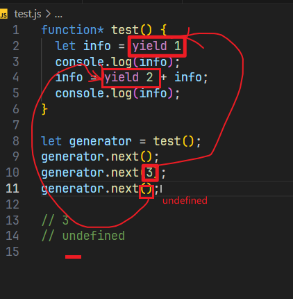

# 概述

1. ECMAScript, JavaScript, NodeJS, 它们的区别是什么？

   ECMAScript：简称ES，是一个语言标准(循环，判断，变量，数组等数据类型)

   JavaScript: 运行再浏览器端的语言，该语言使用ES标准.`ES + Web api = JavaScript`

   Nodejs: 运行在服务器端的语言,该语言使用ES标准. `ES + node api = JavaScript`

   无论JavaScript,还是Nodejs,它们都是ES的超集

2. ECMAScript有哪些关键版本

   ES3.0: 1993

   ES5.0: 2009

   ES6.0: 2015, 从该版本之后,不再使用数字作为编号,而使用年份,每年发布一个新版本

   ES7.0: 2016

3. 为什么ES6如此重要

   ES6解决了JS无法开发大型应用的语言层面的问题.

4. 如何应对兼容性问题

   之后的课程会介绍如何解决

5. 学习本课程需要哪些前置知识

   HTML, CSS, JavaScript

6. 这套课程难不难?

# 块级绑定

## 使用`var`声明变量

1. 允许重复声明导致数据被覆盖

   ```js
   var a = 1;
   
   function print() {
     console.log(a);
   }
   
   // 假设这里有一千行代码
   
   var a = 2;
   print();  // 2
   ```

2. 变量提升: 怪异的数据访问

   ```js
   if (Math.random() < 0.5) {
     var a = 'abc';
     console.log(a);
   } else {
     console.log(a);
   }
   
   console.log(a);
   // abc
   // abc
   // 或
   // undefined
   // undefined
   
   // 因为变量提升,所以实际如下
   var a;
   if (Math.random() < 0.5) {
     a = 'abc';
     console.log(a);
   } else {
     console.log(a);
   }
   ```

3. 变量提升: 闭包问题

   ```js
   var container = document.querySelector('.container');
       for(var i=1; i<=10; i++) {
         var btn = document.createElement('button');
         btn.innerHTML = i;
         container.appendChild(btn);
         btn.onclick = function() {
           console.log(i);
         }
       }
   // 发现无论点击哪一个按钮,都输出11
   // 因为实际上是这样
   var i;
   var container = document.querySelector('.container');
       for(i=1; i<=10; i++) {
         var btn = document.createElement('button');
         btn.innerHTML = i;
         container.appendChild(btn);
         btn.onclick = function() {
           console.log(i);
         }
       }
   
   // 过去为了解决这样的问题,需要使用立即执行函数
   var container = document.querySelector('.container');
         for (var i = 1; i <= 10; i++) {
           var btn = document.createElement('button');
           btn.innerHTML = i;
           container.appendChild(btn);
           (function (i) {
             btn.onclick = function () {
               console.log(i);
             };
           })(i);
         }
   ```
   
4. 全局变量挂载到全局对象: 全局对象成员污染问题
   
   ```js
   var abc = "123";
   console.log(window.abc);
   ```
   
## 使用`let`声明变量

`let`声明的变量,不会挂载到全局对象

`let`声明的变量,不允许在当前作用域重复声明(包括`块级作用域`)

>块级作用域: 代码执行时遇到花括号,产生块级作用域,遇到结束花括号,块级作用域销毁.

`let`声明的变量,不能在初始化之前使用(存在`暂时性死区(TDZ)`).当代码运行到该变量的初始化代码时,会从暂时性死区中移除.

在循环中,用`let`声明的循环变量,会特殊处理,**每次进入循环体,都会开启一个新的作用域,并且将循环变量绑定到该作用域.**每次循环使用的是一个全新的作用域.

在循环中,使用let声明的循环变量,在循环结束后会销毁.

```js
let container = document.querySelector('.container');
    for(let i=1; i<=10; i++) {
      let btn = document.createElement('button');
      btn.innerHTML = i;
      container.appendChild(btn);
      btn.onclick = function() {
        console.log(i);
      }
    }
```

## 使用`const`声明常量

和`let`基本相同,除了`const`必须初始化,且值不能修改.

>注意如果用const声明对象类型,只要**地址不变**就可以.地址里面的内容可以变

在实际开发中,尽量使用`const`,当需要改变时,再使用`let`

# 字符串和正则表达式

## 更好的`Unicode`支持

早期,由于存储空间宝贵,`Unicode`使用16位二进制来存储文字.我们将一个16位的二进制编码叫做一个码元(`code Unit`)

后来,由于技术的发展,`Unicode`对文字编码进行了扩展,将某些文字扩展到了32位(占用两个码元),并且,将某个文字对应的二级制数字叫做码点(`Code Point`)

```js
console.log('𠮷'.length)
// 2
// 因为𠮷这一个码点有两个码元
```

ES6为了解决这个困扰,为字符串提供了方法:`codePointAt(n)`,可以得到序号为`n`的码元的码点(往后判断).

```js
const text = '𠮷';
console.log('得到第一个码点:', text.codePointAt(0)); // 134071
console.log('得到第二个码点:', text.codePointAt(1)); // 57271
console.log('得到第一个码元:', text.charCodeAt(0)); // 55362
console.log('得到第二个码元:', text.charCodeAt(1)); // 57271

/**
 * 判断字符串char，是32位还是16位
 * @param {String} char 
 */
function is32bit(char, i) {
  char.codePointAt(i) > 0xFFFF
}

/**
 * 得到一个字符串真实的码点数量
 * @param {String} str 要判断的字符串
 * @returns 字符串真实的码点数量
 */
function getLengthOfCodePoint(str) {
  let len = 0;
  for(let i=0; i<str.length; i++) {
    // i在索引码元
    if(is32bit(str,i)) {
      // 当前字符串，在i的位置，占用了两个码元,跳过下一个码元
      i++;
    }
    len++;
  }
  return len;
};
```

同时,ES6为正则表达式添加了一个`flag`:`u`,如果添加了该配置,匹配的时候使用**码点匹配**

## 更多的字符串API

一下均为字符串的实例方法

### `includes`

```js
str.includes('substr', startIndex)
```

判断字符串中是否包含指定的子字符串

### `startWith`

判断是否以`substr`开始

```js
str.startWith('substr')
```

### `endWith`

判断是否以`substr`结束

```js
str.endWith('substr')
```

### `repeat`

返回一个字符串重复n次的结果

```js
str.repeat(n)
```

## *正则中的粘连标记

标记名: `y`

含义: 匹配时,完全按照正则对象中的`lastIndex`位置开始匹配,并且匹配的位置必须在`lastIndex`位置

```js
const text = "Hello World!!!"
const reg1 = /W\w+/
const reg2 = /W\w+/
console.log(reg1.test(text))   // true
console.log(reg2.test(text))   // false
```

## 模板字符串

ES6之前处理字符串繁琐的两个方面:

1. 多行字符串
2. 字符串拼接

ES6提供了模板字符串的写法用\`\`来包裹字符串

如果要在字符串中使用表达式,则在\`\`中用${}包裹即可

## *模板字符串标记

标记是一个函数,参数如下

1. 参数1: 被插值分割的字符串的数组
2. 剩余参数: 插值的值

```js
const love1 = '苹果';
const love2 = '香蕉';
const myTag = ([...args],...variables) => {
  for(const item of args) {
    console.log(item);
  }
  for(const item of variables) {
    console.log(item);
  }
};
let text = myTag`我喜欢了${love1}和${love2}`;


// 相当于
// text = myTag(['我喜欢了', '和'], love1, love2);

console.log(text);

// 我喜欢了
// 和

// 苹果
// 香蕉
// undefined
```

用处,转义字符当普通字符输出,可以使用`String.raw`模板字符串标记

```js
console.log('abc\nbcd');

// abc
// bcd

console.log(String.raw`abc\nbcd`);
// abc\nbcd
```

下面这种情况,当用户在text中写入标签时,如`<h1>jdsfj</h1>`,就会导致输出为标题.我们本意想让他输出纯文本.

```js
<!DOCTYPE html>
<html lang="en">
<head>
  <meta charset="UTF-8">
  <meta name="viewport" content="width=device-width, initial-scale=1.0">
  <title>Document</title>
</head>
<body>
  <textarea name="" id="container"></textarea>
  <p id="text"></p>
  <button id="btn">按钮</button>
  <script>
    const container = document.getElementById('container')
    const btn = document.getElementById('btn')
    const text = document.getElementById('text')
    btn.onclick = () => {
      text.innerHTML = container.value
    }
  </script>
</body>
</html>
```

则进行如下改造

```js
<!DOCTYPE html>
<html lang="en">
<head>
  <meta charset="UTF-8">
  <meta name="viewport" content="width=device-width, initial-scale=1.0">
  <title>Document</title>
</head>
<body>
  <textarea name="" id="container"></textarea>
  <div id="text"></div>
  <button id="btn">按钮</button>
  <script>
    const container = document.getElementById('container')
    const btn = document.getElementById('btn')
    const text = document.getElementById('text')
    btn.onclick = () => {
      text.innerHTML = safe`<p>${container.value}</p>`
    }
    function safe(strings, ...values) {
      let str = ""
      for(let i=0; i<values.length; i++) {
        values[i] = values[i].replace(/</g, '&lt;').replace(/>/g, '&gt;')
        str += strings[i] + values[i]
        if(i === values.length - 1) {
          str += strings[i+1]
        }
      }
      return str
    }
  </script>
</body>
</html>
```

# 函数

## 参数默认值

在书写时,直接给形参赋的值就是默认值

### 对arguments的影响

非严格模式下,在函数内部修改形参,会导致`arguments`的值也发生改变.

```js
function sum(a, b) {
  console.log(arguments[0], arguments[1]);
  console.log(a, b);
  a = 3;
  console.log(arguments[0]);
  console.log(a);
}

sum(1, 2);
// 1 2
// 1 2
// 3
// 3
```

但是在严格模式下,在函数内部修改形参,`arguments`的值不会发生改变

```js
"use strict"
function sum(a, b) {
  console.log(arguments[0], arguments[1]);
  console.log(a, b);
  a = 3;
  console.log(arguments[0]);
  console.log(a);
}

sum(1, 2);
// 1 2
// 1 2
// 1
// 3
```

**只要给函数加上参数默认值,该函数会自动变成严格模式下的规则:`arguments`和形参脱离**

### 留意暂时性死区

形参和ES6中的`let`和`const`一样,具有作用域,并且根据参数的声明顺序,存在暂时性死区(TDZ)

```js
function test(a, b = a) {
  console.log(a, b);
}

test(1);

// 1 1
```

```js
function test(a = b, b) {
  console.log(a, b);
}

test(undefined, 1);

// ReferenceError: Cannot access 'b' before initialization
```

## 剩余参数

使用`arguments`的缺陷

1. 如果和形参配合使用,容易导致混乱
2. 从语义上,使用`arguments`获取参数,由于形参缺失,无法从函数定义上理解函数的真实意图

ES6的剩余参数,专门用于收集**末尾**的所有参数到一个形参数组中.

**一个函数最多只能有一个剩余参数,而且必须是最后一个形参**

## 展开运算符

使用`...要展开的东西`

## 函数柯里化

用户固定某个函数前面的参数,得到一个新的函数,新的函数调用时,接收剩余参数

```js
function curry(func, ...args) {
    return function(...subArgs) {
        const allArgs = [...args,...subArgs];
        if(allArgs.length >= func.length) {
           return func(...allArgs);
        }
        return curry(func, ...allArgs);
    }
}
```

## 明确函数的双重用途

ES6提供了一个特殊的API,可以使用该API在函数内部,判断该函数是否使用了`new`来调用

```js
new.target
```

如果没有使用`new`来调用函数,则返回`undefined`

如果使用`new`调用函数,则得到的是`new`关键字后面的函数本身

## 箭头函数

回顾: `this`指向

1. 通过对象调用函数,`this`指向调用对象
2. 直接调用函数,`this`指向全局对象
3. 通过`new`调用函数,`this`指向新创建的对象
4. 通过`apply,call,bind`调用函数,`this`指向指定的数据
5. DOM事件函数,`this`指向事件源

```js
const obj = {
  count: 0,
  start: function () {
    // this -> obj
    setInterval(function () {
      // this -> windox/global
      this.count++;
      console.log(this.count);
    }, 1000);
  },
};

obj.start();

/**
 * NaN
 * NaN
 * ...
 */
```

在过去需要通过使用闭包来解决

```js
const obj = {
  count: 0,
  start: function () {
    // this -> obj
    let _this = this;
    setInterval(function () {
      // this -> windox/global
      _this.count++;
      console.log(this_.count);
    }, 1000);
  },
};

obj.start();

/**
 * NaN
 * NaN
 * ...
 */
```

现在可以直接使用箭头函数.

### 使用语法

```js
const func = (arg) => {
    
}
```

### 注意细节

箭头函数没有`this,arguments,new.target`,它只能继承定义位置的执行上下文的对应变量,与如何调用无关

### 应用场景

1. 事件处理函数
2. 异步处理函数
3. 临时函数
4. 为了绑定外层this

# 对象

## 新增的对象字面量语法

### 成员速写

如果对象字面量初始化时，如果一个成员的值来源于**同名变量的值**,则可以直接简写

```js
const name = "zhangsan"
const obj = {
    name
}
console.log(obj);
// { name: 'sdfj' }
```

### 方法速写

对象字面量初始化时,方法可以省略`冒号`和`function`关键字.

```js
const ojb = {
    sayHello: function(){
        console.log('hello')
    }
}
const obj = {
    sayHello(){
        console.log('hello')
    }
}
```

### 计算属性名

有的时候,初始化对象时,某些**属性名**可能来源于某个表达式的值,在ES6,可以使用**中括号**来表示该属性名是通过计算得到的.

```js
const pro1 = 'name';
const obj = {
  [pro1]: '张三',
};
console.log(obj)
//{ name: '张三' }
```

## Object的新增API

以下都是静态方法

### Object.is

用于判断两个对象是否相等,基本上和严格相等一致

```js
console.log(NaN===NaN) 	// false
console.log(+0===-0)	// true
// 上述是历史遗留问题
console.log(Object.is(NaN, NaN))	// true
cosnole.log(Object.is(+0,-0))		// false
```

### Object.assign

```js
const obj = Object.assign(obj1,obj2);
// 将obj2的数据覆盖到obj1,并改变obj1,返回obj1
// 要想不改动obj1,可以用如下方法
const obj = Object.assign({},obj1,obj2)
// ES7之后可以使用展开运算符
const obj = {...obj1, ...obj2}
```

### Object.getOwnProperNames的枚举顺序

`Object.getOwnPropertyNames`方法之前就存在,只不过,官方没有明确要求,对属性的顺序如何排列,并没有明确要求.

ES6规定了该方法返回的数组排序方式与`for...in`循环或`Object.keys()`方法获取的顺序一致.

> 根据现代 ECMAScript 规范，遍历顺序是明确定义的，并且在实现之间是一致的。在原型链的每个组件中，所有**非负整数键（可以是数组索引的键**）将首先**按值升序**遍历，然后按**属性创建的时间升序遍历**其他字符串键。

### Object.setPrototypeOf

用于设置某个对象的隐式原型

```js
Object.setPrototypeOf(obj1, obj2)
// 相当于
obj1.__proto__ = obj2
```

## 面向对象简介

面向对象: 一种编程思想,和具体语言无关.

对比面向过程:

- 面向过程:思考的切入点是功能的步骤
- 面向对象:思考的切入点是对象的划分

## 类: 构造函数的语法糖

### 传统构造函数的问题

1. 属性和原型方法定义分离,降低了可读性
2. 原型成员可以被枚举
3. 默认情况下,构造函数仍然可以被当作普通函数使用

### 类的特点

1. 类声明不会被提升,与`let`和`const`一样,存在暂时性死区
2. 类中所有代码均在严格模式下执行
3. 类的所有方法都是不可枚举的
4. 类的所有方法内部都无法被当作构造函数使用
5. 类的构造器必须使用`new`来调用

## 类的其他书写方式

### 可计算的成员名

```js
const pro1 = 'name'
class Aniaml {
    [pro1]: 'zhangsan'
}
```

### getter和setter

```js
class Animal {
  #name;
  constructor(name) {
    this.#name = name;
  }
  get name() {
    return this.#name;
  }
  set name(name) {
    this.#name = name;
  }
}
const dog = new Animal('旺财');
console.log(dog.name);
dog.name = '小黑';
console.log(dog.name);
// 旺财
// 小黑
```

### 静态成员

使用`static`关键字定义的成员即静态成员

```js
class Animal {
    static name = 'zhangsan'
}
```

### 字段初始化器(ES7)

字段初始化器相当于在`constructor`中加上这些内容

```js
class Animal {
    constructor() {
        this.name = 'zhangsan';
        this.age = 15
    }
}
// 可以直接写为如下形式
class Animal {
    name = 'zhangsan',
    age = 15
}
// 直接书写,是定义在实例上的,而不是静态属性,这与方法不同,方法是定义在原型上的
```

1. 使用`static`的字段初始化器,添加的是静态成员.
2. 没有使用`static`的字段初始化器,添加的成员位于**对象上**,注意,**不是位于原型上**
3. 箭头函数在字段初始化器位置上,this指向当前对象

```js
class Animal {
    constructor(name) {
        this.name = name;
    }
    print = () => {
        console.log(this.name)
    }
}
// 这里的print没有定义在原型上,而是每一个实例都会有一个自己的print
```

### 类表达式

```js
const A = class {
    // 匿名类,类表达式
    a = 1;
    b = 2;
}
const a = new A();
console.log(a);
```

### 装饰器(ES7)


## 类的继承

如果两个类A和B,如果可以描述为B是A,则A和B形成继承关系

如果B是A,则:

1. B继承自A
2. A派生B
3. B是A的子类
4. A是B的父类

如果A是B的父类,则B会自动拥有A中所有实例成员

新的关键字

- `extends`:继承,用于类的定义
- `super`:
  - 直接当作函数调用,当作父类的构造函数
    - 如果定义了construcor,且该类是子类,必须在访问子类的constructor的this之前,调用super
    - 如果子类不写constructor,则会自动
  - 当作对象调用
    - 在实例方法中,指向父类原型
    - 在静态方法中,指向父类本身

## 抽象类

```js
class Animal {
  constructor(name) {
    if (new.target === Animal) {
      throw new Error('不能实例化Animal类');
    }
    this.name = name;
  }
  eat() {
    console.log(`${this.name}吃东西`);
  }
}

class Dog extends Animal {
  constructor(name, age) {
    super(name);
    this.age = age;
  }
  run() {
    console.log(`${this.name}在跑`);
  }
}
```

# 解构

# 符号

##  普通符号

符号是ES6新增的一个数据类型,它通过使用函数`Symbol(符号描述)`来创建

符号设计的初衷,是**为了给对象设置私有属性**

私有属性:只能在对象内部使用,外面无法使用.

符号具有以下特点:

- 没有字面量
- 使用`typeof`得到的类型是`symbol`
- **每次调用`Symbol`得到的符号永远不相等,无论符号名是否相同**
- 符号可以作为对象的属性名存在,这种属性称之为符号属性
  - 开发者可以通过精心的设计,让这些属性无法通过常规方式被外界访问.
  - 符号属性是不能被枚举的,因此,在`for-in`循环中无法读取到符号属性,`Object.keys`方法也无法读取到符号属性
  - `Object.getOwnPropertyNames`尽管可以得到所有无法枚举的属性,但是仍然无法读取到符号属性
  - ES6新增了`Object.getOwnPropertySymbols`方法,可以读取符号
- 符号无法被隐式转换,因此不能被用于数学运算,字符串拼接或其他隐式转换的场景,但符号可显示地转换为字符串,通过`String`构造函数进行转换即可.`console.log`之所以可以输出符号,是因为它在内部进行了显示转换.

## 共享符号

根据某个符号描述能够得到同一个符号

```js
Symbol.for("符号描述")   // 获取共享符号
```

## 知名(公共,具名)符号

知名符号是一些具有特殊含义的共享符号,通过Symbol的静态属性得到

ES6延续了ES5的思想:减少魔法,暴露内部实现!

因此,ES6用知名符号暴露了某些场景的内部实现

1. `Symbol.hasInstance`

   该符号用于定义构造函数的静态成员,它将影响`instanceof`的判定

   ```js
   obj instanceof A
   // 等效于
   A[Symbol.hasInstance](obj)
   ```

2. `Symbol.isConcatSpreadable`

   该符号会影响到数组的cancat方法

   ```js
   const arr = [3];
   const result = arr.concat(56, [5, 6, 7, 8]);
   console.log(result)
   // [3, 56, 5, 6, 7, 8]
   ```

3. `Symbol.toPrimitive`

   该知名符号会影响类型转换的结果

   ```js
   const obj = {
     a: 1,
     b: 2,
   };
   // 会依次尝试以下方法，直达obj转化为基本类型
   console.log(obj[Symbol.toPrimitive])  // undefined
   console.log(obj.valueOf())      // {a: 1, b: 2}
   console.log(obj.toString())     // [object Object]
   
   
   
   console.log(obj + 123);         // [object Object]123
   ```

   ```js
   const obj = {
       [Symbol.toPrimitive](hint) {
           if (hint === "number") {
               return 42; // 数值上下文
           }
           if (hint === "string") {
               return "Hello"; // 字符串上下文
           }
           return "default"; // 默认上下文
       }
   };
   
   console.log(+obj); // 42
   console.log(`${obj}`); // "Hello"
   console.log(obj + ""); // "default"
   
   ```

4. `Symbol.toStringTag`

   该知名符号会影响`Object.prototype.toString`的返回值

   

5. 其他知名符号

# 迭代器和生成器

## 迭代器

### 背景知识

1. 什么是迭代

   从一个数据集合中按照一定的顺序，不断取出数据的过程

2. 迭代和遍历的区别？

   迭代强调的是依次取数据，并不保证取多少，也不保证把所有的数据取完

   遍历强调的是完整性，要把整个数据依次全部取出

3. 迭代器

   对迭代过程的封装，在不同的语言中有不同的表现形式，通常为对象

4. 迭代模式

   一种设计模式，用于统一迭代的过程，并规范了迭代器的规格：

   - 迭代器应该具有得到下一个数据的能力
   - 迭代器应该具有判断是否还有后续数据的能力

### JS中的迭代器

JS规定，如果一个对象具有`next()`方法，并且该方法返回一个对象，该对象的格式如下

```js
{value: 值, done:是否迭代完成}
```

则认为该对象是一个迭代器

含义:

- `next`方法:用于得到下一个数据
- 返回的对象
  - `value`下一个对象的数据
  - `done`是否结束

```js
const arr = [1, 2, 3, 4, 5];
const iterator = {
  i: 0,
  next() {
    //当前的数组下标
    return {
      value: arr[this.i++],
      done: this.i >= arr.length,
    };
  },
};

console.log(iterator.next());
console.log(iterator.next());
console.log(iterator.next());
console.log(iterator.next());
console.log(iterator.next());
console.log(iterator.next());

// { value: 1, done: false }
// { value: 2, done: false }
// { value: 3, done: false }
// { value: 4, done: false }
// { value: 5, done: true }
// { value: undefined, done: true }

```

```js
function createFeivoIterator() {
  let prev1 = 1,
    prev2 = 1;
  return {
    next() {
      const result = {
        value: prev1 + prev2,
        done: false,
      };
      prev2 = prev1;
      prev1 = result.value;
      return result;
    },
  };
}

const iter = createFeivoIterator();
console.log(iter.next().value);
console.log(iter.next().value);
```

## 可迭代协议与`for-of`循环

**概念回顾**

- 迭代器(iterator): 一个具有next方法的对象, next方法返回下一个数据并且能指示是否迭代完成.
- 迭代器创建函数(iterator creator): 一个返回迭代器的函数

**可迭代协议**

ES6规定,如果一个对象具有知名符号属性`Symbol.iterator`,并且属性值是一个迭代器创建函数,则该对象是可迭代的(iterable)

> 思考:如何知晓一个对象是否是可迭代的?
>
> 思考:如何遍历一个可迭代对象?

**`for-of`循环**

`for-of`循环用于遍历可迭代对象,格式如下

```js
//迭代完成后循环
for(const item of arr) {
    console.log(item)
}

// 相当于
const iterator = arr[Symbol.iterator]();
let result = iterator.next();
while(!result.done) {
    const item = result.value;	// 取出数据
    console.log(item);
    // 下一次迭代
    result = iterator.next();
}
```

**展开运算符与可迭代对象**

展开运算符可以将可迭代对象展开,这样可以轻松将其转换为数组

## 生成器

1. 什么是生成器?

生成器是通过构造函数`Generator`创建的对象,生成器既是一个**迭代器**,同时又是一个**可迭代对象**.

2. 如何创建生成器?

生成器的创建,必须使用生成器函数(Generator Function)

3. 如何书写一个生成器函数呢?

```js
function* mthod() {
    
}
```

```js
function* test() {
  yield 1;
  yield 2;
  yield 3;
}

const generator = test();
console.log(generator.next().value);
console.log(generator.next().value);
console.log(generator.next().value);

// 1
// 2
// 3
```

4. 生成器函数内部是如何执行的?

生成器函数内部是为了给生成器提供迭代数据

每次调用生成器的next方法,将导致生成器函数运行到下一个yield关键字位置

yield是一个关键字,该关键字只能在生成器函数内部使用,表达产生一个迭代数据.

5. 有哪些需要注意的细节

   1. 生成器函数可以有返回值,返回值表示第一次`done: true`时对应的`value`值

   ```js
   function* test() {
     yield 1;
     yield 2;
     return 4;
     yield 3;
   }
   
   const generator = test();
   console.log(generator.next());
   console.log(generator.next());
   console.log(generator.next());
   console.log(generator.next());
   
   // { value: 1, done: false }
   // { value: 2, done: false }
   // { value: 4, done: true }
   // { value: undefined, done: true }
   ```
   2. 调用生成器的next方法时,可以传递参数,传递的参数会交给`yield`表达式的返回值
   3. 第一次调用next方法时,**传参没有任何意义**
   
   
   
   4. 在生成器函数内部还可以调用其他生成器函数,但是要注意加上`*`
   
      ```js
      function* t1() {
          yield "a"
          yield "b"
      }
      function* test() {
          yield* t1();
          yield 1;
          yield 2;
          yield 3;
      }
      ```
   
6. 生成器的其他API

   - return方法: 调用该方法,可以提前结束生成器函数,从而让整个迭代过程结束
   - throw方法: 调用该方法,在生成器中产生一个错误

## 生成器的应用-异步任务控制

ES6之后有了Promise,但是`async`和`await`要ES7才有.

```js
function* task() {
  const d = yield 1;
  // d: 1
  const resp = yield fetch('http://101.132.72.36:5100/api/local');
  const result = yield resp.json();
  console.log(result);
}

run(task);

function run(generatorFunc) {
  const generator = generatorFunc();
  let result = generator.next(); // 启动任务,开始迭代
  handleResult();
  function handleResult() {
    if (result.done) {
      return; // 迭代完成
    }
    // 1. 迭代的数据是一个Promise
    if (result.value.then === 'function') {
      result.value.then(
        function (data) {
          result = generator.next(data);
          handleResult();
        },
        function (error) {
          result = generator.throw(error);
          handleResult();
        }
      );
    } else {
      result = generator.next(result.value);
      handleResult();
    }
  }
}
```

