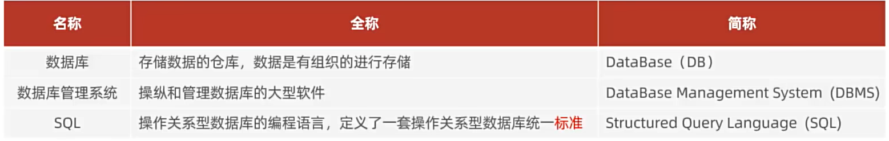

# SQL基础篇



## MySQL的安装与启动

### 启动与停止

```powershell
net start <服务名>
net stop <服务名>
```

```
Win + R 
```


## SQL通用语法及分类

### SQL通用语法

- 可以**单行**或**多行**书写,以分号结尾
- 可以使用空格/缩进来增强语句的可读性
- 不区分大小写,**关键字建议使用大写**
- 注释
  - 单行注释:  --注释内容 或 #注释内容(MySQL特有)
  - 多行注释: /* 注释内容 */

### SQL分类

| 分类 | 全称                       | 说明                                               |
| ---- | -------------------------- | -------------------------------------------------- |
| DDL  | Data Definition Language   | 数据定义语言,用来定义数据库对象(数据库,表,字段)    |
| DML  | Data Manipulation Language | 数据操作语言,用来对数据库表中的数据进行增删改      |
| DQL  | Data Query Language        | 数据查询语言, 用来查询数据库中表的记录             |
| DCL  | Data Control Language      | 数据控制语言,用来创建数据库用户,控制数据库访问权限 |

## DDL

### 数据库操作

``` sql
-- 查询所有数据库
SHOW DATABASES;
-- 查询当前数据库
SELECT DATABASE();
-- 创建
CREATE DATABASE [IF NOT EXISTS] 数据库名 [DEFAULT CHARSET 字符集][COLLATE 排序规则]
-- 删除
DROP DATABASE[IF EXISTS]数据库名
-- 使用
USE 数据库名
```

### 表操作

**查询**

```sql
-- 查询当前数据库所有表
SHOW TABLES;
-- 查询表结构
DESC 表名;
-- 查询指定表的创建语句
SHOW CREATE TABLE 表名;
```

**创建**

```sql
CREATE TABLE (
    字段1 字段1类型[COMMENT 字段1注释],
    字段2 字段2类型[COMMENT 字段2注释],
    字段3 字段3类型[COMMENT 字段3注释],
    字段4 字段4类型[COMMENT 字段4注释],
    ....
    字段n 字段n类型[COMMENT 字段n注释],
)[COMMENT 表注释]
```

**数据类型**

| 分类 | 类型       | 大小  | 有符号数(SIGNED)范围 | 无符号(UNSIGNED)范围 | 描述     |
| ---- | ---------- | ----- | -------------------- | -------------------- | -------- |
|      | `TINYINT`  | 1Byte | (-128-127)           | (0,255)              | 小整数值 |
|      | `SMALLINT` | 2Byte | (-32768,32767)       | (0,65535)            | 大整数值 |
|      |            |       |                      |                      |          |
|      |            |       |                      |                      |          |
|      |            |       |                      |                      |          |
|      |            |       |                      |                      |          |
|      |            |       |                      |                      |          |
|      |            |       |                      |                      |          |

