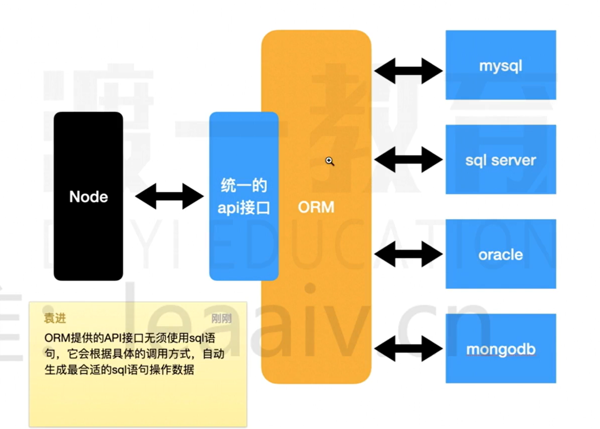
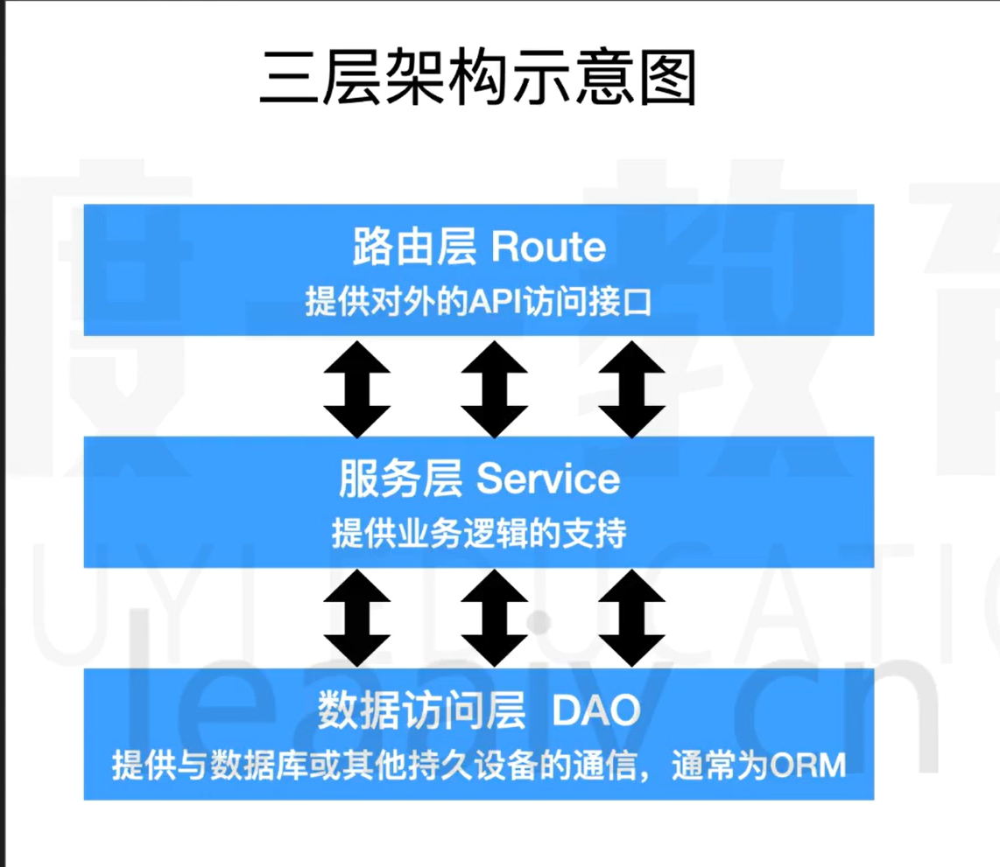

# node概述

## 特点

单线程所以可以快速I/O操作.

## 用途

- 开发桌面应用程序
- 开发服务器应用程序

# 全局对象

- `setTimeout`
- `setInterval`

> 注意这两者在浏览器中返回的是==数字==,但是在node中返回的是==对象==

- `setImmediate`: 类似于`setTimeout(()=>{},0)`
- `console`
- `__dirname`: 当前文件的目录,注意,该属性并**不是**`global`里面的属性
- `__filename`: 获取当前文件的路径,该属性并**不是**`global`里面的属性
- `Buffer`: 类型化数组,继承自`UInt8Array`
- `process`: 
  - `cwd()`: 输出当前终端(命令行)所在目录
  - `exit()`: 强制退出当前node进程,可以传入一个退出状态码,默认为`0`,表示没有错误.
  - `argv`: 获取执行命令时的所有命令行参数
  - `platform`: 获取当前的操作系统
  - `kill(pid)`: 杀死进程
  - `env`: 获取环境变量

# node的模块化细节

## 模块的查找

- 绝对路径: 直接导入
- 相对路径: `./`或`../`转换为绝对路径后导入.
- 相对路径
  - 检查是否是内置模块: 如`fs`,`path`等.
  - 检查当前目录中的`node_modules`
  - 检查上级目录中的`node_modules`
  - 转换为绝对路径
  - 加载模块
- 关于后缀名
  - 如果不提供后缀名,则node会尝试补全
  - `js`,`json`,`node`,`mjs`
- 关于文件名
  - 如果仅提供目录,不提供文件名,则自动寻找该目录中的`index.js`
  - `package.json`中的`main`字段
    - 表示包的默认入口
    - 导入或执行包时若只提供目录,则使用main补全入口
    - 默认值为`index.js`

## module对象

记录了当前模块的信息

## require函数

当执行一个模块或使用require时,会将模块放置在一个**函数环境中**

```js
function require(modulePath) {
    // 1. 将modulePath转换为绝对路径 D:\test
    // 2. 判断是否该模块已有缓存,
    if (require.cache['D:\test']) // 直接返回
   	// 3. 读取文件内容
    // 4. 包裹到一个函数中
    function __temp(module, exports, __dirname, __filename) {
        console.log('当前模块路径', __dirname);
        console.log('当前模块文件', __filename);
        exports.c = 3;
        module.exports = {
            a: 1,
            b: 2
        };
        this.m = 5;
    }
    // 6. 创建module对象
    module.exports = {}
    const exports = module.exports;
    __temp.call(module.exports,module, exports, require, module.path, module, __dirname, __filename) {
        return module.exports;
    }
}
```

# [扩展] Node中的ES模块化

# 基本内置模块

## `OS`

- `EOL`: end of line
- `arch()`: CPU架构
- `cpus()`: CPU信息
- `fremem()`:空闲内存
- `homedir()`: 用户目录
- `hostname()`: 主机名
- `tmpdir()`: 操作系统的临时目录

## `path`

- `basename`: 获取文件名(路径中的最后一部分)
- `sep`: 路径分割符(Linux和Mac`/`,windows`\`)
- `delimiter`: 多个路径之间的分割符(Linux和Mac`:`, Windows`;`)
- `dirname`: 获取路径(除去文件名)
- `extname`: 获取扩展名
- `join`: 把多段路径按照目前操作系统的规则拼接为一个完整的目录
- `normalrize`: 得到规范化路径
- `relative`: 得到左边想要找右边的相对路径(右边相对于左边的相对路径)
- `resolve`: 解析为完整路径

## `url`

## `util`

- `callbackify`: 把Promise转换为回调函数的形式
- `promisify`: 把回调函数转换为Promise的形式
- `inherits`: 继承
- `isDeepStrictEqual`: 对象是否严格相等.

# 文件I/O

## fs模块

- `readFile`: 读取一个文件

```js
const fs = require('fs')

const path = require('path')

const filename = path.resolve(__dirname, 'test.txt');

fs.readFile(filename, 'utf8', (err, data) => {
  if (err) {
    console.error(err);
    return;
  }
  console.log(data);
});
```

- `writeFile`: 写文件
- `stat`: 文件或目录的信息
  - `size`: 占用的字节数
  - `atime`: 上次访问时间
  - `mtime`: 上次文件内容被修改的时间
  - `ctime`: 上次文件状态被修改的时间
  - `birthtime`: 文件创建时间
  - `isDirectory()`: 判断是否是目录
  - `isFile()`: 判断是否是文件
- `readdir`: 获取目录中的文件和子目录
- `mkdir`: 创建目录
- `exists`:判断文件或目录是否存在

# 文件流

## 什么是流

流是指数据的流动,数据从一个地方缓缓地流动到另一个地方

流是有方向的

- 可读流(readable): 数据从源头流向内存
- 可写流(writable): 数据从内存流向源头
- 双工流: 数据既可以从源头流向内存,也可以从内存流向源头.

## 为什么需要流

其他介质和内存的数据规模不一致

其他介质和内存的数据处理能力不一致

## 文件流

### 什么是文件流

内存数据和磁盘文件数据之间的流动

### 文件流的创建

`fs.createReadStream(path[, options])`

- 含义: 创建一个文件可读流,用于读取文件的内容
- path: 读取的文件路径
- options: 可选配置
  - encoding: 编码方式
  - start: 起始字节
  - end: 结束字节
  - highWaterMark: 每次读取数量
    - 如果encoding有值,该数量表示一个字符数
    - 如果encoding为null,该数量表示字节数
- 返回: Readable的子类ReadStream
  - 事件: rs.on(事件名, 处理函数)
    - open: 文件打开事件,文件打开后触发
    - error: 出错时触发
    - close: 文件关闭事件,文件关闭后触发
    - data
      - 读取到一部分数据后触发
      - 注册`data`事件后,才会真正开始读取
      - 每次读取`hightWaterMark`指定的数量
      - 回调函数中会附带读取到的数据
    - end
  - 事件: rs.pause(): 暂停读取
  - 事件: rs.resume(): 恢复读取

`fs.createWriteStream(path[,options])`

- 含义:创建一个文件可写流,用于写入文件内容
- path: 写入的文件路径
- options: 可选配置
  - flags: 操作文件的方式
  - encoding: 编码方式
  - start: 起始字节
  - highWaterMark: 每次最多写入的字节数,与`encoding`无关
- 返回: Writable的子类WriteStream
  - ws.write(data)
    - 写入一组数据
    - data可以是字符串或`Buffer`
    - 返回一个`boolean`值
      - true: 写入通道没有被填满,接下来的数据可以直接写入,无需排队
      - false: 写入通道目前已经被填满,接下来的数据将进入写入队列
    - 当写入队列清空时,会触发`drain`事件.
  - ws.end([data])

`fs.pipe(ws)`

# net模块

## 回顾http请求

### 普通模式

非持久http连接,每次请求都需要重新进行三次握手,四次挥手

### 长连接模式

持久http请求.

## net模块能干什么

`net`是一个通信模块

利用它,可以实现

- 进程间的通信 IPC
- 网络通信 TCP/IP

## 创建客户端

```js
const net = require('net');

const socket = net.createConnection({
  host: '47.109.37.182',
  port: 80
},() => {
  console.log('connected');
})
```

返回一个`socket`文件

- `socket`是一个特殊的文件
- 在node中表现为一个双工流对象
- 通过向流写入内容发送数据
- 通过监听流的内容获取数据.

## 创建服务器

# http模块

建立在net模块之上

`http.request(url[, options][,callback])`

`http.createServer([options][,requestListener])`

我是客户端

- 请求: `ClientRequeset`对象
- 响应: `IncomingMessage`对象

我是服务器

- 请求: `IncomingMessage`对象
- 响应: `ServerResponse`对象

# https模块

# node生命周期


`timers`: 存放计时器的回调函数

`poll`: 轮询队列,除了`timers`和`checks`,绝大部分都会进入,比如:文件读取,监听用户请求

- 运作方式
  - 如果poll中有回调,依次执行回调,直到清空队列
  - 如果poll中没有回调
    - 等待其他队列中出现回调,结束该阶段,进入下一阶段
    - 如果其他队列也没有回调,持续等待,直到出现回调为止.

```js
const start = Date.now();

setTimeout(() => {
  console.log('setTimeout',Date.now() - start);
}, 200);

const fs = require('fs');

fs.readFile(__filename, () => {
  console.log('readFile');
  const start = Date.now();
  while(Date.now() - start < 300) {
    // do nothing
  }
});

// readFile
// setTimeout 317
```

`check`: 检查阶段,使用`setImmediate()`的回调

```js
let i = 0;
console.time()
function test() {
  i++;
  if (i < 100) {
    setImmediate(test);
  }else {
  console.timeEnd()
  }
}

test();

// default: 3.173ms
```

```js
let i = 0;
console.time()
function test() {
  i++;
  if (i < 100) {
    setTimeout(test, 0);
  }else {
  console.timeEnd()
  }
}

test();

// default: 1.413s
```

```js
setTimeout(() => {
  console.log('setTimeout');
}, 1);

setImmediate(() => {
  console.log('setImmediate');
});

// setImmediate
// setTimeout
// 或者
// setTimeout
// setImmediate

// 先后顺序不确定

```

```js
const fs = require('fs');

fs.readFile('./test.js', (err, data) => {
  setTimeout(() => console.log(1));
  setImmediate(() => console.log(2));
});

// 2
// 1
```

事件循环中,每次打算执行一个回调之前,必须要先清空`nextTick`和`Promise`队列

```js
setImmediate(() => {
  console.log(1)
})

process.nextTick(() => {
  console.log(2)
  process.nextTick(() => {
    console.log(6)
  })
})

console.log(3);

Promise.resolve().then(() => {
  console.log(4);
  process.nextTick(() => {
    console.log(5)
  })
})

// 3
// 2
// 6
// 4
// 5
// 1
```

```js
async function async1() {
  console.log('async1 start');
  await async2();
  console.log('async1 end');
}

async function async2() {
  console.log('async2');
}

console.log('script start');
setTimeout(function () {
  console.log('setTimeout0');
}, 0);

setTimeout(function () {
  console.log('setTimeout3');
}, 3);

setImmediate(() => {
  console.log('setImmediate');
});

process.nextTick(() => {
  console.log('nextTick');
});

async1();
new Promise(function (resolve) {
  console.log('promise1');
  resolve();
}).then(function () {
  console.log('promise3');
});
console.log('script end');

// script start
// async1 start
// async2
// promise1
// script end
// nextTick
// async1 end
// promise3
// 后面三个说不准
// setTimeout0
// setImmediate
// setTimeout3
```

# EventEmitter

node事件管理的通用机制

```js
const { EventEmitter } = require('events');
// 创建一个事件处理对象
// 可以注册事件,可以触发事件
const ee = new EventEmitter();

ee.on('abc', () => {
  console.log('abc事件触发了');
});

ee.emit('abc');   // 触发名为abc的事件,会依次运行注册的函数
```

# mysql的驱动程序

## 什么是驱动程序

驱动程序是连接**内存**和**其他存储介质**的桥梁

mysql驱动程序是连接内存数据和mysql数据的桥梁

mysql驱动程序通常使用

- mysql
- mysql2

## mysql2的使用

# Sequelize简介

## ORM

`ORM(Object Relation Mapping)`,对象关系映射.

通过ORM框架,可以自动的把程序中的对象和数据库关联.

ORM框架会隐藏具体的数据库底层细节,让开发者使用同样的数据操作接口,完成对不同数据库的操作.

ORM的优势

- 开发者不用关心数据库,仅需关心对象
- 可轻易的完成数据库的移植
- 无须拼接复杂的sql语句即可完成精确查询.



## Node中的ORM

### Sequelize

比较成熟

- JS
- TS

### TypeORM

不够成熟

# 模型定义和同步

# 模型的增删改

## 三层架构



# 模拟数据

使用`Mock.js`

# 数据抓取

涉及到的库

- axios
- cheerio

# 数据查询

- 查询单个数据: `findOne`
- 按照主键查询单个数据: `findByPk`
- 查询多个数据: `findAll`
- 查询数量: `count`
- 包含关系: `include`

# MD5加密

`MD5`是`hash`加密算法的一种,可以将任何一个字符串,加密成一个固定长度的字符串.

单向加密,无法破解.

# momentjs(现在更常用dayjs)

## 概念

### utc和北京时间

utc: 世界协调时,以英国格林威治时间为标准

北京时间为 utc + 8h

### 时间戳

某个utc时间到`utc1970-1-1的0:00`的毫秒数,也可以是秒数,用小数部分记录毫秒.

注意: 时间戳表示的是**utc时间**的差异.

### utc时间

### 对服务器的影响

服务器可能会部署到世界的任何位置

服务器内部应该统一使用`utc`时间或时间戳,包括数据库.

### 对客户端的影响

- 客户端要给不同地区的客户友好的显示时间.
- 客户端应该把时间戳转换为本地时间显示


# 数据验证

## 数据验证的位置

- 前端(客户端): 为了用户体验
- 路由层: 验证接口格式是否正常
- 业务逻辑层: 保证业务完整性
- 数据库验证(约束): 保证数据完整性

## 相关库

- validator: 用于验证某个字符串是否满足某个规则
- validate: 用于验证某个对象是否满足某个规则

# 访问器和虚拟字段

```js
get()

DataTypes.Virtual
```

# 日志记录

`log4js`


# express的基本使用

# nodemon

# express中间件

# 常用中间件

# express的路由

# cookie的基本概念

# 实现登录和认证

# 断点调试

# 跨域之JSONP

# 跨域之CORS

# CORS中间件

# session

# JWT
