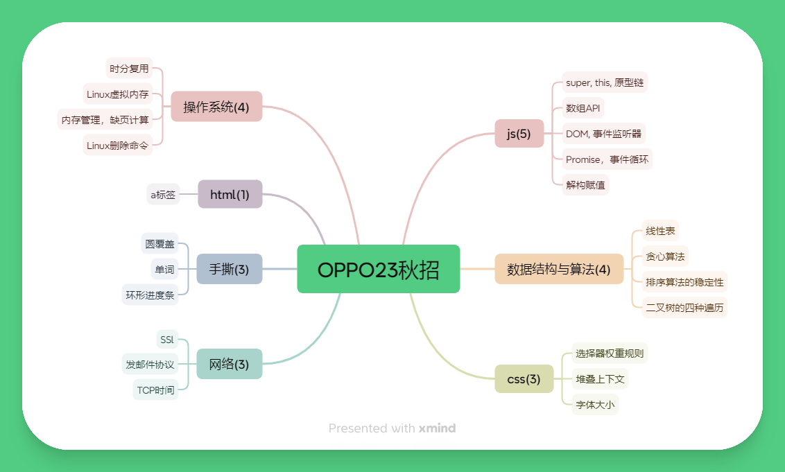
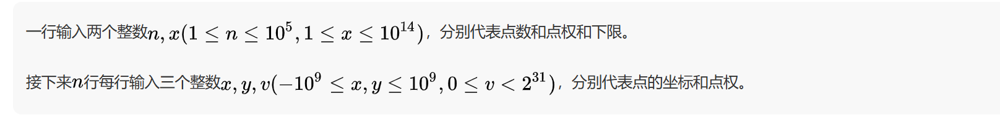
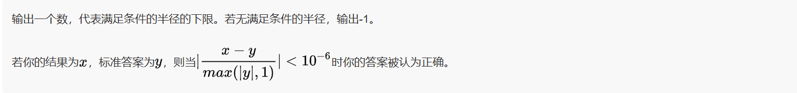
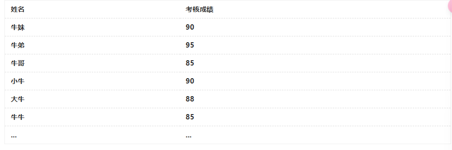
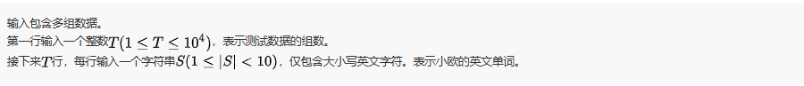
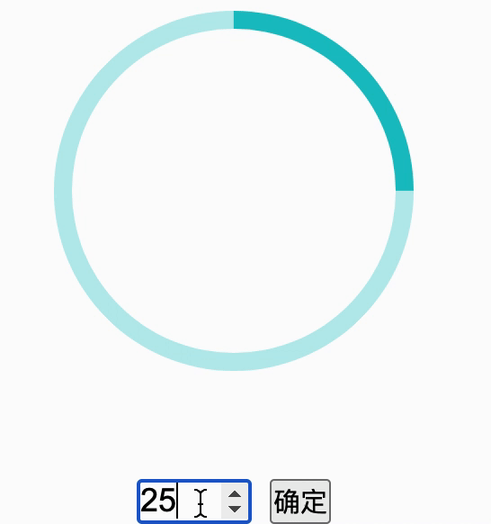

# 考情分析



# 题目解析

## 1.下述代码的执行结果为

```js
let obj1 = {
  name: '张三',
  getName() {
    return this.name;
  },
};

let obj2 = {
  name: '李四',
  getName() {
    return super.getName();
  },
};

Object.setPrototypeOf(obj2, obj1);
console.log(obj2.getName());
```

- A. undefined
- B. "张三"
- C. "李四"
- D. null

> 正确答案 C

> 考点：`super`关键字， `this`关键字

`this`指向调用者

`super`关键字用于访问对象字面量或类的[[Prototype]]上的属性，或调用超类的构造函数。

`super.prop`和`super[expr]`表达式在**类和对象字面量**的任何**方法定义**中都有效。

`super(...args)`表达式只在**类的构造函数中**有效

> **注意**：`super`是一个关键字，这些是特殊的语法结构，`super`不是指向**proto**对象的变量。尝试读取`super`本身是一个语法错误.也不能通过 super 来删除超类的属性。

```js
const child = {
  myParent() {
    console.log(super); // SyntaxError: 'super' keyword unexpected here
  },
};

class Base {
  foo() {}
}
class Derived extends Base {
  delete() {
    delete super.foo; // this is bad
  }
}

new Derived().delete(); // ReferenceError: invalid delete involving 'super'.
```

---

## 2.运行此代码,运行结果正确的是

```js
var nums = [2, 3, 4, 5, 6, 7];
nums.push(0);
nums.pop();
console.log(nums);
```

- A. [2, 3, 4, 5, 6, 7]
- B. [3, 4, 5, 6, 7, 0]
- C. [2, 3, 4, 5, 6, 7, 0]
- D. [0, 2, 3, 4, 5, 6]

> 正确答案 A

> 考点：数组 API

**数组添加和移除元素常用 API**

| API                     | 说明                                 | 返回值                                         |
| ----------------------- | ------------------------------------ | ---------------------------------------------- |
| `push(e1,e2,...,en)`    | 向数组的末尾添加一个或多个元素       | 新数组的长度                                   |
| `pop()`                 | 移除数组的最后一个元素               | 被移除的元素                                   |
| `shift()`               | 移除数组第一个元素，其他元素索引减一 | 被移除的元素，若没有被移除的元素，则返回空数组 |
| `unshift(e1,e2,...,en)` | 向数组的开头添加一个或多个元素       | 新数组的长度                                   |

---

## 3.运行此代码，并单击页面中的按钮“点我”，控制台的输出结果正确的是（）

```html
<button id="btn" type="button">点我</button>

<script type="text/javascript">
  document.getElementById('btn').addEventListener('click', function () {
    console.log('hello');
  });
  document.getElementById('btn').addEventListener('click', function () {
    console.log('hello nowcoder');
  });
</script>
```

- A. hello hello nowcoder
- B. hello
- C. hello nowcoder
- D. hello nowcoder hello nowcoder

> 正确答案 A

> 考点：事件监听

**EventTarget.addEventListener()**方法将指定的监听器注册到`EventTarget`上，当该对象触发指定的事件时，指定的回调函数就会被执行。`EventTarget`可以是一个文档上的元素`Element`,`Document`和`Window`，也可以是任何支持事件的对象(比如`XMLHttpRequest`).

`addEventListener()`的工作原理是将实现`EventListener`的函数或对象添加到调用它的`EventTarget`上的指定事件类型的事件侦听器列表中。如果要绑定的函数或对象**已经被添加到列表中**，该函数或对象**不会被再次添加**。

> 注意：如果先前向事件侦听器列表中添加过一个匿名函数，并且在之后的代码中调用`addEventListener`来添加一个功能完全相同的匿名函数(**甚至代码完全相同**),那么之后的这个匿名函数也会被添加到列表中。
>
> 实际上，即使使用完全相同的代码来定义一个匿名函数，这两个函数仍然存在区别，并非同一个函数。

---

## 4.当单击 a 标签中的文本时，要求跳转到 div 标签区域，下列选项中，做法正确的是（）

- A. `<div id="a"></div> <a href="a">跳转</a>`
- B. `<div id="#a"></div> <a href="a">跳转</a>`
- C. `<div id="a"></div> <a href="#a">跳转</a>`
- D. `<div id="#a"></div> <a href="#a">跳转</a>`

> 正确答案 C

---

## 5.请问一下 JS 代码输出的结果是()

```js
const p = Promise.resolve(935);
p.then((val) => {
  return val;
})
  .then((val) => {
    console.log(val);
    return new Promise((res, rej) => {
      res(++val);
    });
  })
  .then((val) => {
    console.log(val);
    return new Promise((res, rej) => {
      setTimeout(() => {
        res(++val);
      }, 1000);
    });
  })
  .then((val) => {
    console.log(val);
  });
```

- A. 935 936 936
- B. 935 936 937
- C. 935 935 935
- D. 935 935 936

> 正确答案 B

---

## 6.下列关于 SSL 说法错误的是\_\_.

- A. SSL 是 TCP 加强版本
- B. SSL 通过采用机密性，数据完整性，服务器鉴别和客户端鉴别来强化 TCP
- C. SSL 强制网络两端的用户使用特定的对称加密算法
- D. SSL 记录由类型字段，版本字段，长度字段，数据字段，MAC 字段组成

> 正确答案 C

---

## 7.请问以下 JS 代码最终输出的结果是（）

```js
const [a, b] = '123';
const { c, d } = '123';
console.log(a);
console.log(b);
console.log(c);
console.log(d);
```

- A. undefined undefined undefined undefined
- B. 1 2 1 2
- C. undefined undefined 1 2
- D. 1 2 undefined undefined

> 正确答案：D

---

## 8.小明使用 Chrome 浏览器上 163 邮箱发送了一封邮件，请问这封邮件发向邮件服务器时采用的什么协议？

- A. SMTP
- B. POP3
- C. HTTP
- D. IGMP

> 正确答案

---

## 9.某个主机与服务器之间建立连接，经测试主机到服务器的平均 RTT 为 120ms，一个 gif 图像的平均发送时延为 45ms。如果一个 Web 页面使用非持久连接的 HTTP 协议，它包含了 8 幅 gif 图像，请问使用上述主机访问这个页面需要多少时间（）（页面的基本 HTML 文件、HTTP 请求报文、TCP 握手报文大小忽略不计，TCP 第三次握手捎带一个 HTTP 请求）

- A. 1560ms
- B. 2280ms
- C. 2520ms
- D. 2640ms

> 正确答案

---

## 10.对于某线性表来说，若第一个元素的存储地址为 100，每个元素的长度为 2，则经过五个元素后，第六个元素的存储地址为（）

- A. 106
- B. 108
- C. 110
- D. 112

> 正确答案 C

---

## 11.给定一组硬币面值 C={1,5,10,25,60,100}，下面是用最少的硬币向客户支付金额的贪心算法，下列关于该贪心算法的叙述正确的是（）

```
ALGORITHM (x, c1, c2, …, cn)//c1,c2..表示货币金额
SORT n coin denominations so that 0 < c1 < c2 < … < cn.
S ← ∅.//选择货币的集合
WHILE (x > 0)
    k ← largest coin denomination ck such that ck <= x.
    IF no such k, RETURN “no solution.”
    ELSE
        x ← x – ck.
        S ← S ∪ { k }.
RETURN S.
```

- A. 利用该贪心算法求解得到的解总是最优的
- B. 题目中所给的贪心算法适用于任何一套面值`c1<c2<...<cn`的硬币，前提是`c1=1`
- C. 题中所给的贪心算法只适合于硬币面值为 C = {1, 5, 10, 25, 60, 100}
- 给定 x=90，得到的集合`C={1,5,10,25,60,100}`，这个解是最优的

> 正确答案 D

## 12.分时操作系统中，当时间片固定时，用户数越多，每个用户分到的时间片就越少，响应时间自然就变长。在一个分时操作系统，当时间片固定为 5ms 时，为保证响应时间不超过 2s，最大就绪进程数为（）

- A. 200
- B. 250
- C. 400
- D. 500

> 正确答案 C

---

## 13.圆覆盖

平面上有*n*个点，每个点有一个点权*v*。你现在可以以原点为圆心放置一个圆，请问要使圆能覆盖到的点的权值和达到*x*，圆的半径至少为多少？

### 输入描述



### 输出描述



#### 示例 1

```
输入例子：
        5  10
        0  1  2
        -1  1  3
        3  3  4
        -4  3  1
        5  -3  1

输出例子：5
例子说明：
半径为5时，点(0,1),(-1,1),(3,3),(-4,3)在圆内，权值和为10
```

#### 示例 2

```
输入例子：
        5  10
        0  1  2
        -1  1  3
        3  3  2
        -4  3  1
        5  -3  1

输出例子：-1
例子说明：
权值和无法达到10
```

```js
const rl = require('readline').createInterface({
  input: process.stdin,
});
var iter = rl[Symbol.asyncIterator]();
const readline = async () => (await iter.next()).value;

void (async function () {
  // 读入点数n, 点权和下限x
  const [n, x] = (await readline()).split(' ').map(Number);
  // 收集点的信息
  const points = [];
  for (let i = 0; i < n; i++) {
    const [a, b, v] = (await readline()).split(' ').map(Number);
    // 计算距离并存储点信息
    const distance = Math.sqrt(a * a + b * b);
    points.push({ distance, v });
  }
  // 按照距离升序排序
  points.sort((p1, p2) => p1.distance - p2.distance);

  // 将圆的半径从零开始扩大,依次将点的权值加和
  let sum = 0;
  for (const { distance, v } of points) {
    sum += v;
    if (sum >= x) {
      console.log(distance);
      return;
    }
  }

  // 如果所有点的权值加起来都达不到下限x
  if (sum < x) {
    console.log(-1);
  }
})();
```

### 时间复杂度

1. 读取输入：`O(n)`
2. 计算距离： `O(n)`
3. 排序操作：`O(nlogn)`
4. 遍历求和：`O(n)`

**整体时间复杂度:`O(nlogn)`**

### 空间复杂度 `O(n)`

---

## 14.在 Linux 中，关于虚拟内存相关的说法正确的是（）

- A. CPU 与内存之间通过 MMU 将虚拟内存地址翻译为物理内存地址
- B. 页是虚拟内存与物理内存的交换单元,最小的单位是 64KB
- C. 在页表结构中, 有效位为 1 代表虚拟地址未被分配
- D. 在一个进程中，每个线程之间的虚拟内存是独占的

> 正确答案 A

---

## 15.牛牛想要对下表中的数据进行排序，要求以考核成绩进行排序，成绩相同的不改变现有的位置关系，以下排序算法中牛牛必须选择（）



- A. 快速排序
- B. 直接选择排序
- C. 堆排序
- D. 简单插入排序

> 正确答案 D

---

## 16.单词

小欧有一些英文单词，他想知道这些单词是不是合法的。一个单词是合法的当且仅当这个单词首字母是大写的，其它字母均是小写的。你能帮帮他吗。

### 输入描述



### 输出描述

```
对于每一组数据，如果单词是合法的，输出一行"YES"，否则输出一行"NO"。
```

#### 示例 1

```
输入例子：
2
yeerV
Ophu
输出例子：
NO
YES
例子说明：
yeerV的首字母是小写的，因此不是合法单词。
Ophu的首字母是大写的，其它字母都是小写的，因此是合法单词。
```

#### 示例 2

```
输入例子：
2
vvryuCryg
pzjiyR
输出例子：
NO
NO
```

```js
const rl = require('readline').createInterface({
  input: process.stdin,
});
var iter = rl[Symbol.asyncIterator]();
const readline = async () => (await iter.next()).value;

void (async function () {
  // Write your code here
  // 读入数据数量
  const reg = /^[A-Z][a-z]*$/;
  const n = parseInt(await readline());
  for (let i = 0; i < n; i++) {
    const word = await readline();
    console.log(reg.test(word) ? 'YES' : 'NO');
  }
})();
```

## 17.系统在作业调度时分配了 N 个物理块，页面引用串长度为 P，包含 M 个不同的页号，当使用固定分配局部置换算法时，缺页次数不会少于（）？当使用可变分配局部置换算法时，缺页次数不会少于（）

- A. M, M
- B. P, min(M,N)
- C. N, N
- D. min(M, P), min(M, N)

> 正确答案 D

---

## 18.已知某二叉树的中序遍历为 dhbieafjckg，层序遍历为 abcdefghijk，则由此可得，其叶子结点的个数为（）


- A. 2
- B. 3
- C. 4
- D. 5

> 正确答案 C

---

## 19.下面选项中，哪个命令可以删除当前目录下名字中包含“nowcoder”的所有文件（）

- A. rm -rf \*
- B. rm -rf nowcoder/\*
- C. rm -rf nowcoder\*
- D. rm -rf \*nowcoder\*

> 正确答案 D

---

## 20.请问根据以下代码，id 为 main 的 div 标签的宽度为（）

```html
<!DOCTYPE html>
<html lang="en">
  <head>
    <meta charset="UTF-8" />
    <title>Document</title>
    <style>
      body div {
        max-width: 150px !important;
      }
      #main {
        width: 300px !important;
      }
      div {
        max-width: 120px !important;
      }
    </style>
  </head>
  <body>
    <div id="main" style="width: 100px;"></div>
  </body>
</html>
```

- A. 150px
- B. 300px
- C. 120px
- D. 100px

> 正确答案 A

---

## 21.根据代码，请问四个 div 标签从上到下的排列顺序（以 class 值代指）是（）

```html
<!DOCTYPE html>
<html lang="en">
  <head>
    <meta charset="UTF-8" />
    <title>Document</title>
    <style>
      div {
        width: 20px;
        height: 20px;
      }
      .item1 {
        z-index: -10;
        background-color: yellow;
      }
      .item2 {
        position: fixed;
        z-index: 1;
        background-color: red;
        margin-top: 10px;
      }
      .item3 {
        position: fixed;
        z-index: -1;
        background-color: green;
        margin-top: 40px;
      }
      .son {
        position: fixed;
        z-index: 100;
        background-color: black;
        margin-top: 30px;
      }
    </style>
  </head>
  <body>
    <div class="item1"></div>
    <div class="item2"></div>
    <div class="item3">
      <div class="son"></div>
    </div>
  </body>
</html>
```

- A. son item2 item3 item1
- B. item1 item2 item3 son
- C. item2 item1 item3 son
- D. item1 son item2 item3

> 正确答案 B

---

## 22.请问以下 HTML 中文字 a、b、c 的 font-size 值分别是多少 px（）

```html
<!DOCTYPE html>
<html lang="en">
  <head>
    <meta charset="UTF-8" />
    <title>Document</title>
    <style>
      * {
        font-size: 15px;
      }
      .main {
        font-size: 20px;
      }
    </style>
  </head>
  <body>
    <div class="main">
      a
      <span>b</span>
      <div>c</div>
    </div>
  </body>
</html>
```

- A. 20 20 20
- B. 15 15 15
- C. 20 15 15
- D. 20 15 20

> 正确答案 C

---

## 23.环形进度条

环形进度条

`id`为`"magnifier"`的`"section"`节点是一个环形进度条模块，而`"magnifier"`对象用于初始化该模块。该模块的功能如下：

1. 输入框中可以输入数字类型，数值即百分比值；
2. 当点击确定按钮时，环形进度条按输入框中的数值进行渲染；
3. 若输入框中的数据比 0 小，则将输入框中的值置为 0，百分比按 0% 渲染；
4. 若输入框中的数据比 100 大，则将输入框中的值置为 100，百分比按 100% 渲染；

注意：若用户输入数据为小数，则按四舍五入取整处理

请阅读给定的 JavaScript 代码，并在 TODO 处完善代码。效果如下：



```html
<!DOCTYPE html>
<html>
  <head>
    <meta charset="utf-8" />
    <style type="text/css">
      * {
        margin: 0px;
        padding: 0px;
      }
      .loop-pie {
        position: relative;
        width: 200px;
        height: 200px;
        margin: 60px;
      }
      .loop-pie-line {
        position: absolute;
        width: 50%;
        height: 100%;
        top: 0;
        overflow: hidden;
      }
      .loop-pie-l {
        top: 0px;
        left: 0px;
      }
      .loop-pie-r {
        top: 0px;
        transform: rotate(180deg);
        right: 0px;
      }
      .loop-pie-c {
        width: 200%;
        height: 100%;
        border: 4px solid transparent;
        border-radius: 50%;
        position: absolute;
        box-sizing: border-box;
        top: 0;
        transform: rotate(-45deg);
      }
      .loop-pie-rm {
        border-top: 10px solid #baedee;
        border-left: 10px solid #baedee;
        border-bottom: 10px solid #1ac4c7;
        border-right: 10px solid #1ac4c7;
      }
      .loop-pie-lm {
        border-top: 10px solid #baedee;
        border-left: 10px solid #baedee;
        border-bottom: 10px solid #1ac4c7;
        border-right: 10px solid #1ac4c7;
      }
      .percent-number {
        margin-left: 60px;
        width: 200px;
        text-align: center;
      }
      .percent-number input {
        width: 60px;
        font-size: 18px;
      }
      #submit {
        font-size: 15px;
        margin-left: 10px;
      }
    </style>
  </head>

  <body>
    <section id="magnifier"></section>

    <script>
      var magnifier = {
        init(param) {
          const el = param.el;
          if (!el) return;
          this.createElement(el);
          this.initEvent();
          this.loadPercent();
        },
        createElement(el) {
          const loopPie = document.createElement('div');
          loopPie.className = 'loop-pie';
          // 右半圆
          const rightLoopPie = document.createElement('div');
          rightLoopPie.className = 'loop-pie-line loop-pie-r';
          const rightMask = document.createElement('div');
          rightMask.className = 'loop-pie-c loop-pie-rm';
          rightMask.id = 'loop-rc';
          rightLoopPie.appendChild(rightMask);
          // 左半圆
          const leftLoopPie = document.createElement('div');
          leftLoopPie.className = 'loop-pie-line loop-pie-l';
          const leftMask = document.createElement('div');
          leftMask.className = 'loop-pie-c loop-pie-lm';
          leftMask.id = 'loop-lc';
          leftLoopPie.appendChild(leftMask);

          loopPie.appendChild(rightLoopPie);
          loopPie.appendChild(leftLoopPie);

          // 百分比输入框
          const percent = document.createElement('div');
          percent.className = 'percent-number';
          const input = document.createElement('input');
          input.type = 'number';
          input.value = 25;
          const button = document.createElement('button');
          button.innerText = '确定';
          button.id = 'submit';
          percent.appendChild(input);
          percent.appendChild(button);

          el.appendChild(loopPie);
          el.appendChild(percent);
        },
        initEvent() {
          // TODO：获取id=submit的节点
          const submit = null;
          // TODO：给submit的按钮添加点击事件，当被点击时调用 loadPercent() 方法
        },
        getPercenNumber() {
          const input = document.querySelector('.percent-number input');
          // TODO：将输入框中的值保留四舍五入取整
          let num = 0;
          // TODO：将输入框框的值置为合理区间范围

          input.value = num;
          return num;
        },
        loadPercent() {
          // TODO：计算左半圆部分和右半圆部分旋转的角度
          // 右半圆部分旋转角度
          let rotateRight = 0;
          // 左半圆部分旋转角度
          let rotateLeft = 0;

          const lc = document.querySelector('#loop-lc');
          lc.style.transform = `rotate(${rotateLeft}deg)`;
          const rc = document.querySelector('#loop-rc');
          rc.style.transform = `rotate(${rotateRight}deg)`;
        },
      };
      magnifier.init({
        // TODO: 请获取id=magnifier的节点
        el: null,
      });
    </script>
  </body>
</html>
```
