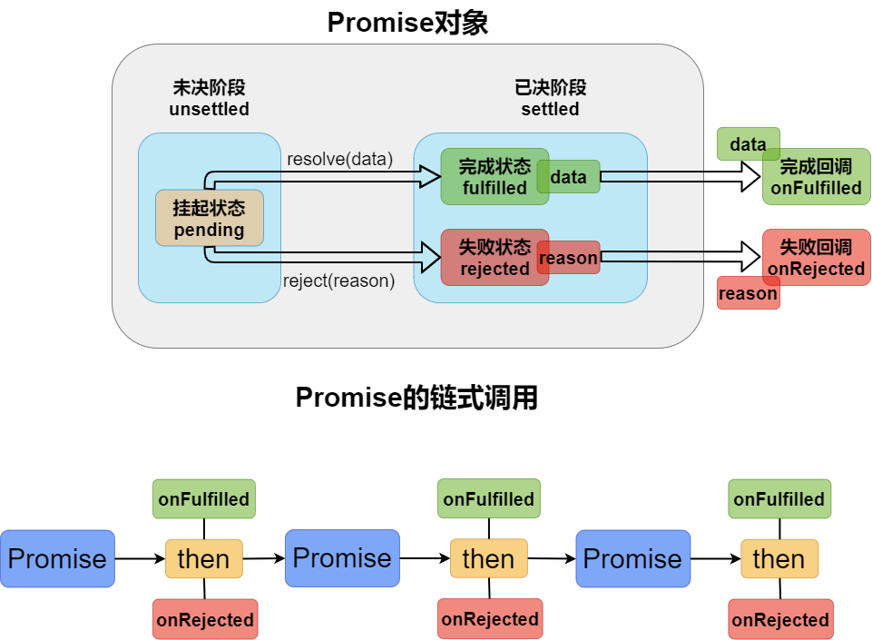
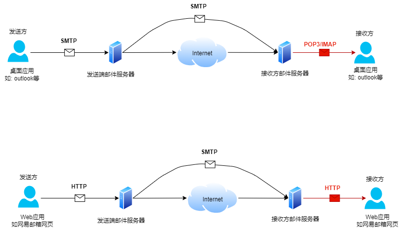
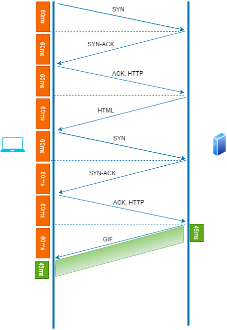
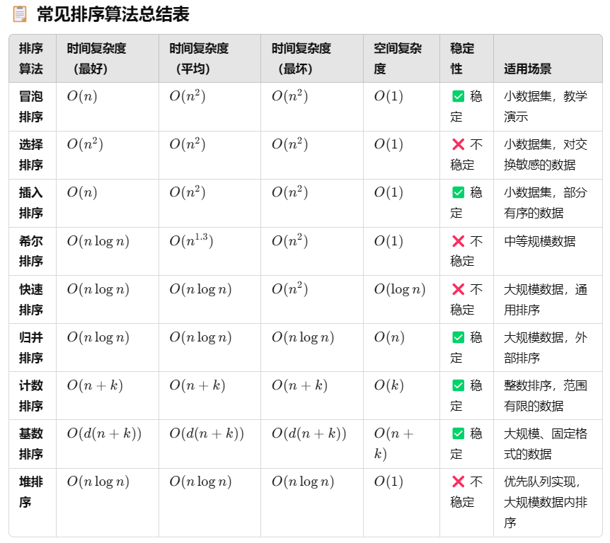
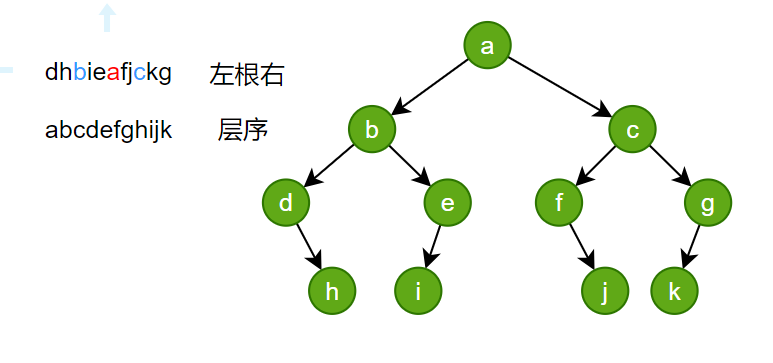

# 考情分析

[真题地址](https://www.nowcoder.com/exam/test/85190579/detail?pid=55153645&examPageSource=Company&subTabName=written_page&testCallback=https%3A%2F%2Fwww.nowcoder.com%2Fexam%2Fcompany%3FcurrentTab%3Drecommand%26jobId%3D100%26keyword%3Doppo23&testclass=%E8%BD%AF%E4%BB%B6%E5%BC%80%E5%8F%91)


# 题目解析

## 1.下述代码的执行结果为

```js
let obj1 = {
  name: '张三',
  getName() {
    return this.name;
  },
};

let obj2 = {
  name: '李四',
  getName() {
    return super.getName();
  },
};

Object.setPrototypeOf(obj2, obj1);
console.log(obj2.getName());
```

- A. undefined
- B. "张三"
- C. "李四"
- D. null

> 正确答案 C

> 考点：`super`关键字， `this`关键字

`this`指向调用者

`super`关键字用于访问对象字面量或类的[[Prototype]]上的属性，或调用超类的构造函数。

`super.prop`和`super[expr]`表达式在**类和对象字面量**的任何**方法定义**中都有效。

`super(...args)`表达式只在**类的构造函数中**有效

> **注意**：`super`是一个关键字，这些是特殊的语法结构，`super`不是指向**proto**对象的变量。尝试读取`super`本身是一个语法错误.也不能通过 super 来删除超类的属性。

```js
const child = {
  myParent() {
    console.log(super); // SyntaxError: 'super' keyword unexpected here
  },
};

class Base {
  foo() {}
}
class Derived extends Base {
  delete() {
    delete super.foo; // this is bad
  }
}

new Derived().delete(); // ReferenceError: invalid delete involving 'super'.
```

---

## 2.运行此代码,运行结果正确的是

```js
var nums = [2, 3, 4, 5, 6, 7];
nums.push(0);
nums.pop();
console.log(nums);
```

- A. [2, 3, 4, 5, 6, 7]
- B. [3, 4, 5, 6, 7, 0]
- C. [2, 3, 4, 5, 6, 7, 0]
- D. [0, 2, 3, 4, 5, 6]

> 正确答案 A

> 考点：数组 API

**数组添加和移除元素常用 API**

| API                     | 说明                                 | 返回值                                         |
| ----------------------- | ------------------------------------ | ---------------------------------------------- |
| `push(e1,e2,...,en)`    | 向数组的末尾添加一个或多个元素       | 新数组的长度                                   |
| `pop()`                 | 移除数组的最后一个元素               | 被移除的元素                                   |
| `shift()`               | 移除数组第一个元素，其他元素索引减一 | 被移除的元素，若没有被移除的元素，则返回空数组 |
| `unshift(e1,e2,...,en)` | 向数组的开头添加一个或多个元素       | 新数组的长度                                   |

---

## 3.运行此代码，并单击页面中的按钮“点我”，控制台的输出结果正确的是（）

```html
<button id="btn" type="button">点我</button>

<script type="text/javascript">
  document.getElementById('btn').addEventListener('click', function () {
    console.log('hello');
  });
  document.getElementById('btn').addEventListener('click', function () {
    console.log('hello nowcoder');
  });
</script>
```

- A. hello hello nowcoder
- B. hello
- C. hello nowcoder
- D. hello nowcoder hello nowcoder

> 正确答案 A

> 考点：事件监听

**`EventTarget.addEventListener()`**方法将指定的监听器注册到`EventTarget`上，当该对象触发指定的事件时，指定的回调函数就会被执行。`EventTarget`可以是一个文档上的元素`Element`,`Document`和`Window`，也可以是任何支持事件的对象(比如`XMLHttpRequest`).

`addEventListener()`的工作原理是将实现`EventListener`的函数或对象添加到调用它的`EventTarget`上的指定事件类型的事件侦听器列表中。如果要绑定的函数或对象**已经被添加到列表中**，该函数或对象**不会被再次添加**。

> 注意：如果先前向事件侦听器列表中添加过一个匿名函数，并且在之后的代码中调用`addEventListener`来添加一个功能完全相同的匿名函数(**甚至代码完全相同**),那么之后的这个匿名函数也会被添加到列表中。
>
> 实际上，即使使用完全相同的代码来定义一个匿名函数，这两个函数仍然存在区别，并非同一个函数。

---

## 4.当单击 a 标签中的文本时，要求跳转到 div 标签区域，下列选项中，做法正确的是（）

- A. `<div id="a"></div> <a href="a">跳转</a>`
- B. `<div id="#a"></div> <a href="a">跳转</a>`
- C. `<div id="a"></div> <a href="#a">跳转</a>`
- D. `<div id="#a"></div> <a href="#a">跳转</a>`

> 正确答案 C

> 考点: 锚点跳转机制 片段标识符

`<a href="#example">`会跳转到页面中`id`属性值为`example`的元素的位置.

`#`是**片段标识符**,在URL中用于标识页面中的某个片段(fragment).

- 片段标识符并不会触发HTTP请求或重新加载页面,它只是告诉浏览器滚动到目标为止
- 浏览器通过与`id`匹配的方式定位到对应的片段.

> 注意,虽然`#id名`的写法与`css`选择器一致,但是a标签只能跳转到id对应的位置,并不能跳转到其他选择器,如类选择器选中元素的位置.

---

## 5.请问一下 JS 代码输出的结果是()

```js
const p = Promise.resolve(935);
p.then((val) => {
  return val;
})
  .then((val) => {
    console.log(val);
    return new Promise((res, rej) => {
      res(++val);
    });
  })
  .then((val) => {
    console.log(val);
    return new Promise((res, rej) => {
      setTimeout(() => {
        res(++val);
      }, 1000);
    });
  })
  .then((val) => {
    console.log(val);
  });
```

- A. 935 936 936
- B. 935 936 937
- C. 935 935 935
- D. 935 935 936

> 正确答案 B

> 考点 Promise 事件循环



1. `then`方法必定会返回一个新的`Promise`,可以理解为后续处理也是一个==任务对象==
2. 新任务的状态取决于后续处理(即`onFulfilled`和`onRejected`)
   - 若没有相关的后续处理,则新任务的状态和前任务一致,数据为前任务数据.(==注意: 在新版本node中,如果整个链式调用过程都未对失败(`reject`)进行处理,则程序会直接报错==)
   - 若有后续处理但未执行,则新任务挂起
   - 若后续处理执行了,则根据后续处理的情况确定新任务的状态
     - 后续处理==无错==,新任务的状态为==完成==,数据为后续处理的==返回值==
     - 后续处理==有错==,新任务的状态为==失败==,数据为异常对象
     - 后续执行返回的是一个==任务对象(`Promise`)==,新任务的状态和数据和该任务一致.

3. `Promise`类的静态方法

| 方法                           | 含义                                                         |
| ------------------------------ | ------------------------------------------------------------ |
| `Promise.resolve(data)`        | 直接返回一个完成状态的任务                                   |
| `Promise.reject(reason)`       | 直接返回一个失败状态的任务                                   |
| `Promise.all(任务数组)`        | 返回一个任务<br />任务数组全部成功则成功<br />任何一个任务失败则失败 |
| `Promise.any(任务数组)`        | 返回一个任务<br />任务数组任一成功则成功<br />全部失败则失败 |
| `Promise.allSettled(任务数组)` | 返回一个任务<br />任务数组全部已决则成功<br />该任务不会失败 |
| `Promise.race(任务数组)`       | 返回一个任务<br />任务数组任一已决则已决,状态和其一致        |

---

## 6.下列关于 SSL 说法错误的是\_\_.

- A. SSL 是 TCP 加强版本
- B. SSL 通过采用机密性，数据完整性，服务器鉴别和客户端鉴别来强化 TCP
- C. SSL 强制网络两端的用户使用特定的对称加密算法
- D. SSL 记录由类型字段，版本字段，长度字段，数据字段，MAC 字段组成

> 正确答案 C

SSL（Secure Sockets Layer）协议是一种安全传输协议，旨在通过加密、身份认证、数据完整性等手段确保计算机网络中数据传输的安全性。SSL 最初由 Netscape 提出，用于保护在互联网上传输的数据，特别是在 Web 浏览器和服务器之间。SSL 现已被 TLS（Transport Layer Security）协议所取代，但仍有许多人将 SSL 和 TLS 混用。以下是 SSL 协议的详细介绍：

### 1. SSL 的目标

SSL 协议的核心目标是提供以下几方面的安全保障：

- **加密（Confidentiality）**：防止数据在传输过程中被第三方窃听。
- **身份认证（Authentication）**：确保通信的双方是合法的，防止中间人攻击。
- **数据完整性（Integrity）**：确保传输的数据在传输过程中没有被篡改。
- **不可否认性（Non-repudiation）**：确保发送方在通信后无法否认其发送过的数据。

### 2. SSL 工作原理

SSL 主要通过两种加密方式来实现其安全目标：

- **对称加密（Symmetric Encryption）**：用于数据传输的加密和解密，速度快，但加密和解密使用相同的密钥，需要在通信前交换密钥。
- **非对称加密（Asymmetric Encryption）**：用于加密密钥交换过程，使用公钥和私钥对数据进行加密和解密。通过公钥加密的数据只能通过对应的私钥解密，反之亦然。

SSL 协议在数据传输过程中依赖以下几个重要的步骤：

1. **SSL 握手过程**：在客户端和服务器之间建立连接时，双方会通过 SSL 握手来协商使用的加密算法、交换密钥并验证身份。
2. **密钥交换**：客户端和服务器交换用于加密数据的密钥，通常使用非对称加密算法（如 RSA）进行交换。
3. **加密通信**：在成功建立安全连接后，数据的传输会使用对称加密算法进行加密，保证通信内容的安全。

### 3. SSL 握手过程

SSL 握手是建立安全连接的关键，通常包括以下几个步骤：

1. **客户端发起连接请求**：客户端向服务器发送一个“客户端 hello”消息，消息中包括客户端支持的 SSL 协议版本、加密算法（如 RSA、AES）、支持的压缩方法等。
2. **服务器响应**：服务器选择支持的协议和加密算法后，向客户端发送“服务器 hello”消息，并返回服务器的证书（包括公钥）以及其他相关信息。
3. **客户端验证证书**：客户端通过验证服务器的证书（由受信任的证书颁发机构 CA 签发）来确认服务器的身份。如果证书有效，客户端继续进行下一步。如果证书无效，可能会弹出警告或连接失败。
4. **生成会话密钥**：客户端生成一个对称密钥，并用服务器的公钥加密该密钥，然后发送给服务器。服务器用自己的私钥解密密钥。
5. **客户端和服务器确认安全参数**：双方交换信息，确认密钥已经成功交换，并且开始使用对称加密算法加密通信。
6. **加密通信开始**：一旦握手完成，客户端和服务器开始使用生成的会话密钥进行加密的消息传输，确保通信的机密性和完整性。

### 4. SSL 记录协议

SSL 记录协议是负责将数据加密并传输的协议层。它包含以下几个部分：

- **类型字段（Content Type）**：标识消息的类型（如：握手、警告、应用数据等）。
- **版本字段（Version）**：指示使用的 SSL/TLS 版本。
- **长度字段（Length）**：指示消息体的长度。
- **数据字段（Data）**：包含加密的实际数据。
- **MAC（Message Authentication Code）字段**：用于保证数据的完整性，确保数据在传输过程中没有被篡改。

### 5. SSL 的安全性

SSL 协议通过加密和身份验证来确保数据的安全性，防止以下攻击：

- **中间人攻击（Man-in-the-middle）**：攻击者在客户端和服务器之间窃取或篡改信息。通过加密和身份验证，SSL 确保通信的各方是合法的。
- **重放攻击（Replay Attack）**：攻击者将已捕获的合法数据重新发送。SSL 通过使用随机数和时间戳来防止这种攻击。
- **数据篡改**：SSL 使用消息认证码（MAC）来确保数据在传输过程中未被篡改。

### 6. SSL 证书

SSL 证书用于验证服务器（和客户端）的身份。证书由受信任的证书颁发机构（CA）签发，其中包含以下信息：

- **公钥**：用于加密数据的密钥。
- **证书持有者的信息**：包括持有者的名称、组织、域名等。
- **CA 的签名**：证明证书的合法性和可信性。
- **有效期**：证书的有效期限。

在客户端访问 HTTPS 网站时，服务器会提供 SSL 证书，客户端通过验证证书来确认服务器身份。

### 7. SSL 与 TLS

SSL 和 TLS（传输层安全协议）实际上是相同的协议，只是名称和实现有所不同。TLS 是 SSL 协议的继任者，TLS 更安全、更新，并且修复了 SSL 协议中的一些漏洞。大部分现代浏览器和服务器都支持 TLS，但仍然使用 SSL 这一术语来指代安全连接。

### 8. SSL 的应用

SSL 主要用于保护 Web 通信，但也可以用于保护其他协议（如电子邮件、FTP 等）。SSL 常用于以下场景：

- **HTTPS**：基于 HTTP 协议的 SSL 实现，用于安全的 Web 浏览。
- **电子邮件加密（如 IMAPS、POP3S、SMTP over SSL）**：用于加密和保护电子邮件通信。
- **VPN**：通过 SSL 构建的虚拟专用网络，用于安全远程访问。

### 9. SSL 的缺点和限制

尽管 SSL 提供了强大的安全性，但也有一些缺点：

- **性能开销**：SSL 加密和解密过程会消耗较多的计算资源，尤其是在高流量的环境中。
- **兼容性问题**：早期的 SSL 协议（如 SSL 2.0 和 3.0）已被发现存在一些漏洞，因此许多现代系统已禁用这些旧版本。
- **证书费用**：商用证书的成本可能较高，尤其是在需要高保障的场合。

### 总结

SSL 协议通过加密、身份认证和数据完整性检查来提供安全保障，广泛应用于 Web 通信和其他网络协议中。虽然它已经被 TLS 协议取代，但 SSL 仍然是网络安全的核心组成部分，尤其是在建立安全连接时

---

## 7.请问以下 JS 代码最终输出的结果是（）

```js
const [a, b] = '123';
const { c, d } = '123';
console.log(a);
console.log(b);
console.log(c);
console.log(d);
```

- A. undefined undefined undefined undefined
- B. 1 2 1 2
- C. undefined undefined 1 2
- D. 1 2 undefined undefined

> 正确答案：D

> 解构赋值, 字符串是一个类数组对象

### 1. 解析 `const [a, b] = '123';`

- `'123'` 是一个字符串，实际上它是一个类数组对象，具有数字索引（例如 `0`、`1`、`2`）和 `length` 属性。

- 这里使用了 **数组解构**（`[a, b]`），它的目标是从 `'123'` 字符串中提取第一个和第二个字符并分别赋值给 `a` 和 `b`。

  **具体过程**：

  - 字符串 `'123'` 被视作一个类数组对象，具有索引 0 对应字符 `'1'`，索引 1 对应字符 `'2'`，索引 2 对应字符 `'3'`。
  - 解构赋值将 `'1'` 赋给变量 `a`，将 `'2'` 赋给变量 `b`。

  **结果**：

  - `a = '1'`
  - `b = '2'`

### 2. 解析 `const { c, d } = '123';`

- 这里的解构使用了 **对象解构**（`{ c, d }`）。通常，解构用于从一个对象中提取属性值。

- `'123'` 作为字符串被传递给对象解构，但字符串并没有直接提供名为 `c` 和 `d` 的属性。

- 在 JavaScript 中，字符串是类数组对象，并且对象解构是根据属性名称来匹配的，但字符串本身没有 `c` 和 `d` 这样的属性。

  **具体过程**：

  - 因为字符串 `'123'` 没有 `c` 和 `d` 这两个属性，所以 `c` 和 `d` 会被赋值为 `undefined`。

  **结果**：

  - `c = undefined`
  - `d = undefined`

---

## 8.小明使用 Chrome 浏览器上 163 邮箱发送了一封邮件，请问这封邮件发向邮件服务器时采用的什么协议？

- A. SMTP
- B. POP3
- C. HTTP
- D. IGMP

> 正确答案 C

> 电子邮件收发过程

A. SMTP(Simple Mail Transfer Protocol, 简单邮件传输协议),将邮件发送的服务器

B. POP3(Post Office Protocol v3)

C. HTTP(Hyper Text Transfer Protocol, 超文本传输协议), 常用于应用前后端交互.

D. IGMP(Internet Group Management Protocol, 互联网管理协议),用于管理网络中多播组成员的协议,允许主机报告它们对多播组的成员身份.



### 1. 发送邮件

#### 发送邮件的基本流程

1. **邮件客户端发送邮件**：
   - 小明在邮件客户端（例如，Outlook、Apple Mail、Web 邮箱、Thunderbird 等）中编写好邮件，并点击发送按钮。
2. **邮件客户端连接邮件服务器（SMTP 服务器）**：
   - 邮件客户端通过 SMTP（Simple Mail Transfer Protocol，简单邮件传输协议）将邮件发送到邮件服务器。
   - SMTP 是一种推送协议，负责邮件的发送与转发。
3. **SMTP 协议的工作过程**：
   - 邮件客户端与 SMTP 服务器建立连接（通常是端口 25、465 或 587）。
   - 邮件客户端向 SMTP 服务器提供发送者的邮箱地址、收件人的邮箱地址、邮件内容和附件等信息。
   - 邮件服务器验证发送者的身份（如登录认证）后，开始转发邮件。
   - SMTP 服务器检查邮件的目的地（收件人邮箱所在的服务器）并确定最佳路径，可能通过多个中转邮件服务器来实现。
   - 如果收件人邮箱服务器无法立刻接收邮件（例如，目标邮件服务器不可用），SMTP 服务器会暂时存储邮件并重试发送。
4. **邮件被存储在收件人邮件服务器上**：
   - 最终，SMTP 服务器将邮件转发到收件人的邮件服务器（例如，收件人的 163 邮箱服务器）。
   - 邮件在服务器上暂时存储，等待收件人获取。

### 2. 接收邮件

#### 收取邮件的基本流程

收件人收到邮件的过程通常依赖于 **POP3** 或 **IMAP** 协议。下面介绍这两种协议的区别和工作方式：

#### 使用 POP3 协议（Post Office Protocol v3）

1. **邮件客户端连接 POP3 服务器**：
   - 收件人的邮件客户端（例如 Outlook、Thunderbird 等）通过 POP3 协议连接到邮件服务器。
   - POP3 通常使用端口 110（未加密）或 995（加密）。
2. **邮件下载过程**：
   - 客户端从邮件服务器下载邮件内容到本地计算机。
   - 下载后，POP3 协议通常会将邮件从邮件服务器上删除（取决于设置）。这意味着邮件仅存在于收件人本地，不再保留在服务器上。
3. **邮件客户端与服务器之间的交互**：
   - 客户端会验证用户身份（通常是用户名和密码）以获取权限。
   - 然后，客户端从邮件服务器上下载所有新邮件，并显示在收件箱中。

**POP3 协议的特点**：

- 简单、快速，但只能在下载邮件后才能离线查看。
- 不适合多个设备之间同步邮件（如手机、电脑、平板等），因为邮件下载后会被删除。

#### 使用 IMAP 协议（Internet Message Access Protocol）

1. **邮件客户端连接 IMAP 服务器**：
   - 收件人的邮件客户端通过 IMAP 协议连接到邮件服务器。
   - IMAP 通常使用端口 143（未加密）或 993（加密）。
2. **邮件同步过程**：
   - 与 POP3 不同，IMAP 不会下载邮件到本地，而是通过 IMAP 协议与邮件服务器同步邮件。邮件实际上仍然存储在邮件服务器上。
   - 用户可以在任何设备上查看、删除、移动邮件等，因为这些操作会直接同步到邮件服务器。
3. **邮件客户端与服务器之间的交互**：
   - 客户端在每次操作（例如标记已读、删除邮件、移动邮件等）时，都会与服务器同步这些状态。
   - 由于邮件保存在服务器上，用户可以在不同设备上查看相同的邮件内容，适合多设备同步。

**IMAP 协议的特点**：

- 支持多设备同步，邮件始终保留在服务器上。
- 适用于经常使用多个设备查看和管理邮件的用户。

---

## 9.某个主机与服务器之间建立连接，经测试主机到服务器的平均 RTT 为 120ms，一个 gif 图像的平均发送时延为 45ms。如果一个 Web 页面使用非持久连接的 HTTP 协议，它包含了 8 幅 gif 图像，请问使用上述主机访问这个页面需要多少时间（）（页面的基本 HTML 文件、HTTP 请求报文、TCP 握手报文大小忽略不计，TCP 第三次握手捎带一个 HTTP 请求）

- A. 1560ms
- B. 2280ms
- C. 2520ms
- D. 2640ms

> 正确答案: C

> TCP三次握手, 网络延迟计算



最开始三次握手以及获取页面HTML文件等消耗两个`RTT`,即
$$
120 * 2 = 240ms
$$
由于是非持久连接,所以后续每次获取GIF文件都需要重新三次握手,消耗两个RTT,同时还有每个GIF图片的平均发送时延`45ms`,故后续每张GIF消耗时间
$$
120 * 2+45 = 285ms
$$
所以总的访问时间为
$$
240+285*8=2520ms
$$

---

## 10.对于某线性表来说，若第一个元素的存储地址为 100，每个元素的长度为 2，则经过五个元素后，第六个元素的存储地址为（）

- A. 106
- B. 108
- C. 110
- D. 112

> 正确答案 C

> 线性表的存储方式

线性表根据题目描述判断,该线性表应该是数组的存储方式,即逻辑上相邻的节点,在实际内存中的存储也相邻.故计算可得第六个元素的存储地址为
$$
100+2*5 = 110
$$


---

## 11.给定一组硬币面值 C={1,5,10,25,60,100}，下面是用最少的硬币向客户支付金额的贪心算法，下列关于该贪心算法的叙述正确的是（）

```
ALGORITHM (x, c1, c2, …, cn)//c1,c2..表示货币金额
SORT n coin denominations so that 0 < c1 < c2 < … < cn.
S ← ∅.//选择货币的集合
WHILE (x > 0)
    k ← largest coin denomination ck such that ck <= x.
    IF no such k, RETURN “no solution.”
    ELSE
        x ← x – ck.
        S ← S ∪ { k }.
RETURN S.
```

- A. 利用该贪心算法求解得到的解总是最优的
- B. 题目中所给的贪心算法适用于任何一套面值`c1<c2<...<cn`的硬币，前提是`c1=1`
- C. 题中所给的贪心算法只适合于硬币面值为 `C = {1, 5, 10, 25, 60, 100}`
- 给定 x=90，得到的集合`C={60, 25, 5}`，这个解是最优的

> 正确答案 D

> 贪心算法

A.  贪心算法只能保证局部最优解,无法保证全局最优解.

B. 举反例说明

`C={1, 3, 4}, x=6`,按照该算法可得最优解为`{4, 1, 1}`,为3个硬币,实际上,最优解为`{3, 3}`,只需要2个硬币.

C. 面值集合 {1, 2, 4, 8, 16, 32, 64}，类似二进制系统。这种情况下，贪心算法一定最优，因为每个硬币的“价值跨度”不重叠。

D. 正确

## 12.分时操作系统中，当时间片固定时，用户数越多，每个用户分到的时间片就越少，响应时间自然就变长。在一个分时操作系统，当时间片固定为 5ms 时，为保证响应时间不超过 2s，最大就绪进程数为（）

- A. 200
- B. 250
- C. 400
- D. 500

> 正确答案 C

> 分时操作系统

为保证响应时间不超过2s,考虑最坏的情况,就是当前进程需要等待所有其他就绪进程分时后才能分到时间,故总进程数
$$
n = \frac{2s}{5ms} = 400
$$


---

## 13.圆覆盖

平面上有*n*个点，每个点有一个点权*v*。你现在可以以原点为圆心放置一个圆，请问要使圆能覆盖到的点的权值和达到*x*，圆的半径至少为多少？

### 输入描述


### 输出描述


#### 示例 1

```
输入例子：
        5  10
        0  1  2
        -1  1  3
        3  3  4
        -4  3  1
        5  -3  1

输出例子：5
例子说明：
半径为5时，点(0,1),(-1,1),(3,3),(-4,3)在圆内，权值和为10
```

#### 示例 2

```
输入例子：
        5  10
        0  1  2
        -1  1  3
        3  3  2
        -4  3  1
        5  -3  1

输出例子：-1
例子说明：
权值和无法达到10
```

```js
const rl = require("readline").createInterface({
    input: process.stdin,
});
const iter = rl[Symbol.asyncIterator]();
const readline = async () => (await iter.next()).value;

void (async function () {
    const [n, x] = (await readline()).split(" ").map(Number);
    const points = [];
    for (let i = 0; i < n; i++) {
        const [a, b, v] = (await readline()).split(" ").map(Number);
        const distanceSquared = a * a + b * b; // 使用平方距离避免重复计算平方根
        points.push({ distanceSquared, v });
    }

    // 按照平方距离升序排序
    points.sort((p1, p2) => p1.distanceSquared - p2.distanceSquared);

    let sum = 0;
    for (const { distanceSquared, v } of points) {
        sum += v;
        if (sum >= x) {
            console.log(Math.sqrt(distanceSquared)); // 只在需要时计算平方根
            return;
        }
    }

    // 如果所有点的权值加起来都达不到下限x
    console.log(-1);
})();
```

### 时间复杂度

1. 读取输入：`O(n)`
2. 计算距离： `O(n)`
3. 排序操作：`O(nlogn)`
4. 遍历求和：`O(n)`

**整体时间复杂度:`O(nlogn)`**

### 空间复杂度 `O(n)`

---

## 14.在 Linux 中，关于虚拟内存相关的说法正确的是（）

- A. CPU 与内存之间通过 MMU 将虚拟内存地址翻译为物理内存地址
- B. 页是虚拟内存与物理内存的交换单元,最小的单位是 64KB
- C. 在页表结构中, 有效位为 1 代表虚拟地址未被分配
- D. 在一个进程中，每个线程之间的虚拟内存是独占的

> 正确答案 A

> 操作系统的存储器管理,CPU管理

A. 正确.CPU生成虚拟地址,`MMU(Memory Management Unit, 内存管理单元)`负责将**虚拟地址**转换为**物理地址**,其依据页表进行地址映射,从而访问物理内存.

这种机制实现了内存保护,进程隔离和虚拟内存管理.

B. Linux系统中默认页的大小是**4KB**

C. 在页表结构中,有效位为`1`表示虚拟地址有对应物理页;有效位为0,地址为null表示该虚拟地址未被分配;有效位为0,地址不为null,表示虚拟地址被分配,但还没有缓存到物理页.

D. 线程是轻量级的执行单元,具有独立的**栈空间和寄存器上下文**,但他们共享同一进程的**堆,代码段和全局数据,共享相同的虚拟地址空间**

---

## 15.牛牛想要对下表中的数据进行排序，要求以考核成绩进行排序，成绩相同的不改变现有的位置关系，以下排序算法中牛牛必须选择（）


- A. 快速排序
- B. 直接选择排序
- C. 堆排序
- D. 简单插入排序

> 正确答案 D

> 排序算法的稳定性



> 口诀: 排序算法稳定的有**茶(插入排序)几(计数排序)并(归并排序)鸡(基数排序)毛(冒泡排序)**,茶几并鸡毛.

---

## 16.单词

小欧有一些英文单词，他想知道这些单词是不是合法的。一个单词是合法的当且仅当这个单词首字母是大写的，其它字母均是小写的。你能帮帮他吗。

### 输入描述


### 输出描述

```
对于每一组数据，如果单词是合法的，输出一行"YES"，否则输出一行"NO"。
```

#### 示例 1

```
输入例子：
2
yeerV
Ophu
输出例子：
NO
YES
例子说明：
yeerV的首字母是小写的，因此不是合法单词。
Ophu的首字母是大写的，其它字母都是小写的，因此是合法单词。
```

#### 示例 2

```
输入例子：
2
vvryuCryg
pzjiyR
输出例子：
NO
NO
```

```js
const rl = require('readline').createInterface({
  input: process.stdin,
});
var iter = rl[Symbol.asyncIterator]();
const readline = async () => (await iter.next()).value;

void (async function () {
  // Write your code here
  // 定义正则匹配规则
  const reg = /^[A-Z][a-z]*$/;
  // 读入数据数量
  const n = parseInt(await readline());
  for (let i = 0; i < n; i++) {
      // 逐个读入单词
    const word = await readline();
    console.log(reg.test(word) ? 'YES' : 'NO');
  }
})();
```

- 时间复杂度: `O(n·L)`,`n`是单词个数,L是每行长度
- 空间复杂度: `O(L)`

## 17.系统在作业调度时分配了 N 个物理块，页面引用串长度为 P，包含 M 个不同的页号，当使用固定分配局部置换算法时，缺页次数不会少于（）？当使用可变分配局部置换算法时，缺页次数不会少于（）

- A. M, M
- B. P, min(M,N)
- C. N, N
- D. min(M, P), min(M, N)

> 正确答案 D

> 操作系统的内存管理

无论采用什么页面置换算法，每种页面第一次访问时不可能在内存中，必然发生缺页，所以缺页次数大于等于M，答案选A。

---

## 18.已知某二叉树的中序遍历为 `dhbieafjckg`，层序遍历为 `abcdefghijk`，则由此可得，其叶子结点的个数为（）

- A. 2
- B. 3
- C. 4
- D. 5

> 正确答案 C



---

## 19.下面选项中，哪个命令可以删除当前目录下名字中包含“nowcoder”的所有文件（）

- A. rm -rf \*
- B. rm -rf nowcoder/\*
- C. rm -rf nowcoder\*
- D. rm -rf \*nowcoder\*

> 正确答案 D

`rm`即`remove`指移除

`-r`是命令参数,指`-recursion`,加上该参数后可以删除文件夹,否则只能删除文件.

`-f`是命令参数,指`-force`,即强制删除.只读文件也会删除,文件如果不存在不报错.

后面的`*`,`nowcoder/*`,`nocoder*`,`*nowcoder*`都是匹配模式,用于匹配特定的文件或目录

常见的匹配模式

| 匹配模式符号 | 含义                             | 匹配模式示例          | 可以匹配的例子                                     | 不会匹配的例子           |
| ------------ | -------------------------------- | --------------------- | -------------------------------------------------- | ------------------------ |
| `*`          | 匹配零个或多个字符               | `*.log`               | `error.log`,`access.log`,`debug.log`               | `error.js`               |
| `?`          | 匹配单个任意字符                 | `???.txt`             | `abc.txt`,`123.txt`                                | `dsjfkldjs.txt`          |
| `[]`         | 方括号内的任意一个字符都会被匹配 | `file[1-5].txt`       | `file1.txt`,`file2.txt`,...`file5.txt`             | `file6.txt`,`sdklfj.txt` |
| `{}`         | 提供了一种指定字符串序列的方式   | `backup{1..3}.tar.gz` | `backup1.tar.gz`,`backup2.tar.gz`,`backup3.tar.gz` | `backup4.tar.gz`         |
| `[^]`        | 用于匹配不在括号内的任意一个字符 | `[^0-9]*.txt`         | `note.txt`,`report222.txt`                         | `2jklds.txt`,`3wjf.txt`  |

A表示删除当前目录下所有文件

B表示删除当前目录的nowcoder目录下的所有文件

C表示删除当前目录下文件名以nowcoder开头的文件

D表示删除当前目录下文件名包含nodwcoder的文件.

---

## 20.请问根据以下代码，id 为 main 的 div 标签的宽度为（）

```html
<!DOCTYPE html>
<html lang="en">
  <head>
    <meta charset="UTF-8" />
    <title>Document</title>
    <style>
      body div {
        max-width: 150px !important;
      }
      #main {
        width: 300px !important;
      }
      div {
        max-width: 120px !important;
      }
    </style>
  </head>
  <body>
    <div id="main" style="width: 100px;"></div>
  </body>
</html>
```

- A. 150px
- B. 300px
- C. 120px
- D. 100px

> 正确答案 A

> CSS属性值的计算过程

CSS属性值的计算过程包括以下四步:

1. 确定声明值:把没有冲突的属性值直接应用
2. 层叠:根据一定的规则解决冲突
3. 继承:没有值且可以继承的属性使用继承值
4. 使用默认值:还没有值的属性使用默认值

其中层叠步骤又分为三步

1. 比较重要性

> 带有`!important`的默认样式>带有`!important`的作者样式>作者样式>默认样式

2. 比较特定性

重要性相同的情况下,比较特定性

| 选择器类型                     | 权重      | 备注                                              |
| ------------------------------ | --------- | ------------------------------------------------- |
| 内联样式                       | (1,0,0,0) | <style="....">,通过在标签上写的内联样式特定性最高 |
| id选择器                       | (0,1,0,0) | 有几个id选择器,第二个数字就是几                   |
| 类选择器,伪类选择器,属性选择器 | (0,0,1,0) |                                                   |
| 元素选择器,伪元素选择器        | (0,0,0,1) |                                                   |

3. 比较源次序

当重要性和特定性都相同时,在源代码中靠后的属性值会覆盖前面的.

在该题目中,只涉及到两个属性`max-width`和`width`的层叠.

首先来看`max-width`属性,有两个选择器定义了该属性.

即

```css
body div {
  max-width: 150px !important;
}
div {
  max-width: 120px !important;
}
```

首先比较重要性,两者都是带有`!important`的作者样式,重要性相同.

然后比较特定性,前者有两个元素选择器,故特定性为(0,0,0,2)

后者为一个元素选择器,故特定性为(0,0,0,1)

前者特定性更高,故`max-width`的计算值是`150px`

---

然后来看`width`属性.这里也有两个部分声明了该属性

```css
#main {
  width: 300px !important;
}
```

```html
<div id="main" style="width:100px">
  
</div>
```

首先比较重要性,前者带有`!important`,重要性更高,所以`width`的计算值为`300px`

综上`max-width:150px`,`width:300px`,`width`属性受到`max-width`属性限制,所以最终其宽度为`150px`


---

## 21.根据代码，请问四个 div 标签从上到下的排列顺序（以 class 值代指）是（）

```html
<!DOCTYPE html>
<html lang="en">
  <head>
    <meta charset="UTF-8" />
    <title>Document</title>
    <style>
      div {
        width: 20px;
        height: 20px;
      }
      .item1 {
        z-index: -10;
        background-color: yellow;
      }
      .item2 {
        position: fixed;
        z-index: 1;
        background-color: red;
        margin-top: 10px;
      }
      .item3 {
        position: fixed;
        z-index: -1;
        background-color: green;
        margin-top: 40px;
      }
      .son {
        position: fixed;
        z-index: 100;
        background-color: black;
        margin-top: 30px;
      }
    </style>
  </head>
  <body>
    <div class="item1"></div>
    <div class="item2"></div>
    <div class="item3">
      <div class="son"></div>
    </div>
  </body>
</html>
```

- A. son item2 item3 item1
- B. item1 item2 item3 son
- C. item2 item1 item3 son
- D. item1 son item2 item3

> 正确答案 B

> 考察CSS的视觉格式化模型

根据题意,该题问的是**从上到下**的顺序,应该指的是在屏幕这个平面内,从上到下,而不是距离用户的远近,所以直接忽视`z-index`,因为该属性决定的是层叠的优先级,与上下顺序无关.

首先给每个盒子都设置宽高为`20px`

首先是`item1`是常规流没有定位的块盒,`z-index`只对定位元素有效,`item1`未定位(`position`未`static`,故`z-index`无效).所以item1直接正常排列在最上面.

`item2`使用了固定定位,所以会脱离常规流,其位置是相对其包含块来说的.

> `position:fixed`的元素的包含块是视口

由于其没有设置`left/right/top/bottom`属性的值,所以其默认位置仍然是原来在文档流中的位置,加了一个`margin-top:10`后相对原来的位置下移10px.

故`item1`下面10px为`item2`

`item2`同样设置了`position:fixed`,也保持原来的位置,但是由于`item2`已经脱离了文档流,所以`item3`的默认位置和`item2`的默认位置重合,`item3`加了一个`margin-top:40`效果是相对于`item1`下边界下移40px, 距`item2`下边界10px.

`item3`同样设置了`position:fixed`,脱离文档流,包含块是视口,但是没有设置`left`等,所以默认位置还是原来在文档流中的位置,就是紧贴`item1`的下边缘.

`son`是`item3`的子元素.默认位置上边与`item3`上边平齐.所以设置`margin-top`是相对于`item3`的上边,之所以没有和`item3`发生外边距合并,是因为`item3`使用了固定定位,形成了新的BFC,不同BFC中的margin不能合并.

所以`son`距`item3`下边10px;

---

## 22.请问以下 HTML 中文字 a、b、c 的 font-size 值分别是多少 px（）

```html
<!DOCTYPE html>
<html lang="en">
  <head>
    <meta charset="UTF-8" />
    <title>Document</title>
    <style>
      * {
        font-size: 15px;
      }
      .main {
        font-size: 20px;
      }
    </style>
  </head>
  <body>
    <div class="main">
      a
      <span>b</span>
      <div>c</div>
    </div>
  </body>
</html>
```

- A. 20 20 20
- B. 15 15 15
- C. 20 15 15
- D. 20 15 20

> 正确答案 C

> CSS样式计算


---

## 23.环形进度条

环形进度条

`id`为`"magnifier"`的`"section"`节点是一个环形进度条模块，而`"magnifier"`对象用于初始化该模块。该模块的功能如下：

1. 输入框中可以输入数字类型，数值即百分比值；
2. 当点击确定按钮时，环形进度条按输入框中的数值进行渲染；
3. 若输入框中的数据比 0 小，则将输入框中的值置为 0，百分比按 0% 渲染；
4. 若输入框中的数据比 100 大，则将输入框中的值置为 100，百分比按 100% 渲染；

注意：若用户输入数据为小数，则按四舍五入取整处理

请阅读给定的 JavaScript 代码，并在 TODO 处完善代码。效果如下：


```html
<!DOCTYPE html>
<html>
  <head>
    <meta charset="utf-8" />
    <style type="text/css">
      * {
        margin: 0px;
        padding: 0px;
      }
      .loop-pie {
        position: relative;
        width: 200px;
        height: 200px;
        margin: 60px;
      }
      .loop-pie-line {
        position: absolute;
        width: 50%;
        height: 100%;
        top: 0;
        overflow: hidden;
      }
      .loop-pie-l {
        top: 0px;
        left: 0px;
      }
      .loop-pie-r {
        top: 0px;
        transform: rotate(180deg);
        right: 0px;
      }
      .loop-pie-c {
        width: 200%;
        height: 100%;
        border: 4px solid transparent;
        border-radius: 50%;
        position: absolute;
        box-sizing: border-box;
        top: 0;
        transform: rotate(-45deg);
      }
      .loop-pie-rm {
        border-top: 10px solid #baedee;
        border-left: 10px solid #baedee;
        border-bottom: 10px solid #1ac4c7;
        border-right: 10px solid #1ac4c7;
      }
      .loop-pie-lm {
        border-top: 10px solid #baedee;
        border-left: 10px solid #baedee;
        border-bottom: 10px solid #1ac4c7;
        border-right: 10px solid #1ac4c7;
      }
      .percent-number {
        margin-left: 60px;
        width: 200px;
        text-align: center;
      }
      .percent-number input {
        width: 60px;
        font-size: 18px;
      }
      #submit {
        font-size: 15px;
        margin-left: 10px;
      }
    </style>
  </head>

  <body>
    <section id="magnifier"></section>

    <script>
      var magnifier = {
        init(param) {
          const el = param.el;
          if (!el) return;
          this.createElement(el);
          this.initEvent();
          this.loadPercent();
        },
        createElement(el) {
          const loopPie = document.createElement('div');
          loopPie.className = 'loop-pie';
          // 右半圆
          const rightLoopPie = document.createElement('div');
          rightLoopPie.className = 'loop-pie-line loop-pie-r';
          const rightMask = document.createElement('div');
          rightMask.className = 'loop-pie-c loop-pie-rm';
          rightMask.id = 'loop-rc';
          rightLoopPie.appendChild(rightMask);
          // 左半圆
          const leftLoopPie = document.createElement('div');
          leftLoopPie.className = 'loop-pie-line loop-pie-l';
          const leftMask = document.createElement('div');
          leftMask.className = 'loop-pie-c loop-pie-lm';
          leftMask.id = 'loop-lc';
          leftLoopPie.appendChild(leftMask);

          loopPie.appendChild(rightLoopPie);
          loopPie.appendChild(leftLoopPie);

          // 百分比输入框
          const percent = document.createElement('div');
          percent.className = 'percent-number';
          const input = document.createElement('input');
          input.type = 'number';
          input.value = 25;
          const button = document.createElement('button');
          button.innerText = '确定';
          button.id = 'submit';
          percent.appendChild(input);
          percent.appendChild(button);

          el.appendChild(loopPie);
          el.appendChild(percent);
        },
        initEvent() {
          // TODO：获取id=submit的节点
          const submit = null;
          // TODO：给submit的按钮添加点击事件，当被点击时调用 loadPercent() 方法
        },
        getPercenNumber() {
          const input = document.querySelector('.percent-number input');
          // TODO：将输入框中的值保留四舍五入取整
          let num = 0;
          // TODO：将输入框框的值置为合理区间范围

          input.value = num;
          return num;
        },
        loadPercent() {
          // TODO：计算左半圆部分和右半圆部分旋转的角度
          // 右半圆部分旋转角度
          let rotateRight = 0;
          // 左半圆部分旋转角度
          let rotateLeft = 0;

          const lc = document.querySelector('#loop-lc');
          lc.style.transform = `rotate(${rotateLeft}deg)`;
          const rc = document.querySelector('#loop-rc');
          rc.style.transform = `rotate(${rotateRight}deg)`;
        },
      };
      magnifier.init({
        // TODO: 请获取id=magnifier的节点
        el: null,
      });
    </script>
  </body>
</html>
```
