# 核心概念

## 注入


vue 会将以下配置注入到 vue 实例:

- data: 和界面相关的数据
- compouted: 通过已有的数据计算出来的数据
- methods: 方法

> 模板中可以使用 vue 实例中的成员

## 虚拟 DOM 树

直接操作真实的 DOM 会引发严重的效率问题,vue 使用虚拟 DOM(vnode)的方式来描述要渲染的内容,vnode 是一个**普通**的 JS 对象,用于描述界面上应该有什么,比如:

```js
var vnode = {
  tag: 'h1',
  children: [{ tag: undefined, text: '第一个vue应用: Hello World' }],
};
```

上面的对象描述了:

```
有一个标签名为h1的节点,他会有一个子节点,该子节点是一个文本,内容为"第一个vue应用: Hello World"
```

**vue 模板并不是真实的 DOM,他会被编译为虚拟 DOM**

```html
<div id="app">
  <h1>第一个vue应用: {{title}}</h1>
  <p>作者: {{author}}</p>
</div>
```

上面的模板会被编译成为类似下面结构的虚拟 DOM

```js
{
  tag: "div",
  children: [
    {
      tag: "h1",
      children: [
        {
          text: "第一个vue应用: Hello World"
        }
      ]
    },
    {
      tag: "p",
      children: [
        {
          text: "作者: 拿破仑"
        }
      ]
    }
  ]
}
```

虚拟 DOM 树会最终生成为真实的 DOM 树


当数据变化后,将引发重新渲染,vue 会比较新旧两棵 vnode tree, 找出差异, 然后仅把差异部分应用到真实 DOM Tree 中


**可见,在 Vue 中,要得到最终的界面,必须要生成一个 vnode tree**

`vue`通过以下逻辑生成`vnode tree`:


**注意: 在`Vue2`中虚拟节点树必须是单根的**

## 挂载

将生成的真实 DOM 树,放到某个元素位置,称之为**挂载**

## 完整流程


# 组件

组件的出现是为了实现以下两个目标:

1. 降低整体复杂度,提升代码的可读性和可维护性

2. 提升局部代码的可复用性

绝大部分情况下,一个组件就是页面中某个区域,组件包含该区域的:

- 功能(JS 代码)
- 内容(模板代码)
- 样式(CSS 代码)

> 要在组件中包含样式,需要构建工具的支持

## 组件开发

### 创建组件

组件是根据一个普通的配置对象创建的,所以要开发一个组件,只需要写一个配置对象即可
该配置对象和 vue 实例的配置**几乎一样**

```js
// 组件配置对象
var myComp = {
  data() {
    return {};
  },
  template: `...`,
};
```

值得注意的是,组件配置对象和 vue 实例有以下几点差异:

- 无`el`
- `data`必须是一个函数,该函数返回的对象作为数据
- 由于没有`el`配置,组件的虚拟 DOM 树必须定义在`template`或`render`中

### 注册组件

注册组件分为两种方式,一种是**全局注册**,一种是**局部注册**

#### 全局注册

一旦全局注册了一个组件,整个应用中任何地方都可以使用


全局注册的方式是:

```js
// 参数1: 组件名称,将来在模板中使用组件时,会使用该名称
// 参数2: 组件配置对象
// 该代码运行后,即可在模板中使用组件
Vue.component('my-comp', myComp);
```

在模板中,就可以使用组件了

```vue
<my-comp/>
<!-- 或 -->
<my-comp></my-comp>
```

> 但是在一些工程化的大型项目中,很多组件都不需要全局使用
>
> 比如一个登录组件,只有在登录相关的页面中使用,如果全局注册,将导致构建工具无法优化打包
>
> 因此,除非组件特别通用,否则不建议全局注册

#### 局部注册


局部注册组件的方式是,在要使用组件或实例中加入一个配置

```js
// 这是另一个要使用my-comp的组件
const otherComp = {
    components: {
        // 属性名为组件名称,模板中将使用该名称
        // 属性值为组件配置对象
        "my-comp": myComp
    }
}
```

### 应用组件

在模板中使用组件特别简单,把组件名当做HTML元素名使用即可.

但要注意以下几点:

1. **组件必须有结束**

组件可以自结束,也可以使用结束标记结束,但必须要有结束.

下面的组件使用是**错误的.**

```vue
<my-comp>
```

2. **组件的命名**

无论你使用哪种方式注册组件,组件的命名方式都需要遵循规范.

组件可以使用`kebab-case`短横线命名法,也可以使用`PascalCase`大驼峰命名法

下面两种命名方式都是可以的

```js
const otherComp = {
    components: {
        'my-comp': myComp, 	//方式1
        'MyComp': myComp,	//方式2
    }
}
```

> 实际上,使用小驼峰命名法camelCase也是可以识别的,只不过不符合官方要求的规范.

使用`PascalCase`方式命名还有一个好处,就是在模板中既可以使用大驼峰,也可以使用短横线.

## 组件树

一个组件创建好后,往往会在各种地方使用它.它可能多次出现在vue实例中,也可能出现在其他组件中.

于是就形成了一个组件树


## 向组件传递数据

大部分组件要完成自身的功能,都需要一些额外的信息

比如一个头像组件,需要告诉它头像的地址,这就需要在使用组件时向组件传递数据

传递数据的方式有很多种,最常见的一种是使用***组件属性(Component Props)**

首先在组件中声明可以接受哪些属性

```js
const MyComp = {
    props: ['p1','p2','p3'],
    // 和Vue实例一样,使用组件时也会创建组件的实例
    // 而组件的属性会被提取到组件实例中,因此可以在模板中使用
    template: `
    <div>{{p1}},{{p2}},{{p3}}</div> `
}
```

在使用组件时,向其传递属性

```js
const OtherComp = {
    components: {
        MyComp
    },
    data() {
        return 1;
    },
    template: `
    <my-comp :p1="a" :p2="2" p3="3" />`
}
```

**注意: 在组件中,属性是只读的,绝对不可以更改,这叫做单向数据流**


## 工程结构

## 组件混入

有的时候,许多组件有着类似的功能,这些功能代码分散在组件不同的配置中.

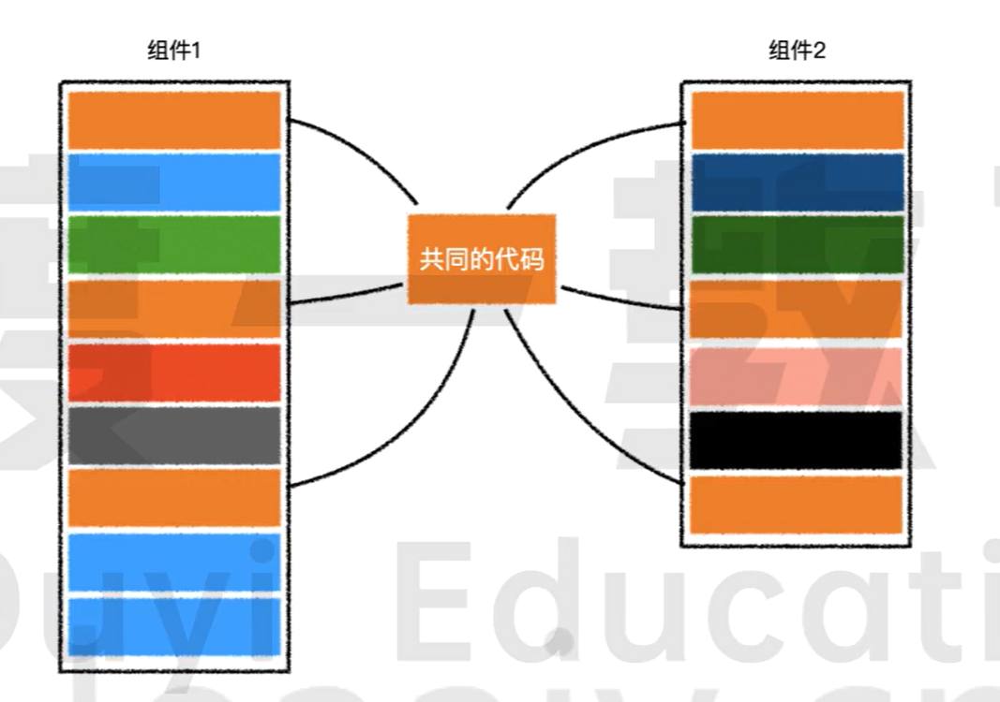

于是,我们可以把这些配置代码抽离出来,利用**混入**融合到组件中.


```js
// 抽离的公共代码
const common = {
    data() {
        return {
            a: 1,
            b: 2
        }
    },
    created() {
        console.log('common created');
    },
    methods: {
        sum() {
            return this.a + this.b;
        }
    }
}

/**
* 使用comp1,将会得到:
* common created
* comp1 created 1 2 3
*/

const comp1 = {
    mixins: [common],		// 之所以是数组,是因为可以混入多个配置代码
    created() {
        console.log('comp1 created', this.a, this.b, this.sum)
    }
}
```

混入并不复杂,更多细节参见官网.

## 组件递归

```vue
<template>
  <ul class="right-list-container">
    <li
      v-for="(item, index) in list"
      :class="{ active: item.isSelected }"
      :key="index"
    >
      {{ item.name }}
      <!-- 递归调用自身 -->
      <RightList v-if="item.children" :list="item.children" />
    </li>
  </ul>
</template>

<script>
export default {
  // 给组件定义name,方便递归使用组件
  name: 'RightList',
  props: {
    list: {
      type: Array,
      default: () => [],
    },
  },
};
</script>

<style></style>
```

 

# 搭建工程

## vue-cli

`vue-cli`是一个脚手架工具,用于搭建`vue`工程

它内部使用了`webpack`,并预置了诸多插件(plugin)和加载器(loader),以达到开箱即用的效果.除了基本的插件和加载器外,`vue-cli`还预置了

- babel
- webpack-dev-server
- eslint
- postcss
- less-loader

## SFC(Single File Component)

单文件组件,即一个文件就包含了一个组件所需的全部代码

```vue
<template>
<!-- 组件模板代码 -->
</template>

<script>
export default {
    // 组件配置
}
</script>

<style>
/* 组件样式 */
</style>
```

## 预编译

当`vue-cli`进行打包时,会直接把模板转换为`render`函数,这叫做模板预编译

这样做的好处在于:

1. 运行时就不需要编译模板了,提高了运行效率
2. 打包结果中不再需要vue的编译代码,减少了打包体积


# 计算属性

面试题: 计算属性和方法有什么区别

> 计算属性本质上是包含`getter`和`setter`的方法
>
> 当获取计算属性时,实际上是调用计算属性的`getter`方法.vue会收集计算属性的依赖,并缓存计算属性的返回结果.只有当依赖变化后才会重新进行计算
>
> 方法没有缓存,每次调用方法都会导致重新执行.
>
> 计算属性的`getter`和`setter`参数固定,`getter`没有参数,`setter`只有一个参数.而方法不限.
>
> 由于有以上的这些区别,因此计算属性通常是更具已有数据得到其他数据,并在得到数据的过程中不建议使用异步,当前时间,随机数等副作用操作.
>
> 实际上,他们最重要的区别是含义上的区别.计算属性含义上也是一个数据,可以读取也可以赋值;方法含义上是一个操作,用于处理一些事情.

完整的计算属性书写

```js
computed: {
    propName: {
        // getter
        get() {
            
        },
        // setter
        set(val) {
            
        }
    }
}
```

只包含`getter`的计算属性简写

```js
computed: {
    propName() {
        
    }
}
```

> 父组件样式会影响子组件的根元素样式


# 组件事件

## pager组件

### 属性

| 属性名        | 含义       | 类型   | 必填 | 默认值 |
| ------------- | ---------- | ------ | ---- | ------ |
| current       | 当前页码   | Number | 否   | 1      |
| total         | 总数据量   | Number | 否   | 10     |
| limit         | 页容量     | Number | 否   | 10     |
| visibleNumber | 可见页码数 | Number | 否   | 10     |

### 事件

| 事件名     | 含义     | 事件参数 | 参数类型 |
| ---------- | -------- | -------- | :------- |
| pageChange | 页码变化 | 新的页码 | Number   |

## 知识点

### 全局样式

### v-if和v-show


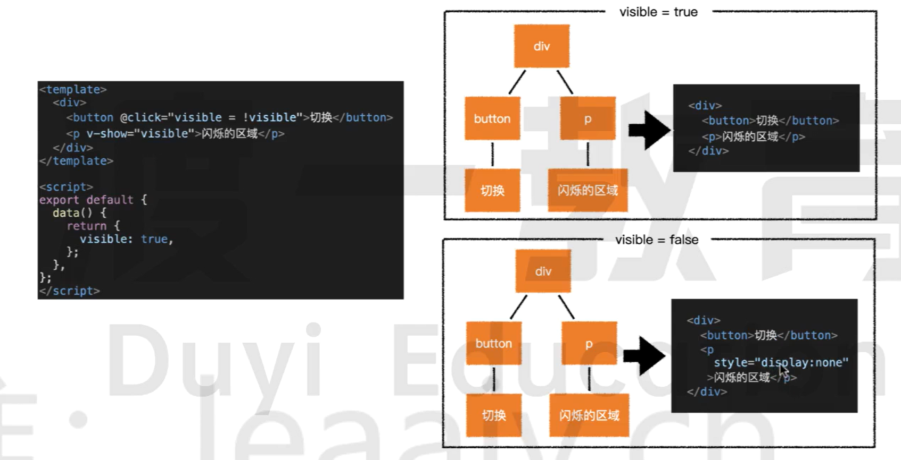

### 面试题: v-if和v-show有什么区别

> v-if能够控制是否生成vnode,也就间接控制了是否生成对应的DOM.当v-if为true时,会生成对应的vnode,并生成对应的DOM元素,当其为false时,不会生成对应的vnode,自然不会生成任何DOM元素
>
> v-show始终会生成vnode,也就间接导致了始终生成DOM.它只是控制DOM的`display`属性,当v-show为true时,不做任何处理;当其为false时,生成的DOM的`display`属性为none
>
> 使用v-if可以有效的减少树的节点和渲染量,但也会导致树的不稳定;而使用v-show可以保持树的稳定,但不能减少树的节点和渲染量
>
> 因此,在实际的开发中,显示状态变化频繁的情况下应该使用v-show,以保持树的稳定;显示状态变化较少时应该使用v-if,以减少树的节点和渲染量.

### 组件事件


抛出事件: 子组件在某个时候发生了一件事,但自身无法处理,于是通过事件的方式通知父组件处理.

事件参数: 子组件抛出事件,传递给父组件的数据

注册事件: 父组件声明,当子组件发生某件事的时候,自身将做出一些处理.

# 优化工程结构

# 插槽

```vue
<template>
<!-- message组件: 一个弹窗消息 -->
	<div class="message-container">
    	<div class="content">
           <!-- 这是消息内容,可以是一个文本,也可能是一段html,具体是什么不知道,需要父组件指定 --> 
    	</div>
        <button>
        	确定
   		</button>
		<button>
        	关闭
    	</button>
    </div>
</template>
```

## 插槽的简单用法

此时,就需要使用插槽来定制组件的功能

```vue
<!-- Message 组件 -->
<template>
<!-- message组件: 一个弹窗消息 -->
	<div class="message-container">
    	<div class="content">
           <!-- slot是vue内置的组件 --> 
            <slot></slot>
    	</div>
        <button>
        	确定
   		</button>
		<button>
        	关闭
    	</button>
    </div>
</template>
```

```vue
<!-- 父组件 -->
<Message>
	<div>
        <p>
            APP Message
        </p>
        <a href="">detail</a>
    </div>
</Message>

<!-- 最终结果 -->
<template>
<!-- message组件: 一个弹窗消息 -->
	<div class="message-container">
    	<div class="content">
           <!-- slot是vue内置的组件 --> 
            <div>
       	 		<p>
            		APP Message
        		</p>
        		<a href="">detail</a>
   		    </div>
    	</div>
        <button>
        	确定
   		</button>
		<button>
        	关闭
    	</button>
    </div>
</template>
```

## 具名插槽

如果某个组件中需要父元素传递多个区域的内容.为了避免冲突,就需要给不同的插槽赋予不同的名称.


# 路由


## 路由插件

VueRouter

## 路由模式

路由模式决定了:

1. 路由从哪里获取访问路径
2. 路由如何改变访问路径

`vue-router`提供了三种路由模式

1. hash: 默认值.路由从浏览器地址栏中的hash部分.该模式兼容性最好

   ```
   http://localhost:8081/#/blog   --> blog
   http://localhost:8081/about#/blog  --> blog
   ```

2. history: 路由从浏览器地址栏的`location.pathname`中获取路径,改变路径使用H5的history api.该模式可以让地址栏最友好,但是需要浏览器支持`history api`

   ```
   http://localhost:8081/#/blog   			-->  /
   http://localhost:8081/about#/blog		--> /about
   http://localhost:8081/blog				--> /blog
   ```
   
3. abstract: 路由从内存中获取路径,改变路径也只是改动内存中的值.这种模式通常应用到非浏览器环境中.

   ```
   内存:  /       -->  /
   内存:  /about  --> /about
   内存:  /blog   --> /blog
   ```

## 导航

`vue-router`提供了全局的组件`RouterLink`,它的渲染结果是一个`a`元素

```vue
<template>
	<RouterLink to="/blog">文章</RouterLink>
	<!-- mode: hash 生成 -->
	<a href="#/blog">文章</a>
	<!-- mode: history 生成 -->
	<!-- 为了避免刷新页面,vue-Router实际上为它添加了点击事件,并阻止了默认行为,在事件内部使用history api更改了路径.-->
	<a href="/blog">文章</a>
</template>
```

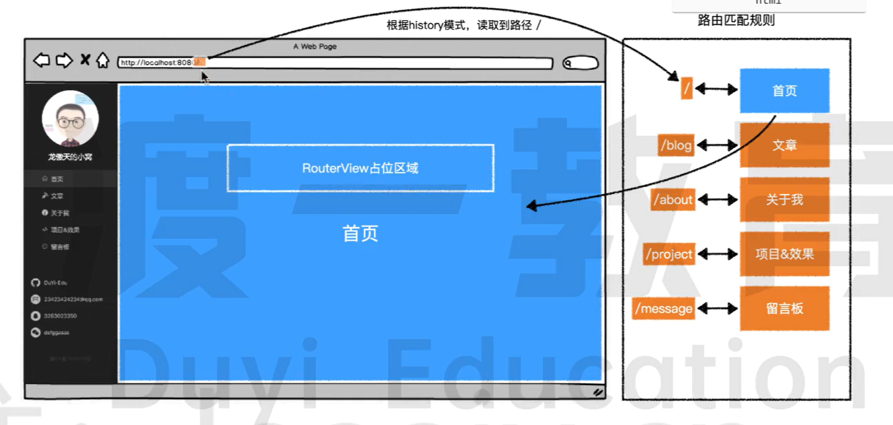

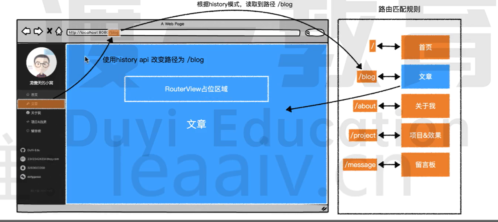

### 激活状态

默认情况下,`vue-router`会用**当前路径**匹配**导航路径**

- 如果当前路径是以导航路径开头,则算作匹配,会为导航的a元素添加类名`router-link-active`
- 如果当前路径完全等于导航路径,则算作精确匹配,会为导航的a元素添加类名`router-link-exact-active`

例如,当前访问的路径是`/blog`,则:

| 导航路径 | 类名                                           |
| -------- | ---------------------------------------------- |
| /        | router-link-active                             |
| /blog    | router-llink-active   router-link-exact-active |
| /about   | 无                                             |
| /message | 无                                             |

可以为组件`RouterLink`添加bool属性`exact`,将匹配规则改为:必须精确匹配才能添加类名`router-link-active`

例如,当前访问的路径是`/blog`则

| 导航路径 | 类名                |
| -------- | ------------------- |
| /        | 无                  |
| /blog    | router-llink-active |
| /about   | 无                  |
| /message | 无                  |

另外,可以通过`active-class`属性更改匹配的类名,通过`exact-active-class`更改精确匹配的类名.

## 命名路由

使用命名路由可以解除系统与路径之间的耦合

```js
// 路由配置
const router = new VueRouter({
    routes: [
        // 路由规则
        //当匹配到路径 /foo时,渲染Foo组件
        {name: "foo", path: '/foo', component: Foo},
        // 当匹配到路径 /bar时, 渲染Bar组件
        {name: "bar", path: '/bar', component: Bar}
    ]
})
```

向to属性传递路由信息对象 RouterLink会根据你传递的信息以及路由配置生成对应的路径.

```vue
<template>
	<RouterLink :to="{name: 'foo'}">go to foo</RouterLink>
</template>
```

## 动态路由

### 动态路由的导航

```vue
<template>
	<RouterLink to="/article/cate/3">to article </RouterLink>
	<RouterLink to="{
                    	name: 'CategoryBlog',
                    	params: {
							categoryId: 3                    	
                    	}
                    }" ></RouterLink>
</template>
```

### 编程式导航

除了使用`<RouterLink>`超链接导航外,`vue-router`还允许在代码中跳转页面.

```js
this.$router.push('跳转地址');		// 普通跳转
this.$router.push({
    // 命名路由跳转
    name: "Blog"
})

this.$router.go(-1);	// 回退,类似于 history.go
```


# 弹窗

## 使用css module

 需要将样式文件命名为: `xx.module.ooo`

`xxx`为文件名

`ooo`为样式文件后缀名,可以是`css`,`less`,`scss`等

## 得到组件渲染的DOM

```js
/**
*	获取某个组件渲染的DOM根元素
*/
function getComponentRootDom(comp, props) {
    const vm = new Vue({
        render: h => h(comp, {props})
    })
    vm.$mount();
    return vm.$el;
}
```

## 扩展Vue实例


## ref

```vue
<template>
	<div>
        <p ref="para">
          some paragraph  
    	</p>
        <ChildComp ref="comp" />
        <button @click="handleClick">
        	查看所有引用    
    	</button>
    </div>
</template>
<script>
	import ChildComp from './ChildComp';
    export default {
        components: {
            ChildComp
        },
        methods: {
            handleClick() {
                console.log(this.$refs);
            }
            /*
            * 输出 para: p元素(原生DOM)
            *     comp: ChildComp的组件实例
            */
        }
    }
</script>
```

通过`ref`可以直接操作DOM,但是不符合Vue的设计理念,尽量不要使用.


# 获取远程数据

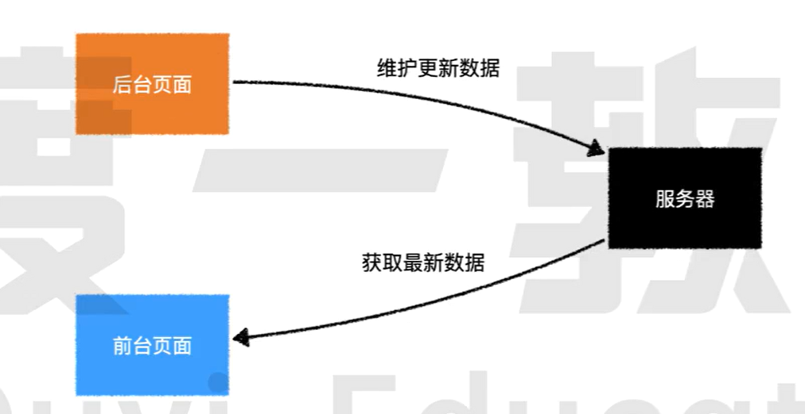

## 开发环境有跨域问题

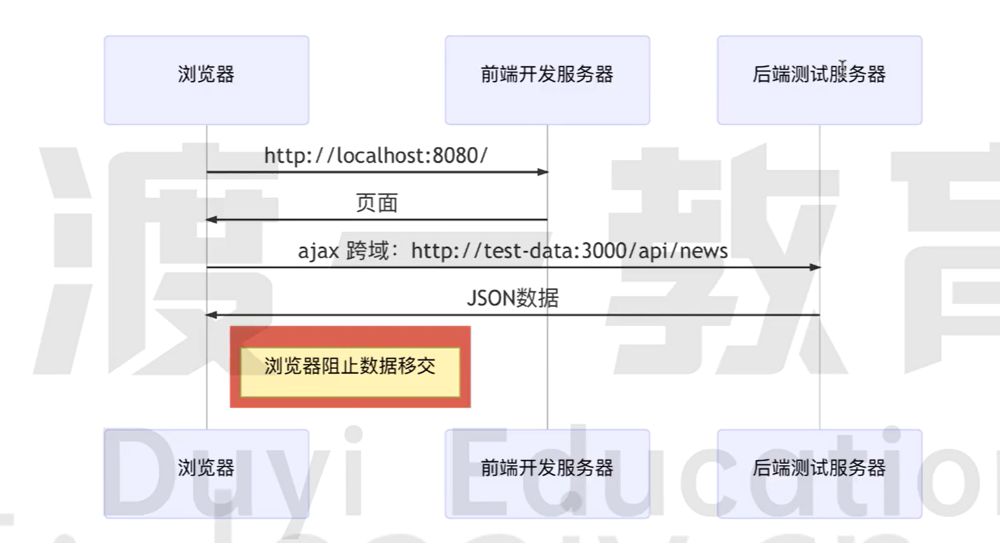

## 生产环境一般没有跨域问题

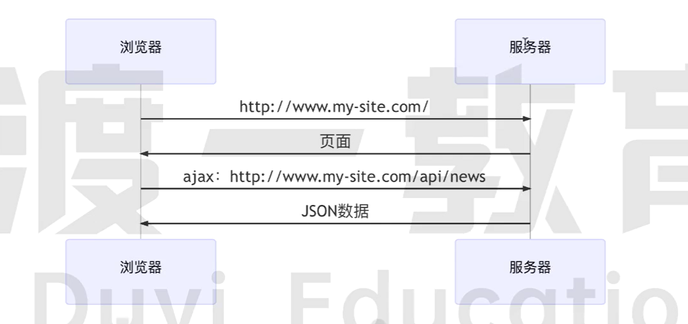

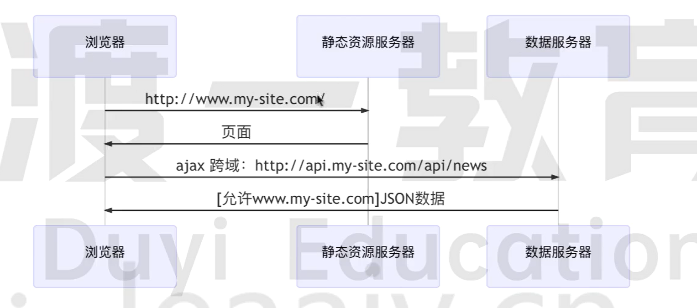

## 解决开发环境的跨域问题

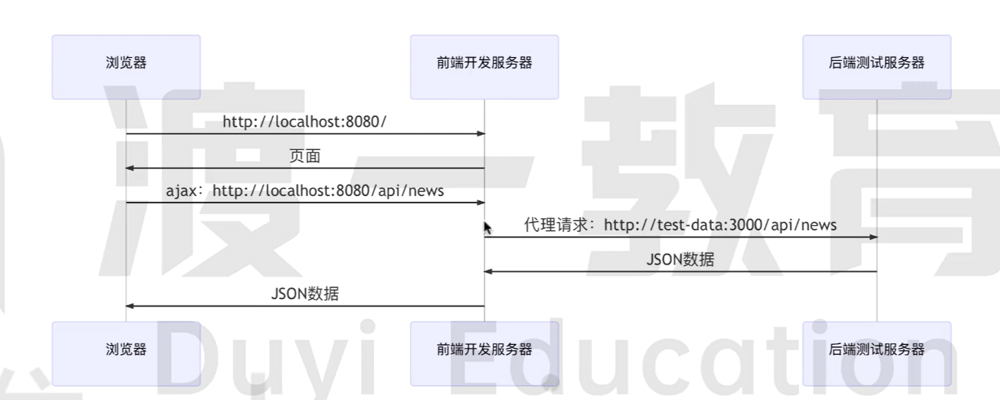

## 为什么要Mock数据

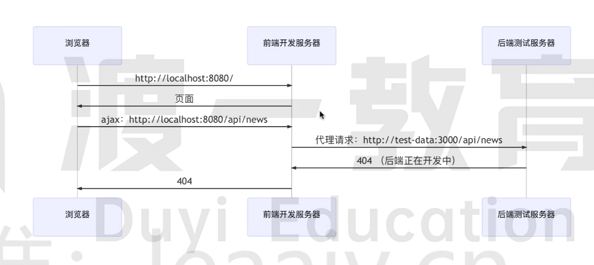

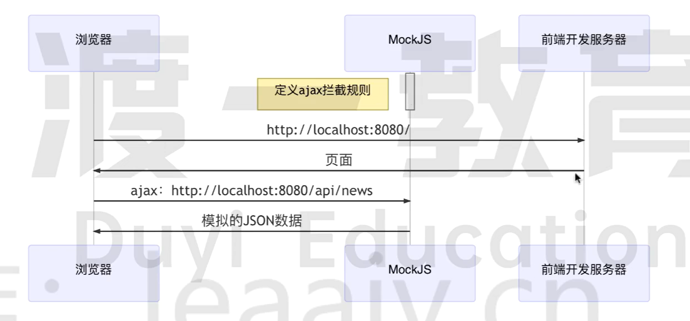

# 组件的生命周期

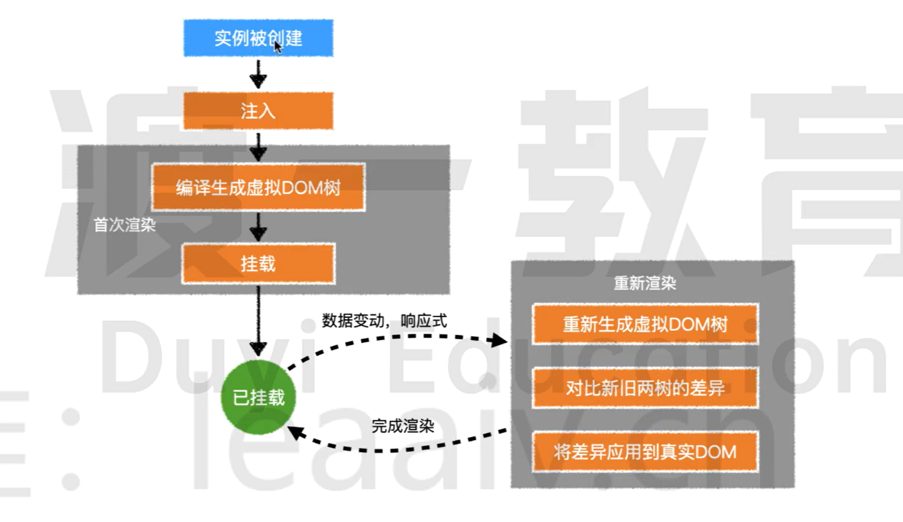

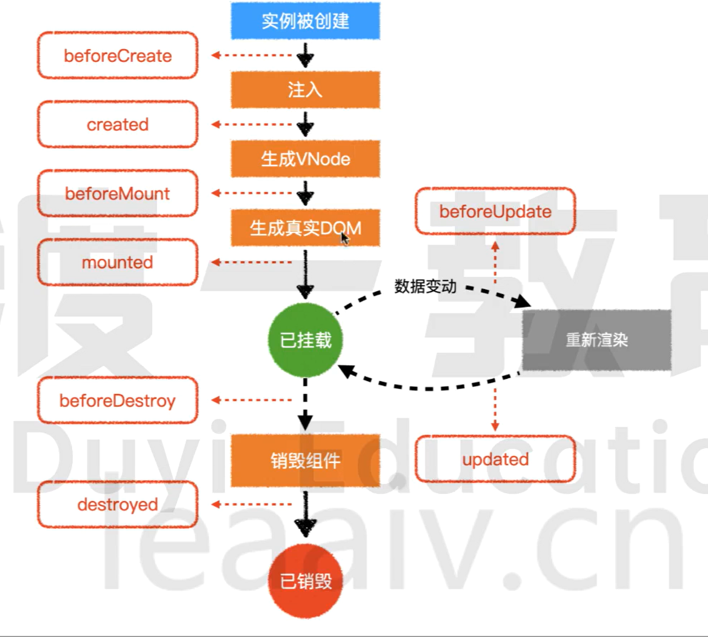

## 常见应用

> 不要死记硬背,根据具体情况灵活处理

### 加载远程数据

```js
export default {
    data() {
        return {
            news: [];
        }
    },
    async created() {
        this.news = await getNews();
    }
}
```

### 直接操作DOM

```js
export default {
    data() {
        return {
            containerWidth: 0,
            containerHeight: 0
        }
    },
    mounted() {
        this.containerWidth = this.$refs.container.clientWidth;
        this.containerHeight = this.$refs.container.clientHeight;
    }
}
```

### 启动和清除计时器

```js
export default {
    data() {
        return {
            timer: null
        }
    },
    created() {
        this.timer = setInterval(()=>{
            //...
        },1000)
    },
    destoryed() {
        clearInterval(this.timer);
    }                             
}
```

# 自定义指令

## 定义指令

### 全局指令

```js
// 指令名称为: mydirec1
Vue.directive('mydirec1', {
    // 指令配置
})

// 指令名称为: mydirec2
Vue.directive('mydirec2', {
    // 指令配置
})
```

之后,所有的组件都可以使用`mydirec1`和`mydirec2`指令

```vue
<template>
	<!-- 某个组件代码 -->
	<MyComp v-mydirec1="js表达式" />
	<div v-mydirec2="js表达式">
        <!-- ... -->
    </div>
</template>
```

### 局部指令

局部定义是指在某个组件中定义的指令,和局部注册的组件类似.

定义的指令仅在该组件中有效.

```vue
<template>
	<!-- 某个组件代码 -->
	<div>
        <MyComp v-mydirec1="js表达式" />
        <div v-mydirec2="js表达式">
            <!-- ... -->
    	</div>
        
    </div>
</template>


<script>
export default {
    // 定义指令
    directives: {
        // 指令名称: mydirec1
        mydirec1: {
            // 指令配置
            
        },
        // 指令名称: mydirec2
        mydirec2: {
            // 指令配置
        }
    }
}
</script>
```

## 指令配置对象

没有配置的指令,就像没有配置的组件一样,毫无意义.

`vue`支持在指令中配置一些**钩子函数**,在适当的时机,`vue`会调用这些钩子函数并传入适当的参数,以便开发者完成自己想做的事情.

常用的钩子函数

```js
// 指令配置对象
{
    bind() {
        // 只调用一次,指令第一次绑定到元素时调用.在这里可以进行一次初始化设置.
    },
    inserted() {
        // 被绑定元素插入父节点时调用
    },
    update() {
        // 所在组件的VNode更新时调用
    }
}
```

每个钩子函数在调用时,`vue`都会向其传递一些参数,其中最重要的是前两个参数.

```js
// 指令配置对象
{
    bind(el, binding) {
        // el: 被绑定元素对应的真实DOM
        // binding: 是一个对象,描述了指令中提供的信息
    }
}
```

### binding对象

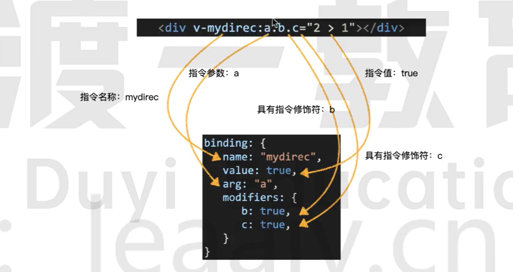

## 配置简化

比较多的时候,在配置自定义指令时,我们都会配置两个钩子函数

```js
{
    bind(el, binding) {
        
    },
    update(el, binding) {
        
    }
}
```

这样,在元素绑定和更新时,都能运行到钩子函数.

如果这两个钩子函数实现功能相同,可以直接把指令配置简化为一个单独的函数:

```js
function(el, binding) {
    // 该函数会被同时设置到bind和update中
}
```

> 利用上述知识,可以满足大部分自定义指令的要求.

# watch

利用watch配置,可以直接观察某个数据的变化,变化时可以做一些处理.

```js
export default {
    // ... 其他配置
    watch: {
        // 观察 this.$route 的变化,变化后,会调用该函数
        $route(newVal, oldVal) {
            // newVal: this.$route 新的值,等同 this.$route
            // oldVal: this.$route 旧的值
        },
        // 完整写法
        $route: {
            handler(newVal, oldVal){},
            deep: false, // 是否监听该数据内部属性的变化,默认 false
            immediate: false	// 是否立即执行一次 handler 默认 false
        }
        // 观察 this.$route.params 的变化,变化后, 会调用该函数
        ["$route.params"]:(newVal, oldVal) {
    	
		},
    }
}
```

# $listeners

`$listeners`是`vue`的一个实例属性,它用于获取父组件传递过来的所有时间事件函数

```vue
<template>
	<!-- 父组件 -->
	<Child @event1="handleEvent1" @event2="handleEvent2" />
</template>
```

```vue
// 子组件
this.$listeners 		// {event1: handleEvent1, event2: handleEvent2}
```

> `$emit`和`$listener`通信的异同
>
> 相同点: 都可以实现父组件向子组件传递消息
>
> 差异点: 
>
> - `$emit`更加符合单向数据流,子组件仅发出通知,由父组件监听做出改变,而`$listener`则是在子组件中直接使用了父组件的方法
> - 调试工具可以监听到子组件`$emit`事件,但无法监听到`$listener`中的方法调用(想一想为什么?因为相当于调用了一个普通函数)
> - 由于`$listener`可以获得父组件传递过来的方法,因此调用方法可以得到其返回值.但`$emit`仅仅是向父组件发出通知,无法知晓父组件处理的结果.

# 事件总线

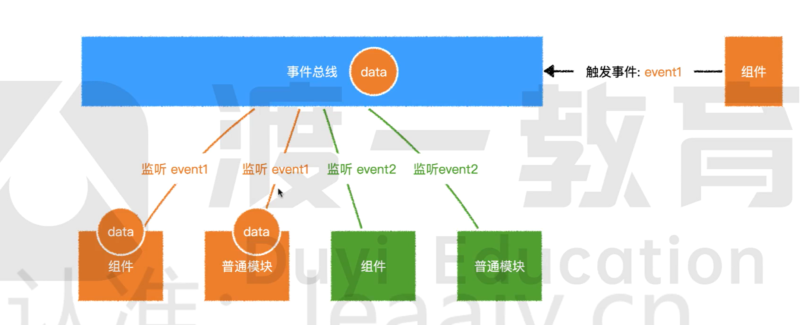

## 功能

1. 提供监听某个事件的接口
2. 提供取消监听的接口
3. 触发事件的接口(可传递数据)
4. 触发事件后会自动通知监听者

```js
// 事件总线
const listeners = [];

export default {
  // 监听某一个事件
  $on(eventName, handler) {
    if(!listeners[eventName]) {
      listeners[eventName] = new Set();
    }
    listeners[eventName].add(handler);
  },
  // 取消监听
  $off(eventName, handler) {
    if(!listeners[eventName]) {
      return;
    }
    listeners[eventName].delete(handler);
  },
  // 触发事件
  $emit(eventName, ...args) {
    if(!listeners[eventName]) {
      return;
    }
    listeners[eventName].forEach(handler => {
      handler(...args);
    })
  }
}
```

# 数据共享

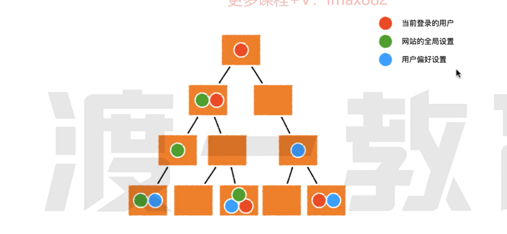

在vue中遇到**共享数据**,会带来以下问题.

- 如何保证数据的唯一性?
  - 如果数据不唯一,则会浪费大量的内存空间
  - 如果数据不唯一,可能会出现数据不一致的情况
- 某个组件改动数据后,如何让其他用到该数据的组件知道组件变化了?
  - 事件总线貌似可以解决该问题,但是需要再组件中手动维护监听,极其不方便,而且数据总线的目的在于**通知**,而不是**数据共享**

一种比较容易想到的方案,就是把所有的共享数据**全部**提升到根组件,然后通过属性不断下发,当某个组件需要修改数据时,又不断向上抛出事件,直到根组件完成对数据的修改.


这种方案的缺陷也非常明显:

- 需要编写大量的代码层层下发数据,很多组件被迫拥有了自己根本不需要的数据.
- 需要编写大量的代码层层上抛数据,很多组件注册了自己根本处理不了的事件


基于上面的问题,我们可以简单设置一个**独立的数据仓库**

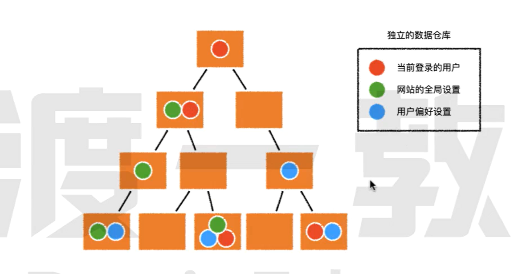

- 组件需要什么共享数据,可以自由地从仓库中获取,需要什么拿什么.
- 组件可以自由的改变仓库中的数据,仓库的数据变化后,会自动通知到相应数据的组件更新

要实现这一切,可以选择`vuex`

## 创建仓库

安装`vuex`后,可以通过下面的代码创建一个数据仓库,在大部分情况下,一个工程仅需创建一个数据仓库.

```js
import Vuex from 'vuex';
import Vue from 'vue';

Vue.use(Vuex); 

const store = new Vuex.Store({
    // 仓库的配置
    state: {
        // 仓库的初始状态(数据)
        count: 0
    }
})

export default store;
```

```js
// main.js
import Vue from 'vue';
import App from './App.vue';
import store from './store.js';

new Vue({
    store,	// 向vue中注入仓库
    render: h => h(App)
}).$mount("#app");
```

之后,在`vue`的组件中,可以通过实例的`$store`属性访问的仓库.

`Vuex`会自动将配置的状态数据设置为响应式数据,当数据变化时,依赖该数据的组件会自动渲染.


## 数据的变更

尽管可以利用数据响应式的特点直接变更数据,但这样的做法在大型项目中会遇到问题.

> 如果有一天,你发现某个共享数据是错误的,而有一百多个组件都有可能变更过这块数据,你该如何知道是哪一步变更出了问题?

为了能够更好的跟踪数据的变化,`vuex`强烈推荐使用`mutation`来更改数据.

```js
const store = new Vuex.Store({
    // 仓库的配置
    state: {
        // 仓库的出示状态(数据)
        count: 0
    },
    mutations: {
        /**
        * 每个mutation是一个方法,它描述了数据在某种场景下的变化
        * increase mutation描述了数据在增加时应该发生的变化
        * 参数state为当前的仓库数据
        */
        increase(state) {
            state.count++;
        },
        decrease(state) {
            state.count--;
        },
        /** 
        * 求n次幂
        * 该mutation需要一个额外的参数来提供指数
        * 我们把让数据产生变化是的附加信息称之为负荷(负载)payload
        * payload可以是任何类型,数字,字符串,对象均可
        * 在该mutation中,我们约定payload为一个数字,表示指数
        */
        power(state, payload) {
            state.count **= payload;
        }
    } 
})
```

当我们有了`mutation`后,就不应该直接去改动仓库的数据了

而是通过`store.commit`方法提交一个`mutation`,具体的做法是

```js
store.commit("mutation的名字", payload);
```

现在,我们可以通过`vue devtools`观测到数据的变化了.

**特别注意**

1. `mutation`操作中**不得出现异步操作**

> 在实际开发规范中,甚至要求不得有副作用的操作.
>
> 副作用操作包括
>
> - 异步
> - 更改或读取外部环境的信息,例如`localStorage`,`location`,`DOM`等.

2. 提交`mutation`是数据改变的**唯一原因**

## 异步处理

如果在`vuex`中要进行异步操作,需要使用`action`

```js
const store = new Vuex.Store({
    state: {
        count: 0
    },
    mutations: {
        increase(state) {
            state.count++;
        },
        decrease(state) {
            state.count--;
        },
        power(state, payload) {
            state.count **= payload;
        }
    },
    actions: {
        /**
        * ctx: 类似于store的对象
        * payload: 本次异步操作的额外信息
        */
        asyncPower(ctx, payload) {
        	setTimeout(function(){
        		ctx.commit('power',payload);
        	},1000)
        }
    }
})
```


# 项目优化

## 分析打包结果

由于`vue-cli`是利用`webpack`进行打包,我们仅需要加入一个`webpack`插件`webpack-bundle-analyzer`即可分析打包结果.

为了避免在开发环境中启动`webpack-bundle-analyzer`,我们仅需要使用以下代码即可.

```js
const BundleAnalyzerPlugin = require('webpack-bundle-analyzer').BundleAnalyzerPlugin;

// vue.config.js
module.exports = {
    // 通过 configureWebpack 选项,可对webpack进行额外的配置
    // 该配置最终会和 vue-cli` 的默认配置进行合并 (webpack-merge)
    configureWebpack: {
        plugins: [new BundleAnalyzerPlugin()]
    }
}
```

## 优化公共库打包体积

### 使用CDN

CDN(Content Delivery Network), 内容分发网络

它的基本原理:架设多台服务器,这些服务器定期从源站拿取资源保存到本地,让不同地域的用户能够通过访问最近的服务器获得资源


我们可以把项目中所有的静态资源都放到CDN上(收费),也可以利用现成免费的CDN获取公共库资源.

首先,我们需要告诉`webpack`不要对公共库进行打包.

```js
// vue.config.js
module.exports = {
    configureWebpack: {
        externals: {
            vue: "Vue",
            vuex: "vuex",
            "vue-router": "VueRouter"
        }
    }
}
```

然后,在页面中手动加入cdn连接,这里使用`bootcdn`

### 启用现代模式

为了兼容各种浏览器,`vue-cli`在内部使用了`@babel/present-env`对代码进行降级,你可以通过`.browserlistrc`配置来设置需要兼容的目标浏览器.

这是一种比较偷懒的方法,因为对于那些使用现代浏览器的用户,他们也被迫使用了降级之后的代码,而降低的代码中包含了大量的`polyfill`,从而提升了包的体积.

因此,我们希望提供两种打包结果:

1. 降级后的包(大),提供给旧浏览器用户使用
2. 未降级的包(小),提供给现代浏览器用户使用.

除了应用`webpack`进行多次打包外,还可以利用`vue-cli`给我们提供命令.

```powershell
vue-cli-service build --modern
```

## 优化项目包体积

这里的项目包是指`src`目录中的打包结果

### 页面分包

默认情况下,`vue-cli`会利用`webpack`将`src`目录中的所有代码打包成一个`bundle`,这样就导致访问一个页面时,需要加载所有页面的js代码.

我们可以利用`webapck`对动态`import`的支持,从而达到把不同的页面的代码打包到不同的文件中.

```js
// routes
export default {
    {
    	name: "Home",
    	path: "/",
    	component: ()=>import(/* webpackChunkName: "home" */ "@/views/Home")
	},
    {
    	name: "About",
    	path: "/about",
    	component: ()=>import(/* webpackChunkName: "about" */ "@/views/about")
	},
}
```

## 优化首屏响应

> 首页白屏受到很多因素的影响

`vue`页面需要js构建,因此在js下载到本地之前,页面上什么也没有.

一个非常简单有效的办法,即在页面中先渲染一个小的加载中效果,等到js下载到本地并运行后,即会自动替换.

```html
<div id="app">
    
</div>
```

# 异步组件

在代码层面,`vue`组件本质上是一个配置对象.

```js
const comp = {
    props: xxx,
    data: xxx,
    computed: xxx,
    methods: xxx
}
```

但有的时候,要得到某个组件配置对象需要一个异步的加载过程,比如:

- 需要使用`ajax`获得某个数据之后才能加载该组件.
- 为了合理的分包,组件配置对象需要通过`import(xxx)`动态加载

如果一个组件**需要通过异步的方式得到组件配置对象**,该组件可以把它做成一个异步组件

```js
/**
* 异步组件本质上是一个函数
* 该函数调用后返回一个Promise,Promise成功的结果是一个组件配置对象
*/
const AsyncComponent = () => import('./MyComp');

const App = {
    components: {
        /***
        * 你可以把该函数当做一个组件使用(异步组件)
        */
        AsyncComponent
    }
}
```

> 异步组件的函数不仅可以返回一个Promise,还支持返回一个对象.

## 应用

异步组件通常应用在路由懒加载中,以达到更好的分包.

为了提高用户体验,可以在组件配置对象加载完成之前给用户显示一些提示信息

```js
const routes = [
    {
        path: "/",
        component: async() => {
            console.log('组件开始加载');
            const HomeComp = await import("./Views/Home.vue");
            console.log('组件加载完毕');
            return HomeComp;
        }
    }
]
```

推荐使用==NProgress==展现一个进度条.
