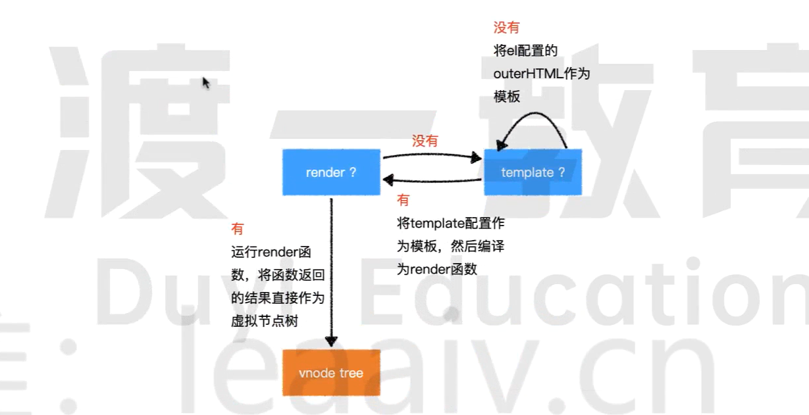
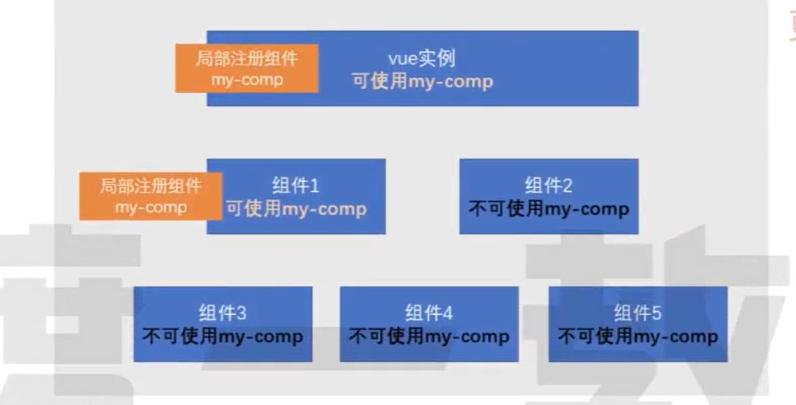
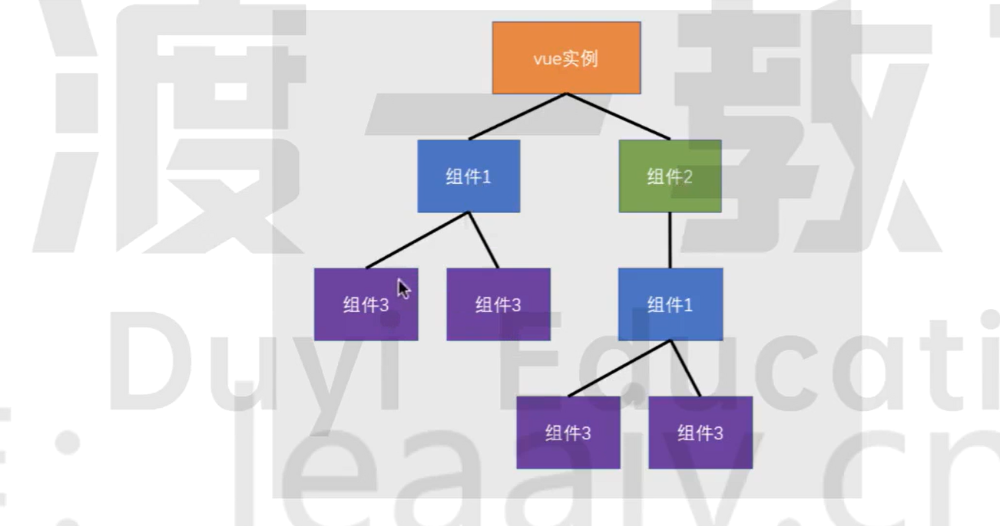
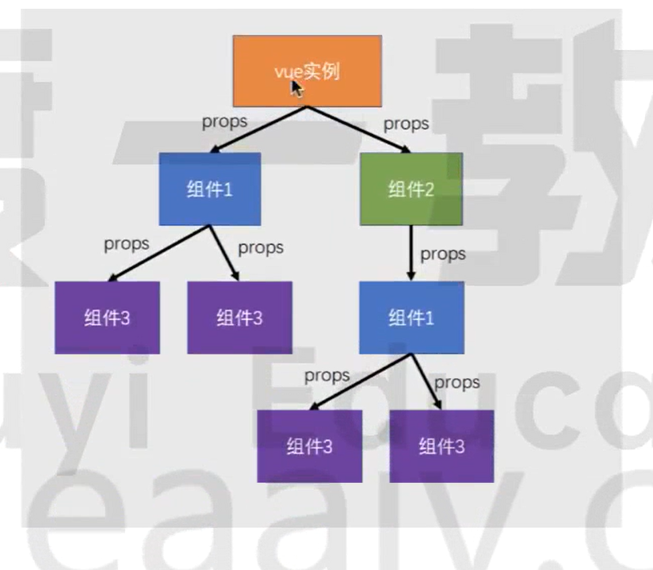
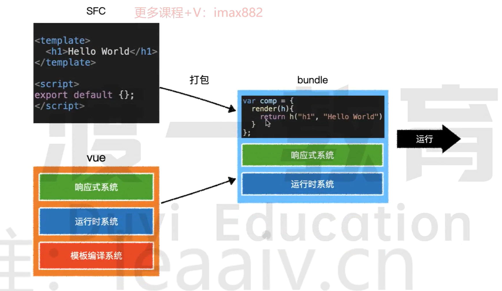
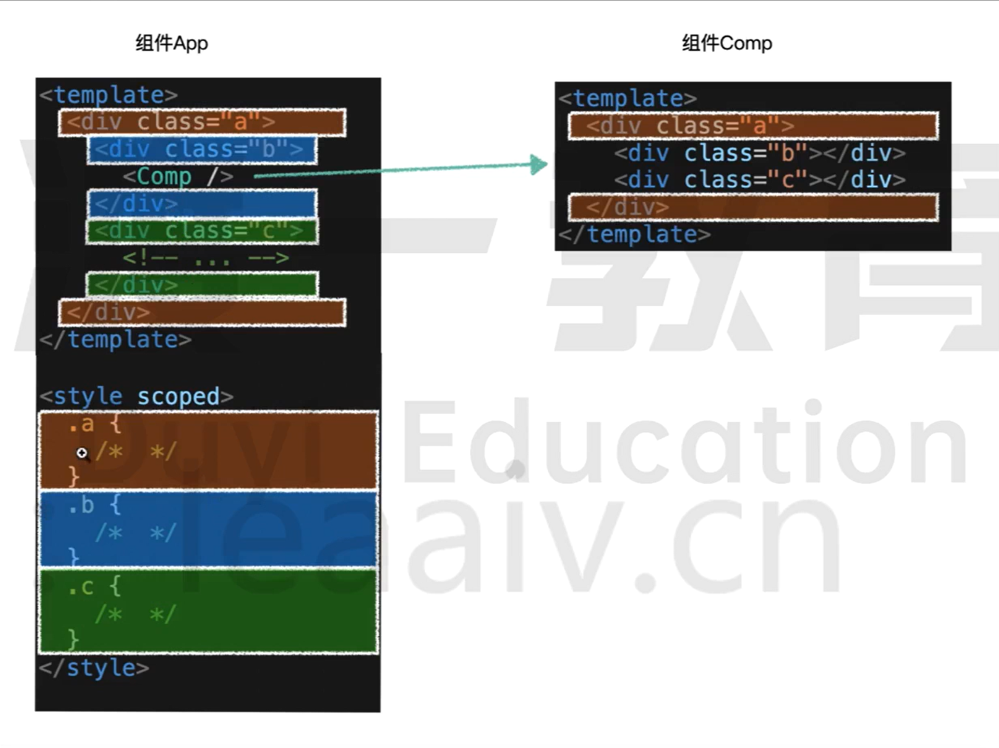
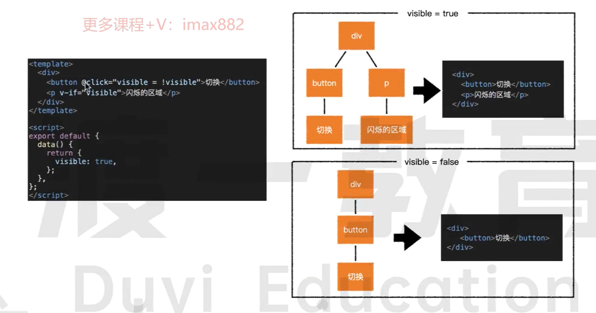
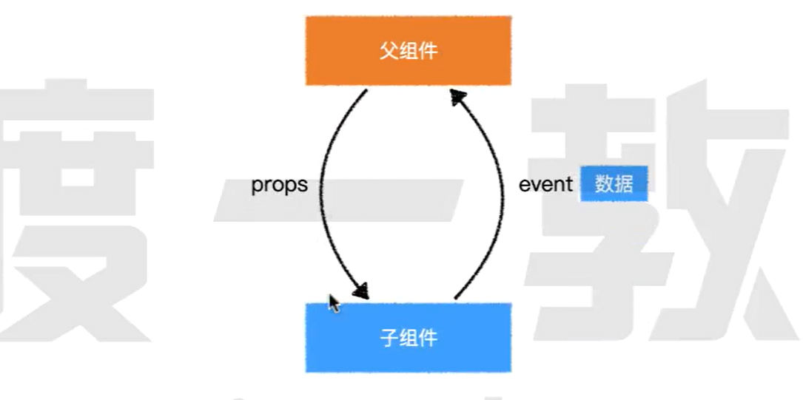
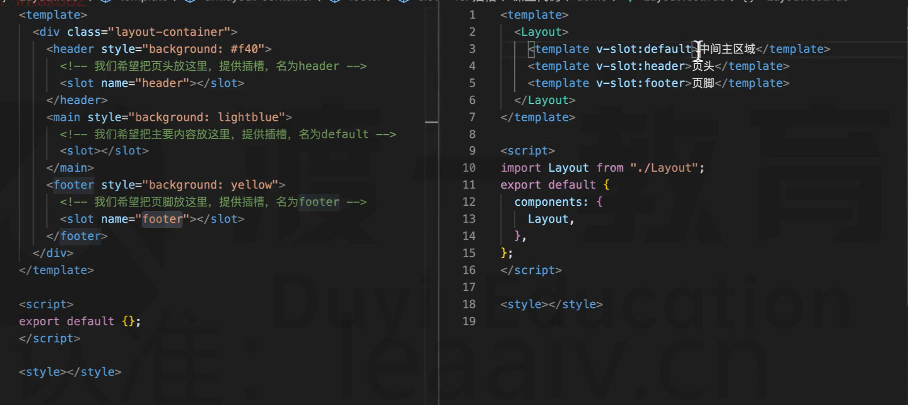
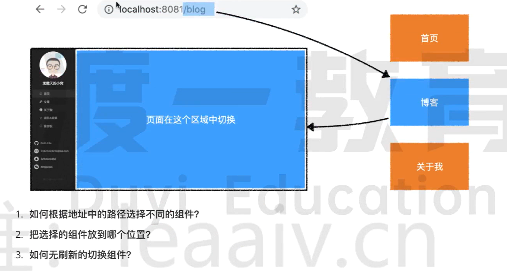

# 核心概念

## 注入


vue 会将以下配置注入到 vue 实例:

- data: 和界面相关的数据
- compouted: 通过已有的数据计算出来的数据
- methods: 方法

> 模板中可以使用 vue 实例中的成员

## 虚拟 DOM 树

直接操作真实的 DOM 会引发严重的效率问题,vue 使用虚拟 DOM(vnode)的方式来描述要渲染的内容,vnode 是一个**普通**的 JS 对象,用于描述界面上应该有什么,比如:

```js
var vnode = {
  tag: 'h1',
  children: [{ tag: undefined, text: '第一个vue应用: Hello World' }],
};
```

上面的对象描述了:

```
有一个标签名为h1的节点,他会有一个子节点,该子节点是一个文本,内容为"第一个vue应用: Hello World"
```

**vue 模板并不是真实的 DOM,他会被编译为虚拟 DOM**

```html
<div id="app">
  <h1>第一个vue应用: {{title}}</h1>
  <p>作者: {{author}}</p>
</div>
```

上面的模板会被编译成为类似下面结构的虚拟 DOM

```js
{
  tag: "div",
  children: [
    {
      tag: "h1",
      children: [
        {
          text: "第一个vue应用: Hello World"
        }
      ]
    },
    {
      tag: "p",
      children: [
        {
          text: "作者: 拿破仑"
        }
      ]
    }
  ]
}
```

虚拟 DOM 树会最终生成为真实的 DOM 树


当数据变化后,将引发重新渲染,vue 会比较新旧两棵 vnode tree, 找出差异, 然后仅把差异部分应用到真实 DOM Tree 中


**可见,在 Vue 中,要得到最终的界面,必须要生成一个 vnode tree**

`vue`通过以下逻辑生成`vnode tree`:



**注意: 在`Vue2`中虚拟节点树必须是单根的**

## 挂载

将生成的真实 DOM 树,放到某个元素位置,称之为**挂载**

## 完整流程


# 组件

组件的出现是为了实现以下两个目标:

1. 降低整体复杂度,提升代码的可读性和可维护性

2. 提升局部代码的可复用性

绝大部分情况下,一个组件就是页面中某个区域,组件包含该区域的:

- 功能(JS 代码)
- 内容(模板代码)
- 样式(CSS 代码)

> 要在组件中包含样式,需要构建工具的支持

## 组件开发

### 创建组件

组件是根据一个普通的配置对象创建的,所以要开发一个组件,只需要写一个配置对象即可
该配置对象和 vue 实例的配置**几乎一样**

```js
// 组件配置对象
var myComp = {
  data() {
    return {};
  },
  template: `...`,
};
```

值得注意的是,组件配置对象和 vue 实例有以下几点差异:

- 无`el`
- `data`必须是一个函数,该函数返回的对象作为数据
- 由于没有`el`配置,组件的虚拟 DOM 树必须定义在`template`或`render`中

### 注册组件

注册组件分为两种方式,一种是**全局注册**,一种是**局部注册**

#### 全局注册

一旦全局注册了一个组件,整个应用中任何地方都可以使用


全局注册的方式是:

```js
// 参数1: 组件名称,将来在模板中使用组件时,会使用该名称
// 参数2: 组件配置对象
// 该代码运行后,即可在模板中使用组件
Vue.component('my-comp', myComp);
```

在模板中,就可以使用组件了

```vue
<my-comp/>
<!-- 或 -->
<my-comp></my-comp>
```

> 但是在一些工程化的大型项目中,很多组件都不需要全局使用
>
> 比如一个登录组件,只有在登录相关的页面中使用,如果全局注册,将导致构建工具无法优化打包
>
> 因此,除非组件特别通用,否则不建议全局注册

#### 局部注册



局部注册组件的方式是,在要使用组件或实例中加入一个配置

```js
// 这是另一个要使用my-comp的组件
const otherComp = {
    components: {
        // 属性名为组件名称,模板中将使用该名称
        // 属性值为组件配置对象
        "my-comp": myComp
    }
}
```

### 应用组件

在模板中使用组件特别简单,把组件名当做HTML元素名使用即可.

但要注意以下几点:

1. **组件必须有结束**

组件可以自结束,也可以使用结束标记结束,但必须要有结束.

下面的组件使用是**错误的.**

```vue
<my-comp>
```

2. **组件的命名**

无论你使用哪种方式注册组件,组件的命名方式都需要遵循规范.

组件可以使用`kebab-case`短横线命名法,也可以使用`PascalCase`大驼峰命名法

下面两种命名方式都是可以的

```js
const otherComp = {
    components: {
        'my-comp': myComp, 	//方式1
        'MyComp': myComp,	//方式2
    }
}
```

> 实际上,使用小驼峰命名法camelCase也是可以识别的,只不过不符合官方要求的规范.

使用`PascalCase`方式命名还有一个好处,就是在模板中既可以使用大驼峰,也可以使用短横线.

## 组件树

一个组件创建好后,往往会在各种地方使用它.它可能多次出现在vue实例中,也可能出现在其他组件中.

于是就形成了一个组件树



## 向组件传递数据

大部分组件要完成自身的功能,都需要一些额外的信息

比如一个头像组件,需要告诉它头像的地址,这就需要在使用组件时向组件传递数据

传递数据的方式有很多种,最常见的一种是使用***组件属性(Component Props)**

首先在组件中声明可以接受哪些属性

```js
const MyComp = {
    props: ['p1','p2','p3'],
    // 和Vue实例一样,使用组件时也会创建组件的实例
    // 而组件的属性会被提取到组件实例中,因此可以在模板中使用
    template: `
    <div>{{p1}},{{p2}},{{p3}}</div> `
}
```

在使用组件时,向其传递属性

```js
const OtherComp = {
    components: {
        MyComp
    },
    data() {
        return 1;
    },
    template: `
    <my-comp :p1="a" :p2="2" p3="3" />`
}
```

**注意: 在组件中,属性是只读的,绝对不可以更改,这叫做单向数据流**



## 工程结构

# 搭建工程

## vue-cli

`vue-cli`是一个脚手架工具,用于搭建`vue`工程

它内部使用了`webpack`,并预置了诸多插件(plugin)和加载器(loader),以达到开箱即用的效果.除了基本的插件和加载器外,`vue-cli`还预置了

- babel
- webpack-dev-server
- eslint
- postcss
- less-loader

## SFC(Single File Component)

单文件组件,即一个文件就包含了一个组件所需的全部代码

```vue
<template>
<!-- 组件模板代码 -->
</template>

<script>
export default {
    // 组件配置
}
</script>

<style>
/* 组件样式 */
</style>
```

## 预编译

当`vue-cli`进行打包时,会直接把模板转换为`render`函数,这叫做模板预编译

这样做的好处在于:

1. 运行时就不需要编译模板了,提高了运行效率
2. 打包结果中不再需要vue的编译代码,减少了打包体积



# 计算属性

面试题: 计算属性和方法有什么区别

> 计算属性本质上是包含`getter`和`setter`的方法
>
> 当获取计算属性时,实际上是调用计算属性的`getter`方法.vue会收集计算属性的依赖,并缓存计算属性的返回结果.只有当依赖变化后才会重新进行计算
>
> 方法没有缓存,每次调用方法都会导致重新执行.
>
> 计算属性的`getter`和`setter`参数固定,`getter`没有参数,`setter`只有一个参数.而方法不限.
>
> 由于有以上的这些区别,因此计算属性通常是更具已有数据得到其他数据,并在得到数据的过程中不建议使用异步,当前时间,随机数等副作用操作.
>
> 实际上,他们最重要的区别是含义上的区别.计算属性含义上也是一个数据,可以读取也可以赋值;方法含义上是一个操作,用于处理一些事情.

完整的计算属性书写

```js
computed: {
    propName: {
        // getter
        get() {
            
        },
        // setter
        set(val) {
            
        }
    }
}
```

只包含`getter`的计算属性简写

```js
computed: {
    propName() {
        
    }
}
```

> 父组件样式会影响子组件的根元素样式



# 组件事件

## pager组件

### 属性

| 属性名        | 含义       | 类型   | 必填 | 默认值 |
| ------------- | ---------- | ------ | ---- | ------ |
| current       | 当前页码   | Number | 否   | 1      |
| total         | 总数据量   | Number | 否   | 10     |
| limit         | 页容量     | Number | 否   | 10     |
| visibleNumber | 可见页码数 | Number | 否   | 10     |

### 事件

| 事件名     | 含义     | 事件参数 | 参数类型 |
| ---------- | -------- | -------- | :------- |
| pageChange | 页码变化 | 新的页码 | Number   |

## 知识点

### 全局样式

### v-if和v-show




### 面试题: v-if和v-show有什么区别

> v-if能够控制是否生成vnode,也就间接控制了是否生成对应的DOM.当v-if为true时,会生成对应的vnode,并生成对应的DOM元素,当其为false时,不会生成对应的vnode,自然不会生成任何DOM元素
>
> v-show始终会生成vnode,也就间接导致了始终生成DOM.它只是控制DOM的`display`属性,当v-show为true时,不做任何处理;当其为false时,生成的DOM的`display`属性为none
>
> 使用v-if可以有效的减少树的节点和渲染量,但也会导致树的不稳定;而使用v-show可以保持树的稳定,但不能减少树的节点和渲染量
>
> 因此,在实际的开发中,显示状态变化频繁的情况下应该使用v-show,以保持树的稳定;显示状态变化较少时应该使用v-if,以减少树的节点和渲染量.

### 组件事件



抛出事件: 子组件在某个时候发生了一件事,但自身无法处理,于是通过事件的方式通知父组件处理.

事件参数: 子组件抛出事件,传递给父组件的数据

注册事件: 父组件声明,当子组件发生某件事的时候,自身将做出一些处理.

# 优化工程结构

# 插槽

```vue
<template>
<!-- message组件: 一个弹窗消息 -->
	<div class="message-container">
    	<div class="content">
           <!-- 这是消息内容,可以是一个文本,也可能是一段html,具体是什么不知道,需要父组件指定 --> 
    	</div>
        <button>
        	确定
   		</button>
		<button>
        	关闭
    	</button>
    </div>
</template>
```

## 插槽的简单用法

此时,就需要使用插槽来定制组件的功能

```vue
<!-- Message 组件 -->
<template>
<!-- message组件: 一个弹窗消息 -->
	<div class="message-container">
    	<div class="content">
           <!-- slot是vue内置的组件 --> 
            <slot></slot>
    	</div>
        <button>
        	确定
   		</button>
		<button>
        	关闭
    	</button>
    </div>
</template>
```

```vue
<!-- 父组件 -->
<Message>
	<div>
        <p>
            APP Message
        </p>
        <a href="">detail</a>
    </div>
</Message>

<!-- 最终结果 -->
<template>
<!-- message组件: 一个弹窗消息 -->
	<div class="message-container">
    	<div class="content">
           <!-- slot是vue内置的组件 --> 
            <div>
       	 		<p>
            		APP Message
        		</p>
        		<a href="">detail</a>
   		    </div>
    	</div>
        <button>
        	确定
   		</button>
		<button>
        	关闭
    	</button>
    </div>
</template>
```

## 具名插槽

如果某个组件中需要父元素传递多个区域的内容.为了避免冲突,就需要给不同的插槽赋予不同的名称.



# 路由



## 路由插件

VueRouter

## 路由模式

路由模式决定了:

1. 路由从哪里获取访问路径
2. 路由如何改变访问路径

`vue-router`提供了三种路由模式

1. hash: 默认值.路由从浏览器地址栏中的hash部分.该模式兼容性最好

   ```
   http://localhost:8081/#/blog   --> blog
   http://localhost:8081/about#/blog  --> blog
   ```

2. history: 路由从浏览器地址栏的`location.pathname`中获取路径,改变路径使用H5的history api.该模式可以让地址栏最友好,但是需要浏览器支持`history api`

   ```
   http://localhost:8081/#/blog   			-->  /
   http://localhost:8081/about#/blog		--> /about
   http://localhost:8081/blog				--> /blog
   ```
   
3. abstract: 路由从内存中获取路径,改变路径也只是改动内存中的值.这种模式通常应用到非浏览器环境中.

   ```
   内存:  /       -->  /
   内存:  /about  --> /about
   内存:  /blog   --> /blog
   ```

## 导航

`vue-router`提供了全局的组件`RouterLink`,它的渲染结果是一个`a`元素

```vue
<template>
	<RouterLink to="/blog">文章</RouterLink>
	<!-- mode: hash 生成 -->
	<a href="#/blog">文章</a>
	<!-- mode: history 生成 -->
	<!-- 为了避免刷新页面,vue-Router实际上为它添加了点击事件,并阻止了默认行为,在事件内部使用history api更改了路径.-->
	<a href="/blog">文章</a>
</template>
```


### 激活状态

默认情况下,`vue-router`会用**当前路径**匹配**导航路径**

- 如果当前路径是以导航路径开头,则算作匹配,会为导航的a元素添加类名`router-link-active`
- 如果当前路径完全等于导航路径,则算作精确匹配,会为导航的a元素添加类名`router-link-exact-active`

例如,当前访问的路径是`/blog`,则:

| 导航路径 | 类名                                           |
| -------- | ---------------------------------------------- |
| /        | router-link-active                             |
| /blog    | router-llink-active   router-link-exact-active |
| /about   | 无                                             |
| /message | 无                                             |

可以为组件`RouterLink`添加bool属性`exact`,将匹配规则改为:必须精确匹配才能添加类名`router-link-active`

例如,当前访问的路径是`/blog`则

| 导航路径 | 类名                |
| -------- | ------------------- |
| /        | 无                  |
| /blog    | router-llink-active |
| /about   | 无                  |
| /message | 无                  |

另外,可以通过`active-class`属性更改匹配的类名,通过`exact-active-class`更改精确匹配的类名.

## 命名路由

使用命名路由可以解除系统与路径之间的耦合

```js
// 路由配置
const router = new VueRouter({
    routes: [
        // 路由规则
        //当匹配到路径 /foo时,渲染Foo组件
        {name: "foo", path: '/foo', component: Foo},
        // 当匹配到路径 /bar时, 渲染Bar组件
        {name: "bar", path: '/bar', component: Bar}
    ]
})
```

向to属性传递路由信息对象 RouterLink会根据你传递的信息以及路由配置生成对应的路径.

```vue
<template>
	<RouterLink :to="{name: 'foo'}">go to foo</RouterLink>
</template>
```

# 使用css module

 需要将样式文件命名为: `xx.module.ooo`

`xxx`为文件名

`ooo`为样式文件后缀名,可以是`css`,`less`,`scss`等

# 得到组件渲染的DOM

```js
/**
*	获取某个组件渲染的DOM根元素
*/
function getComponentRootDom(comp, props) {
    const vm = new Vue({
        render: h => h(comp, {props})
    })
    vm.$mount();
    return vm.$el;
}
```

## 扩展Vue实例

