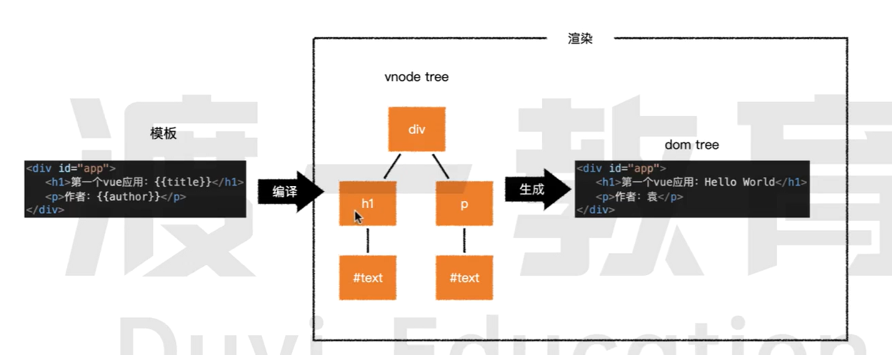
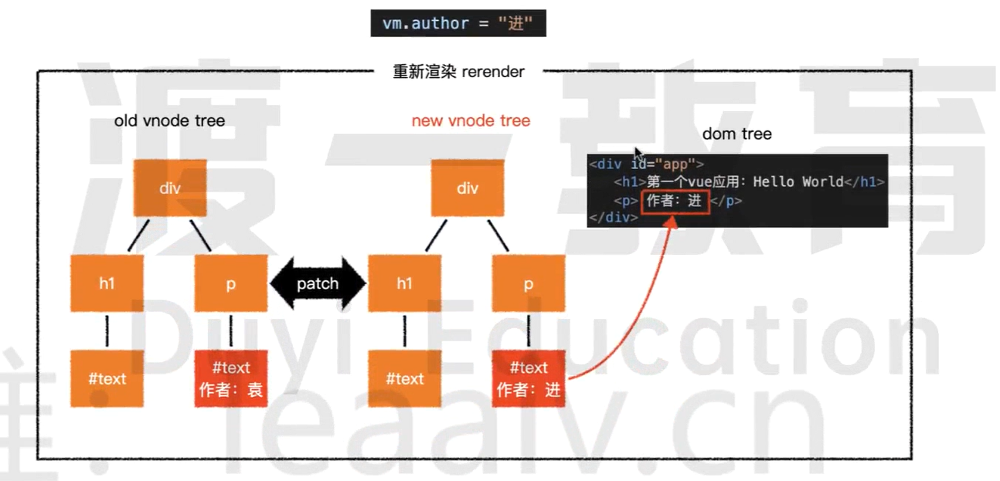
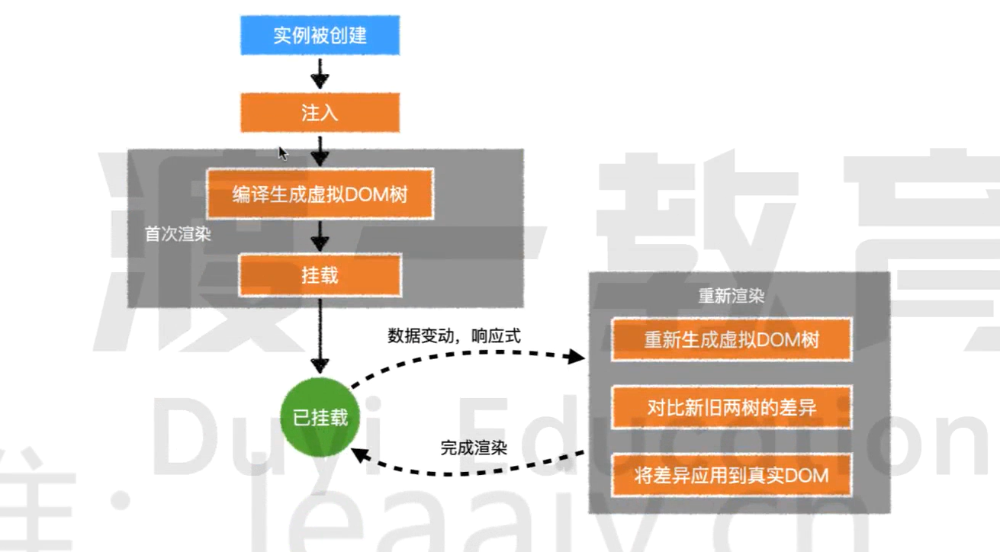
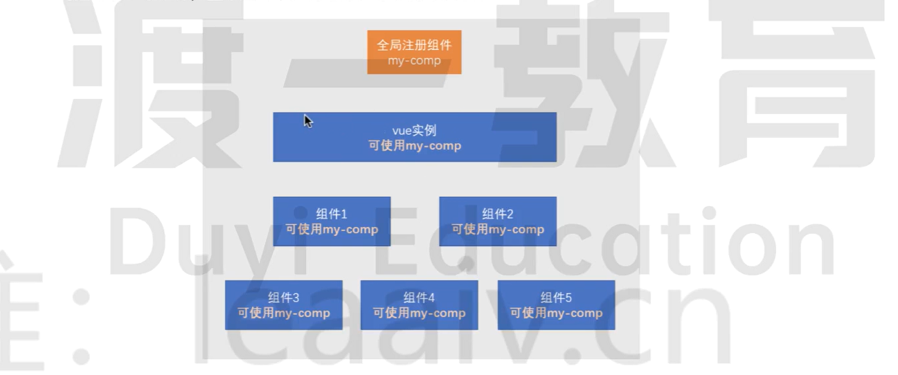

# 核心概念

## 注入


vue 会将以下配置注入到 vue 实例:

- data: 和界面相关的数据
- compouted: 通过已有的数据计算出来的数据
- methods: 方法

> 模板中可以使用 vue 实例中的成员

## 虚拟 DOM 树

直接操作真实的 DOM 会引发严重的效率问题,vue 使用虚拟 DOM(vnode)的方式来描述要渲染的内容,vnode 是一个**普通**的 JS 对象,用于描述界面上应该有什么,比如:

```js
var vnode = {
  tag: 'h1',
  children: [{ tag: undefined, text: '第一个vue应用: Hello World' }],
};
```

上面的对象描述了:

```
有一个标签名为h1的节点,他会有一个子节点,该子节点是一个文本,内容为"第一个vue应用: Hello World"
```

**vue 模板并不是真实的 DOM,他会被编译为虚拟 DOM**

```html
<div id="app">
  <h1>第一个vue应用: {{title}}</h1>
  <p>作者: {{author}}</p>
</div>
```

上面的模板会被编译成为类似下面结构的虚拟 DOM

```js
{
  tag: "div",
  children: [
    {
      tag: "h1",
      children: [
        {
          text: "第一个vue应用: Hello World"
        }
      ]
    },
    {
      tag: "p",
      children: [
        {
          text: "作者: 拿破仑"
        }
      ]
    }
  ]
}
```

虚拟 DOM 树会最终生成为真实的 DOM 树



当数据变化后,将引发重新渲染,vue 会比较新旧两棵 vnode tree, 找出差异, 然后仅把差异部分应用到真实 DOM Tree 中



**可见,在 Vue 中,要得到最终的界面,必须要生成一个 vnode tree**

`vue`通过以下逻辑生成`vnode tree`:


**注意: 在`Vue2`中虚拟节点树必须是单根的**

## 挂载

将生成的真实 DOM 树,放到某个元素位置,称之为**挂载**

## 完整流程



# 组件

组件的出现是为了实现以下两个目标:

1. 降低整体复杂度,提升代码的可读性和可维护性

2. 提升局部代码的可复用性

绝大部分情况下,一个组件就是页面中某个区域,组件包含该区域的:

- 功能(JS 代码)
- 内容(模板代码)
- 样式(CSS 代码)

> 要在组件中包含样式,需要构建工具的支持

## 组件开发

### 创建组件

组件是根据一个普通的配置对象创建的,所以要开发一个组件,只需要写一个配置对象即可
该配置对象和 vue 实例的配置**几乎一样**

```js
// 组件配置对象
var myComp = {
  data() {
    return {};
  },
  template: `...`,
};
```

值得注意的是,组件配置对象和 vue 实例有以下几点差异:

- 无`el`
- `data`必须是一个函数,该函数返回的对象作为数据
- 由于没有`el`配置,组件的虚拟 DOM 树必须定义在`template`或`render`中

### 注册组件

注册组件分为两种方式,一种是**全局注册**,一种是**局部注册**

#### 全局注册

一旦全局注册了一个组件,整个应用中任何地方都可以使用



全局注册的方式是:

```js
// 参数1: 组件名称,将来在模板中使用组件时,会使用该名称
// 参数2: 组件配置对象
// 该代码运行后,即可在模板中使用组件
Vue.component('my-comp', myComp);
```

在模板中,就可以使用组件了

#### 局部注册

### 应用组件

## 组件数

## 向组件传递数据

## 工程结构

# 保持版本一致
