# Vue3的重大变化

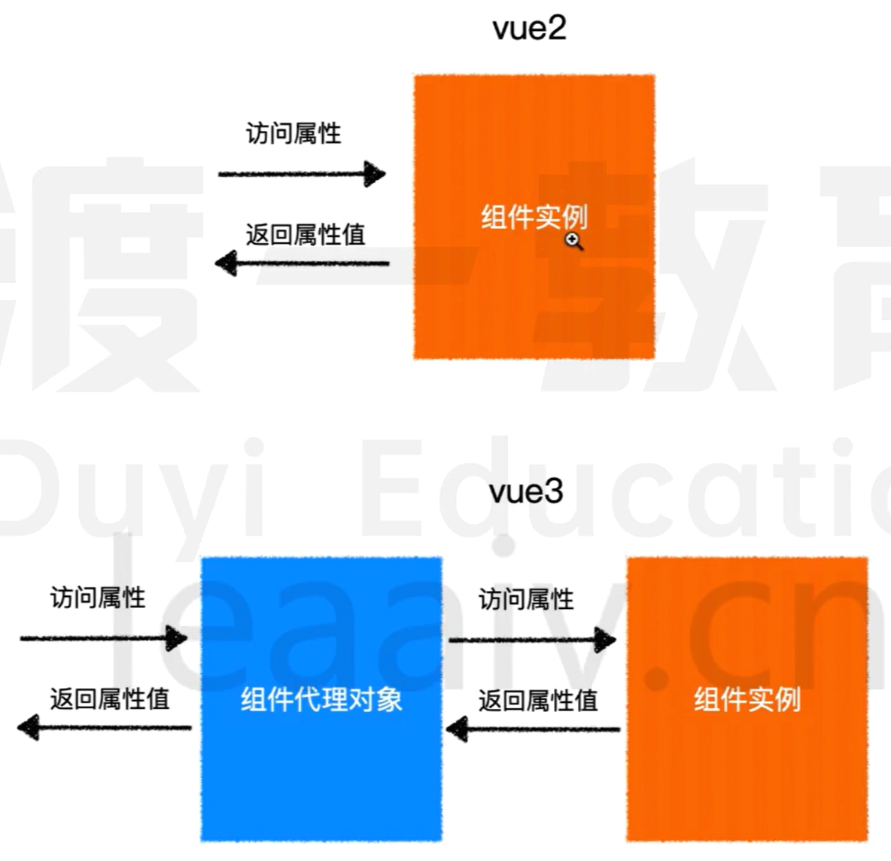

```js
import { ref } from "vue";
export default {
    setup() {
        // console.log('所有生命周期钩子函数之前调用')
        // console.log(this);   this -> undefined
        let count = ref(0);
        const increase = () => {
            // 不具有响应式
            count.value++;
        };
        return {
            count,
            increase
        }
    }
}
```

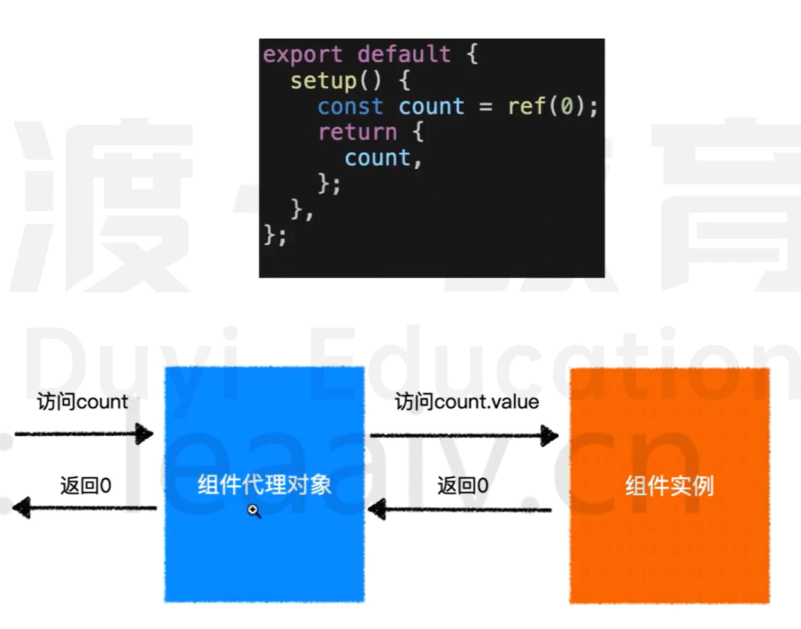

# vite原理

webpack原理图

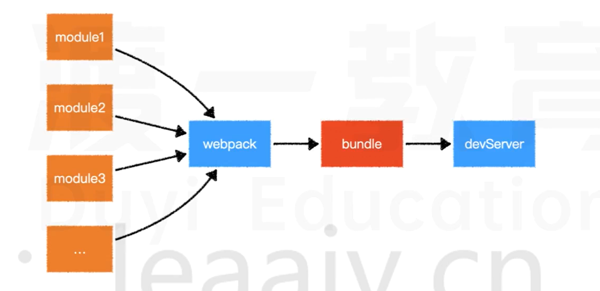

vite原理图

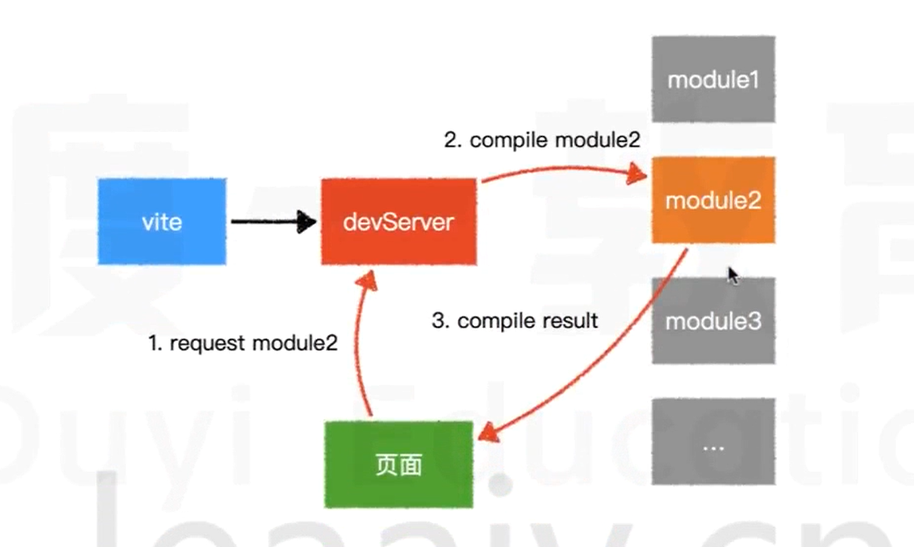

> 面试题:说说`webpack`和`vite`的区别
>
> `webpack`会先打包,然后启动开发服务器,请求服务器时,直接给予打包结果.
>
> 而`vite`是直接启动开发服务器,请求哪个模块再对该模块进行实时编译.
>
> 由于现代浏览器本身支持`ES Module`,会自动向依赖的Module发出请求.`vite`充分利用这一点,将开发环境下的模块文件,就作为浏览器要执行的文件,而不是像`webpack`那样进行打包合并.
>
> 由于`vite`在启动的时候不需要打包,也就意味着不需要分析模块依赖,不需要编译,因此,启动速度非常快.
>
> 当浏览器请求某个模块时,再根据需要对模块内容进行编译.这种按需动态编译的方式,极大的缩减了编译时间,项目越复杂,模块越多,`vite`的优势越明显.
>
> 在HMR(Hot Module Replace)方面,当改动了一个模块后,仅需让浏览器重新请求该模块即可,不像`webpack`那样需要把该模块的相关依赖全部编译一次,效率更高.
>
> 当需要打包到生产环境时,`vite`使用传统的`rollup`进行打包,因此,`vite`的主要优势在开发阶段.另外,由于`vite`利用的是`ES Module`,因此代码中**不能使用`CommonJS`**

## 效率提升

> CSR效率提高了1.3到2倍
>
> SSR效率提高了2-3倍

### 静态提升

下面的静态节点会被提升

- 元素节点
- 没有绑定动态内容

```js
// vue2的静态节点
render() {
    createVNode("h1", null, "Hello World")
    //...
}


// vue3的静态节点
const hoisted = createVNode("h1", null, "Hello World")
function render() {
    // 直接使用 hoisted 即可.
}
```

静态属性会被提升

```vue
<div class="user">
    {{ user.name }}
</div>
```

```js
const hoisted = { class: "user" }

function render() {
    createVNode("div", hoisted, user.name)
    // ...
}
```

### 预字符串化

```html
<div class="menu-bar-container">
    <div class="logo">
        <h1>logo</h1>
    </div>
    <ul class="nav">
        <li></li>
        <li></li>
        <li></li>
        <li></li>
        <li></li>
        <li></li>
    </ul>
    <div class="user">
        <span> {{user.name}} </span>
    </div>
</div>
```

当编译器遇到大量连续的静态内容,会直接将其编译为一个普通字符串节点.

```
const _hoisted_2 = _createStaticVNode("x <div class="menu-bar-container">    <div class="logo">        <h1>logo</h1>    </div>    <ul class="nav">        <li></li>        <li></li>        <li></li>        <li></li>        <li></li>        <li></li>    </ul>    <div class="user">        <span> {{user.name}} </span>    </div></div>")
```

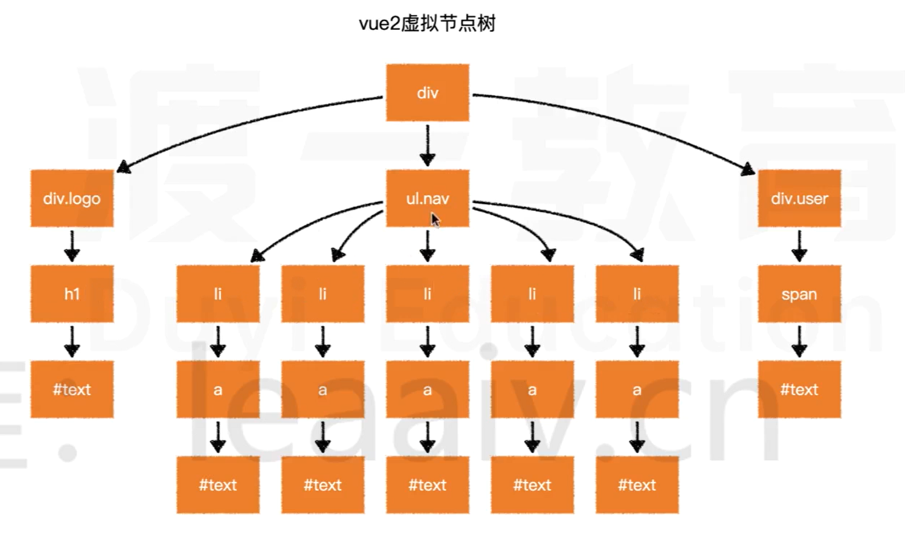

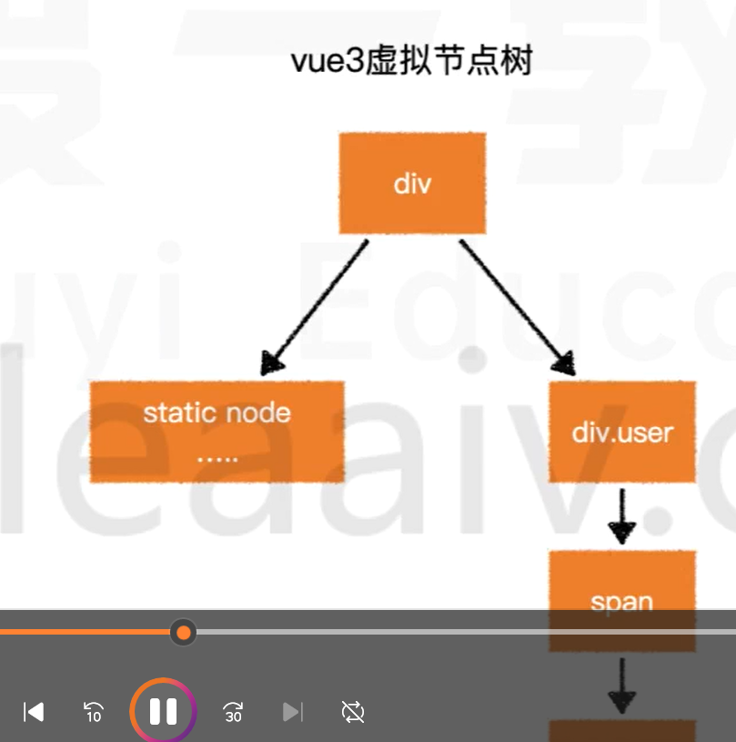

### 缓存事件处理函数

```vue
<button @click="count++">
    plus
</button>
```

```js
// vue2
render(ctx) {
    return createVNode("button", {
        onClick: function($event) {
            ctx.count++;
        }
    })
}

// vue3
render(ctx, _cache) {
    return createVNode("button", {
        onClick: cache[0] || (cache[0] = ($event) => (ctx.count++))
    })
}
```

### Block Tree

vue2在对比新旧树的时候,并不知道哪些节点是静态的,哪些是动态的,因此只能一层一层的比较,这就浪费了大部分的时间在对比静态节点上

```vue
<form>
    <div>
        <label>账号: </label>
        <input v-model="user.loginId"/>
    </div>
    <div>
        <label>密码: </label>
        <input v-model="user.loginPwd"/>
    </div>
</form>
```

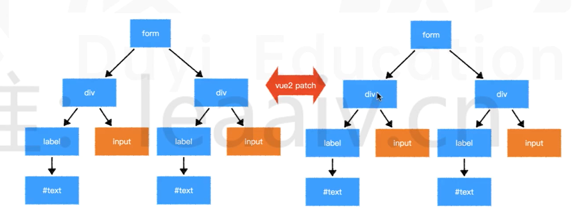

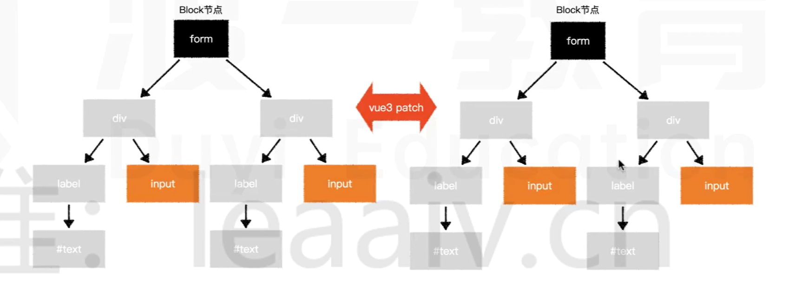

### PatchFlag

vue2在对比每一个节点时,并不知道这个节点哪些相关信息回发生变化,因此只能将所有信息依次对比

```vue
<div class="user" data-id="1" title="user name">
    {{user.name}}
</div>
```


# API和数据响应式的变化

> 面试题1: 为什么vue3中去掉了vue构造函数
>
> 面试题2: 谈谈你对vue3数据响应式的理解

## 去掉了Vue的构造函数

在过去,如果遇到一个页面有多个`vue`应用,往往会遇到一些问题

```vue
<!-- vue2 -->
<div id="app1"></div>
<div id="app2"></div>

<script>
	Vue.use(...);	// 此代码会影响所有的vue应用
	Vue.mixin(...);	// 此代码会影响所有的vue应用
    Vue.component(...);	// 此代码会影响所有的vue应用
                  
                  
   	new Vue({
                  // 配置
                  }).$mount("#app1");
    new Vue({
        // 配置
        
    }).$mount("#app2");
</script>
```

在`vue3`中,去掉了`Vue`构造函数,转而使用`createApp`创建`vue`应用.

```vue
<!-- vue3 -->
<div id="app1">
    
</div>
<div id="app2">
    
</div>

<script>
	createApp(根组件).use(...).mixin(...).component(...).mount("#app1");
    createApp(根组件).mount("#app2");
</script>
```

> 面试题1: 为什么`vue3`中去掉了`vue`构造函数
>
> 1. 调用构造函数的静态方法会对所有`vue`应用都生效,不利于隔离不同应用.
> 2. `vue2`的构造函数集成了太多功能,不利于`tree shaking`,`vue3`把这些功能使用普通函数导出,能够充分利用`tree shaking`优化打包体积.
> 3. `vue2`没有把==组件实例==和==vue应用==两个概念区分开来,在`vue2`中,通过`new Vue`创建的对象,既是一个vue应用,同时又是一个特殊的vue组件.`vue3`中,把两个概念区分开来,通过createApp创建对象,是一个vue应用,它内部提供的方法是针对整个应用的,而不再是一个特殊的组件.

> 面试题2: 谈谈你对vue3数据响应式的理解
>
> vue3不再使用`Object.defineProperty`的方式定义完成数据响应式,而是使用`Proxy`.
>
> 除了`Proxy`本身效率比`Object.defineProperty`更高之外,由于不必递归遍历所有属性,而是直接得到一个`Proxy`.所以在`vue3`中,对数据的访问是动态的,当访问某个属性的时候,再动态的获取和设置,这就极大地提升了在组件初始阶段的效率.
>
> 同时,由于`Proxy`可以监控到成员的新增和删除,因此,在`vue3`中新增成员,删除成员,索引访问等均可以触发重新渲染,而这些在`vue2`中是难以做到的.

## 组件实例中的API

在`vue3`中,组件实例是一个`Proxy`,它仅仅提供了下列成员,功能和`vue2`一样

## 对比数据响应式

`vue2`和`vue3`均在相同的生命周期完成数据响应式,但做法不一样.

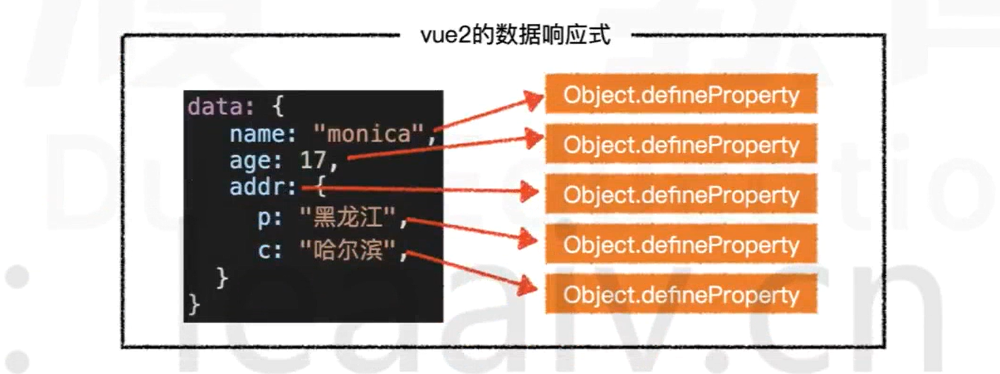

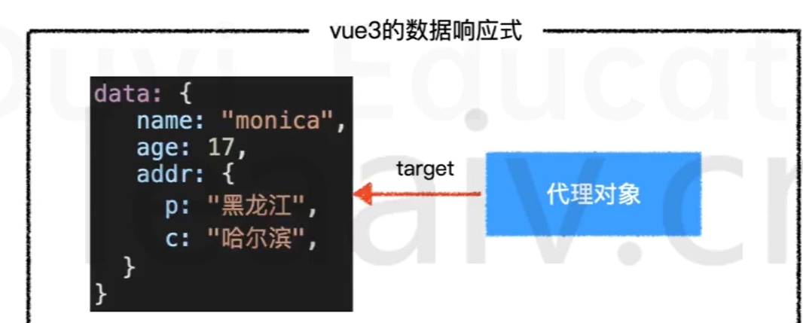

# 指令

## v-model

为了让`v-model`更好的针对多个属性进行双向绑定,`vue3`作出了以下修改.

- 当对自定义组件使用`v-model`指令时,绑定的属性名由原来的`value`变为`modelValue`,事件名由原来的`input`变为`update:modelValue`

  ```vue
  <!-- vue2 -->
  <ChildComponent :value="pageTitle" @input="pageTitle=$event" />
  <!-- 简写为 -->
  <ChildComponent v-model="pageTitle" />
  
  <!-- vue3 -->
  <ChildComponent
    :modelValue="pageTitle"
    @input:modelValue="pageTitle = $event"
  />
  
  <!-- 简写为 -->
  <ChildComponent v-model="pageTitle" />
  ```


- 去掉了`.sync`修饰符,它原本的功能由`v-model`的参数替代

  ```vue
  <!-- vue2 -->
  <ChildComponent :title="pageTitle" @update:title="pageTitle = $event" />
  <!-- 简写为 -->
  <ChildComponent :title.sync="pageTitle" />
  
  
  <!-- vue3 -->
  <ChildComponent :title="pageTitle" @update:title="pageTitle = $event" />
  <!-- 简写为 -->
  <ChildComponent v-model:title="pageTitle" />
  ```

- `model`配置被移除

- 允许自定义`v-model`修饰符

vue2无此功能

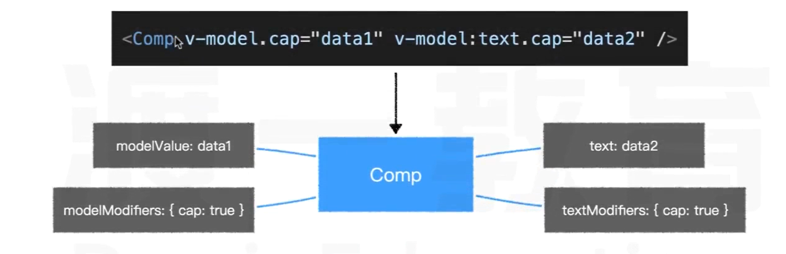

## v-if 和 v-for

`v-if`的优先级高于`v-for`

## key

当使用`<template>`进行`v-for`循环的时候,需要把`key`值放到`<template>`中,而不是它的子元素中.

当使用`v-if v-else-if v-else`分支的时候,不再需要指定`key`值,因为`vue3`会自动给予每个分支一个唯一的`key`

即便要手工给予`key`值,也必须给予每个分支唯一的`key`,**不能因为要重用分支而给予相同的key**

## Fragment

# 组件的变化

# 响应式数据

## 获取响应式数据

| API        | 传入                      | 返回           | 备注                                                         |
| ---------- | ------------------------- | -------------- | ------------------------------------------------------------ |
| `reactive` | `plain-object`            | 对象代理       | 深度代理对象中的所有成员                                     |
| `readonly` | `plain-object` OR `proxy` | 对象代理       | 只能读取代理对象中的成员,不可修改                            |
| `ref`      | `any`                     | `{value: ...}` | 对value的访问是响应式的,如果给value的值是一个对象,则会通过`reactive`函数进行代理,如果已经是代理,则直接使用代理 |
| `computed` | `function``               | `{value: ...}` | 当读取value值时,会**根据情况**决定是否要运行函数             |

应用: 

- 如果想要让一个对象变为响应式数据,可以使用`reactive`或`ref`
- 如果想要让一个对象的所有属性只读,使用`readonly`
- 如果想要让一个非对象数据变为响应式数据,使用`ref`
- 如果想要根据已知的响应式数据得到一个新的响应式数据,使用`computed`

笔试题1: 下面代码的输出结果是什么

```js
import { computed, reactive, readonly, ref } from 'vue'

const state = reactive({
  firstName: 'Xu Ming',
  lastName: 'Deng',
})

const fullName = computed(() => {
  // 当调用full.Name时才会执行;而且如果值相较于上一次没有变,则使用缓存,不会执行
  console.log('changed')
  return `${state.firstName} ${state.lastName}`
})

console.log('state ready')
console.log('fullname is', fullName.value)
console.log('fullname is', fullName.value)
const imState = readonly(state)
console.log(imState === state)

const stateRef = ref(state)
console.log(stateRef.value === state)

state.firstName = 'Cheng'
state.lastName = 'Ji'

console.log(imState.firstName, imState.lastName)
console.log('fullname is', fullName.value)
console.log('fullname is', fullName.value)

const imState2 = readonly(stateRef)
// 前者不能修改属性值,后者可以,不是一个内存地址的内容
console.log(imState2.value === stateRef.value)

// state ready
// changed
// fullname is Xu Ming Deng
// fullname is Xu Ming Deng
// false
// true

// Cheng Ji
// changed 

// fullname is Cheng ji
// fullname is Cheng ji

// false
```

笔试题2: 按照下面的要求完成函数

```js
import { computed, reactive, readonly, ref } from 'vue'

function useUser() {
    // 在这里补全函数

  const userOrigin = reactive({

  })
  const user = readonly(userOrigin)
  const setUserName = (name: string) => {
    userOrigin.name = name
  }
  const setUserage = (age: number) => {
    userOrigin.age = age
  }
  
  return {
      user, // 这是一个只读的用户对象,响应式数据,默认为一个空对象
      setUserName, // 这是一个函数,传入用户姓名,用于修改用户的名称
      setUserage,  // 这是一个函数,传入用户年龄,用于修改用户年龄.
  }
}
```

笔试题3: 按照下面的要求完成函数

```js
import {reactive, readonly} from 'vue';

function debounceGenerator(func, duration) {
  let timer = null;
  return function (...args) {
    if (timer) {
      clearTimeout(timer);
    }
    timer = setTimeout(() => {
      func.apply(this, args);
    }, duration);
  };
}

function useDebounce(obj, duration) {
  // 在这里补全函数
  const valueOrigin = reactive({ ...obj });
  const value = readonly(valueOrigin);
  function setValueOrigin(newObj) {
    Object.assign(valueOrigin, newObj);
  }
  const setValue = debounceGenerator(setValueOrigin, duration);
  return {
    value, // 这里是一个只读对象,响应式数据,默认值为参数值
    setValue, // 这里是一个函数,传入一个新的对象,需要把新对象中的属性混合到原始对象中,混合操作需要再duration时间内防抖
  };
}
```

## 监听数据变化

**watchEffect**

```js
const stop = watchEffect(()=>{
    // 该函数会立即执行,然后追踪函数中用到的响应式数据,响应式数据变化后会再次执行
})
// 通过调用stop函数,会停止监听
stop();	// 停止监听
```

```js
import { reactive, ref, watchEffect } from 'vue';
const state = reactive({a: 1, b: 2});
const count = ref(0);
const stop = watchEffect(() => {
  // 注册后立即运行一次,输出 1 0
  console.log(state.a, count.value);
});

// 进入微队列,这一次时间循环结束后才会输出
state.b++; 
state.a++;  
state.a++; 
state.a++; 


state.a++;

// 输出 5 0
```

**watch**

```js
// 等效于vue2的$watch

// 监听单个数据的变化
const state = reactive({ count: 0 })
watch(() => state.count, (newvalue, oldValue) => {
    // ...
},options)

const countRef = ref(0);
watch(countRef, (newValue, oldValue)=>{
    //...
},options)


// 监听多个数据的变化
watch([()=>state.count, countRef], ([new1, new2],[old1, old2]) => {
    //...
})
```

```js
import { reactive, ref, watch } from 'vue';
const state = reactive({ a: 1, b: 2 });
const count = ref(0);

watch(count, (newValue, oldValue) => {
  console.log(`count changed from ${oldValue} to ${newValue}`);
});

count.value++;
count.value++;

// count changed from 0 to 2

watch(
  () => state.a,
  (newValue, oldValue) => {
    console.log(`state.a changed from ${oldValue} to ${newValue}`);
  }
);

state.a++;

//state.a changed from 1 to 2
```

```js
watch([()=> state.a, count], ([new1, new2], [old1, old2]) => {
  console.log(`a changed from ${old1} to ${new1}`);
  console.log(`count changed from ${old2} to ${new2}`);
});

state.a = 2;

// a changed from 1 to 2
// count changed from 0 to 0

// 只要watch的监听条件中有一个变了,就会触发回调
```

> 注意: 无论是`watchEffect`还是`watch`,当依赖项变化时,回调函数的执行都是**异步**的(微队列)

应用: 除非遇到下面的场景,否则均建议选择选择`watchEffect`

- 不希望回调函数一开始就执行
- 数据改变时,需要参考旧值
- 需要监控一些回调函数中不会用到的数据

笔试题: 下面的代码的输出结果是什么?

```js
import { reactive, watchEffect, watch } from 'vue';

const state = reactive({
  count: 0,
});

watchEffect(() => {
  console.log('count:', state.count);
});

watch(
  () => state.count,
  (count, oldCount) => {
    console.log('watch', count, oldCount);
  }
);

console.log('start');

setTimeout(() => {
  console.log('time out');
  state.count++;
  state.count++;
});

state.count++;
state.count++;

console.log('end');

// count: 0
// start
// end
// cout: 2
// watch 2 0
// time out
// count: 4
// watch 4 2

```

## 判断

| API          | 含义                                             |
| ------------ | ------------------------------------------------ |
| `isProxy`    | 判断某个数据是否是由`reactive`或`readonly`创建的 |
| `isReactive` | 判断某个数据是否是通过`reactive`创建的           |
| `isReadonly` | 判断某个数据是否是通过`readonly`创建的           |
| `isRef`      | 判断某个数据是否是一个`ref`对象                  |

## 转换

**unref**

等同于`isRef(val) ? val.value : val`

应用:

```js
function useNewTodo(todos) {
    todos = unref(todos);
    //...
}
```


**toRef**

得到一个响应式对象==某个属性==的ref格式

```js
const state = reactive({
    foo: 1,
    bar: 2
})

const fooRef = toRef(state, 'foo')

fooRef.value++;
console.log(state.foo) 			// 2

state.foo++;		
console.log(fooRef.value)		// 3
```

**toRefs**

把一个响应式对象的所有属性转换为`ref`格式,然后包装到一个`plain-object`中返回

```js
const state = reactive({
    foo: 1,
    bar: 2
})

const stateAsRefs = toRefs(state)

/*
stateAsRefs: not a proxy
{
	foo: {value: ...},
	bar: {value: ...}
}
*/
```

应用

```js
setup() {
    const state1 = reactive({a:1, b:2});
    const state2 = reactive({c:3, d:4});
    return {
        ...state1,  // 失去响应式 lost reactivity
        ...state2	// 失去响应式 lost reactivity
    }
}

setup() {
    const state1 = reactive({a:1, b:2});
    const state2 = reactive({c:3, d:4});
    return {
        ...toRefs(state1), // reactivity
        ...toRefs(state2)  // reactivity
    }
}

function usePos() {
    const pos = reactive({x:0, y:0});
    return pos;
}

setup() {
    const {x, y} = usePos(); // lost reactivity
    const {x, y} = toRefs(usePos());
}
```

## 降低心智负担

所有的`composition function`均以`ref`的结果返回,以保证`setup`函数的返回结果中不包含`reactive`或`readonly`直接产生的数据.

```js
import { reactive, toRefs, ref, readonly } from 'vue'
function usePos() {
  const pos = reactive({x: 0, y: 0})
  return toRefs(pos);   // {x: refObj, y: refObj}
}

function useBooks() {
  const books = ref([]);
  return {
    books   // book is refObj
  }
}

function useLoginUser() {
  const user = readonly({
    isLogin: false,
    name: 'guest'
  });
  return toRefs(user);  // {isLogin: refObj, name: refObj}
}

setup(){
  // 在setup函数中,尽量保证解构,展开出来的所有响应式数据都是ref
  return {
    ...usePos(),
    ...useBooks(),
    ...useLoginUser()
  }
}
```

# 组合式API

> 面试题: composition api相比于 option api 有哪些优势?

不同于`reactivity api`,`composition api`提供的函数很多都是与组件深度绑定的,不能脱离组件而存在.

## setup

```js
// component
export default {
    setup(props, context) {
        // 该函数在组件属性被赋值后立即执行,早于所有生命周期钩子函数
        // pros是一个对象,包含了所有的组件属性值.
        // context是一个对象,提供了组件所需的上下文信息
    }
}
```

`context`对象的成员

| 成员  | 类型 | 说明                    |
| ----- | ---- | ----------------------- |
| attrs | 对象 | 同`vue2`的`this.$attrs` |
| slots | 对象 | 同`vue2`的`this.$slots` |
| emit  | 方法 | 同`vue2`的`this.$emit`  |

## 生命周期函数

| vue2 option api | vue3 option api     | vue3 composition api                                       |
| --------------- | ------------------- | ---------------------------------------------------------- |
| beforeCreate    | beforeCreate        | 不再需要,代码可直接置于setup中,因为数据响应式API被单独抽离 |
| created         | created             | 不再需要,代码可直接置于setup中                             |
| beforeMount     | beforeMount         | onBeforeMount                                              |
| mounted         | mounted             | onMounted                                                  |
| beforeUpdate    | beforeUpdate        | onBeforeUpdate                                             |
| upodated        | updated             | onUpdated                                                  |
| beforeDestroy   | ==beforeUnmount==   | onBeforeUnmount                                            |
| destroyed       | ==unmounted==       | onUnmounted                                                |
| errorCaptured   | errorCaptured       | onErrorCaptured                                            |
| -               | ==renderTracked==   | onRenderTracked                                            |
| -               | ==renderTriggered== | onRenderTriggered                                          |

新增钩子函数说明

| 钩子函数        | 参数          | 执行时机                       |
| --------------- | ------------- | ------------------------------ |
| renderTracked   | DebuggerEvent | 渲染vdom收集到的每一次依赖时   |
| renderTriggered | DebuggerEvent | 某个依赖变化导致组件重新渲染时 |

DebuggerEvent

- target: 跟踪或触发渲染的对象
- key: 跟踪或触发渲染的属性
- type: 跟踪或触发渲染的方式

## 面试题参考答案

面试题: `composition api`相比于`option api`有哪些优势

> 从两个方面回答:
>
> 1. 为了更好的逻辑复用和代码组织
> 2. 更好的类型推导
>
> 有了`composition api`,配合`reactivity api`,可以在组件内部进行更加细粒度的控制,使得组件中不同的功能高度聚合,提升了代码的可维护性.对于不同组件的相同功能,也能够更好的复用
>
> 相比于`option api`,`composition api`中没有了奇怪的`this`,所有的`api`变得更加的函数式,这有利于和类型推导系统比如TS的深度配合.

# 共享数据

## vuex方案

- 去掉了构造函数`Vuex`,而使用`createStore`创建仓库
- 为了配合`composition api`,新增`useStore`函数获得仓库对象

## global state

由于`vue3`的响应式系统本身可以脱离组件而存在,因此可以充分利用这一点,轻松制造多个全局响应式数据.

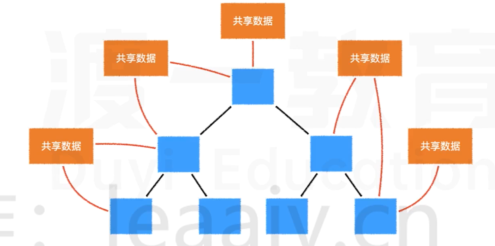

## Provide&Inject

在`vue2`中,提供了`provide`和`inject`配置,可以让开发者在高层组件中注入数据,然后在后代组件中使用.

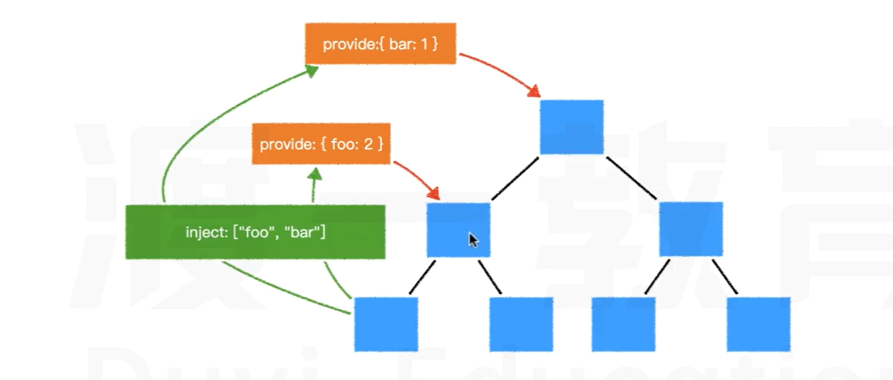

除了兼容`vue2`的配置式注入,`vue3`在组合式API中,添加了`provide`和`inject`方法,可以在`setup`函数中注入和使用数据

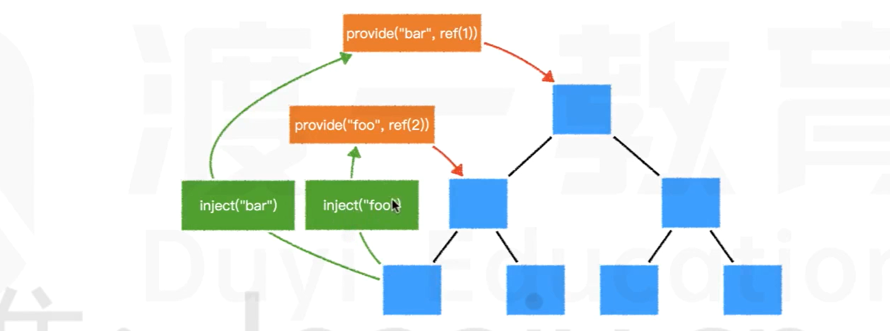

考虑到有些数据需要在整个`vue`应用中使用,`vue3`还在应用实例中加入了`provied`方法,用于提供整个应用的共享数据.

```js
createApp(App)
	.provide('foo', ref(1))
	.provide('bar', ref(2))
	.mount('#app')
```

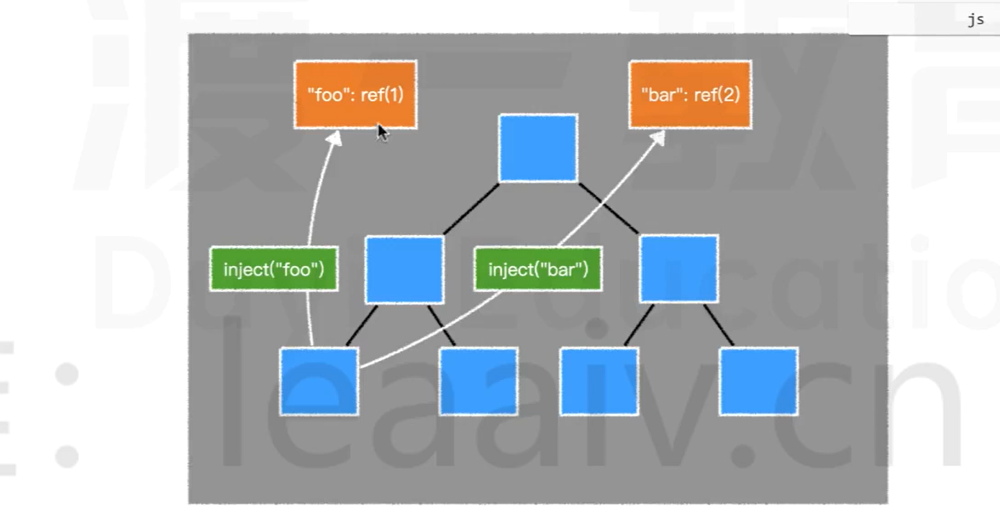

因此,我们可以利用这一点,在整个`vue`应用中提供共享数据.

## 对比

|              | vuex | global state | Provide&Inject |
| ------------ | ---- | ------------ | -------------- |
| 组件数据共享 | √    | √            | √              |
| 可否脱离组件 | √    | √            | ×              |
| 调试工具     | √    | ×            | √              |
| 状态树       | √    | 自行决定     | 自行决定       |
| 量级         | 重   | 轻           | 轻             |

