# 五层网络模型

## 分层的意义

- 每层相对独立,只需解决自己的问题
- 每层无需考虑下层的交付,只需要把自己的结果交给下层即可
- 每层有多种方案可供选择,选择不同的方案不会对上下层造成影响
- 每一层会在上一层的基础上增加一些额外信息

## 五层网络模型

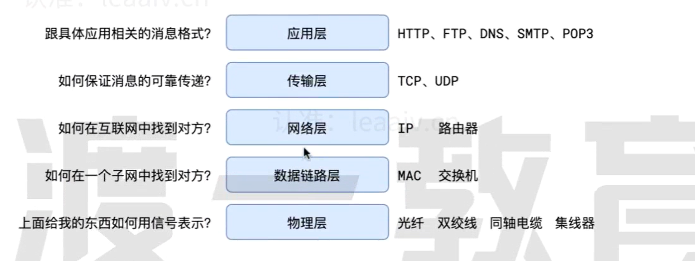

## 数据的封装和解封

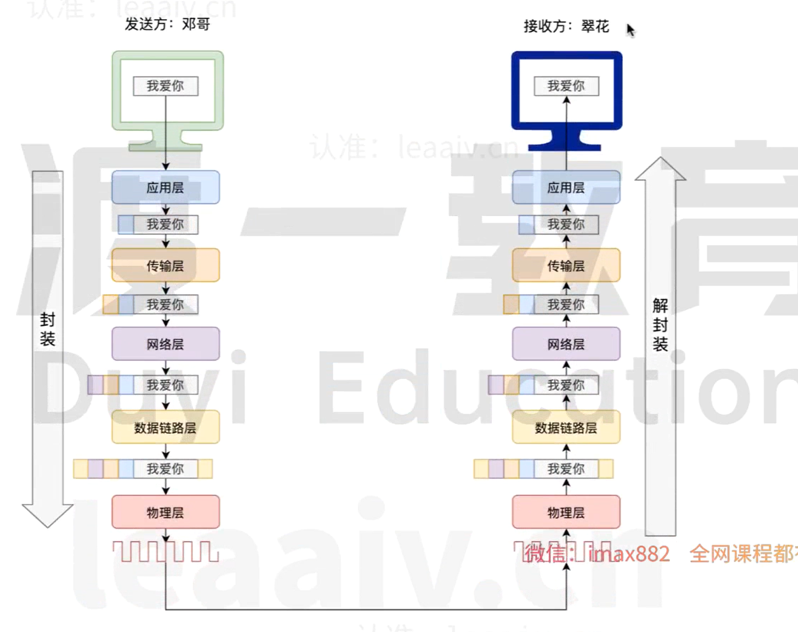

## 四层,五层,七层

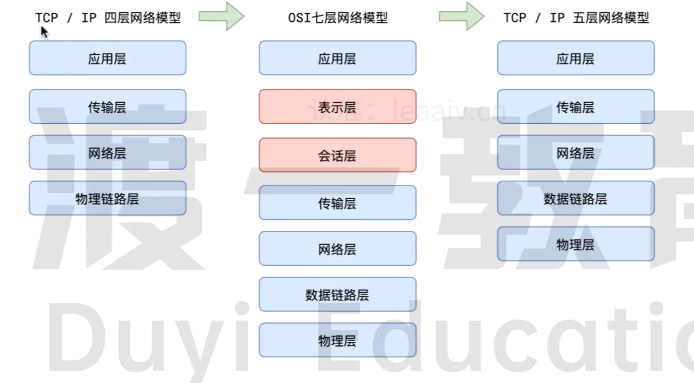

## 面试题

说说网络的五层模型

>参考答案
>
>从上到下分别为应用层,传输层,网络层,数据链路层,物理层.在发送消息时,消息从上到下进行打包,每一层会在上一层的基础之上加包,而接收消息时,会从下到上解包,最终得到原始信息.
>
>其中: 
>
>应用层主要面向互联网中的应用场景,比如网页,邮件,文件中心等等,它的代表协议有http,smtp,pop3,ftp,DNS等
>
>传输层主要面向传输过程,比如TCP协议是为了保证可靠的传输,而UDP协议则是一种无连接的广播,他们提供了不同的传输方式.
>
>网络层主要解决如何定位目标以及如何寻找最优路径的问题,比如IP等
>
>数据链路层的作用是将数据在一个子网(广播域)内有效传输,MAC地址,交换机都是属于该层的
>
>物理层要解决的是将二进制数据到信号之间的互转问题,集线器,双绞线,同轴电缆都是属于该层的设备.

# 常见的请求方法

## 请求方法的本质

请求方法是请求行中的第一个单词,它向服务器描述了客户端发出请求的动作类型.在HTTP协议中,不同的请求方法只是包含了不同的语义,但服务器和浏览器的一些约定俗成的行为造成了他们具体的区别

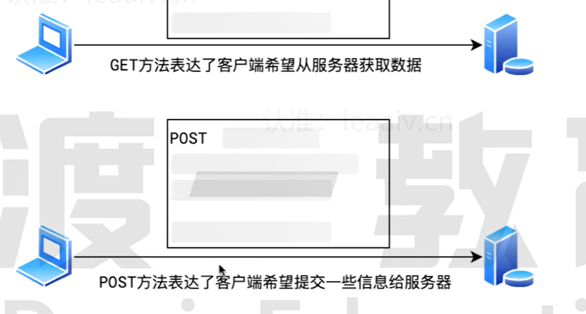

```js
fetch('https://www.baidu.com', {
    method: 'heiheihei', // 告诉百度,我这次请求是来嘿嘿嘿的
})
```

上面的请求中,我们使用了自定义的方法`heiheihei`.虽然百度服务器无法理解这样的请求是在干什么,但这样的请求也是可以正常发送到百度服务器的.

在实践中,客户端和服务器慢慢的形成了一个共识,约定俗称的一些 常见的请求方法:

- GET:表示向服务器获取资源.业务数据在请求行中,无需请求体
- POST: 表示向服务器提交信息,通常用于产生新的数据,比如注册.业务数据在请求体中.
- PUT: 表示希望修改服务器的数据,通常用于修改.业务数据在请求体中.
- DELETE: 表示希望删除服务器的数据.业务数据在请求行中,无需请求体
- OPTIONS:发生在跨域的预检请求中,表示客户端向服务器申请跨域提交
- TRACE:回显服务器收到的去请求,主要用于测试和诊断
- CONNECT: 用于建立连接管道,通常在代理场景中使用,网页中很少用到

## GET和POST的区别

由于浏览器和服务器**约定俗成**的规则,造成了GET请求和POST请求在Web中的区别:

1. 浏览器在发送GET请求时,不会附带请求体
2. GET:请求的传递信息量有限,适合传递少量数据;POST请求的传递信息量是没有限制的,适合传输大量数据
3. GET请求只能传递`ASCII`数据,遇到非`ASCII`数据需要进行编码;POST请求没有限制
4. 大部分GET请求传递的数据都附带在`path`参数中,能够通过分享地址完整地重现页面,但同时也暴露了数据,若有敏感数据传递,不应该使用GET请求,至少不应该放到`path`中.
5. 刷新页面时,若当前的页面是通过POST请求得到的,则浏览器会提示用户是否重新提交.若是GET请求得到的页面则没有提示.
6. GET请求的地址可以被保存为浏览器中的书签,POST不可以.

# cookie

## 一个不大不小的问题

假设服务器有一个接口,请求通过这个接口,可以添加一个管理员.

但是,不是任何人都有权力做这种操作的

那么服务器是如何知道请求接口的人是有权力的呢

答案是: 只有登录过的管理员才能做这种操作.

可问题是,客户端和服务器的传输使用的是http协议,http协议是无状态的,即**服务器不知道这一次请求的人,和之前登录请求成功的人是不是同一个人**

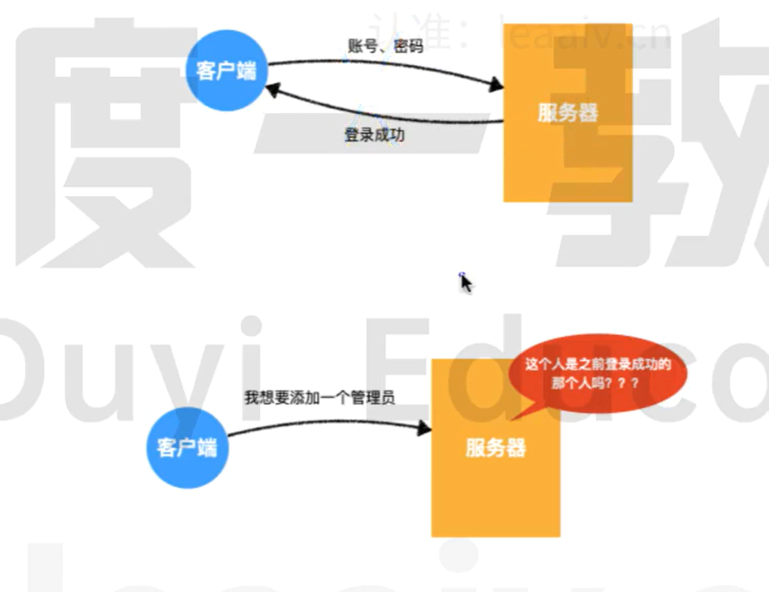

服务器按照下面的流程来认证客户端的身份

1. 客户端登录成功后,服务器会给客户端一个出入证
2. 后续客户端的每次请求,都必须要附带这个出入证

服务器发扬了认证不认人的优良传统,就可以很轻松地识别身份了

但是,用户不可能只在一个网站登录,由于客户端会收到来自各个网站的出入证,因此,就要求客户端要有一个类似卡包的东西,能够具备以下功能:

1. **能够存放多个出入证**: 这些出入证来自不同的网站,也可能是一个网站有多个出入证,分别用于出入不同的地方
2. **能够自动出示出入证**: 客户端在访问不同的网站时,能够自动地把对应的出入证附带请求发送出去
3. **正确地出示出入证**: 客户端不能将肯德基的出入证发送给麦当劳
4. **管理出入证的有效期**:客户要能够自动地发现那些已经过期的出入证,并把它从卡包中移除

能够满足上面要求的,就是cookie

cookie类似于一个卡包,专门用于存放各种出入证,并有着一套机制来自动管理这些证件

卡包内的每一张卡片,称之为一个**cookie**

## cookie的组成

**cookie是浏览器中特有的一个概念**,它就像浏览器的专属卡包,管理着各个网站的身份信息

每个cookie就相当于是属于某个网站的一个卡片,它记录了下面的信息

- key: 键,比如身份证号
- value: 值,比如袁小金的身份证编号是238907489723894789327,这有点像卡片的条形码,当然,它可以是任何信息
- domain: 域, 表达这个cookie是属于哪个网站的,比如yuanjin.tech,表示这个cookie是属于yuanjin.tech这个网站的.
- path: 路径,表达这个cookie是属于该网站的哪个路径的,就好比是同一家公司不同部门会颁发不同的出入证,比如`/new`表示这个cookie是属于`/new`这个路径的.
- secure: 是否使用安全传输
- expire: 过期时间,表示该cookie在什么时候过期

当浏览器向服务器发送一个请求的时候,它会瞄一眼自己的卡包,看看哪些信息适合附带捎给服务器.

如果一个cookie同时满足以下条件,则这个cookie会被附带到请求中

- cookie没有过期
- cookie中的域和这次请求的域是匹配的
  - 比如cookie中的域是`yuanjin.tech`,则可以匹配的请求域是`yuanjin.tech`,`www.yuanjin.tech``blogs.yuanjin.tech`等等
  - 比如cookie中的域是`www.yuanjin.tech`,则只能匹配`www.yuanjin.tech`这样的请求域
  - cookie是不在乎端口的,只要域匹配即可
- cookie中的path和这次请求的path是匹配的
  - 比如cookie中的path是`/new`,则可以匹配的请求路径可以是`/new`,`/new/detail`,`/new/a/b`等等,但不能匹配`/blogs`
  - 如果cookie的path是`/`,可以想象,能够匹配所有的路径.
- 验证cookie的安全传输
  - 如果cookie的secure属性是true,则请求协议必须是`https`,否则不会发送该cookie
  - 如果cookie的secure属性是false,则请求协议可以是`http`,也可以是`https`

如果一个cookie满足了上述所有的条件,则浏览器会把它自动加入到这次请求中

具体的加入方式是,**浏览器会将符合条件的cookie,自动放置到请求头中**,例如,当我在浏览器中访问百度时,它在请求头中自动附带了下面的cookie.

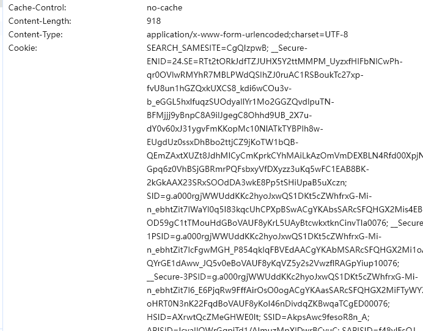


**cookie中包含了重要的身份信息,永远不要把你的cookie泄露给别人!!**否则,他人就拿到了你的证件,有了证件,就具备了为所欲为的可能性

## 如何设置cookie

由于cookie是保存在浏览器端的,同时,很多证件又是服务器颁发的

所以,cookie的设置有两种模式: 

- 服务器相应:这种模式是非常普遍的,当服务器决定给客户端颁发一个证件时,它会在响应的消息中包含cookie,浏览器会自动的把cookie保存到卡包中
- 客户端自行设置: 这种模式少见一些,不过也有可能会发生.比如用户关闭了某个广告,并选择了以后不要再弹出,此时就可以把这种小信息直接通过浏览器的JS代码保存到cookie中.后续请求服务器时,服务器会看到客户端不想要再弹出广告的cookie,于是就不会再有广告发送过来了

### 服务器端设置cookie

服务器可以通过设置响应头,来告诉浏览器应该如何设置cookie

响应头按照下面的格式设置

```http
set-cookie: cookie1
set-cookie: cookie2
set-cookie: cookie3
....
```

通过这种模式,就可以在一次响应中设置多个cookie了,具体设置多少个cookie,设置什么cookie,根据你的需要自行处理

其中,每个cookie的格式如下:

```
键=值;path=?;domain=?; expire=?;max-age=?;secure;httponly
```

每个cookie除了键值对是必须要设置的,其他属性都是可选的,并且顺序不限

当这样的响应头达到客户端后,**浏览器会自动的将cookie保存到卡包中,如果卡包中已经存在一模一样的卡片(其他path,domain相同),则会自动覆盖之前的设置**

下面,依次说明各个属性值:

- path: 设置cookie的路径,如果不设置,浏览器会将其自动设置为当前请求路径.比如,浏览器请求的地址是`/login`,服务器相应了一个`set-cookie: a=1`,浏览器会将该cookie的path设置为请求的路径`/login`
- domain: 设置cookie的域,如果不设置,浏览器会自动将其设置为当前请求的请求域,比如,浏览器请求的地址是`http://www.yuanjin.tech`,服务器响应了一个`set-cookie: a=1`,浏览器会将该cookie的domain属性设置为请求的域`www.yuanjin.tech`
  - 这里指的注意的是,如果服务器响应了一个无效的域,浏览器是不认的.
  - 什么是无效的域?就是响应的域连根域都不一样.比如,浏览器请求的域是`yuanjin.tech`,服务器响应的cookie是`set-cookie: a=1`,`domain=baidu,com`,这样的域浏览器是不认的.
  - 如果浏览器连这样的情况都允许,就意味着张三的服务器,有权力给用户一个cookie,用于访问李四的服务器,这会造成很多安全性的问题
- expire: 设置cookie的过期时间.这里必须是一个有效的**GMT**时间,即格林威治标准时间字符串,比如`Fri 17 Apr 2020 09:35:59`.当客户端的时间到达这个时间点后,会自动销毁该cookie
- max-age: 设置cookie的相对有效期.expire和max-age通常设置一个即可比如设置`max-age`为`1000`,浏览器在添加cookie时,会自动设置它的`expire`为当前时间加上`1000s`,作为过期时间
  - 如果`expire`和`max-age`都没有设置,则表示**会话结束后过期**
  - 对于大部分浏览器而言,关闭所有浏览器窗口意味着会话结束
- secure: 设置cookie是否是安全连接.如果设置了该值,则表示该cookie后续只能随着`https`请求发送,如果不设置,则表示可以随着所有请求发送
- httpolny:设置该cookie是否仅能用于传输.如果设置了该值,表示该cookie只能用于传输,而不允许在客户端通过JS获取,这对防止**跨站脚本攻击(XSS)**会很有用.

现在,还剩下最后一个问题,就是如何删除一个cookie呢?

如果要删除浏览器的cookie,只需要让服务器响应一个同样的域,同样的路径,同样的key,只是时间过期的cookie即可

**所以,删除cookie其实就是修改cookie**

下面的响应会让浏览器删除cookie

```
set-cookie: token=;domain=yuanjin.tech;path=/;max-age=-1
```

浏览器按照要求修改了cookie后,会发现cookie已经过期,所以会自动删除

> 无论是删除还是修噶,都要注意cookie的域和路径,因为完全可能存在域或路径不同,但key相同的cookie
>
> 因此无法仅通过key确定是哪一个cookie

### 客户端自行设置cookie

既然cookie是存放在客户端的,所以浏览器向JS公开了接口,让其可以设置cookie

```js
document.cookie = "键=值; path=?; domain=?;l expire=?; max-age=?; secure"
```

可以看出,在客户端设置cookie,和服务器端设置cookie的格式一样,只是有下面的不同

- 没有httponly,因为httponly本来就是为了限制客户端的访问的,既然你是在客户端配置,自然就失去了限制的意义
- path的默认值.在服务器端设置cookie时,如果没有写path,使用的是请求的path.而客户端设置cookie时,也许根本没有请求发生.因此,path在客户端设置时的默认值是**当前网页的path**
- domain的默认值.和path同理.
- 其他:一样
- 删除cookie:和服务器相同

## 总结

### 登录请求

1. 浏览器发送请求到服务器,附带账号密码
2. 服务器验证账号密码是否正确,如果不正确,响应错误,如果正确,在响应头中设置cookie,附带登录认证信息(至于登录认证信息是什么样的,如何设计,要考虑哪些问题,就是另一个话题了`json web token, jwt`)
3. 客户端收到cookie,浏览器自动记录下来

### 后续请求

1. 浏览器发送请求到服务器,希望添加一个管理员,并将cookie自动附带到请求中.
2. 服务器先获取cookie,验证cookie中的信息是否正确,如果不正确,不予以操作.如果正确,完成正常的业务流程.

## sessionStorage和localStorage

cookie/sessionStorage/localStorage 的区别

>参考答案
>
>cookie, sessionStorage,localStorage都是保存本地数据的方式
>
>其中,cookie的兼容性较好,所有浏览器均支持.浏览器针对cookie会有一些默认行为,比如当响应头中出现`set-cookie`字段时,浏览器会自动保存cookie的值;再比如,浏览器发送请求时,会附带匹配的cookie到请求头中.这些默认行为,使得cookie长期以来担任着维持登录状态的责任.与此同时,也正是因为浏览器的默认行为,给了恶意攻击者可乘之机,CSRF攻击就是一个典型的利用cookie的攻击方式.虽然cookie不断地改进,但签单仍然需要另一种更加安全的保存数据的方式
>
>HTML5新增了sessionStorage和localStorage,前者用于保存会话级别的数据,后者用于更持久的保存数据.浏览器针对他们没有任何默认行为,这样一来,就把保存数据,读取数据的工作交给了前端开发者,这就让恶意攻击者难以针对登录状态进行攻击.
>
>cookie的大小是有限制的,一般浏览器会限制,每个 Cookie 的大小一般不能超过 **4KB**,同一个域下的cookie总量为**4MB**,而sessionStorage和localStorage则没有限制
>
>cookie会和domain, path关联,而sessionStorage和localStorage只与domain关联.

# 加密

## 加密算法的分类

### 对称加密

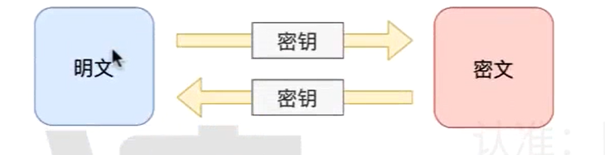

常见算法: DES, 3DES, TDEA, Blowfish, RC5, IDEA

优点: 加密,解密速度快,适合对**大数据量**进行加密

缺点: 在网络中需要分发密钥,增加了密钥被盗取的风险

### 非对称加密

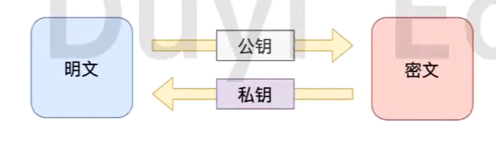

常见算法: RSA, Rabin, DSA, ECC, Elgamal, D-H

优点: 安全(私钥仅被一方保存,不用网络传输)

缺单: 仅能一方进行解密

### 摘要/哈希/散列

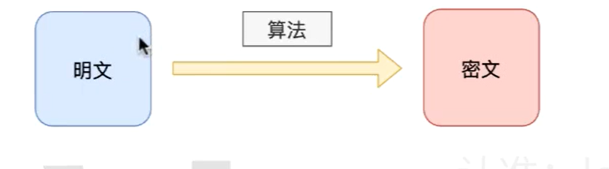

常见算法: MD4, MD5, SHA1

优点: 密文占用空间小(定长的短字符串);难以破解

缺点: 无法解密

## 面试题

对称加密,非对称加密,摘要的概念

>参考答案:
>
>密钥
>
>密钥是一种参数,它是在明文转换为密文或将密文转换为明文的算法中输入的参数.密钥分为对称密钥和非对称密钥,分别应用在对称加密和非对称加密上
>
>对称加密
>
>对称加密,又叫做私钥加密,即信息的发送方和接收方使用同一个密钥去加密和解密数据.对称加密的特点是算法公开,加密和解密速度快,适合于对大数据量进行加密,常见的对称加密算法有 DES, 3DES, TDEA, Blowfish, RC5 和 IDEA
>
>非对称加密
>
>非对称加密也叫做公钥加密.非对称加密和对称加密相比,其安全性更好.对称加密的通信双方使用相同的密钥,如果一方的密钥遭泄露,那么整个通信就会被破解.而非对称加密使用一对密钥,即公钥和私钥,并且两者成对出现.私钥被自己保存,不能对外泄露.公钥指的是公共的密钥,任何人都可以获得该密钥.用公钥或私钥中的任何一个进行加密,用另一个进行解密.
>
>摘要
>
>摘要算法又称为哈希/散列算法.它通过一个函数,把任意长度的数据转换为一个长度固定的数据串(通常用16进制的字符串表示).算法不可逆

# JWT

## 概述

回顾登录的流程

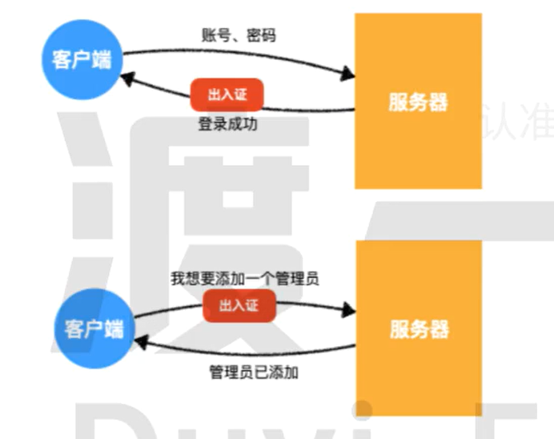

接下来的问题是,这个出入证(令牌)里面到底存啥?

一个比较简单的颁发就是直接存储用户信息的JSON字符串,这会造成下面几个问题:

- 非浏览器环境,如何在令牌中记录过期时间
- 如何防止令牌被伪造

JWT就是为了解决这些问题的.

JWT全称`Json Web Token`,本质就是一个字符串.

它要解决的问题,就是在互联网环境中,提供**统一的,安全的**令牌格式

因此,jwt只是一个令牌格式而已,你可以把它存储到cookie,也可以存储到localStorage,没有任何限制!

同样的,对于传输,你可以使用任何方式来传输jwt,一般来说,我们会使用消息头来传输它

比如,当登录成功后,服务器可以给客户端响应一个jwt

```http
HTTP/1.1 200 OK
...
set-cookie:token=jwt令牌
authorization: jwt令牌
...

{..., token: jwt令牌}
```

可以看到,jwt令牌可以出现在响应的任何一个地方,客户端和服务器自行约定即可.

>当然,它也可以同时出现在响应的多个地方,比如为了充分利用浏览器的cookie,同时为了照顾其他设备,也可以让jwt出现在`set-cookie`和`authorization`或`body`中,尽管这会增加额外的传输量

当客户端拿到令牌后,他要做的只有一件事: 存储它.

你可以存储到任何位置，比如手机文件，PC文件，localStorage,cookie

当后续请求发生时,你只需要将他作为请求的一部分发送到服务器即可.

虽然jwt没有明确要求应该如何附带到请求体中,但通常我们会使用如下的格式

```http
GET /api/resources HTTP/1.1
...
authorization: bearer jwt令牌
...
```

这样一来,服务器就能收到这个令牌了,通过对令牌的验证,即可知道该令牌是否有效.

他们的完整交互流程是非常简单清晰的.

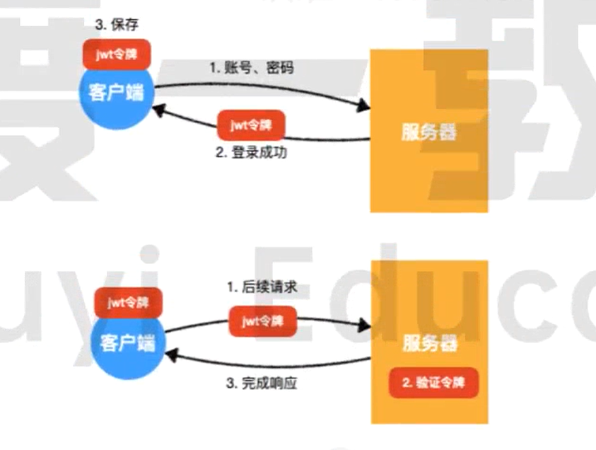

## 令牌的组成

为了保证令牌的安全性,jwt令牌由三个部分组成,分别是:

1. header:  令牌头部,记录了整个令牌的类型和签名算法
2. payload: 令牌负荷,记录了保存的主体信息,比如你要保存的用户信息就可以放到这里
3. signature: 令牌签名,按照头部固定的签名算法对整个令牌进行签名,该签名的作用是: **保证令牌不被伪造和篡改**

他们组合而成的完整格式为`header.payload.signature`

比如,一个完整的jwt令牌如下

```
eyJhbGciOiJIUzI1NiIsInR5cCI6IkpXVCJ9.eyJzcyI6IuWPkeihjOiAhSIsImlhdCI6IuWPkeW4g+aXtumXtCIsImV4cCI6IuWIsOacn+aXtumXtCIsInN1YiI6IuS4u+mimCIsImF1ZCI6IuWQrOS8lyIsIm5iZiI6IuWcqOatpOS5i+WJjeS4jeWPr+eUqCIsImp0aSI6IkpXVCBJRCJ9.BCwudsiofjdiosjfidsjklfjdskljfk-dsjfkldsjklfjdskljmnnkln
```

它各个部分的值分别是:

- header:eyJhbGciOiJIUzI1NiIsInR5cCI6IkpXVCJ9
- payload:eyJzcyI6IuWPkeihjOiAhSIsImlhdCI6IuWPkeW4g+aXtumXtCIsImV4cCI6IuWIsOacn+aXtumXtCIsInN1YiI6IuS4u+mimCIsImF1ZCI6IuWQrOS8lyIsIm5iZiI6IuWcqOatpOS5i+WJjeS4jeWPr+eUqCIsImp0aSI6IkpXVCBJRCJ9
- signature: BCwudsiofjdiosjfidsjklfjdskljfk-dsjfkldsjklfjdskljmnnkln

下面对每个部分进行说明

### header

它是令牌的头部,记录了整个令牌的类型和签名算法

它的格式是一个`json`对象,如下:

```json
{
    "alg": "HS256h",
    "typ": "JWT"
}
```

该对象记录了

- alg: signature部分使用的签名算法,通常可以取两个值
  - HS256: 一种对称加密算法,使用同一个密钥对signature加密解密
  - RS256: 一种非对称加密算法,使用私钥进行签名,公钥验证
- typ: 整个令牌的类型,固定写`JWT`即可

设置好了`header`之后,就可以生成`header`部分了

具体的生成方式极其简单,就是把`header`部分使用`base64 url`编码即可

>`base64 url`不是一个加密算法,而是一种编码方式,他是在base64算法的基础上对`+`,`=`,`/`三个字符做出特殊处理的算法
>
>而`base64`是使用64个可打印字符来表示一个二进制数据,具体做法请百度

浏览器提供了`btoa`函数,可以完成这个操作

```js
window.btoa(JSON.stringify({
    "alg": "HS256",
    "typ": "JWT"
}))
```

### payload

这部分是jwt的主体信息,它仍然是一个JSON对象,它可以包含以下内容: 

```json
{
    "ss": "发行者",
    "iat": "发布时间",
    "exp": "到期时间",
    "sub": "主题",
    "aud": "听众",
    "nbf": "在此之前不可用",
    "jti": "JWT ID"
}
```

以上属性可以全写,也可以一个都不写,它只是一个规范,就算写了,也需要你在将来验证这个jwt令牌时手动处理才能发挥作用.

上述属性表达的含义分别是:

- ss: 发行该jwt的是谁,可以写公司的名字,也可以写服务的名称
- iat: 该jwt的发放时间,通常是写当前时间的时间戳
- exp:该jwt的到期时间,通常写时间戳
- sub: 该jwt是干嘛的
- aud: 该jwt是发放给哪个终端的,可以是终端类型,也可以是用户名称,随意
- nbf: 一个时间点,在该时间点到达之前,该令牌是不可用的
- jti: jwt的唯一编号,设置此项的目的,主要是为了防止重放攻击(重放攻击是在某些场景下,用户使用之前的令牌发送到服务器,被服务器正确识别,从而导致不可预期的行为发生).

当用户登录成功后,我可能需要把用户的一些信息写入到jwt令牌中,比如用户id账号等

其实很简单,`payload`这部分只是一个json对象而已,你可以向对象中加入任何想要加入的信息

最终`payload`部分也经过`base64 url`编码得到.

### signature

这一部分是`jwt`的签名,正式它的存在,保证了**整个jwt不被篡改**

这部分的生成,是对前面两个部分的编码结果,按照头部指定的方式进行加密

比如: 头部指定的加密方法是`HS256`,前面两部分的编码结果是`eyJhbGciOiJIUzI1NiIsInR5cCI6IkpXVCJ9.eyJzcyI6IuWPkeihjOiAhSIsImlhdCI6IuWPkeW4g+aXtumXtCIsImV4cCI6IuWIsOacn+aXtumXtCIsInN1YiI6IuS4u+mimCIsImF1ZCI6IuWQrOS8lyIsIm5iZiI6IuWcqOatpOS5i+WJjeS4jeWPr+eUqCIsImp0aSI6IkpXVCBJRCJ9`

则第三部分就是用对称加密算法`HS256`对字符串`eyJhbGciOiJIUzI1NiIsInR5cCI6IkpXVCJ9.eyJzcyI6IuWPkeihjOiAhSIsImlhdCI6IuWPkeW4g+aXtumXtCIsImV4cCI6IuWIsOacn+aXtumXtCIsInN1YiI6IuS4u+mimCIsImF1ZCI6IuWQrOS8lyIsIm5iZiI6IuWcqOatpOS5i+WJjeS4jeWPr+eUqCIsImp0aSI6IkpXVCBJRCJ9`进行加密,当然,你得指定一个密钥,比如`shfldj`

最终将三个部分合在一起,就得到了完整的jwt

由于签名使用的密钥保存在服务器,这样一来,客户端就无法伪造出签名,因为它拿不到密钥.

换句话说,**之所以说无法伪造jwt,就是因为有第三部分的存在**.

而前面两部分没有加密,只是一个编码结果而已,相当于明文传输.

> 这不会造成太大的问题,因为既然用户登录成功了,它当然有权力查看自己的用户信息
>
> 甚至在某些网站,用户的基本信息可以被任何人查看
>
> 你要保证的,是不要将敏感信息存放到jwt中,比如密码

jwt的`signature`可以保证令牌不被伪造,那如何保证令牌不被篡改呢?

比如,某个用户登录成功了,获得了jwt,但他人为的篡改了`payload`,比如把自己的账户余额修改为原来的两倍,然后重新编码出`payload`发送到服务器,服务器如何得知这些信息被篡改过了呢?

这就要说到令牌的验证了.

## 令牌的验证

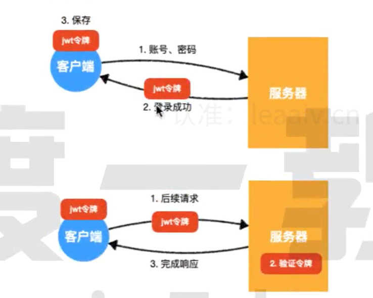

令牌在服务器组装完成后,会以任意的方式发送到客户端

客户端会把令牌保存起来,后续的请求会将令牌发送给服务器

而服务器需要验证令牌是否正确,如何验证呢?

首先,服务器要验证这个令牌是否被篡改过,验证方式非常简单,就是对`header.payload`用同样的密钥和算法进行重新加密

然后把加密的结果和传入jwt的`signature`进行对比,如果完全相同,则表示前面两部分没有动过,就是自己颁发的,如果不同,肯定是被篡改过了

## 总结

最后,总结一下jwt的特点

- jwt本质上只是一种**令牌格式**,它和终端设备无关,同样和服务器无关,甚至和如何传输无关.他只是规范了令牌的格式而已
- jwt由三部分组成: header, payload, signature. 主体信息在payload.
- jwt难以被篡改和伪造.这是因为有第三部分的签名存在

## 面试题

请阐述JWT令牌的格式

> 参考答案
>
> token分为三段,分别是 header, payload和signature
>
> 其中,header标识签名算法和令牌类型;payload标识主体信息,包含令牌的过期时间,发布时间,发行者,主体内容等;signature是使用特定的算法对前面两部分进行加密,得到的加密结果.
>
> token有防篡改的特点,如果攻击者改动了前面两个部分,就会导致和第三部分对应不上,使得token失效,而攻击者不知道加密密钥,因此又无法修改第三部分的值
>
> 所以,在密钥不被泄露的前提下,一个验证通过的token是值得被信任的.

# 同源策略

浏览器有一个重要的安全策略,称之为**同源策略**

其中`源=协议+主机+端口`,两个源相同,称之为同源,两个源不同,称之为跨域或跨源

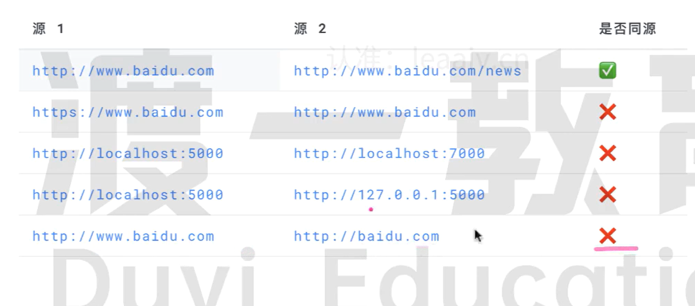

同源策略是指,若页面的源和页面运行过程加载的源不一致时,出于安全考虑,浏览器会对跨域的资源访问进行一些限制.

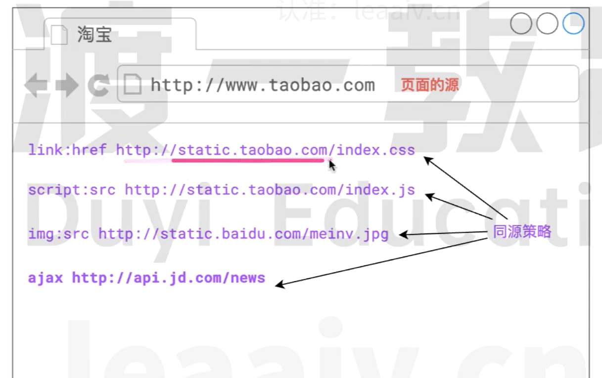

同源策略对`Ajax`的跨域限制最为凶狠,默认情况下,它不允许`Ajax`访问跨域资源

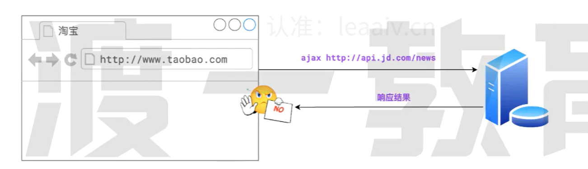

所以,我们常说的跨域问题,就是同源策略对`Ajax`产生的影响

有多种方式解决跨域问题.常见的有

- 代理: 常用
- CORS:常用
- JSONP

无论使用哪一种方式,都是要让浏览器知道,我这次跨域请求的是自己人,就不要拦截了

# 跨域-代理

**对于前端开发而言**,大部分的跨域问题,都是通过代理解决的

**代理适用的场景是:生产环境不发生跨域,但开发环境发生跨域**

因此,只需要再开发环境使用代理解决跨域即可,这种代理又称为开发代理

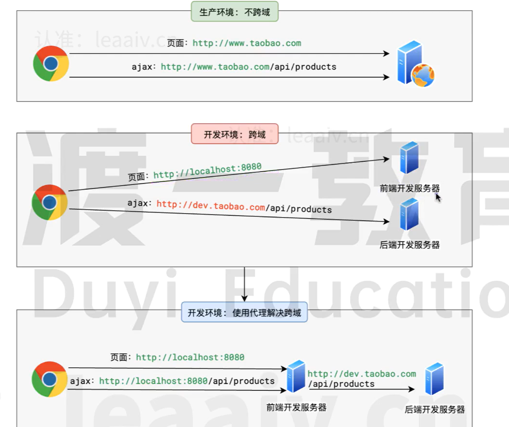

在实际开发中,只需要对**开发服务器**稍加配置即可完成.

```js
// vue的开发服务器代理配置
// vue.config.js
module.exports = {
    devServer: {
        // 配置开发服务器
        proxy: {
            // 配置代理
            "/api": {
                // 若请求路径以 /api 开头
                target: "http://dev.taobao.com",	//将其转发到http://dev.taobao.com
            }
        }
    }
}
```

# 跨域-CORS

`CORS`是基于`http1.1`的一种跨域解决方案,它的全称叫**C**ross-**O**rigin **R**esource **S**haring,跨域资源共享.

它的总体思路是: **如果浏览器要跨域访问服务器的资源,需要获得服务器的许可**

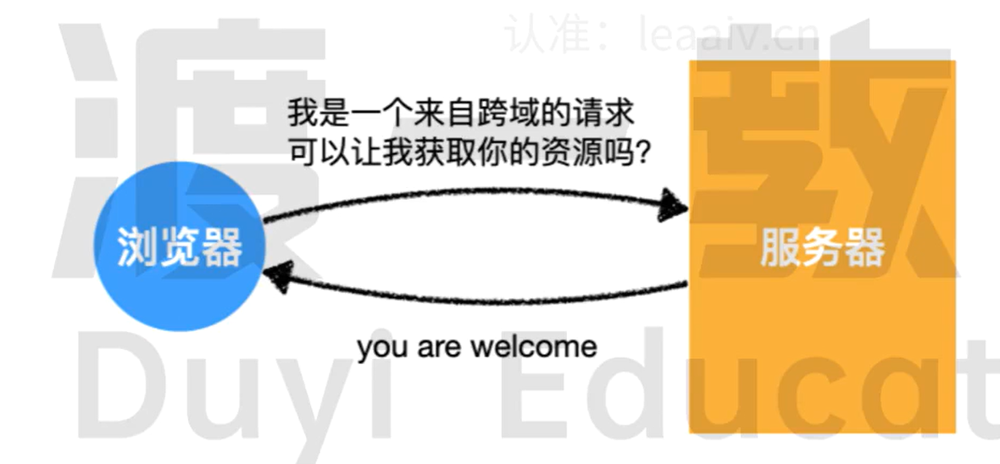

而要知道,一个请求可以附带很多信息,从而会对服务器造成不同程度的影响

比如有的请求只是获取一些新闻,有的请求会改动服务器的数据

针对不同的请求,CORS规定了三种不同的交互模式,分别是

- 简单请求
- 需要预检的请求
- 附带身份凭证的请求

这三种模式从上到下层层递进,请求可以做的事情越来越多,要求也越来越严格.

下面分别说明三种请求模式的具体规范.

## 简单请求

当浏览器端运行了一段`ajax`代码(无论是使用`XMLHttpRequest`还是`fetch api`),浏览器会首先判断它属于哪一种请求模式.

### 简单请求的判定

当请求**同时满足**以下条件时,浏览器会认为他是一个简单请求

1. **请求方法属于下面的一种**
   - get
   - post
   - head
2. 请求头仅包含**安全**的字段,常见的安全字段如下:
   - `Accept`
   - `Accept-Language`
   - `Content-Language`
   - `Content-Type`
   - `DPR`
   - `Downlink`
   - `Save-Data`
   - `Viewport-Width`
   - `Width`
3. 请求头吐过包含`content-type`,仅限下面的值之一
   - `text/plain`
   - `multipart/form-data`
   - `application/x-www-form-urlencoded`

如果以上三个条件同时满足,浏览器判定为简单请求

下面是一些例子

```js
// 简单请求
fetch('http://crossdomain.com/api/news');

// 请求方法不满足要求,不是简单请求
fetch('http://crossdomain.com/api/news',{
    method: 'PUT'
})

// 加入了额外的请求头,不是简单请求
fetch('http://crossdamain.com/api/news', {
    header: {
        a: 1,
    }
})

// 简单请求
fetch('http://crossdomain.com/api/news', {
    method: 'post',
});

// content-type不满足要求,不是简单请求
fetch('http://crossdomain.com/api/news', {
    method: 'post',
    headers: {
        'content-type': 'application/json'
    }
});
```

### 简单请求的交互规范

当浏览器判定某个**ajax跨域请求**是**简单请求**时,会发生以下的事情

1. **请求头中会自动添加`Origin`字段**

比如,在页面`http://my.com/index.html`中有以下代码造成了跨域

```js
// 简单请求
fetch('http://crossdomain.com/api/news');
```

请求发出后,请求头会是下面的格式

```http
GET /api/news/ HTTP/1.1
Host: crossdomain.com
Connection: keep-alive
...
Refer: http://my.com/index.html
Origin: http://my.com
```

看到最后一行没, `Origin`字段会告诉服务器,是哪个源地址在跨域请求

2. **服务器响应头中包含`Access-Control-Allow-Origin`**

当服务器收到请求后,如果允许该请求跨域访问,需要在响应头中添加`Access-Control-Allow-Origin`字段

该字段的值可以是:

- `*`: 表示我很开放,我允许所有源访问
- 具体的源: 比如`http://my.com`,表示我就允许你访问.

> 实际上, 这两个值对于`http://my.com`而言,都一样,因为客户端才不会管其他源服务器允不允许,就关心自己是否别允许.
>
> 当然,服务器也可以维护一个可被允许的源列表,如果请求的`Origin`命中该列表,才响应*或具体的源
>
> **为了避免后续的麻烦,强烈推荐响应具体的源**

假设服务器做出了以下的响应:

```http
HTTP/1.1 200 OK
Date: Tue, 21 Apr 2020 08h:03:35 GMT
...
Access-Control-Allow-Origin: http://my.com
...

消息体中的数据
```

当浏览器看到服务器允许自己访问后,高兴地像一个两百斤的孩子,于是他就顺利的交给js,以完成后续的操作.

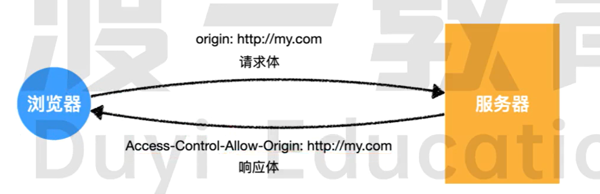

## 需要预检的请求

简单的请求对服务器造成的威胁不大,所以允许使用上述的简单交互即可完成.

但是,如果浏览器不认为这是一种简单请求,就会按照下面的流程进行:

1. **浏览器发送预检请求,询问服务器是否允许**
2. **服务器允许**
3. **浏览器发送真实请求**
4. **服务器完成真实的响应**

比如在页面`http://my.com/index.html`中有以下代码造成了跨域

```js
// 需要跨域的请求
fetch('http://crossdomain.com/api/user', {
    method: 'POST', // post请求
    header: {
        // 设置请求头
        a: 1,
        b: 2,
        'content-type': 'application/json',
    },
    body: JSON.stringify({name:'袁小金', age: 18}), // 设置请求体
})
```

浏览器发现它不是一个简单请求,则会按照下面的流程与服务器进行交互

1. 浏览器发送预检请求,询问服务器是否允许

```http
OPTIONS /api/user HTTP/1.1
Host: crossdomain.com
...
Origin: http://my.com
Access-Control-Request-Method: POST
Access-Control-Request-Headers: a, b, content-type
```

可以看出,这并非我们想要发出的真实请求,请求中不包含我们的请求头,也没有消息体

这是一个预检请求,它的目的是询问服务器,是否允许发送后续的真实请求

预检请求**没有请求体**,它包含了后续真实请求要做的事情

预检请求有以下特征:

- 请求方法为`OPTIONS`
- 没有请求体
- 请求头中包含
  - `Origin`:请求的源,和简单请求的含义一致
  - `Access-Control-Request-Method`: 后续的真实请求将使用的请求方法
  - `Access-Control-Request-Headers`: 后续的真实请求会改动的请求头

2. 服务器允许

服务器收到预检请求后,可以检查预检请求中包含的信息,如果允许这样的请求,需要响应下面的消息格式.

```http
HTTP/1.1 200 OK
Date: Tue, 21 Apr 2020 08:03:35 GMT
...
Access-Control-Allow-Origin: http://my.com
Access-Control-Allow-Methods: POST
Access-Control-Allow-Headers: a, b, content-type
Access-Control-Max-Age: 86400
...
```

对于预检请求,不需要响应任何的消息体,只需要在响应头中添加:

`Access-Control-Allow-Origin`: 和简单请求一样,表示允许的源
`Access-Control-Allow-Methods`: 表示允许的后续真实的请求方法
`Access-Control-Allow-Headers`: 表示允许改动的请求头
`Access-Control-Max-Age`: 告诉浏览器,多少秒内,同样的请求源,方法,头,都不需要在发送预检请求了

3. 浏览器发送预检请求

预检被服务器允许后,浏览器就会发送真实请求了,上面的代码会发生下面的数据请求

```http
POST /api/user HTTP/1.1
Host: crossdomain.com
Connection: keep-alive
...
Referer: http://my.com/index.html
Origin: http://my.com

{"name": "袁小金", "age": 18}
```

4. 服务器响应真实请求

```http
HTTP/1.1 200 OK
Date: Tue, 21 Apr 2020 08:03:35 GMT
...
Access-Control-Allow-Origin: http://my.com
...
添加用户成功
```

可以看出,当完成预检之后,后续的处理与简单请求相同

下面简述了整个交互过程

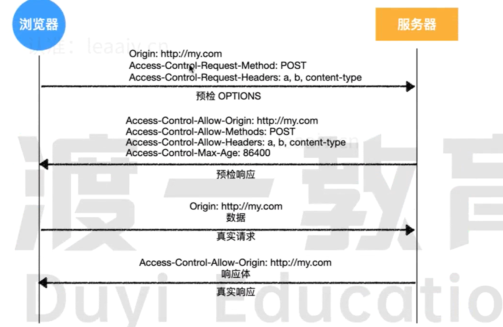

## 需要附带身份凭证的请求

默认情况下,ajax的跨域请求并不会附带cookie,这样一来,某些需要权限的操作就无法进行

不过可以通过简单的配置就可以实现附带cookie

```js
//xhr
var xhr = new XMLHttpRequest();
xhr.withCredentials = true;

// fetch api 
fetch(url, {
    credentials: 'include'
})
```

这样一来,该跨域的`ajax`请求就是一个附带身份凭证的请求

当一个请求需要附带cookie时,无论它是简单请求,还是预检请求,都会在请求头中添加`cookie`字段

而服务器相应时,需要明确告知客户端: 服务器允许这样的凭据

告知的方式也非常简单,只需要在响应头中添加`Access-Control-Allow-Credentials: true`即可.

对于一个附带身份凭证的请求,若服务器没有明确告知,浏览器仍然视为跨域被拒绝.

另外需要特别注意的是,**对于附带身份凭证的请求,服务器不得设置`Access-Control-Allow-Oring`的值为`*`.这就是为什么不推荐使用`*`.

## 一个额外的补充

在跨域访问时,JS只能拿到一些最基本的响应头,如:`Cache-Control,Content-Language,Content-Type,Expires,Last-Modified,Pragma`,如果要访问其他头,则需要服务器设置本响应头

`Access-Control-Expose-Headers`头让服务器把允许让浏览器访问的头放入白名单,例如

```http
Access-Control-Expose-Headers: authorization, a, b
```

这样JS就能够访问指定的响应头了

# 跨域-JSONP

在CORS出现之前,人们想了一种奇妙的办法来实现跨域,这就是JSONP

要实现JSONP,需要浏览器和服务器来进行一个天衣无缝的配合.

JSONP的做法是: **当需要跨域请求时,不使用AJAX,转而生成一个script元素去请求服务器,由于浏览器并不阻止script元素的请求,这样请求可以到达服务器.服务器拿到请求后,响应一段JS代码,这段代码实际上是一个函数调用,调用的是客户端预先生成好的函数,并把浏览器需要的数据作为参数传递到函数中,从而间接的把数据传递给客户端.

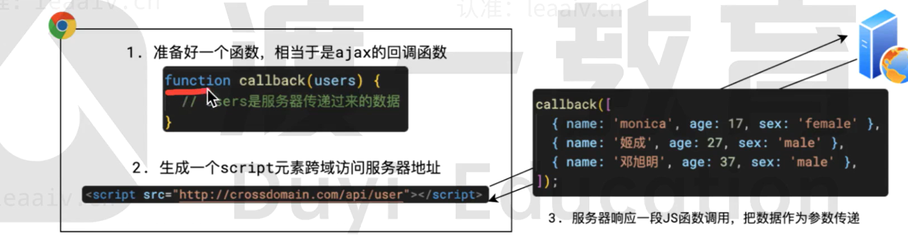

JSONP有着明显的缺点,即只能支持GET请求.

# 文件上传

## 文件上传的消息格式

文件上传的本质上仍然是一个数据提交,无非就是数据量大一些而已

在实践中,人们逐渐的形成了一种共识,我们自行规定,文件上传默认使用下面的请求格式

```http
PSOT 上传地址 HTTP/1.1
其他请求头
Content-Type: multipart/form-data; boundary=----WebKitFromBoudary7MA4YWxkTrZu0gW

----WebKitFromBoudary7MA4YWxkTrZu0gW
Content-Disposition: form-data; name='avatar'; filename="小仙女.jpg"
Content-Type: image/jpeg

(文件二进制数据)
----WebKitFromBoudary7MA4YWxkTrZu0gW


----WebKitFromBoudary7MA4YWxkTrZu0gW
Content-Disposition: form-data; name='username'; 


admin 
----WebKitFromBoudary7MA4YWxkTrZu0gW


----WebKitFromBoudary7MA4YWxkTrZu0gW
Content-Disposition: form-data; name='password'; 

213213
----WebKitFromBoudary7MA4YWxkTrZu0gW
```

- 除非接口文档特别说明,文件上传一般使用POST请求
- 接口文档中会规定上传地址,一般一个站点会有一个统一的上传地址
- 除非接口文档特别说明,`content-type: multipart/form-data`,浏览器会自动分配一个定界符`boundary`
- 请求体的格式是一个被定界符`boundary`分割的消息,每个分割区域本质是一个键值对
- 除了键值对外, `multipart/form-data`允许添加其他额外信息,比如文件数据区域,一般会把文件在本地的名称和文件MIME类型告诉服务器

## 文件上传的实现

在现代的网页交互中,带表单的文件上传通常使用下面的方式实现

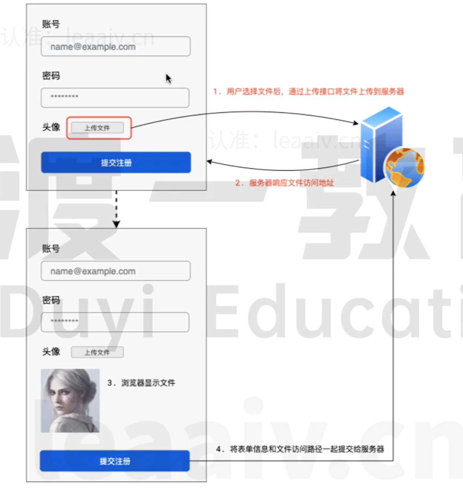

```js
const fileUploader = document.querySelector('#fileUploader');
const formData = new FormData();
formData.append('file', fileUploader.files[0]);	// 添加一个键值对,fileUploader.files[0]是文件的二进制数据

fetch('http://localhost:8000/api/upload', {
    method: 'POST',
    body: fromData
})
```

# 输入url地址后

在浏览器地址栏输入地址,并按下回车键后,发生了哪些事情

> 参考答案:
>
> 1. 浏览器自动补全协议,端口
> 2. 浏览器自动完成url编码,对非ASCII字符进行编码
> 3. 浏览器根据url地址查找本地缓存,根据缓存规则看是否命中缓存,若命中缓存则直接使用缓存,不再发出请求
> 4. 通过DNS解析找到服务器的IP地址
> 5. 浏览器向服务器发出建立TCP连接的申请,完成三次握手后,连接通道建立
> 6. 若使用了HTTPS协议,则还会进行SSL握手,建立加密信道.使用SSL握手时,会确定是否使用HTTP2
> 7. 浏览器决定要附带哪些cookie到请求头中
> 8. 浏览器自动设置好请求头,协议版本,cookie,发出GET请求
> 9. 服务器处理请求,进入后端处理流程,处理完成后,服务器响应一个HTTP报文给浏览器.
> 10. 浏览器根据使用的协议版本,以及Connection字段的约定,决定是否要保持TCP连接
> 11. 浏览器根据响应状态码决定如何处理这一次的响应
> 12. 浏览器根据请求头中的`Content-Type`字段识别响应类型,如果是`text/html`,则对响应体的内容进行HTML解析,否则做其他处理
> 13. 浏览器根据响应头的其他内容完成缓存,cookie的设置
> 14. 浏览器开始从上到下解析HTML,若遇到外部资源链接,则进一步请求资源
> 15. 解析过程中生成DOM树,CSSOM树,然后一边生成,一边把两者合并为渲染树(render tree),然后对渲染树中的每个节点计算位置和大小(reflow),最后把每个节点利用GPU绘制到屏幕(repaint)
> 16. 在解析过程中还会触发一系列的时间,当DOM树完成后会触发DOMContentLoaded事件,当所有资源加载完毕后会触发load事件.

# 文件下载

## 文件下载的消息格式

服务器只要在响应头中加入`Content-Disposition: attachment; filename="xxx"`,即可触发浏览器的下载功能

其中: 

- attachment 表示附件,浏览器看到此字段,触发下载行为(不同的浏览器下载行为有所区别)
- filename="xxx" 这是告诉浏览器,保存文件时使用的默认文件名

这部分操作由服务器完成的,和前端开发无关

## 启用迅雷下载

用户可能安装了某些下载工具,这些下载工具在安装时,都会自动安装相应的浏览器插件,只要对下载地址稍作修改,就会触发浏览器使用插件进行下载,当然,不同插件的地址规则不同

比如,迅雷的下载地址规则为

```
thunder://base64(AA地址ZZ)
```

# session

## cookie的缺陷

cookie是保存在客户端的,虽然为了服务器减少了很多压力,但某些情况下,会出现麻烦

比如验证码

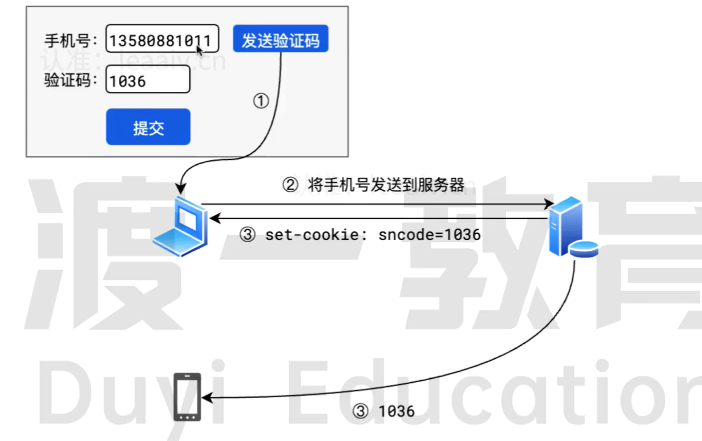

如果这样做,客户端可以随便填写一个别人的手机号,然后从cookie中获取到验证码,从而绕开整个验证.

因此,有些敏感数据是千万不能发送给客户端的.

那要如何实现这一流程呢?

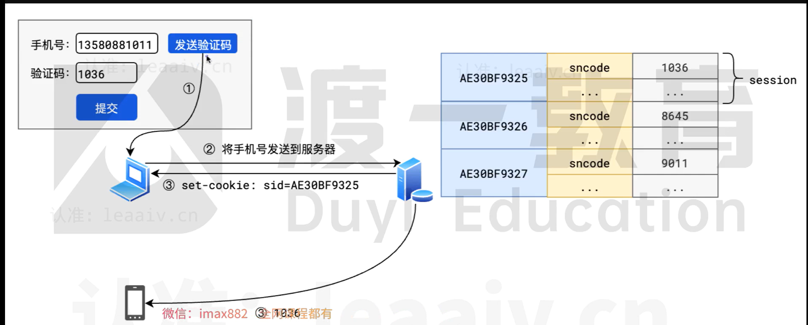

## 面试题

1. cookie和session的区别

> 参考答案
>
> 1. cookie的数据保存在浏览器端; session的数据保存在服务器
> 2. cookie的存储空间有限; session的存储空间不限
> 3. cookie只能保存字符串; session可以保存任何类型的数据
> 4. cookie中的数据容易被获取,session中的数据难以获取

2. 如何消除session

>参考答案
>
>1. 过期时间
>
>当客户端长时间没有传递sessionid过来时,服务器可以在过期时间之后自动清除session
>
>2. 客户端主动通知
>
>可以使用JS监听客户端页面关闭或其他退出操作,然后通知服务器清除 session

# HTTP缓存协议

## 缓存的基本原理

在一个C/S结构中,最基本的缓存分为两种:

- 客户端缓存
- 服务端缓存

**本文仅讨论客户端缓存**

所谓**客户端缓存**,顾名思义,是将某一次的响应结果保存在客户端(比如浏览器)中,而后续的请求仅需从缓存中读取即可,极大地降低了服务器的处理压力

客户端缓存的原理如下:

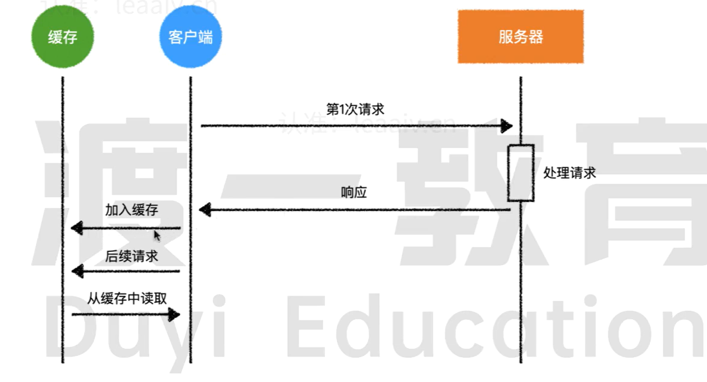

## 来自服务器的缓存指令

当客户端发出一个GET请求到服务器,服务器可能有以下内心活动:'你请求的这个资源,我很少会改动他,干脆你自己把它缓存起来吧,以后就不要来烦我了'

为了表达这个美好的愿望,服务器在**响应头**中加入了以下的内容:

```http
Cache-Control: max-age=3600
ETag: W/"121-171ca289ebf"
Date: Thu, 30 Apr 2020 12:39:56 GMT
Last-Modified: Thu, 30 Apr 2020 08:16:31 GMT
```

这个响应头表达了下面的信息:

- `Cache-Control: max-age=3600`,我希望你把这个资源缓存起来,缓存时间是3600秒(1小时)
- `ETag: W/"121-171ca289ebf"`,这个资源编号是`W/"121-171ca289ebf"`
- `Date: Thu, 30 Apr 2020 12:39:56 GMT`,我给你响应这个资源的服务器时间是格林威治时间`2020-04-30 12:36:56`
- `Last-Modified: Thu, 30 Apr 2020 08:16:31 GMT`,这个资源上一次修改的时间是格林威治时间`2020-04-30 08:16:31`

这个美好的缓存愿望,就这样通过响应头传递给客户端了

如果客户端是其他应用程序,可能并不会理会服务器的愿望,也就是说,可能根本不会缓存任何东西.

但是凑巧客户端是一个浏览器,它和服务器一直以来都是相亲相爱的小伙伴,当它看到服务器的这个响应头表达的美好愿望后,立即忙起来

- 浏览器把这次请求得到的响应体缓存到本地文件中
- 浏览器标记这次的请求方法和请求路径
- 浏览器标记这次缓存的时间
- 浏览器记录服务器的响应时间
- 浏览器记录服务器给予的资源编号
- 浏览器记录资源的上一次修改时间

这一次的记录非常重要,它为以后浏览器不再去请求服务器提供了各种依据.

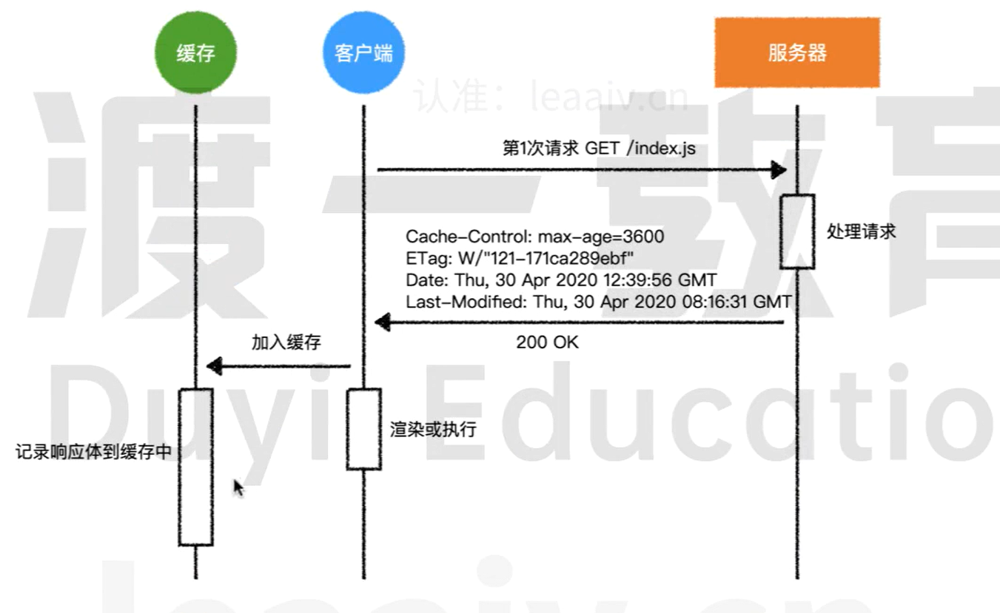

## 来自客户端的缓存指令

当客户端收拾好行李,准备再次请求`GET/index.js`时,它突然想起了一件事: 我需要的东西在不在缓存里呢?

此时,客户端会到缓存里去寻找是否有缓存的资源

寻找的过程如下:

1. 缓存中是否有匹配的请求方法和路径
2. 如果有,该缓存资源是否还有效呢?

以上两个验证会导致浏览器产生不同的行为

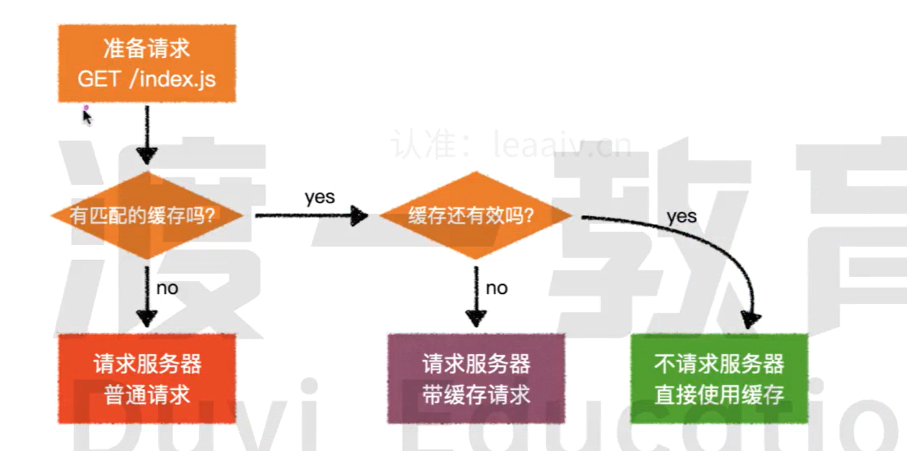

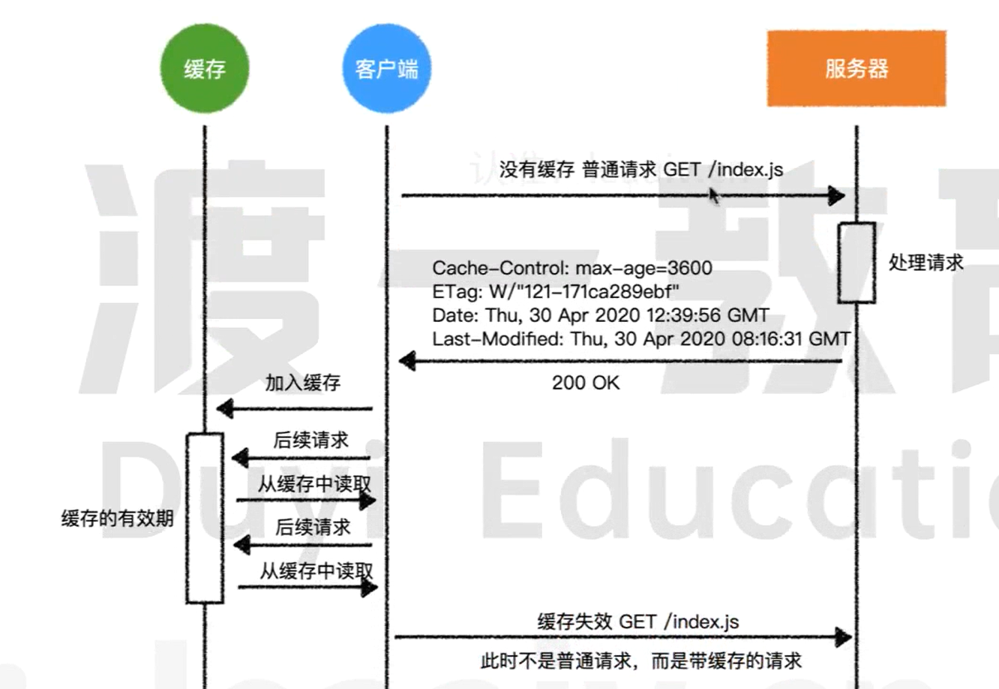

### 缓存有效

当浏览器发现缓存有效时,完全不会请求服务器,直接使用缓存即可得到结果.

此时,如果你断开网络,会发现资源仍然可用

这种情况会极大地降低服务器压力,但当服务器更改了资源后,浏览器是不知道的,只要缓存有效,他就会直接使用缓存

### 缓存无效

当浏览器发现缓存已经过期,它**并不会简单的把缓存删除**,而是抱着一丝希望,想问问服务器,我**这个缓存还能继续使用吗?**

于是,浏览器向服务器发出了一个**带缓存的请求**,又称之为**协商缓存请求**

所谓带缓存的请求,无非就是加入了以下的请求头:

```http
If-Modified-Since: Thu, 30 Apr 2020 08:16:31 GMT
IF-None-Match: W/"121-171ca289ebf"
```

他们表达了下面的信息;

- `If-Modified-Since: Thu, 30 Apr 2020 08:16:31 GMT`j:亲,你曾经告诉我,这个资源的上一次修改时间是格林威治时间`2020-04-30 08:16:31`,请问这个资源在这个时间之后还有发生变动吗?
- `If-Node-Match:W/"121-171ca289ebf"`,亲,你曾经告诉我,这个资源的编号是`W/"121-171ca289ebf"`请问这个资源的编号发生了变动吗?

其实,这两个问题可以合并为一个问题: 快说! 资源到底变了没有!

之所以要发两个消息,是为了兼容不同的服务器,因为有些服务器只认`If-Modified-Sinece`,有些服务器只认`If-None-Match`,有些服务器两个都认.

> 目前的很多服务器,只要发现`If-None-Match`存在,就不会去看`If-Modified-Since`,前者是`http/1.1`d的规范,后者是`http/1.0`的规范

此时,问题又抛给了服务器,接下来,就是服务器的表演时间了

服务器可能会产生两个情况: 

- 缓存已经失效
- 缓存仍然有效

如果是**缓存已经失效**,那么非常简单,服务器再次给予一个正常的响应(响应码`200`带响应体),同时可以附带上新的缓存指令,这就回到了上一节,来自服务器的缓存指令

这样一来,客户端就会缓存新的内容.

但如果服务器觉得**缓存仍然有效**,它可以通过一种极其简单的方式告诉客户端:

- 响应码为`304 Not Modified`
- 无响应体
- 响应头带上新的缓存指令,见上一节

这样一来,就相当于告诉客户端: '你的缓存资源仍然可用,我给你一个新的缓存时间,你那边更新一下就可以了'

于是,客户端就继续happy的使用缓存了.

这样一来,可以最大程度的减少网络传输,因为如果资源还有效,服务器就不会传输消息体

他们的完整交互过程如下

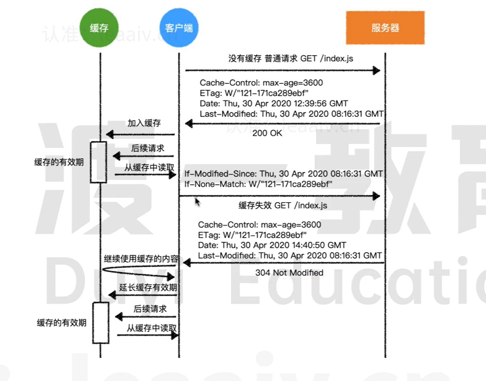

## 细节

上面描述了客户端缓存的基本概念和过程

但起重工仍然有不少细节值得我们注意

### Cache-Control

在上述讲解中,`Cache-Control`是服务器想客户端响应的一个消息头,它提供了一个`max-age`用于指定缓存时间.

实际上,`Cache-Control`还可以设置下面一个或多个值

- public: 只是服务器资源是公开的.比如有一个页面资源,所有人看到的都是一样的.这个值对于浏览器而言就没有什么意义.但可能在某些场景可能有用.本着`我告知,你随意`的原则,`http`协议中很多时候都是客户端或服务器告诉另一端详细信息,至于另一端用不用,完全看他自己.
- private: 只是服务器资源是私有的.比如有一个页面资源,每个用户看到的都不一样.这个值对于浏览器而言没有什么意义,但可能在某些场景有用.本着`我告知,你随意`的原则,`http`协议中很多时候都是客户端或服务器告诉另一端详细信息,至于另一端用不用,完全看他自己.
- `no-cache`:告知客户端,你可以缓存这个资源,但是**不要直接使用**它.当你缓存之后,.后续的每一次请求都需要附带缓存指令,让服务器告诉你这个资源有没有过期.见,来自客户端的缓存指令-缓存无效
- `no-store`:告诉客户端,不要对这个资源做任何的缓存,之后的每一次请求都按照正常的普通请求进行.若设置了这个值,浏览器不会对**该资源**做出任何缓存处理.
- `max-age`:有效时间

比如,`Cache-Control: public, max-age=3600`表示这是一个公开资源,请缓存1个小时.

### Expires

在`http/1.0`版本中,是通过`Expire`来指定过期时间点的,例如:

```http
Expires: Thu, 30 Apr 2020 23:38:38 GMT
```

到了`http/1.1`版本,已经更改为通过`Cache-Control`的`max-age`来记录了

### 记录缓存时的有效期

浏览器会按照市服务器响应头的要求,自动记录缓存到本地文件,并设置各种相关信息

在这些信息中,**有效期**尤为关键,它决定了这个缓存可以使用多久

浏览器会根据服务器的不同响应情况,设置不同的有效期.

具体的有效期设置,按照下面的流程进行

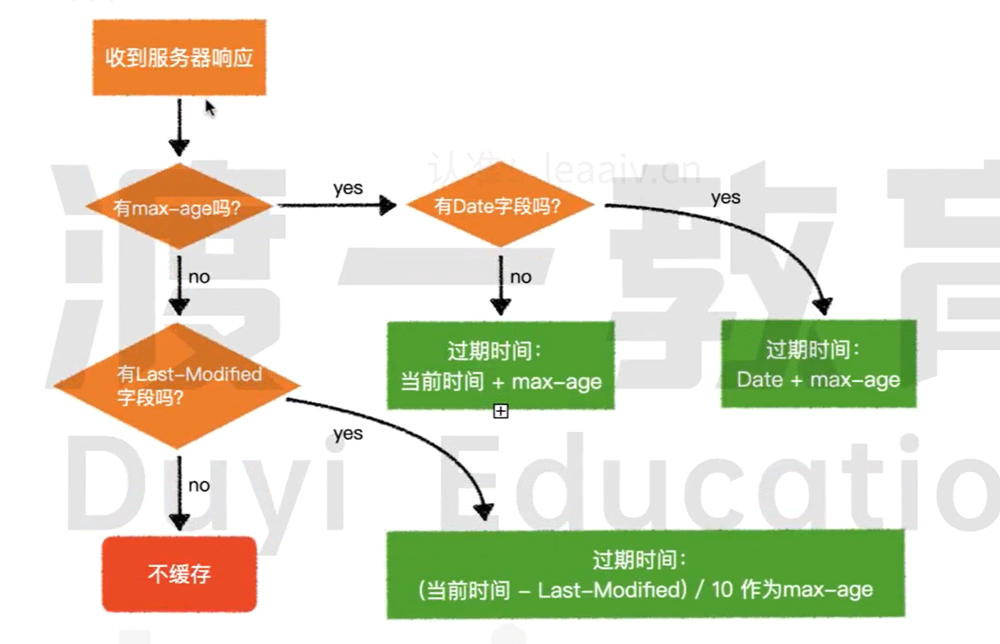

### Pragma

这是`http/1.0`版本的消息头

当该消息头出现在请求体中时,是向服务器表达: 不要考虑任何缓存,给我一个正常的结果.

在`http/1.1`版本中,可以在**请求头**中加入`Cache-Control: no-cache`实现相同的含义.

### Vary

有的时候,是否有缓存,不仅仅是判断请求方法和请求路径是否匹配,可能还有判断头部信息是否匹配

此时,就可以使用`Vary`字段来指定要区分的消息头

比如,当使用`GET/personal.html`请求服务器时,请求头中的`cookie`的值不一样,得到的页面也不一样

如果还按照之前的做法,仅仅匹配请求方法和请求路径,如果`cookie`有变动,你可能得到的仍然是之前的页面.

正确的做法如下:

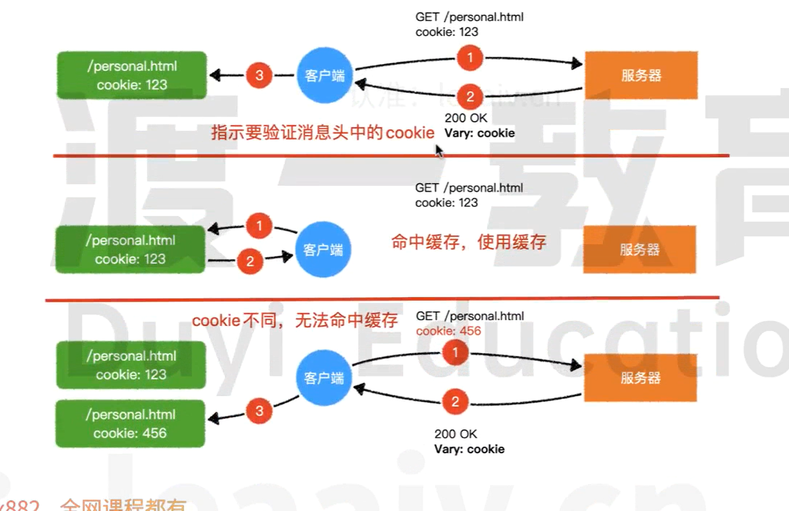

### 使用版本号或hash

如果你是一个前端工程师,使用过`vue`或其他基于`webpack`搭建的工程

你会发现打包的结果中很多文件名类似于这样

```
app.682976d8.css
```

文件的中间部分使用了`hash`值

这样做的好处是,可以让客户端大胆的,长时间的缓存该文件,减轻服务器的压力.

当文件改动后,它的文件`hash`值也会随之改变,比如变成了`app.446fcccb9.css`

这样一来,当客户端要请求新的文件时,就会发现路径从`/app.682976d8.css`变成了`app.446fcccb9.css`,由于之前的缓存路径无法匹配到,因此就会发送新的请求来获取新资源了.

以上是现代流行的做法.

而在古老的年代,构建工具还没有出现的时候,人们使用的办法是在资源路径后面加入版本号来获取新版本的文件

比如,页面中引入了一个css资源`app.css`,它可能得引入方式是

```html
<link href="/app.css?v=1.0.0">
```

这样一来,缓存的路径是`/app.css?v=1.0.0`

当服务器的版本发生变化的时候,可以基于新的版本号,让html中的路径发生变动

```html
<link href="/app.css?v=1.0.1">
```

由于新的路径无法命中缓存,于是浏览器会发送新的普通请求.


## 总结

## 服务器视角

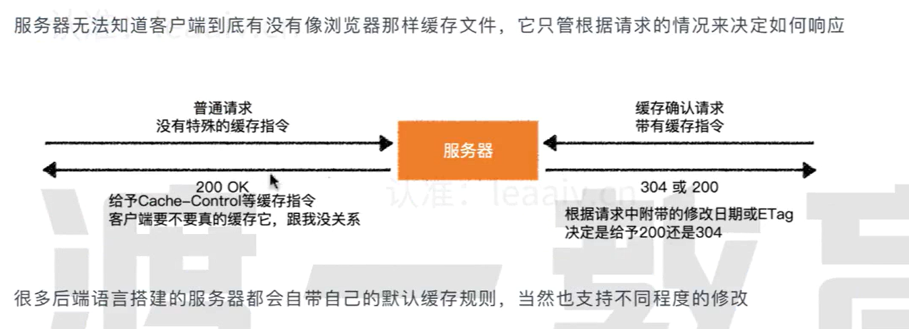

## 浏览器视角

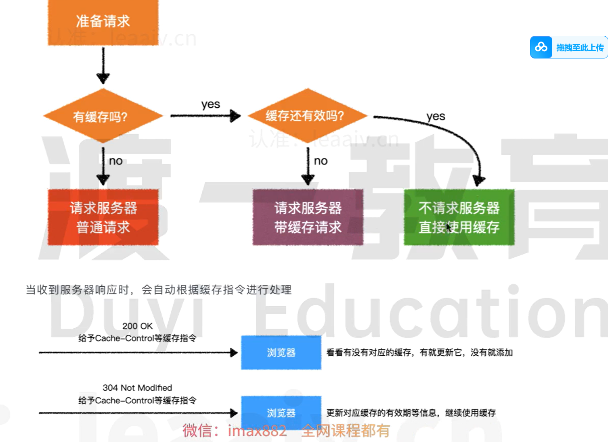

# TCP协议

## TCP收发数据流程

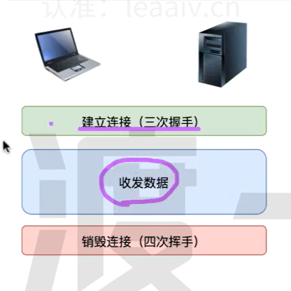

## TCP如何收发数据

### 分段发送

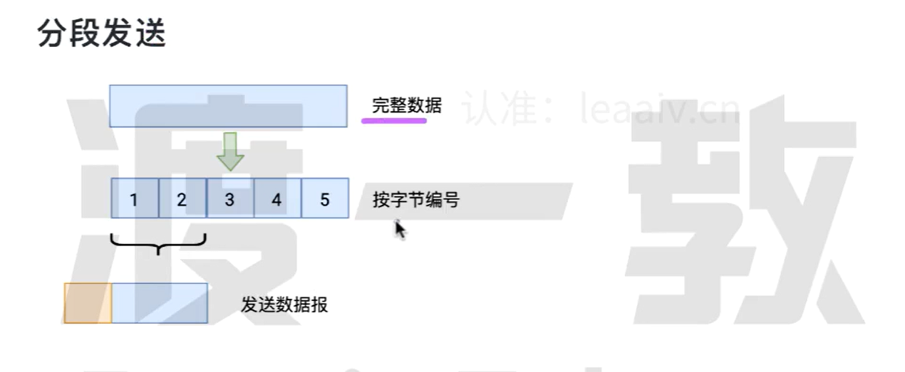

### 可靠传输

在TCP协议中，任何时候，任何一方都可以主动发送数据给另一方。

为了解决数据报丢失，数据报错乱等问题，TCP协议要求：**接收方收到数据报后，必须对数据报进行确认**

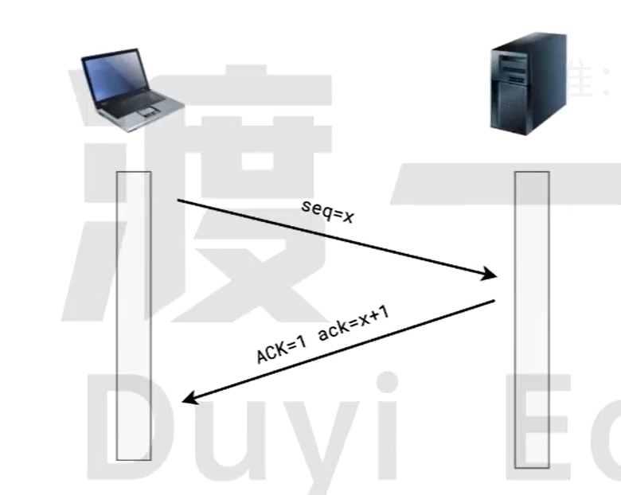

- seq： 表示这次数据报的序号
- ACK：表示这次数据报是一个确认的数据报
- ack： 表示期望下一次接收的数据报序号

发送发如果长时间没有收到确认数据报（ACK=1），则会判定丢失或者错误，然后重发

## 连接的建立(三次握手)

TCP协议要实现数据的收发，必须要先建立连接。

连接的本质就是双方各自开辟一块**内存空间**，空间中主要是数据缓冲区和一些变量

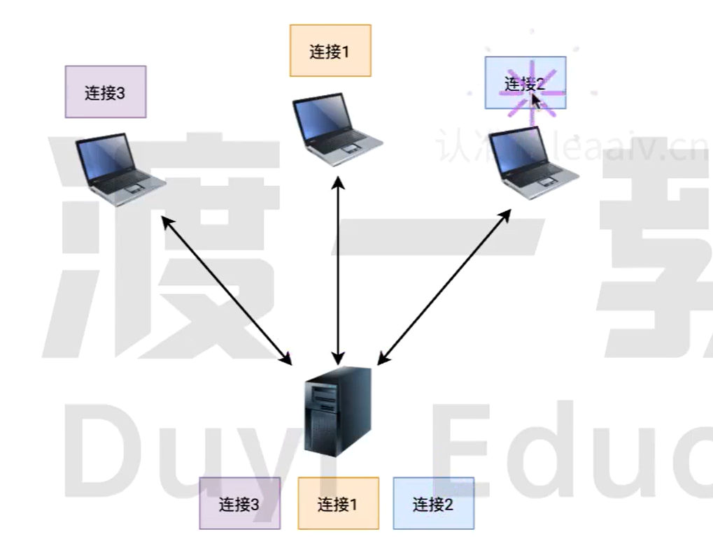

**连接建立的过程需要经过三次数据报传输，因此称之为三次握手**

> 开始
>
> 客户端: 我说话能听见吗?
>
> 服务器: 能听见,我说话能听见吗?
>
> 客户端: 能听见.
>
> 结束

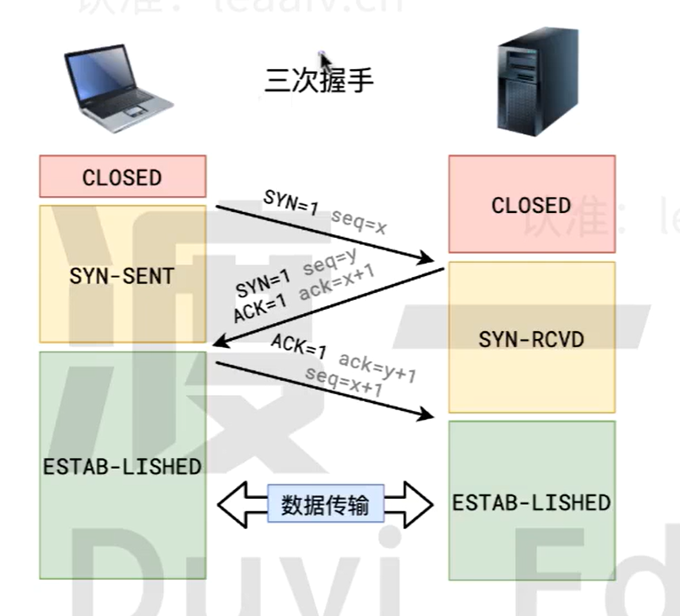

## 连接的销毁(四次挥手)

> 开始
>
> 客户端: 我说完了,挂了?
>
> 服务器: 我明白你说完了,但别忙挂,我还有话说
>
> 服务器继续说......
>
> 服务器: 我也说完了,挂了?
>
> 客户端: 好的!
>
> 结束

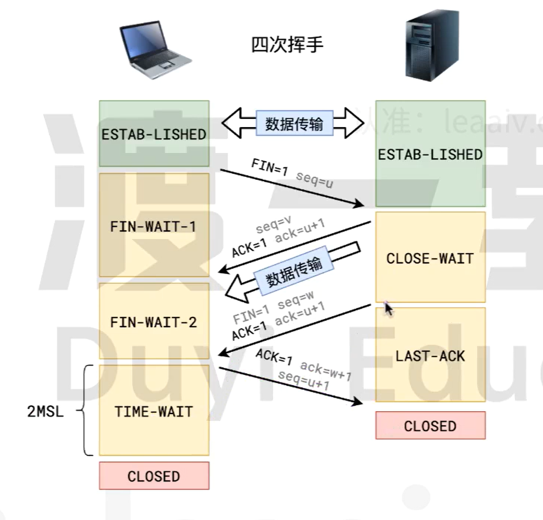

## HTTP和TCP的关系

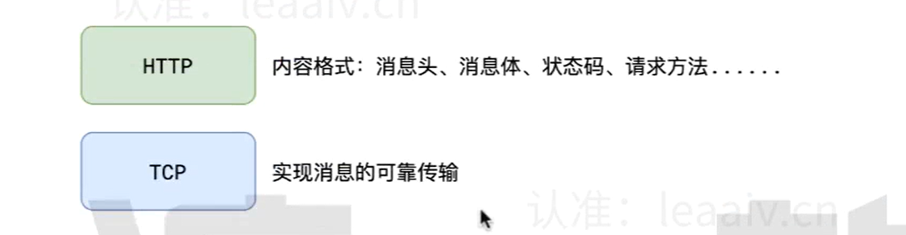

HTTP协议是对内容格式的规定,它**使用**了TCP协议完成消息的可靠差传输

在具体使用TCP协议时:

1. 客户端发消息给服务器叫请求,服务器发消息给客户端叫响应
2. 使用HTTP协议的服务器不会主动发消息给客户端(尽管TCP可以),只对请求进行响应.
3. 每一个HTTP请求-响应,都要先建立TCP连接(三次握手),然后完成请求-响应后,再销毁连接(四次挥手).这就导致每次请求-响应都是相互独立的,无法保持状态.

## 面试题

1. 简述TCP连接的过程

> 参考答案:
>
> TCP协议通过三次握手建立可靠的点对点连接,具体的过程是:
>
> 首先服务器进入监听状态,然后即可处理连接
>
> 第一次握手:建立连接时,客户端发送`syn`包到服务器,并进入`SYN_SET`状态,等待服务器的确认.在发送的包中还会包含一个初始序列号`seq`.此次握手的含义是客户端希望与服务器建立连接.
>
> 第二次握手: 服务器收到`syn`包,然后回应给客户端一个`SYN+ACK`包,此时服务器进入`SYN_RCVD`状态.此次握手的含义是回应客户端,表示已经接收并同意客户端的连接请求.
>
> 第三次握手: 客户端收到服务器的`SYN`包后,向服务器再次发送`ACK`包,并进入`ESTAB_LISHED`状态.
>
> 最后,服务端收到客户端的ACK包之后,也进入`ESTAB_LISHED`状态,至此,连接建立完成.

2. 谈谈你对TCP三次握手和四次挥手的理解

> TCP协议通过三次握手建立可靠的点对点连接具体过程是.
>
> 首先服务器进入监听状态,然后即可处理连接
>
> 第一次握手:建立连接时,客户端发送`syn`包到服务器,并进入`SYN_SET`状态,等待服务器的确认.在发送的包中还会包含一个初始序列号`seq`.此次握手的含义是客户端希望与服务器建立连接.
>
> 第二次握手: 服务器收到`syn`包,然后回应给客户端一个`SYN+ACK`包,此时服务器进入`SYN_RCVD`状态.此次握手的含义是回应客户端,表示已经接收并同意客户端的连接请求.
>
> 第三次握手: 客户端收到服务器的`SYN`包后,向服务器再次发送`ACK`包,并进入`ESTAB_LISHED`状态.
>
> 最后,服务端收到客户端的ACK包之后,也进入`ESTAB_LISHED`状态,至此,连接建立完成.
>
> 当需要关闭连接时,需要进行四次挥手才能关闭.
>
> 1. 客户端向服务器发送`FIN`包,表示客户端主动要关闭连接,然后进入`FIN_WAIT_1`状态,等待服务器返回`ACK包`.此后客户端不能再向服务器发送数据,但是能够读取数据.
> 2. 服务器收到`FIN`包后向客户端发送`ACK`包,然后进入`CLOSE_WAIT`状态,此后服务器不能再读取数据,但可以继续向客户端发送数据.
> 3. 客户端收到服务器返回的ACK包后进入`FIN_WAIT_2`状态,等待服务器发送`FIN`包.
> 4. 服务器完成数据的发送以后,将`FIN`包发送给客户端,进入`LAST_ACK`状态,等待客户端返回ACK包,此后,服务器既不能读取数据,也不能发送数据.

# CSRF攻击

CSRF(Cross-site request forgery, 跨站请求伪造).

它指攻击者利用了用户的身份信息,执行了**非用户本意**的操作.

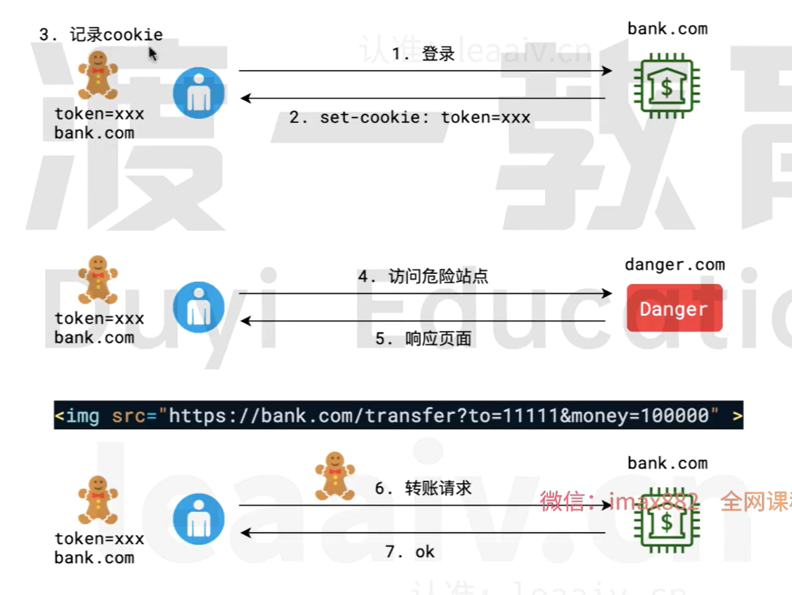

## 防御方式

| 防御手段                  | 防御力 | 问题                                     |
| ------------------------- | ------ | ---------------------------------------- |
| 不使用cookie              | 5星    | 兼容性略差<br />ssr会遇到困难,但可以解决 |
| 使用`sameSite=strict/Lax` | 4星    | 兼容性差<br />容易挡住自己人             |
| 使用`csrf token`          | 5星    | 获取到token后未进行操作仍然会被攻击      |
| 使用`referer`防护         | 2星    | 过去很常用,现在已经发现漏洞              |

## 面试题

介绍`CSRF`攻击

> CSRF(Cross Site Request Fogery),即跨站请求伪造,是一种挟制用户在当前已登录的Web应用上执行非本意的操作的攻击方法
>
> 它首先会引导用户访问一个危险网站,当用户访问网站后,网站会发送请求到被攻击的站点,这次请求会携带用户的cookie发送,因此就利用用户的身份信息完成攻击.
>
> 防御CSRF有多种攻击手段
>
> 1. 不使用cookie
> 2. 为表单添加校验的token校验
> 3. cookie中使用sameSite字段
> 4. 服务器检查referer字段

# XSS攻击

XSS(Cross Site Scripting, 跨站脚本攻击), 是指攻击者利用站点的漏洞,在表单提交时,在表单内容中加入一些恶意脚本,当其他正常用户浏览页面,而页面中刚好出现攻击者的恶意脚本时,脚本被执行,从而使得页面遭到破坏,或者用户信息别窃取.

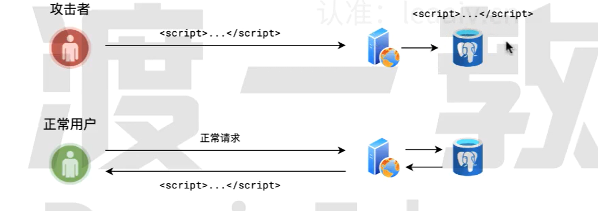

## 防御方式

服务器端对用户提交的内容进行过滤或编码

- 过滤: 去掉一些危险的标签,去掉一些危险的属性
- 编码: 对危险的标签进行HTML实体编码

## 面试题

介绍XSS攻击

> 参考答案:
>
> XSS(Cross Site Script)是指跨站脚本攻击.攻击者利用站点的漏洞,在表单提交时,在表单内容中加入一些恶意脚本,当其他用户正常浏览页面,而页面中刚好出现攻击者的恶意脚本时,脚本被执行, 从而使得页面遭到破坏,或这用户信息被窃取.
>
> 要防范XSS攻击,需要在服务器端过滤脚本代码,将一些危险的元素和属性去掉或者对元素进行HTML实体编码

# 网络性能优化

| 方法             | 说明                                                         | 备注 |
| ---------------- | ------------------------------------------------------------ | ---- |
| 优化打包体积     | 利用一些工具压缩,混淆最终代码,减少打包体积                   |      |
| 多目标打包       | 利用一些打包插件,针对不同的浏览器打包出不同的兼容性版本,这样一来,每个版本中的兼容性代码就会大大减少,从而减少包体积 |      |
| 压缩             | 现代浏览器普遍支持压缩格式,因此服务端的各种文件可以压缩后再响应给客户端,只要解压时间小于优化的传输时间,压缩就是可行的 |      |
| CDN              | 利用CDN可以大幅缩减静态资源的访问时间,特别是对于公共库的访问,可以使用知名的CDN资源,这样可以 |      |
| 缓存             | 对于除HTML外的所有静态资源均可以开启协商缓存,利用构建工具打包产生的文件hash值来置换缓存 |      |
| http2            | 开启http2之后,利用其多路复用,头部压缩等特点,充分利用带宽传递大量的文件数据 |      |
| 雪碧图           | 对于不使用http2的场景,可以将多个图片合并为雪碧图,以达到减少文件的目的 |      |
| defer,async      | 通过`defer`和`async`属性,可以让页面尽早加载js文件            |      |
| prefetch,preload | 通过`prefetch`属性可以让页面在空闲时预先下载其他页面可能会用到的资源,通过`preload`属性,可以让页面预先下载本页面可能要用到的资源 |      |
| 多个静态资源域   | 对于不使用HTTP2的场景,将相对独立的静态资源分到多个域中保存,可以让浏览器同时开启多个TCP连接,并行下载 |      |

# 断点续传

## 下载

若要实现下载时的断点续传,首先, 服务器在响应时,要在头中加入下面的字段

```
Accept-Ranges: bytes
```

这个字段是向客户端表明:我这个文件可以支持传输部分数据,你只需要告诉我你需要的是那一部分的数据即可,单位是字节.

此时,某些支持断点续传的客户端,比如迅雷,他就可以在请求时,告诉服务器需要的数据范围.具体做法是在请求头中加入下面的字段

```
range: bytes=0-5000
```

客户端告诉服务器,请给我传递0-5000字节范围内的数据即可,无须传输全部数据

完整流程如下

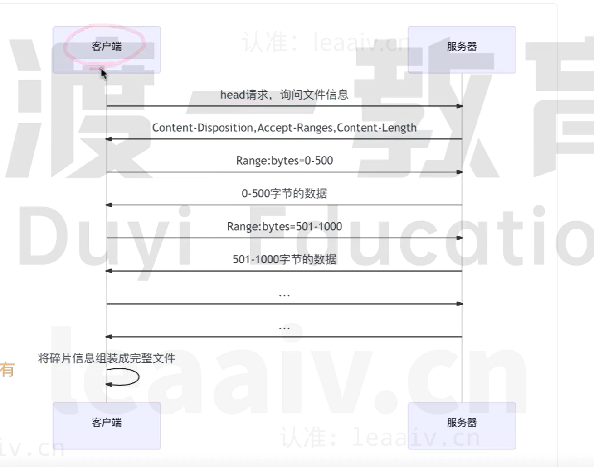

## 上传

整体来说,实现断点上传的主要思路就是把要上传的文件切分为多个小的数据块,然后进行上传

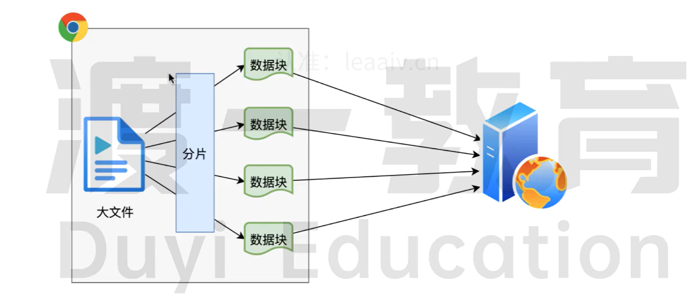

虽然分片上传的整体思路一致,但它没有一个统一的,具体的标准,因此需要根据具体的业务场景制定自己的标准.

由于标准不同,这也就意味着分片上传需要自行编写代码实现.

下面用一种极其简易的流程实现分片上传.

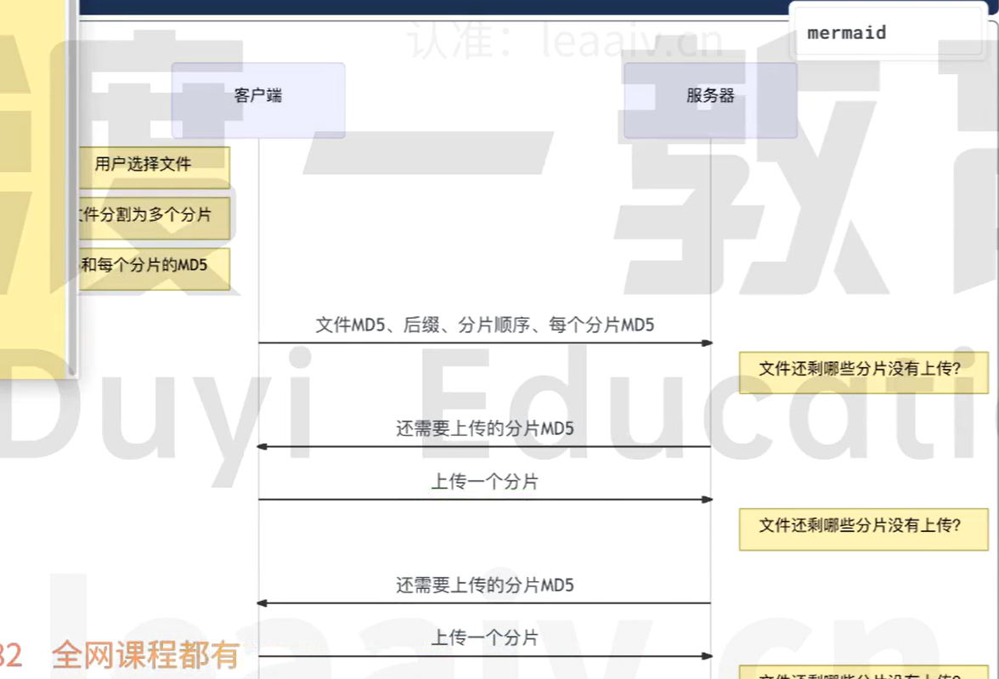

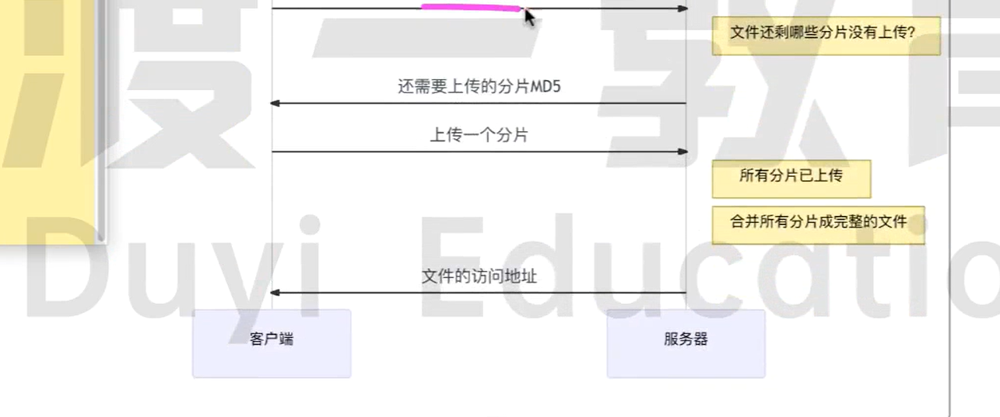

# 域名和DNS

## 域名

域名的作用是帮助人类记忆网站的地址,有了域名,就不用去记IP地址了.

域名的类型有以下几种

- 根域名: `.`
- 顶级域名:`.cn .com .net .us .uk .org   ...`
- 二级域名: `.com .gov .org .edu 自定义`
- 三级域名: `自定义 www.baidu.com www.jd.com www.taobao.com`
- 四级域名: `自定义 www.pku.edu.cn mail.internal.jd.com`

一般来说,购买二级域名后,三级,四级域名都是可以用免费自定义的.

## DNS

域名虽然有助于记忆,但是网络传输和域名没有半毛钱关系.

**网络传输必须依靠IP**

所以,必须有一个东西,能够将域名转换成IP地址,这个东西就是DNS服务器,翻译成IP地址的过程称为**域名解析**

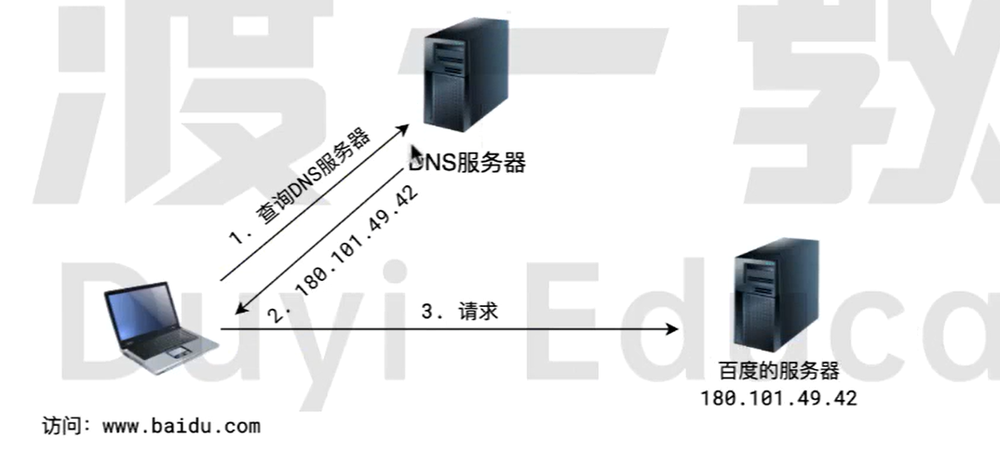

全世界认可的DNS服务器一共有三种,外加一种局部使用的本地DNS服务器,一共四种

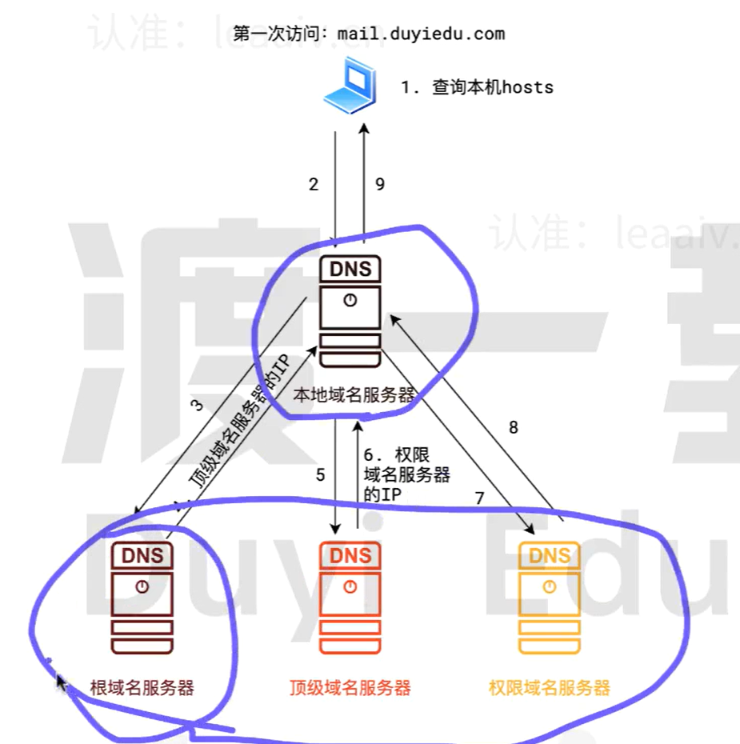

为了使得解析的过程更快,查询节点更少,上述每个节点都可能设置告诉缓存来加速解析.

## 面试题

请简述域名解析过程

> 参考答案
>
> 1. 查找本机host文件中是否有解析记录,如果有,直接使用
> 2. 查找本地的域名服务器中是否有解析记录,如果有,直接使用
> 3. 查询根域名服务器,得到顶级域名服务器的ip
> 4. 查询顶级域名服务器中是否有解析记录,如果有,直接使用,否则,返回权限域名服务器的ip
> 5. 根据顶级域名服务器反馈的ip,查询权限域名服务器,如果有解析记录,直接使用
> 6. 如果以上都找不到,域名解析失败
>
> 本机和域名服务器一般都会有高速缓存,它存在的目的是为了减少查询次数和时间

# SSL, TLS, HTTPS

# HTTP各版本的差异

- 0.9
- 1.0
- 1.1
- 2.0

## HTTP1.0

### 无法复用连接

HTTP1.0为每个请求单独开一个TCP连接

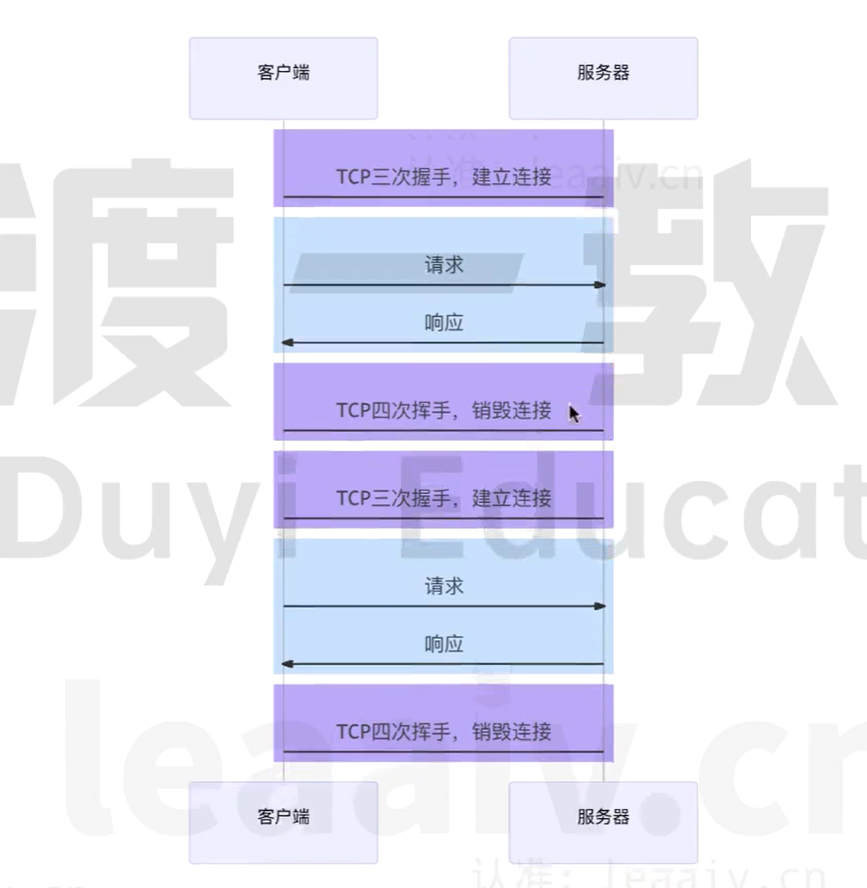

由于每个请求都是独立的连接,因此会带来下面的问题:

1. 连接的建立和销毁都会占用服务器和客户端的资源,造成内存资源的浪费
2. 连接的建立和销毁都会消耗时间,造成响应的浪费
3. 无法充分利用带宽,造成带宽资源的浪费

> TCP协议的特点是**慢启动**,即一开始传输的数据量少,一段时间之后达到传输的峰值.而上面的这种做法,会导致大量的请求在TCP达到传输峰值前就被销毁了

### 队头堵塞

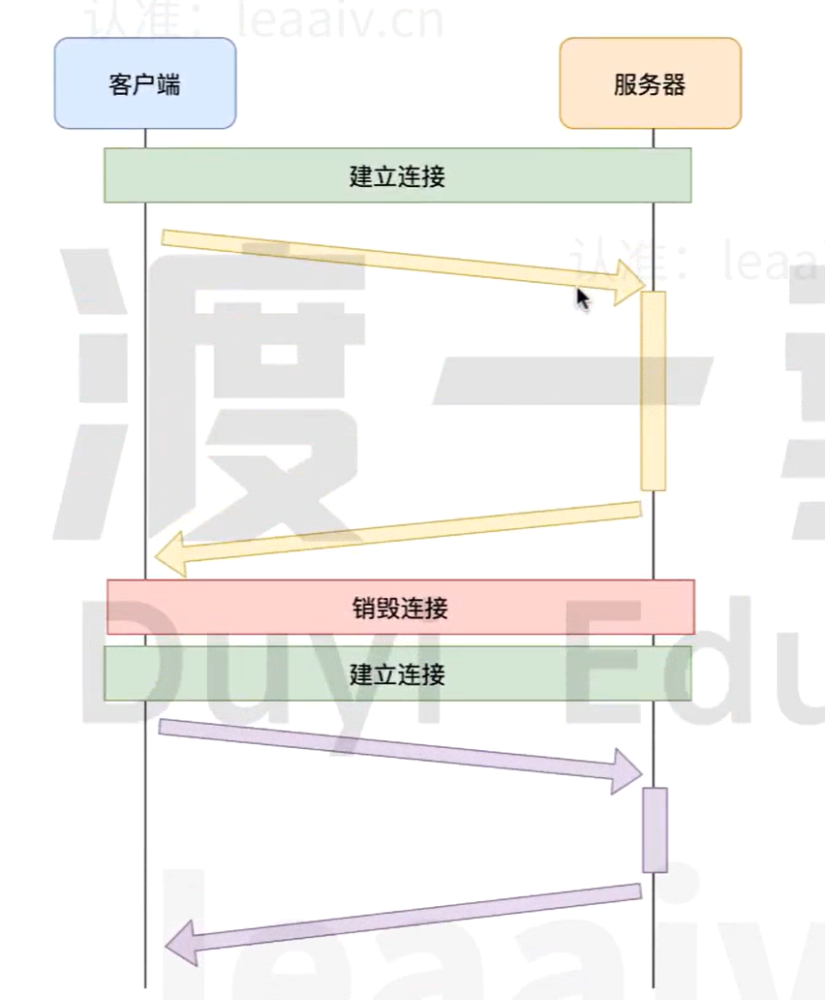

## HTTP1.1

### 长连接

为了解决HTTP1.0的问题,**HTTP1.1默认开启长连接**,即让同一个TCP连接服务于多个请求-响应.

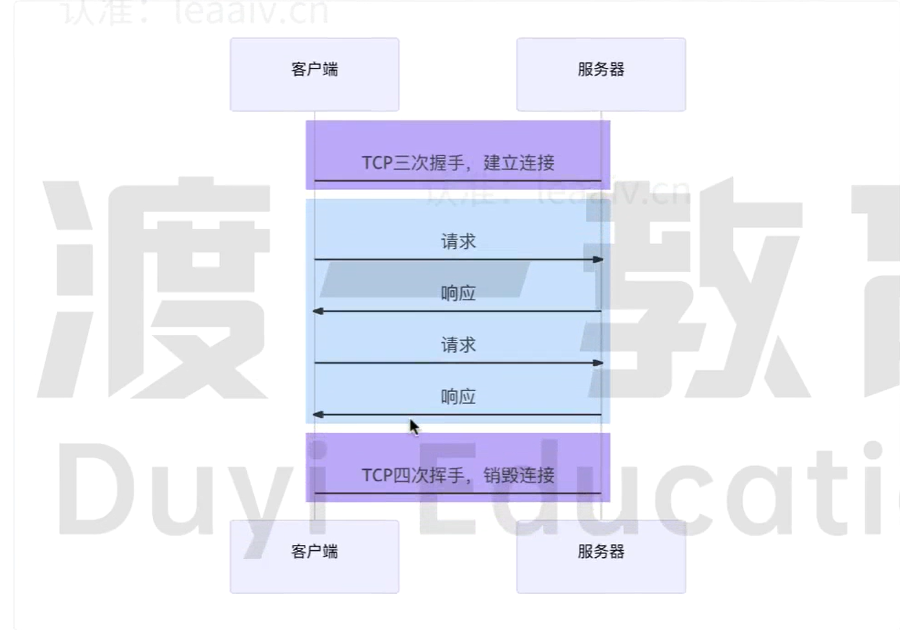

在这种情况下,多次请求响应可以共享一个TCP连接,这不仅减少了TCP的握手和挥手时间,同时可以充分利用TCP**慢启动**的特点,有效的利用带宽

> 实际上, 在HTTP1.0后期,虽然没有官方标准,但开发者们慢慢形成了一个共识:
>
> 只要请求头中包含**Connection:keep-alive**,就表示客户端希望开启长连接,希望服务器响应后不要关闭TCP连接.如果服务器认可这一行为,即可保持TCP连接.

当需要的时候,任何一方都可以关闭TCP连接

> 扩展知识:
>
> 连接关闭的情况主要有三种
>
> 1. 客户端在某一次请求中设置了`Connection:close`,服务器收到此请求后,响应结束立即关闭TCP
> 2. 在没有请求时,客户端会不断对服务器进行心跳检测(一般每隔1s).一旦心跳检测停止,服务器立即关闭TCP
> 3. 当客户端长时间没有新的请求到达服务器,服务器会主动关闭TCP.运维人员可以设置该时间.

### 管道化和队头阻塞

HTTP1.1允许在响应到达之前发送下一个请求,这样可以大幅度缩减带宽限制时间.

但这样仍然存在**队头阻塞**问题.

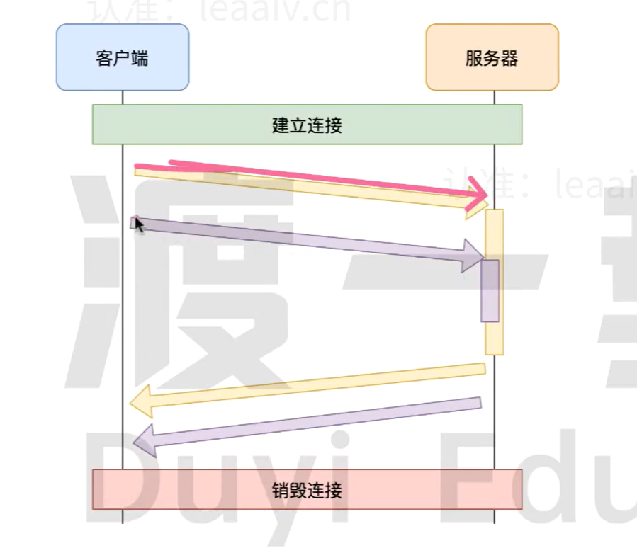

由于多个请求使用的是同一个TCP连接.**服务器必须按照请求到达的顺序进行响应**

> 想一想,为什么?

于是导致了一些后发出的请求,无法在处理完成后相应,产生了等待时间,而这段时间的带宽可能是空闲的,这就造成了带宽的浪费.

队头阻塞虽然**发生在服务器**,但这个问题的根源是客户端无法知晓服务器的响应是针对哪个请求的.

正是由于存在队头阻塞,我们常常使用下面的手段进行优化;

- 减少文件数量,从而减少队头阻塞的几率
- 通过开辟多个TCP连接,实现真正的,有缺陷的并行传输

> 浏览器会根据情况,为打开的页面自动开启TCP连接,对于同一个域名的连接最多有6个
>
> 如果要突破这个限制,就需要把资源放到不同的域中.

然而,管道化并非一个成功的模型,它带来的队头阻塞造成非常多的问题,所以现代浏览器默认关闭这种模式.

## HTTP2.0

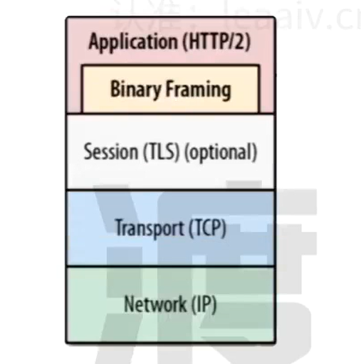

### 二进制分帧

HTTP2.0可以允许更小的单元传输数据,每个传输单元称之为**帧**,而每一个请求或响应的完整数据称之为**流**,每个流有自己的编号,每个帧会记录所属的流.

比如,服务器连续接到了客户端的两个请求,一个请求JS,一个请求CSS,两个问价如下:

```js
function a(){}
function b(){}
```

```css
.container{}
.list{}
```

最终形成的帧可能如下

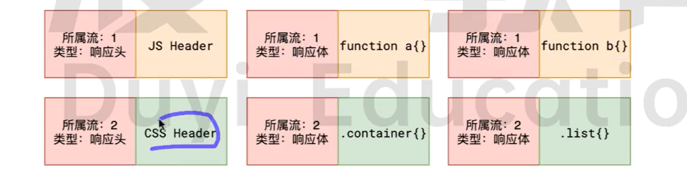

可以看出,每个帧都带了一个头部,记录了流的ID,这样做就能够准确的知道这一帧数据是属于哪一个流的.

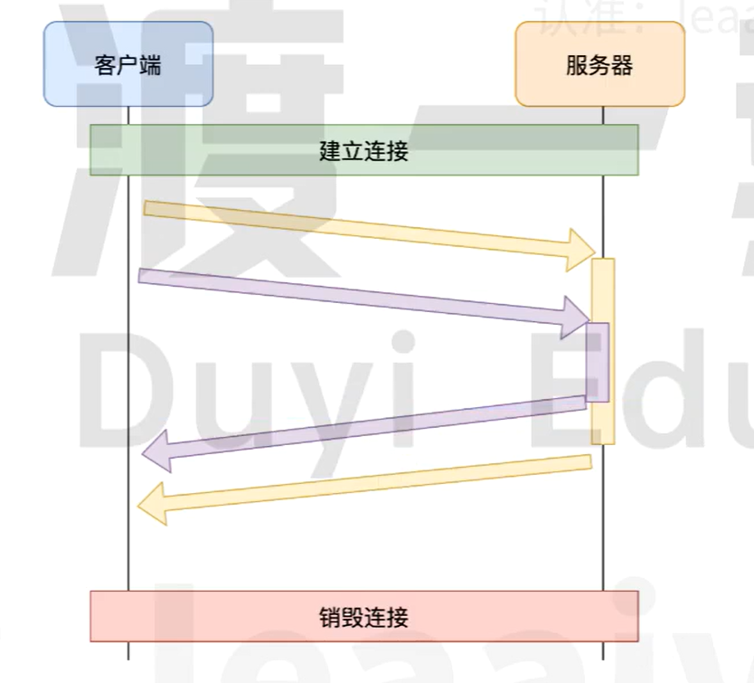

这样就真正的解决了共享TCP连接时的队头阻塞问题,实现了真正的**多路复用**

不仅如此,由于传输时是以**帧**为单元进行传输的.无论是响应还是请求,都可以实现并发处理,即不同的传输可以交替进行.

由于进行了分帧,还可以设置传输的优先级.

### 头部压缩

HTTP2.0之前,所有的消息头都是以字符的形式完整传输的.

可实际上,大部分头部消息都有很多的重复

为了解决这一问题,HTTP2.0使用头部压缩来减少消息头的体积.

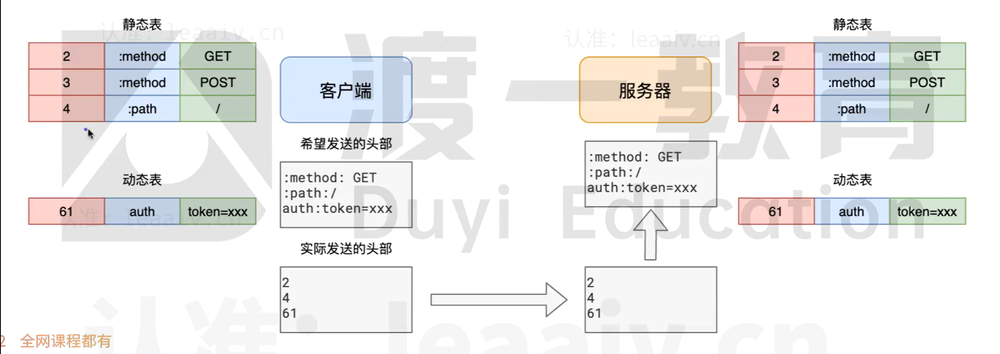

对于两张表都没有的头部,则使用哈夫曼编码压缩后进行传输,同时添加到动态表中.

### 服务器推

HTTP2.0允许在客户端没有主动请求的情况下,服务器预先把资源推送给客户端.

当客户端后续需要请求该资源时,则自动从之前推送的资源中寻找.

## 面试题

1. 介绍下`http1.0`,`http1.1`,`http2.0`协议的区别

> 参考答案:
>
> 首先说 http1.0
>
> 它的特点是每次请求和响应完毕后都会销毁TCP连接,同时规定前一个响应完成后,才能发送下一个请求.这样做有两个问题:
>
> 1. 无法复用连接
>
>    每次请求都要创建新的TCP连接,完成三次握手和四次挥手,网络利用率低
>
> 2. 队头阻塞
>
>    如果前一个请求被某种原因阻塞了,会导致后续请求无法发送.
>
> 然后是http1.1
>
> http1.1是http1.0的改进版,它做出了以下改进:
>
> 1. 长连接
>
>    http1.1允许在请求时添加请求头`connection:keep-alive`,这样便允许后续的客户端请求在一段时间之内复用之前的TCP连接
>    
> 2. 管道化
>
>    基于长连接的基础,管道化可以不等第一个响应继续发送后面的请求,但响应顺序还是按照请求的顺序返回.
>
> 3. 缓存处理
>
>    新增响应头`cache-control`,用于实现客户端缓存.
>
> 4. 断点续传
>
>    在上传/下载资源时,如果资源过大,将其分割为多个部分,分别上传/下载,如果遇到网络故障,可以从已经上传/下载好的地方继续请求,不用从头开始,提高效率
>
> 最后是http2.0
>
> http2.0进一步优化了传输效率,它主要有以下改进
>
> 1. 二进制分帧
>
>    将传输的消息分为更小的二进制帧,每帧有自己的标识序号,即使被随意打乱也能在另一端正确组装.
>
> 2. 多路复用
>
>    基于二进制分帧,同一域名下所有访问都是从一个tcp连接中走,并且不再有队头阻塞的问题,也无须遵守响应顺序
>
> 3. 头部压缩
>
>    http2.0通过字典的形式,将头部中的常见信息替换为更少的字符,极大的减少了头部的数据量,从而实现更小的传输量
>
> 4. 服务器推
>
>    http2.0允许服务器直接推送消息给客户端,无须客户端明确的请求

2. 为什么http1.1不能实现多路复用?

> 参考答案:
>
> HTTP/1.1的传输单元是整个响应报文,因此接收方必须按序接收完所有的内容后才能接收下一个传输单元,否则就会造成混乱.而HTTP2.0的传输单元更小,是一个二进制帧,而且每个帧有针对所属流的编号,这样即便不同的流交替传输,也很容易区分出每个帧是属于哪个流的.

3. 简单讲解一下http2.0的多路复用

> 在HTTP/2.0中,有两个非常重要的概念,分别是帧(frame)和流(stream).帧代表着最小的数据单位,每个帧会标识出该帧属于哪个流,流也就是多个帧组成的数据流.多路复用,就是在一个tcp连接中可以存在多条流.换句话说,也就是可以发送多个请求,对端可以通过帧中的标识知道属于哪个请求.通过这个技术,可以避免HTTP旧版本中的队头堵塞问题,极大地提高传输性能

4. http/1.1 是如何复用TCP连接的

> 客户端请求服务器时,通过请求行告诉服务器使用的协议是http1.1,同时在请求头中附带`connection:keep-alive`(为保持兼容),告诉服务器这是一个长连接,后续请求可以重复使用这一次的TCP连接.
>
> 这样做的好处是减少了三次握手和四次挥手的次数,一定程度上提升了网络的利用率.但由于HTTP/1.1不支持多路复用,响应顺序必须按照请求顺序抵达客户端,不能真正实现并行传输,因此在HTTP2.0出现之前,实际项目中往往把静态资源,比如图片,分发到不同的域名下的服务器,以便实现真正的并行传输.

5. HTTP/1.0, HTTP/2.0, HTTP/3.0之间的区别

> 参考答案
>
> http3.0
>
> http3.0目前还在草案阶段,它完全抛弃了TCP协议,转而使用UDP协议,是为了进一步提升性能,.
>
> 虽然HTTP/2.0进行了大量的优化,但它无法摆脱TCP协议本身的问题,比如建立连接时间长,队头阻塞问题等.
>
> 为了保证传输的可靠性,http3.0使用了QUIC协议.

# WebSocket

## 实时场景旧的处理方案

考虑网页中的以下场景:

- 股票K线图
- 聊天
- 警报,重要通知
- 余座
- 抢购页面的库存
- ....

上述场景有一个共同特点---**实时性**

这种对实时性有要求的页面,会带来一些问题

比如下面的聊天场景.

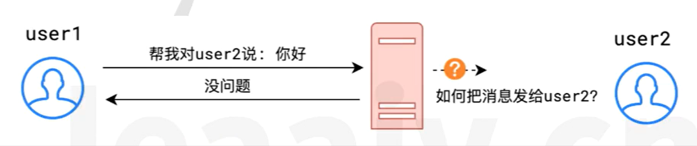

由于HTTP协议是请求-响应模式,请求必须在前,响应必须在后,这就导致了服务器无法**主动**的把消息告诉客户端

开发者想了很多办法来解决这一问题

当然终极解决方案是WebSocket,但了解一些过去的做法,参观前辈们经历的痛苦还是有益的.

### 短轮询short polling

短轮询是一种**话痨式**的方式

客户端每隔一小段时间就向服务器请求一次,询问有没有新消息

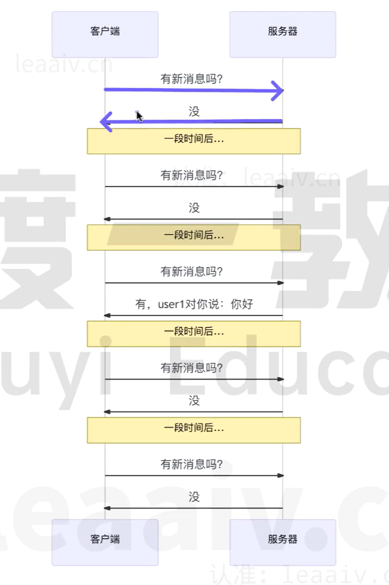

实时短轮询是非常简单的,客户端只需要设置一个定时器不断发送请求即可

这种方案的缺陷是非常明显的

- 会产生大量无意义的请求
- 会频繁的打开关闭连接
- 实时性并不高

### 长轮询 long polling

我们的前辈在有限的条件下,充分发挥智慧,来解决短轮询问题,于是演化为**长轮询.**

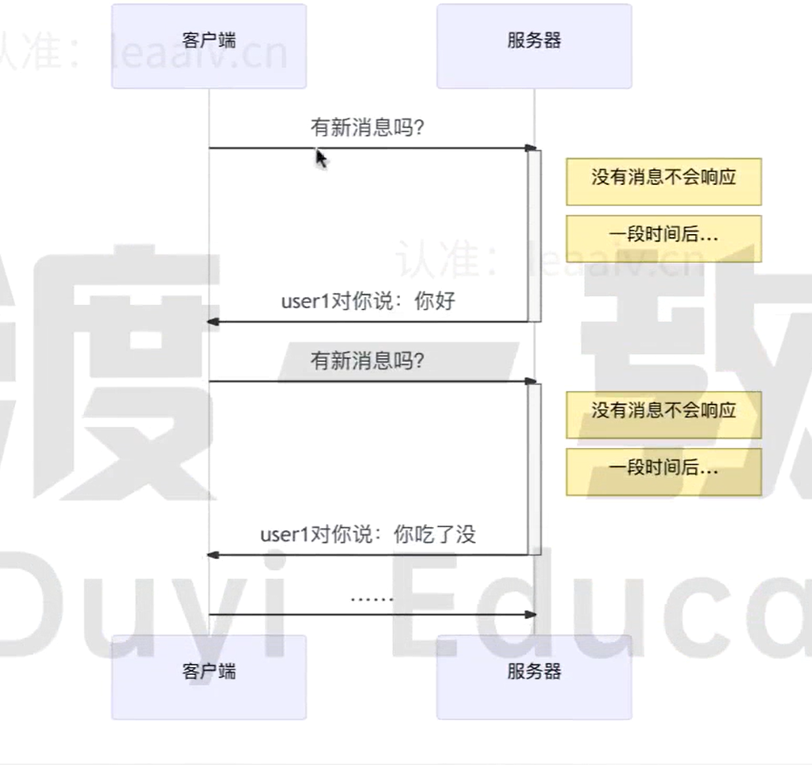

长轮询有效地解决了**话痨问题**,让每一次请求和响应都是有意义的

但长轮询仍然存在问题

- 客户端长时间收不到响应会导致超时,从而主动断开和服务器连接.

> 这种情况是可以处理的,但ajax请求是因为超时而结束,立即重新发送请求到服务器.
>
> 虽然这种做法会让之前的请求变得无意义,但毕竟比短轮询好多了

- 由于客户端可能**过早**的请求了服务器,服务器不得不挂起这个请求直到新消息的出现.这会让服务器长时间的占用资源却没有什么事情可以做.


## WebSocket

伴随着HTML5出现的WebSocket,从协议上赋予了服务器主动推送消息的能力.

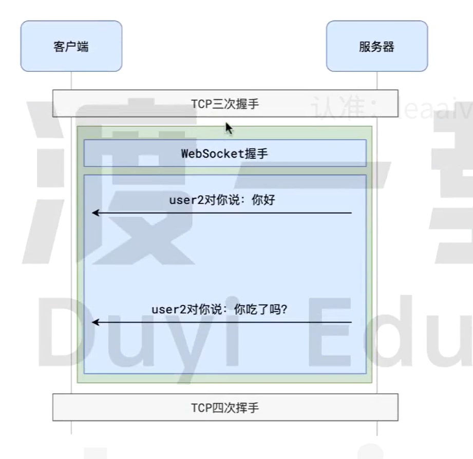

从上图可以看出

- WebSocket也是建立在TCP协议之上的,利用的是TCP全双工通信的能力
- 使用WebSocket,会经历两个阶段,握手阶段,通信阶段

虽然优于轮询方案,但WebSocket仍然是有缺点的:

- 兼容性: WebSocket是HTML5新增的内容,因此古董版本的浏览器都不支持
- 维持TCP连接需要耗费资源

对于那些消息量少的场景,维持TCP连接需要耗费资源

> 为了充分利用TCP连接的资源,在使用了WebSocket的页面,可以放弃ajax,都用WebSocket进行通信,当然这也会带来一些程序设计上的问题,需要权衡.

## 握手

> WebSocket协议是一个高扩展性的协议,详细的内容会比较复杂,这里仅讲解面试中会问到的握手协议.

当客户端需要和服务器使用WebSocket进行通信时,首先会使用**HTTP协议**完成一次特殊的请求-响应,这一次请求-响应就是**WebSocket握手**.

在握手阶段,首先由客户端向服务器发送一个请求,请求地址格式如下:

```
# 使用HTTP
ws://mysite.com/path
# 使用HTTPS
wss://mysite.com/path
```

请求头如下:

```
Connection: Upgrade	/* 嘿,后续咱们别用HTTP了,升级吧*/
Upgrade: websocket	/* 我们把后面的协议升级为websocket */
Sec-WebSocket-Version: 13 /* websocket协议版本就用13好吗? */
Sec-WebSocket-Key: YMJzZmFkZmFzzZmRhyw== /* 暗号: 天王盖地虎 */
```

服务器如果同意,就应该响应下面的信息

```
HTTP/1.1 101 Switching Protocals /* 换,马上换协议 */
Connetction: Upgrade /* 协议升级了 */
Upgrade: websocket /* 升级到WebSocket */
Sec-WebSocket-Accept:Zzijdsklfjkldsjflk /* 暗号:小鸡炖蘑菇 */
```

## 面试题

1. WebSocket协议是什么

> 参考答案: 
>
> websocket协议是HTML5带来的新协议,相对于http,它是一个持久性连接的协议,它利用http协议完成握手,然后通过TCP连接通道发送消息,使用websocket协议可以实现服务器主动推送消息
>
> 首先,客户端若要发起websocket连接,首先必须向服务器发送http请求以完成握手,请求行中的path需要使用`ws:`开头的地址,请求头中要分别加入`upgrade,connection, Sec-WebSocket-Key, Sec-WebSocket-Version`标记
>
> 然后,服务器收到请求后,发现这是一个`websocket`协议的握手请求,于是响应行中包含`Switching Protocols`,同时响应头中包含`upgrade, connection, Sec-WebSocket-Accept`标记
>
> 当客户端收到响应后即可完成握手,随后使用建立的TCP连接直接发送和接收消息

2. WebSocket与传统的http比有什么优势

> 参考答案
>
> 当页面中需要观察实时数据的变化(比如聊天,K线图)时,过去我们往往使用两种方式完成
>
> 一种是短轮询,即客户端每隔一段时间就向服务器发送消息,询问有没有新的数据.
>
> 第二种是长轮询,发起一次请求询问服务器,服务器可以将该请求挂起,等到有新消息时再进行响应.响应后,客户端立即又发起一次请求,重复整个流程.
>
> 无论是哪一种方式,都暴露了http协议的弱点,即响应必须在请求之后发生,服务器是被动的.无法主动推送消息,而客户端不断的发起请求又白白地占用了资源.
>
> websocket的出现就是为了解决这个问题,它利用http协议完成握手之后,就可以与服务器建立持久的连接,服务器可以在任何需要的时候,主动推送消息给客户端,这样占用的资源最少,同时实时性也最高.

3. 前端如何实现即时通讯

> 参考答案:
>
> 1. 短轮询:即客户端每隔一段时间就向服务器发送消息,询问有没有新的数据
> 2. 长轮询:发起一次请求询问服务器,服务器可以将该请求挂起,等到有新消息时再进行响应,响应后客户端立即又发起一次请求,重复整个流程
> 3. websocket,握手完毕后会建立持久性的连接通道,随后服务器可以在任何时候推送消息到客户端.

## 实例 

### WebSocket API

https://developer.mozilla.org/zh-CN/docs/Web/API/WebSocket/WebSocket

```js
const ws = new WebSocket('地址');			// 创建websocket连接,浏览器自动握手

// 事件: 握手完成后触发
ws.onopen = function() {
    console.log('连接到了服务器');
};

// 事件: 收到服务器发送的消息后触发
ws.onmessage = function(e) {
    console.log(e.data);		// e.data: 服务器发送的消息
}

// 事件: 连接关闭后触发
ws.onclose = function() {
    console.log('连接关闭了');
}

// 发送消息到服务器
ws.send(消息);
// 连接状态: 0-正在连接中, 1-已连接, 2-正在关闭中, 3-已关闭
ws.readyState
```

### Socket.io

> 官网: https://socket.io/

原生的接口虽然简单,但是实际应用中会造成很多麻烦

比如一个页面,既有K线,也有实时聊天,于是

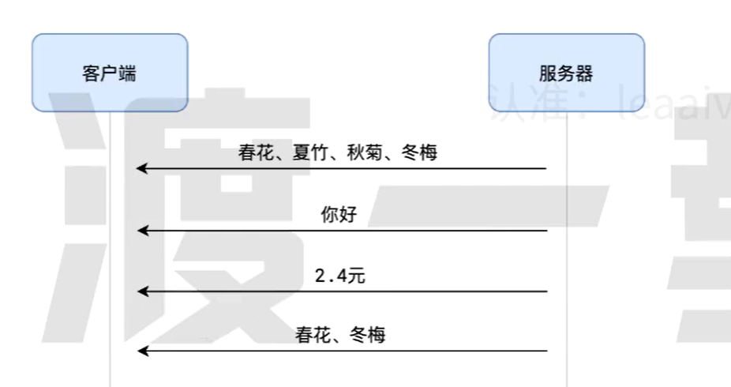

上图是一段时间中服务器给客户端推送消息的数据,你能区分这些数据都是什么意思吗?

这就是问题所在: 连接双方可以在任何时候发送任何类型的数据,另一方必须要清楚这个数据的含义是什么

> 回忆HTTP是如何处理这个问题的
>
> 你会如何解决这个问题

虽然我们可以自行解决这些问题,但毕竟麻烦

**Socket.io**帮助我们解决了这些问题,它把不同的消息放到不同的时间中,通过监听和触发事件来实现对不同消息的处理

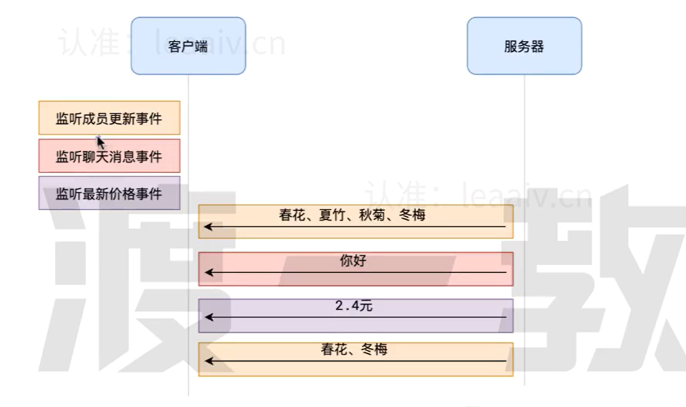

客户端和服务器双方事先约定好不同的事件,事件由谁监听,由谁触发,就可以把各种消息进行有序管理了.

**注意,Socket.io为了实现这些要求,对消息格式进行了特殊处理,因此如果一方要使用Socket.io,双方都必须要使用**

在客户端,使用Socket.io是非常简单的

参见: https://socket.io/docs/v4/client-installation/

> 在约定事件名是要注意,Socket.io有一些预定义的事件名,比如message,connect等,为了避免冲突,建议自定义时间使用一个特殊的前缀,比如`$`

> 除此之外,Socket.io对低版本的浏览器还进行了兼容处理
>
> 如果浏览器不支持WebSocket,Socket.io将使用长轮询(long polling)处理
>
> 另外,Socket.io还支持使用命名空间来进一步隔离业务,要了解这些高级功能,可以参阅其官方文档

