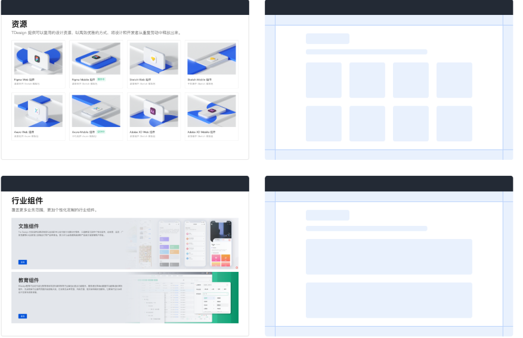

# 前言

最近在公司实习,有一个新的需求,需要把我们的 APP 的遮罩加载 loading 效果替换为骨架屏(`skeleton screen`)以提升用户体验.

原来在学习 uniapp 小程序开发的时候曾经使用过骨架屏这一技术,当时是利用微信小程序开发者工具直接生成的.

但是公司的 APP 的技术栈是 Flutter, 开发的是 Android 和 IOS 的应用,所以在技术实现上可能会略有不同.

为了总结记录骨架屏的相关知识和最佳实践,决定开一篇文章记录一下.

# 骨架屏的背景与意义

## 背景

骨架屏(`skeleton screen`)是指当网络较慢时，在页面真实数据加载之前，给用户展示出页面的**大致结构**。 一方面让用户对页面有一定的心理预期，另一方面可以改善长期停留在空白屏给用户带来的枯燥和不适感。它可以为用户提供更好**视觉效果**和**使用体验**。

## 技术边界

在学习新技术时,我们需要明确**技术是为了解决问题的**.所以在学习过程中,切不可盲目,必须要有明确的方向.

首先,便是**划定技术的边界**,也就是说,这个技术**到底是用来干什么的**.一旦明确了技术的边界,我们学习的过程就像有了前进的灯塔,不会迷茫而混乱.

在当前背景下,前端开发并没有类似`Java Spring`那样一统天下的最佳实践,所以导致前端的技术纷繁复杂,同样一个问题,解决的方案可能有非常多.这个时候更需要我们**划定技术的边界**.

比如在 css 工程化过程中遇到的问题: 类名冲突.随着工程越来越大,样式越来越多,类名经常会出现冲突的情况.为了解决这个问题,提出了很多方案,比如

- BEM,OOCSS,AMCSSD 等命名规范
- css in js 方案,用 js 的对象来表示 css 样式
- css module, 利用模块化处理

这些技术我可能很多没有学过,或者学过又忘了,但是无伤大雅.因为我一旦知道了这些技术到底在解决什么问题,他的所有技术实现细节跑不出如来佛的手掌心.技术具体的实现细节,当我们需要使用时,查阅相关文档即可解决.

回到骨架屏技术,它到底为了解决什么问题呢?

**页面加载时用户体验不佳**

在目前激烈的市场竞争环境下,用户体验的重要性在此不在赘述.造成页面加载体验不好的原因也有很多,用户设备,网速,前端页面处理等等.

为了解决这个问题,之前业界也使用过很多方案

- 白屏: 最开始就是直接白屏,用户体验非常糟糕
- 空内容站位: 显示一个空白框或"加载中"文字占位
  - 优点: 实现简单,占用资源少,无需复杂逻辑
  - 缺点: 空白框或文字与内容本身无直接关联,无法让用户直观感受到加载进度
- Loading 动画(Spinner 或进度条):显示一个旋转的圆圈之类的,告诉用户内容正在加载
  - 优点: 简单易实现,用户反馈明确,用户知道没有卡住,正在加载内容
  - 缺点: 缺乏页面结构感,无法让用户预期页面布局或内容结构,体验较生硬

于是,骨架屏技术应运而生.

# 骨架屏的设计与实现

由于公司技术栈原因,所以首先研究Flutter框架下骨架屏的使用.

至于Web端的骨架屏,三大公司的组件库(`T Design`,`Arco Design` `Ant Design`)都有封装好的最佳实践.

对于Flutter, T Design 有相关设计,可惜还没有更新骨架屏组件.

查阅相关资料文档可知,目前Flutter实现骨架屏主要有两个包`shimmer`和`skeletonizer`

[shimmer](https://pub.dev/packages/shimmer)

[skeletonizer](https://pub.dev/packages/skeletonizer)

详细内容见后面 [案例分享与实践经验](#5)

# 骨架屏的最佳实践

## 何时使用

- 网络较慢,需要长时间等待加载处理的情况下
- 图文信息内容较多的列表/卡片中
- 只在第一次加载数据的时候使用

## 何时不适用

- 当内容布局和排版**不固定**时,轮廓和内容布局之间会有**巨大差异**,使用骨架屏不仅不能给用户流畅体验和期待感,反而会造成落差
- 当内容区域有**空页面**时,不建议使用骨架屏,因为用户很容易误认为**空白页**是正在加载,从而造成困惑.
- 当加载时长低于1s时,不建议使用骨架屏,因为没有必要反而增加负担.当加载市场高于10s时,建议给出加载失败反馈和出口.

# 常见问题与解决方案

待更新

# 案例分享与实践经验

## shimmer Demo

## skeletonizer Demo

# 参考文档

[Ant Design 官网](https://ant.design/components/skeleton-cn)

[Arco Design 官网](https://arco.design/docs/spec/skeleton)

[T Design 官网](https://tdesign.tencent.com/vue/components/skeleton?tab=design)

[掘金文章:网页骨架屏自动生成方案（dps） ](https://juejin.cn/post/6844903893525069838)

[CSDN文章: flutter：占位视图（骨架屏、shimmer）](https://blog.csdn.net/weixin_41897680/article/details/132066134)

[华为云文章: 骨架化加载器](https://bbs.huaweicloud.com/blogs/415235)

[博客园文章: Flutter 实现骨架屏](https://www.cnblogs.com/hhsk/p/18442178)

