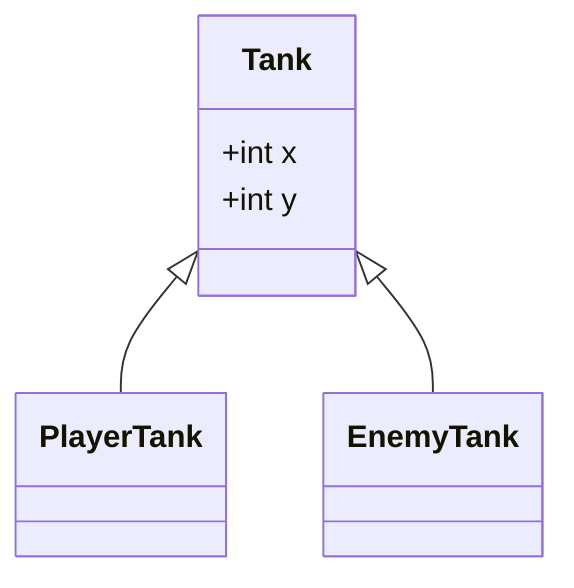
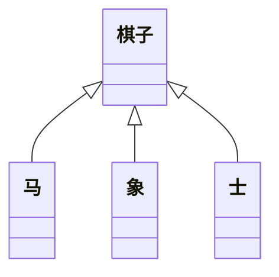

# JS语言的问题

- 使用了不存在的变量，函数或者成员
- 把一个不确定的类型当作确定的类型处理
- 访问null或undefined的成员

js的原罪

- js语言本身的特性，决定了该语言无法适应大型的复杂项目。
- 弱类型：某个变量，可以随时更换类型。
- 解释型：必须运行代码后才能知道错误，报错是在运行时。只要语法正确就可以运行，其他错误只有在运行时才会发现。

前端开发中，大部分时间都是在改bug。

# TypeScript概述

简称TS

TypeScript是JS的超集，是一个**可选的**，**静态的**类型系统。

- 类型系统：对代码中所有的标识符（变量，函数，参数，返回值）进行类型检查。
- 可选的
- 静态的：检查发生的时间是编译时，不是运行时，**TS**不参与运行时的任何类型检查。
无论是浏览器环境还是node环境，都无法直接执行TS。
babel: ES6->ES5
tsc： TS -> JS

TS的常识

- 2012年微软发布
- Anders Hejlsberg 负责开发TS项目
- 开源, 拥抱ES标准

**额外惊喜**

有了类型检查，增强了面向对象的开发。

JS中也有类和对象，js支持面向对象开发，但是没有类型检查。

# 在node中搭建TS开发环境

```bash
pnpm add -g typescript
```
默认情况下，TS会做出以下几种假设：

1. 加上当前执行环境为浏览器
2. 如果代码中没有使用模块化语句（import, export），便认为该代码是全局执行的。
3. 编译的目标代码是ES3

有两种方式改变以上假设：

1. 使用tsc命令行的时候，加上选项参数
2. 使用ts配置文件, 更改编译选项

# 基本类型约束

## 基本类型

> - number
> - string
> - booling
> - bigint
> - symbol
> - null
> - undefined


## 如何进行类型约束

变量，参数，函数的返回值加上`:类型`

TS具有类型推导功能，能根据上下文进行分析类型。

any: 可以是任意类型，不进行类型检查。

> 小技巧：如何区分数字字符串和数字，如果按照数字的方式去读，就是数字；否则是字符串

## 源代码和编译结果的差异

编译后就是JS代码，没有任何类型。

# 类型兼容性

B->A,如果能完成赋值，则B和A类型兼容

鸭子辨型法（子结构辨型法）：目标类型需要某一些特征，赋值的类型只需要满足该特征即可。

- 基本类型：完全匹配
- 对象类型：鸭子辨型法

当直接使用对象字面量进行赋值的时候，会执行更严格的类型检查。

- 函数类型

一切无比自然

函数重载

```ts
function combile(a: number, b: number): number;
function combile(a: string, b: string): string;

function combile(a: any, b: any) {
  if (typeof a === 'number' && typeof b === 'number') {
    return a + b;
  } else if (typeof a === 'string' && typeof b === 'string') {
    return a + b;
  }
  throw new Error('Invalid arguments');
}

const num = combile()
```

# 泛型

有时，书写某个函数时，会丢失一些类型信息（多个位置的类型应该保持一致或有关联的信息）

泛型： 是指附属于函数，类，接口，类型别名之上的类型

泛型相当于是一个类型变量，在定义时，无法预先知道具体的类型，可以用该变量来代替，只有到调用时，才能确定他的类型。

泛型也可以设置默认值。


## 在函数中使用泛型

在函数名之后写上`<泛型名称>`,通常是`<T>`

```ts
const myconsole = <T>(a: T, b: T): void => {
  console.log(a, b);
};

myconsole<number>(1, 2);
```

很多时候，TS会智能的根据传递的参数，推导出泛型的具体类型

如果无法完成推导，并且又没有传递具体的类型，默认为空对象类型

## 在类型别名，接口，类中使用泛型

在名称后面写上`<泛型>`.

```ts
type callback<T> = (n: T, i: number) => boolean;
```


# TS的配置文件

> 有了配置文件后，使用tsc进行编译时，不能跟上文件名，否则配置文件会被忽略，直接使用`tsc`命令即可。

可以直接在项目根目录下新建`tsconfig.json`或者使用`tsc --init`自动生成。

- `compilerOptions`: 编译选项
  - `target`: 编译目标的ES版本标准
  - `module`: 编译目标使用的模块化标准
  - `lib`: 代码运行环境，默认是浏览器环境
  - `outDir`: 输出目录
- `include`: 要编译的文件夹
- `files`: 要编译的具体文件

给lib配置为ES2016后，虽然没有了浏览器环境中的`window`,`document`等对象的干扰，但是我们需要的node环境中的`console`对象也没有了。

由于我们是node环境，但是ts没有给lib提供node环境，所以需要安装第三方库`@types/node`。

```bash
pnpm add @types/node
```
`@types`是ts官方的类型库，其中包含了很多对JS代码的描述


# TS中类

## 属性

使用属性列表来描述属性

**属性的初始化检查**

`strictPropertyInitialization:true`

属性的初始化位置：

1. 构造函数
2. 属性默认值

## 访问修饰符

访问修饰符可以控制类中的某个成员的访问权限

- public: 默认的访问修饰符，公开的，所有代码均可访问
- private：私有的，只有在类中可以访问
- protected：类和子类中可以访问

**属性简写**

```ts
class User {
  constructor(public name:string, public age:number, public sex: string) {}
  say(): string {
    return "hello";
  }
}
```

## 访问器

用于控制属性的读取和赋值

# 扩展类型和兼容性

扩展类型：类型别名，枚举，接口，类

## 类型别名


## 枚举

枚举：枚举通常用于约束某个变量的取值范围

字面量和联合类型配合使用，也可以达到相同的目标

> 字面量类型的问题
> 1. 在类型约束位置会出现重复代码（可以用通过类型别名来解决）
> 2. **逻辑名称**和**真实的值**产生了混淆，会导致修改真实值时会产生大量修改，比如'男' | '女' 修改为'帅哥' | '美女'
> 3. 字面量类型不会进入到编译结果

如何定义一个枚举：

```ts
enum myEnum {
  male = 1;
  female = 2;
}
```

枚举会出现在编译结果中，表现为对象。

枚举的规则

- 枚举的字段值可以是字符串或者数字
- 数字枚举的值会自动自增
- 被数字枚举约束的变量可以直接被赋值为数字
- 数字枚举的编译结果和字符串枚举不同，它会在结果对象中对枚举的键和值进行双向绑定

最佳实践

- 尽量不要在一个枚举中既出现字符串字段又出现数字字段
- 使用枚举时，尽量使用枚举字段的名称，而不是使用真实的值

```ts
enum myEnum {
  male = 1,
  female,
}

let a: myEnum;
a = 1;
```

## 接口

接口：用于约束类，对象，函数的契约（标准）

契约（标准）的形式：
- API文档，弱标准
- 代码约束，强标准

```ts
interface User {
  name: string;
  age: number;
}

const u: User = {
  name: 'sdfds',
  age: 33
}
```
`interface`和`type`有什么区别呢？

```ts
type User = {
  name: string;
  age: number;
}

const u: User = {
  name: 'sjdklfj',
  age: 33,
}
```

# 模块化

本节课相关的配置

|      配置名称       |              含义              |
| :-----------------: | :----------------------------: |
|       module        | 设置编译结果中使用的模块化标准 |
|  moduleResolution   |       设置解析模块的模式       |
| noImplicitUseStrict |  编译结果中不包含"use strict"  |
|   removeComments    |        编译结果移除注释        |
|    noEmitOnError    |      错误时不生成编译结果      |
|   esModuleInterop   |  启用ES模块化交互非ES模块导出  |

前端领域的模块化标准：CJS，ESM，UMD，ESNEXT

## TS中如何书写模块化标准

TS中，导入和导出模块，统一使用ES6的模块化标准。

- 注意不需要加文件后缀名`.ts`,因为编译后没有TS文件。


# 在React中使用TS


# TS基础部分总结

TypeScript是一个可选的，静态的类型系统

- 为什么需要类型系统：要构建大型的应用，会涉及大量的函数和接口，如果没有类型检查，会产生大量的调试成本。类型系统可以降低调试成本，从而降低开发成本。
- 可选的：TS是JS的超集。JS的所有功能都能够在TS中使用，增强的部分是类型系统
- 静态的：TS代码->编译->JS代码

## 如何约束类型

变量，参数，函数的返回值

- 基本类型：boolean, number, string, object, array, void, never, null, undefined
- 字面量类型：配合联合类型使用，达到类似枚举的效果(type gender = "男" | "女")
- 扩展类型：类型别名，枚举，接口，类


```ts
// 字面量类型
type gender = "男" | "女"

type User = {
  name: string;
  age: number;
}
```
类型别名，接口，编译后不存在

枚举和类编译后仍然存在

TS类： 属性列表，修饰符(readonly, 访问修饰符: public, private, protected)，访问器

泛型：解除某个功能和类型的耦合

类型断言： 开发者非常清楚某个东西的类型，但是TS难以分辨，开发者可以通过类型断言告知TS 

## 类型兼容性

- 基本类型：完全匹配
- 对象类型：鸭子辨型法，子结构辨型法，字面量对象直接传递时，会有**更严格的类型检查**
- 函数类型：回调函数中参数数量可以少，但不可以多。要求返回必须返回，不要求返回的情况下随意。

# TS进阶部分

## 声明文件

### 概述

1. 什么是声明文件？

以`.d.ts`结尾的文件

2. 声明文件有什么作用？

ts代码来读取js代码时，得不到类型声明。

3. 声明文件的位置

- 放置到`ts.config.json`文件中`include`字段的目录下
- 放置到`node_modules/@types`文件夹中
- 手动配置`ts.config.json`文件中的`typeRoots`字段
- 与JS代码所在目录相同，并且文件名也相同的文件

### 编写声明文件

1. 手动编写

- 对已有的库，它是使用JS书写而成的，并且改动该库的代码为TS的成本较高
- 对于第三方库，他们使用JS书写而成，并且这些第三方库没有提供声明文件，可以手动编写声明文件

**全局声明**

声明一些全局的对象，属性，变量

> `namespace`表示命名空间，可以将其认为是一个对象，命名空间中的内容，必须通过`命名空间.成员名`的方式来访问

**模块声明**

```ts
declare module "modulename" {
  export function chunk
}
```

**三斜线指令**

在一个声明文件中，包含另一个声明文件

```TS
/// <reference path="../../index.d.ts" />
```

1. 自动生成

工程使用TS来进行开发，在编译的时候加上`--declaration`（简写`-d`)即可生成对应的`.d.ts`文件。

也可以在`ts.config.json`文件中配置该字段为`true`。

在`ts.config.json`中配置`sourceMap`字段也可以生成源码地图。

## 深入理解类和接口

### 面向对象概述

#### 为什么要面向对象
1. TS为前端面向对象开发带来了契机。

JS语言没有类型检查，如果使用面向对象的方式进行开发，会产生大量的接口，而大量的接口会导致调用复杂度剧增，这种复杂度必须通过严格的类型检查来避免错误，尽管可以使用注释或文档或记忆力，但是他们没有强约束力。

TS带来了完整的类型系统，因此开发复杂程序时，无论接口数量有多少，都可以获得完整的类型检查，并且这种检查是具有强约束力的。

2. 面向对象中有许多非常成熟的模式，能处理复杂问题

在过去很多年中，在大型应用或复杂领域，面向对象已经积累了非常多的经验。

nestjs：相当于是前端的Java Spring
typeorm：ORM框架，比如mongoose，类似于C#

#### 什么是面向对象

面向对象：Oriented Object,简称OO。

- 是一种编程思想，它提出一切以对象为切入点思考问题。

其他编程思想：面向过程，函数式编程。

面向过程：以功能流程为思考切入点，不适合大型应用

函数式编程：以数学运算为思考切入点

面向对象：以划分类为思考切入点

类：可以产生对象的模板

#### 如何学习

1. TS中的OOP（面向对象编程， Oriented Object Programing）
2. 小游戏类型


## 类的继承

继承可以描述类与类之间的关系

> 坦克，玩家坦克，敌方坦克
> 玩家坦克是坦克，敌方坦克是坦克

如果A和B都是类，并且可以描述为A是B，那么A和B形成继承关系：

- B是父类，A是子类
- B派生A，A继承自B
- B是A的基类，A是B的派生类



### 重写成员

重写(override): 子类覆盖父类的方法和属性，但是不能改变类型

无论属性还是方法，子类都可以对父类进行重写，但是不能改变类型

注意this指向，指向调用者

在子类方法中可以使用`super`来读取父类成员

### 类型匹配

鸭子辨形法

子类的对象，始终可以赋值给父类

在面向对象中，叫做**里氏替换原则**

如果需要判断一个数据的具体子类型，可以使用`instanceof`

### 单根性和传递性

单根性：一个类只能有一个父类

传递性：A是B的父类，B是C的父类，那么A是C的父类

## 抽象类

抽象类：抽象类不能被实例化，只能被继承

### 为什么需要抽象类



有时，某个类表示一个抽象的概念，主要用于提取子类共有的成员，而不能直接实例化，该类可以作为抽象类。

给类前面加上一个`abastract`关键字，表示该类是抽象类。

### 抽象成员

父类中，可能知道有些成员是必须存在的，但是不知道该成员的值或实现是什么，因此，需要有一种强约束，让继承该类的子类，必须要实现该成员。

抽象类中，可以有抽象成员，普通类中，不能有抽象成员。

### 设计模式——模板模式

设计模式：面对一些常见的功能场景，有一些固定的，经过多年实践的成熟方法，这些方法称之为设计模式。

模板模式：有些方法，所有的子类实现流程完全一致，只是流程中的某个步骤的具体实现不一致，可以将该方法提取到父类，在父类中完成整个流程的实现，遇到实现不一致的方法时，将该方法做成抽象方法。

## 静态成员

静态成员是指，附着在类上的成员(属于某个构造函数而不是原型)

使用static修饰的成员，是静态成员

实例成员：对象成员，属于某个类的对象

静态成员：非实例成员，属于某个类

### 静态方法中的this

实例方法中的this指向的是**当前对象**

静态方法中的this指向的是**当前类**

### 设计模式——单例模式

单例模式：某些类的对象中，在系统中最多只能有一个，为了避免用户创建出来多个实例对象，可以使用单例模式进行强约束

```ts
class Board {
  width: number = 500;
  height: number = 500;

  init() {
    console.log("初始化棋盘");
  }

  private constructor() {}

  private static board: Board;

  static createBoard(): Board {
    if (!Board.board) {
      this.board = new Board();
    }
    return this.board;
  }
}
```

## 再谈接口

接口用于约束类，对象，函数，是一个类型约束。

> 有一个马戏团，马戏团中有很多动物，包括：狮子，老虎，猴子，狗，这些动物都具有共同的特征：名字，年龄，种类名称，还包含一个共同的方法：打招呼，他们各自有各自的技能，**技能是可以通过训练改变的。**
> 马戏团中有以下常见技能：
> - 火圈表演：单火圈，双火圈
> - 平衡表演：独木桥，走钢丝
> - 智慧表演：算术题，跳舞

不使用接口实现时：

- 对能力（成员函数）没有强约束力
- 容易将类型和能力耦合在一起

系统中缺少一种对能力的定义——接口

面向对象中的接口语义：表达了某个类是否具有某种能力

某个类具有某种能力，其实，就是实现了某种接口

### 类型守卫

```ts
// 自定义类型守卫
function isAnimal(obj: any): obj is IAnimal {
  return obj && 
         typeof obj.type === 'string' &&
         typeof obj.run === 'function';
}
```

## 索引器

`对象[值]`的类型检查

在TS中，默认情况下，不对索引器进行严格的类型检查

```ts
interface User {
  name: string;
  age: number;
  // 下面的设置会对所有的成员进行限制
  [prop: string]: any;
}

const user: User = {
  name: 'Joe',
  age: 20
};

console.log(user['bo'])
```

隐式any：TS根据实际情况推导出的`any`类型。

在类中，索引器的位置应该是所有成员之前

TS中索引器的作用：

- 在严格的检查下，可以实现为类动态添加成员
- 可以实现动态的操作类成员对象

在JS中，所有的成员名字本质上，都是字符串，如果使用数字作为成员名称，会在底层自动转换为字符串。

## 类型演算

根据已知的信息，计算出新的类型

### 三个关键字

- typeof

TS中的typeof，书写在类型约束的位置上。

表示获取某个数据的类型。

当typeof作用与类的时候，得到的类型是该类的构造函数。

```ts
class User {
  name: string;
  age: number;
}
// 传入构造函数来新建一个对象
function createUser(cls: typeof User): User {
  return new cls();
}

const u = createUser(User);
```

- keyof

作用与类，接口，类型别名，用于获取其他类型中的所有成员名组成的联合类型

```ts
interface User {
  id: number;
  loginpwd: string;
}

function printUserProperty(obj: User, prop: string) {
  console.log(obj[prop])
}
```

- in

该关键字往往和`keyof`联合使用，限制某个索引类型的取值范围。

```ts
interface User {
  id: number;
  age: number;
}
type Obj = {
  readonly [p in keyof User]: User[p]
}

const u: Obj = {
  id: 1,
  age: 2
}

```
### 已有的类型演算

| 类型演算          | 说明                           |
| ----------------- | ------------------------------ |
| `Partial<T>`      | 把类型T中所有成员变成可选      |
| `Required<T>`     | 把类型T的成员变为必填          |
| `Readonly<T>`     | 把类型T中的成员变成只读        |
| `Exclude<T,U>`    | 从T中**剔除**可以赋值给U的类型 |
| `Extract<T, U>`   | **提取**T中可以赋值给U的类型   |
| `NonNullable<T>`  | 从T中剔除`null`和`undefined`   |
| `ReturnType<T>`   | 获取函数的返回值类型           |
| `InstanceType<T>` | 获取构造函数类型的实例类型     |


## 装饰器

> 面向对象的概念(java: 注解， C#: 特征)， decorator
> angular大量使用，react中也会使用
> 目前JS支持装饰器，目前处于建议征集的第二阶段

### 解决的问题

装饰器：分离关注点

- 信息书写位置的问题
- 重复代码的问题

上述两个问题产生的根源：某些信息，在定义时，能够附加的信息量有限。

装饰器的作用：为某些属性，类，参数，方法提供元数据信息(metadata)

元数据：描述数据的数据

### 装饰器的本质

在JS中，装饰器是一个函数。装饰器是要参与运行的。

装饰器可以修饰
- 类
- 方法
- 访问器
- 字段

| 类型         | 示例                      | 函数签名                                   |
| ------------ | ------------------------- | ------------------------------------------ |
| 类装饰器     | `@decorator class Foo {}` | `(target, context)`                        |
| 方法装饰器   | `@decorator method() {}`  | `(value, context)`                         |
| 访问器装饰器 | `@decorator get foo() {}` | `(value, context)`                         |
| 字段装饰器   | `@decorator foo = 123`    | `undefined`as value,`(undefiend, context)` |
| 参数装饰器   | 目前提案中不支持          | ————                                       |

> 为什么字段装饰器的`value`值是`undefined`？
>
> 因为`JavaScript`的字段初始化发生在**构造函数运行期间**，而装饰器运行在**类定义阶段**（类还没有实例化），即字段装饰器没有访问实例，也无法拿到字段初始值。
>
> 字段定义只是一个`slot`，直到类被实例化后，字段值才会存在于对象之上。
