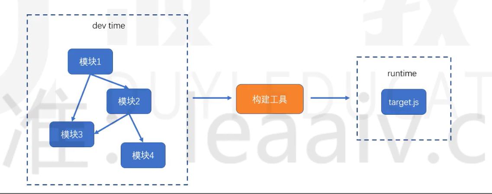
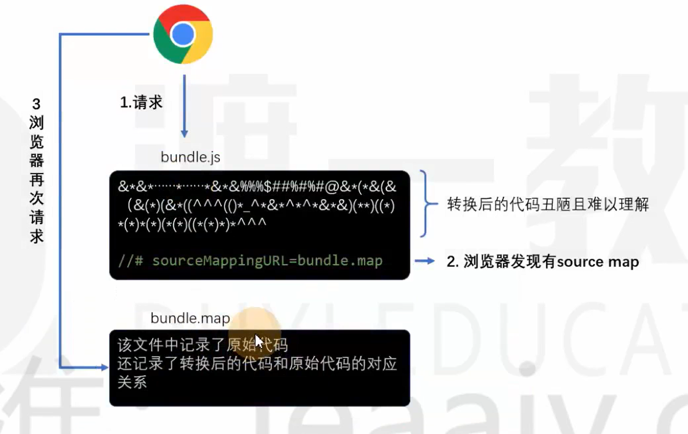
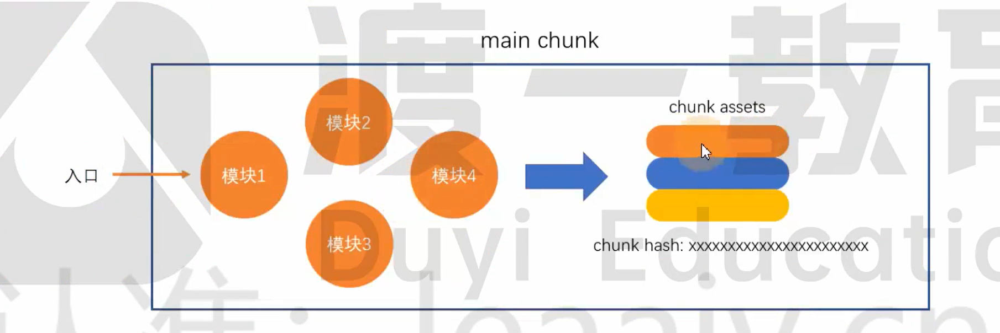
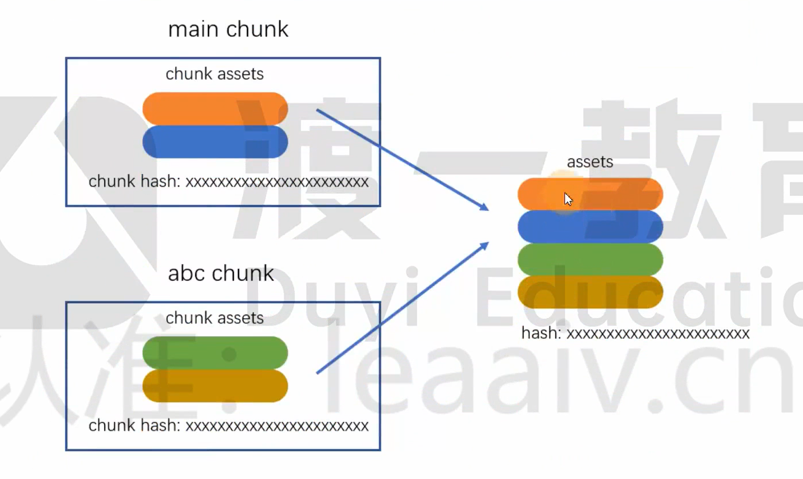
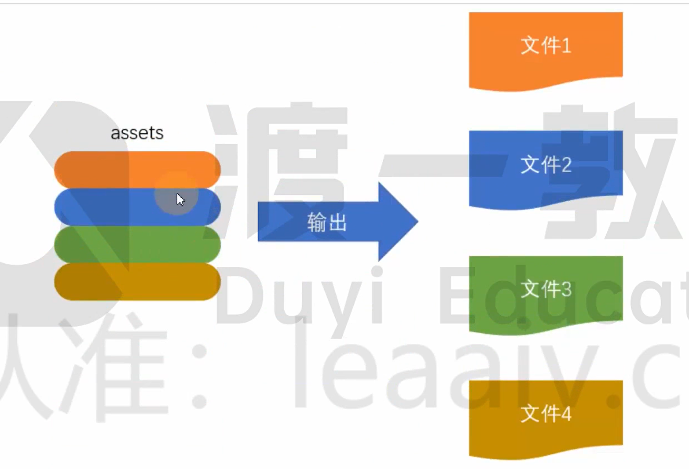
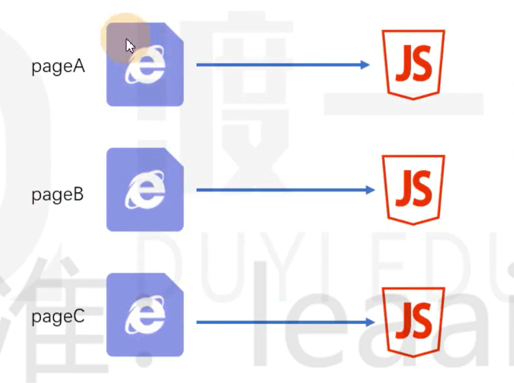
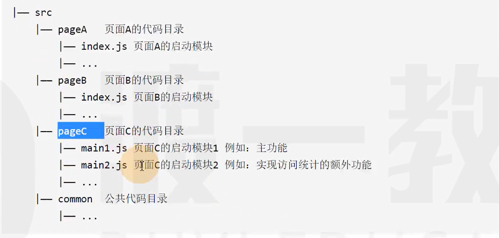
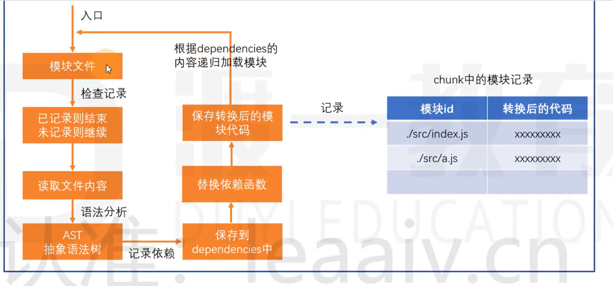
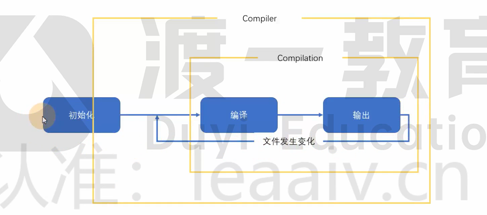

# 课程简介

本门课需要的前置知识: ES6, 模块化, 包管理器, git

本门课程的讲解特点:

1. 合适的深度: webpack 使用层面很简单,但原理层面非常复杂
2. 合适的广度: webpack 生态圈极其繁荣,有海量的第三方库可以融入到 webpack

## 浏览器端的模块化

问题:

- 效率问题: 精细的模块划分带来了更多的 JS 文件,更多的 JS 文件带来了更多的请求,降低了页面访问效率
- 兼容性问题: 浏览器目前仅支持 ES6 的模块化标准,并且还存在在兼容性问题
- 工具问题: 浏览器不支持 npm 下载的第三方包

这些仅仅是前端工程化的一个缩影

当开发一个就具有规模的程序，你将遇到非常多的非业务问题，这些问题包括：执行效率，兼容性，代码的可维护性和可扩展性，团队协作，测试等等。我们将这些问题称之为工程问题.工程问题于业务无关,但他深刻地影响到开发进度,如果没有一个好的工具解决这些问题,将使得开发进度变得极其缓慢,同时也让开发者陷入技术泥潭.

## 根本原因

思考:上面提到的问题,为什么在 node 端没有那么明显,反而到了浏览器端变得如此严重呢?

答:在 node 端,运行的 JS 文件在本地,因此可以本地读取文件,它的效率比浏览器远程传输文件高得多

**根本原因** : 在浏览器端, 开发时态(devtime)和运行时态(runtime)的侧重点不一样.

**开发时态, devtime**:

1. 模块划分越细越好
2. 支持多种模块化标准
3. 支持 npm 或其他包管理器下载的模块
4. 能够解决其他工程化问题

**运行时态, runtime**:

1. 文件越少越好
2. 文件体积越小越好
3. 代码内容越乱越好
4. 所有浏览器都要兼容
5. 能够解决其他运行时的问题,主要是执行效率问题

这种差异在小项目中表现的并不明显,可是一旦项目形成规模,就越来越明显,如果不解决这些问题,前端项目形成规模只能是空谈

## 解决办法

既然开发时态和运行时态面临的局面有巨大的差异,因此,我们需要有一个工具,这个工具能够让开发者专心的在开发时态写代码,然后利用这个工具将开发时态编写的代码转换为运行时态需要的东西

这样的工具,叫做**构建工具**



这样一来,开发者就可以专注于开发时态的代码结构,而不用担心运行时态遇到的问题了

## 常见的构建工具

- webpack
- grunt
- gulp
- browserify
- fis
- 其他

# webpack 的安装和使用

> webpack 官网: https://webpack.js.org/

## webpack 简介

webpack 是基于模块化的打包(构建)工具,它把一切视为模块
它通过一个开发时态的入口模块为起点,分析出所有的依赖关系,然后经过一系列的过程(压缩,合并),最终生成运行时态的文件.

webpack 的特点:

- **为前端工程化而生**: webpack 致力于解决前端工程化,特别是浏览器端工程化中遇到的问题,让开发者集中精力编写业务代码
- **简单易用**: 支持零配置
- **强大的生态**: webpack 是非常灵活,可扩展的,有许多第三方插件
- **基于 nodejs**: 由于 webapck 在构建过程中需要读取文件,因此它是运行在 node 环境中的
- **基于模块化**: webpack 在构建过程中要分析依赖关系,方式是通过模块化导入语句进行分析的,它支持各种模块化标准,包括但不限于 CommonJS, ES6 Module

## webpack 的安装

webapck 通过 npm 安装,它提供了两个包

- webpack: 核心包,包含了 webpack 构建过程中要用到的所有 api
- webpack-cli: 提供了命令行工具,它调用 webpack 核心包的 api 来完成构建过程

安装方式:

- 全局安装: 可以全局使用 webpack 命令, 但是无法为不同项目对应不同的 webpack 版本
- 本地安装: **推荐**, 每个项目都是用自己的 webpack 版本

## 使用

在本地全局或项目中安装 webpack 和 webpack-cli

```powershell
pnpm add webpack webpack-cli -D
```

使用 pnpm 运行 webapck 命令

```powershell
pnpm webpack
```

默认情况下,webpack 会以`./src/index.js`作为入口文件分析依赖关系,打包到`./dist/main.js`文件中

通过 `--mode`选项可以控制 webpack 的打包结果的运行环境

# 模块化兼容性

由于 webpack 同时支持 CommonJS 和 ES6 module, 因此需要理解他们互操作时,webpack 是如何处理的

## 同模块化标准

如果导出和导入使用的是同一种模块化标准,打包后的效果和之前学习的模块化没有任何差异

```js
// CommonJS export

module.exports = {
  a: 1,
  b: 2,
  C: 3,
};
// CommonJS import
require('./a');
```

```js
// ES6 export

export const a = 1;
export const b = 2;
export default 3;
// ES6 import

import * as obj from './a.js';
console.log(obj);
/**{
    a: 1, 
    b: 2,
        default: 3
}
*/
```

## 不同模块化标准

```js
// ES6 export

export const a = 1;
export const b = 2;
export default 3;

// CommonJS import
const obj = require('.a');
console.log(obj);
/**{
    a: 1, 
    b: 2,
        default: 3
}
*/
```

> 这里尤其要注意,使用`ES`导出,`CommonJS`导入时,导入的是把普通导出和默认导出整合在一起的一个对象,默认导出是其中的`defatult`属性

```js
// CommonJS export

module.exports = {
  a: 1,
  b: 2,
  C: 3,
};

// ES6 import

import * as obj from './a'; // 导入全部内容
import c from './a'; // 导入默认值

// 以上两种完全相同,得到的结果都是
console.log(ojb);
console.log(c);
/**{
    a: 1, 
    b: 2,
    c: 3
}
*/
```

## 最佳实践

代码编写最忌讳的是精神分类,选择一个合适的模块化标准,然后贯彻整个开发阶段.

# 练习:酷炫的数字查找特效

# 编译结果分析

**手写`my-main.js`**

```js
// 合并两个模块

// ./src/a.js
// ./src/index.js

(function (modules) {
  var moduleExports = {}; // 用于缓存模块的导出结果

  /**
   * 运行一个模块，得到模块的导出结果
   * @param {string} moduleId 模块路径
   */
  function __webpack_require(moduleId) {
    // 检查是否有缓存
    if (moduleExports[moduleId]) {
      return moduleExports[moduleId];
    }
    var func = modules[moduleId]; // 得到该模块对应的函数
    var module = {
      exports: {},
    };
    func(module, module.exports, __webpack_require); // 运行模块
    var result = module.exports; // 得到模块的导出结果
    moduleExports[moduleId] = result;
    return result;
  }
  // 执行入口模块
  __webpack_require('./src/index.js');
})(
  // 该对象保存了所有的模块，以及模块对应的代码
  {
    './src/a.js': function (module, exports) {
      console.log('module a');
      module.exports = 'a';
    },
    './src/index.js': function (module, exports, require) {
      console.log('index module');
      var a = require('./src/a.js');
      var newA = require('./src/a.js');
      console.log(a);
    },
  }
);
```

**真实的`main.js`**

```js
(() => {
  var __webpack_modules__ = {
    './src/a.js': (module) => {
      eval(
        "console.log('module a');\r\nmodule.exports = 'a';\r\n\n\n//# sourceURL=webpack://code/./src/a.js?"
      );
    },
    './src/index.js': (
      __unused_webpack_module,
      __unused_webpack_exports,
      __webpack_require__
    ) => {
      eval(
        'console.log(\'index module\');\r\nvar a = __webpack_require__(/*! ./a */ "./src/a.js");\r\nconsole.log(a);\n\n//# sourceURL=webpack://code/./src/index.js?'
      );
    },
  };
  var __webpack_module_cache__ = {};

  function __webpack_require__(moduleId) {
    var cachedModule = __webpack_module_cache__[moduleId];
    if (cachedModule !== undefined) {
      return cachedModule.exports;
    }
    var module = (__webpack_module_cache__[moduleId] = {
      exports: {},
    });
    __webpack_modules__[moduleId](module, module.exports, __webpack_require__);

    return module.exports;
  }
  var __webpack_exports__ = __webpack_require__('./src/index.js');
})();
```

**为什么要把代码放到`eval()`函数中，而不是直接写**

当代码报错时，如果在`eval()`中,可以单独显示

```html
<!DOCTYPE html>
<html lang="en">
  <head>
    <meta charset="UTF-8" />
    <meta name="viewport" content="width=device-width, initial-scale=1.0" />
    <title>Document</title>
  </head>
  <body>
    <script>
      var a = 1;
      var b = 2;
      var c = 3;

      eval('var d = null; \n d.abc();');
    </script>
  </body>
</html>

```


可以通过增加注释的方自定义打开空间

```html
<!DOCTYPE html>
<html lang="en">
  <head>
    <meta charset="UTF-8" />
    <meta name="viewport" content="width=device-width, initial-scale=1.0" />
    <title>Document</title>
  </head>
  <body>
    <script>
      var a = 1;
      var b = 2;
      var c = 3;

      eval('var d = null; \n d.abc();//# sourceURL=webpack:///./src/a.js');
    </script>
  </body>
</html>
```


# 学习可以很轻松

## 重过程, 轻目标: 心态

以轻松的心态去学习,享受学习的过程. 轻装上阵才能学习的更持久

## 重大局, 轻细节: 思维

不要一头扎进 API, 要从宏观上把握某一个技术到底是**为了解决什么问题**,而不是纠结于其解决问题的具体方法.

## 重基础, 轻上层: 路径

要先从基础开始,把基础学完,再学习上层的东西.

## 重实践, 轻理论: 方法

实践和自己写是两码事情

# 配置文件

webpack提供的cli支持很多的参数,例如`--mode`,但更多的时候,我们会使用更加灵活的配置文件来控制webpack的行为

默认情况下,webpack会读取`webpack.config.js`文件作为配置文件,但也可以通过CLI参数`--config`来指定某个配置文件

配置文件中通过`CommonJS`模块导出一个对象,对象中的各种属性对应不同的webpack配置

**注意: 配置文件中的代码,必须是有效的node代码**

当命令行参数与配置文件中的配置出现冲突时,**以命令行参数为准**

**基本配置**

1. `mode`: 编译模式,字符串,取值为`development`或`production`,指定编译结果代码运行的环境,会影响webpack对编译结果代码格式的处理.
2. `entry`: 入口,字符串(后续详细讲解), 指定入口文件
3. `output`: 出口, 字符串(后续详细讲解), 指定编译结果文件

>注意: `webpack`支持我们`src`目录下的源代码使用`commonjs`或`ESmodule`,因为源代码在构建过程中根本不会运行,最后运行的是webpack打包后的文件.
>
>但是`webpack.config.js`这个配置文件本身在构建过程中是要在node环境下运行的

# `devtool`配置

## `source map`源码地图

> 本小节的知识与webpack无关

前端发展到现阶段,很多时候都不会直接运行源代码,可能需要对源代码进行合并,压缩,转换等操作,真正运行的是转换后的代码.

这就给调试带来了困难,因为党运行发生错误的首,我们更加希望能看到源代码中的错误,而不是转换后代码的错误

>`jquery`压缩后的代码: https://code.jquery.com/jquery-3.4.1.min.js

为了解决这一问题,chrome率先支持了`source map`,其他浏览器纷纷效仿,目前,几乎所有新版浏览器都支持了`source map`

`source map`实际上是一个配置,配置中不仅记录了所有源码内容,还记录了和转换后的代码的对应关系

下面是浏览器处理`source map`的原理




**最佳实践**

1. `source map`应该在开发环境中使用，作为一种调试手段
2. `source map`不应该在生产环境中使用，`source map`的文件一般比较大，不仅会导致额外的网络传输，还容易暴露原始代码。即便要在生产环境中使用`source map`，用于调试真实的代码运行问题，也要做出一些处理规避网络传输和代码暴露的问题。

## `webpack中的source map`

使用`webpack`编译后的代码难以调试，可以通过`devtool`配置来**优化调试体验**

具体的配置见文档

https://www.webpackjs.com/configuration/devtool

# 编译过程

webpack的作用是将源代码编译(构建，打包)成最终代码


整体过程大致分为三个步骤

1. 初始化
2. 编译
3. 输出

## 初始化

此阶段，webpack会将**CLI参数，配置文件，默认配置**进行融合,形成一个最终的配置对象

对配置的处理过程是依托一个第三方库`yargs`完成的

此阶段相对比较简单,主要是为接下来的编译阶段做必要的准备.

目前,可以简单理解为,初始化阶段主要任务就是形成一个最终的配置

## 编译

### 创建chunk

chunk是webpack内部构建过程中的一个概念,译为`块`,它表示通过某个入口找到的所有依赖的统称.

根据入口模块(默认为`./src/index.js`)创建一个chunk


每个chunk都至少有两个属性:

- name: 默认是main
- id: 唯一编号, 开发环境和name相同,生产环境是一个数字,从0开始

### 构建所有依赖模块


>AST(Abstract Sytax Tree)在线测试工具: https://astexplorer.net/

### 产生chunk assets

在第二步完成后, chunk中会产生一个模块列表,列表中包含了**模块id**和**模块转换后的代码**

接下来,webpack会根据配置为chunk生成一个资源列表,即`chunk assets`,资源列表可以理解为是生成到最终文件的文件名和文件内容


>chunk hash是根据所有chunk assets的内容生成的一个hash字符串
>
>hash: 一种算法,具体有很多分类,特点是将一个任意长度的字符串转换为一个固定长度的字符串,而且可以保证原始内容不变,产生的hash字符串就不变

简图



### 合并chunk assets

将多个chunk的assets合并到一起,并产生一个总的hash



## 输出

此步骤非常简单,webapck利用node中的fs模块,根据编译产生的总的assets,生成响应的文件.



## 总过程


**涉及术语**

- `module`:模块,代码分割的单元,webpack中的模块可以是任何内容的文件,不仅限于JS
- `chunk`:webpack内部构建模块的块,一个chunk中包含多个模块,这些模块是从入口模块通过依赖分析得来的.
- `bundle`:chunk构建好模块后会生成chunk的资源清单,清单中的每一项就是一个bundle,可以认为bundle就是最终生成的文件
- `hash`:最终的资源清单所有内容联合生成的hash值
- `chunkhash`:chunk生成的资源清单的内容联合生成的hash值
- `chunkname`:chunk的名称,如果没有配置则使用main
- `id`:通常指chunk的唯一编号,如果在开发环境下构建,和`chunkname`相同,如果在生产环境下构建,则使用一个从0开始的数字进行编号.

>如果启用 `--watch`选项,每次改动文件后会从编译步骤开始

# 入口和出口

## 出口

这里的出口是针对资源列表的文件名或路径的配置

出口通过`output`进行配置

## 入口

**入口真正配置的是chunk**

入口通过entry进行配置

规则:

- `name`: `chunkname`
- `hash`:总的资源哈希,防止内容更新,名称没变,导致浏览器使用缓存,无法获取最新文件
- `chunkhash`: 每一个chunk的哈希,只有对应的chunk变时,对应的hash才变
- `id`:chunkid, 不推荐使用,因为开发环境是name,生产环境是数字

## 最佳实践

具体情况具体分析

下面是一些经典场景

### 一个页面一个JS



目录结构



webpack配置

```js
module.exports = {
    entry: {
        pageA: "./src/pageA/index.js",
        pageB: "./src/pageB/index.js",
        pageC: ["./src/pageC/main1.js","./src/pageC/main2.js"]
    },
    output: {
        filename: "[name]·[chunkhash:5].js"
    }
}
```

这种方式适用于页面之间功能差异巨大,公共代码较少的情况,这种情况下打包出来的最终代码不会有太多的重复.

### 一个页面多个JS


webpack配置

```js
module.exports = {
    entry: {
        pageA: "./src/pageA/index.js",
        pageB: "./src/pageB/index.js",
        statistics: "./src/statistics/index.js"
    },
    output: {
        filename: "[name]·[chunkhash:5].js"
    }
}
```

这种方式适用于页面之间有一些**独立**,相同的功能,专门使用一个chunk抽离

这部分JS有利于浏览器更好地缓存这部分内容

>思考: 为什么不使用多启动模块的方式

### 单页应用

所谓单页应用,是指整个网站(或网站的某一个功能块),只有一个页面,页面中的内容全部靠JS创建和控制. `Vue`和`React`都是实现单页应用的利器.


源码结构


webpack配置

```js
module.exports = {
    entry: "./src/index.js",
    output: {
        filename: "index.[hash:5].js"
    }
}
```

# loader

>webpack做的事情,仅仅是分析出各种模块的依赖关系,然后形成资源列表,最终打包到指定的文件中.
>
>更多的功能需要借助`webpack loaders`和`webpack plugins`来完成的

`webpack loader`: loader本质上是一个函数,它的作用是将某个源码字符转换成另一个源码字符串返回

## webpack总流程


## chunk中模块解析的流程



## chunk中模块解析更详细的流程


## 处理loaders流程


## loader配置

### 完成配置

```js
const path = require('path');

module.exports = {
  mode: 'development',
  devtool: 'source-map',
  entry: {
    main: './src/index.js', // 默认配置
  },
  output: {
    path: path.resolve(__dirname, 'target'), //必须配置一个绝对路径,表示资源放置的路径，默认是dist
    filename: '[name]-[chunkhash:5].js', // 配置的合并的js文件的规则
  },
  module: {
    rules: [
      {
        test: /index\.js$/, // 正则表达式，匹配模块的路径
        use: [
          {
            loader: './loaders/test.js',      // 加载器的路径
            options: {
              oldWord: '未知数',
              newWord: 'const'
            }
          }, // 每个loader的使用
        ], // 匹配到了之后使用哪些loader
      }, // 规则1
    ], // 模块的匹配规则
  },
};
```

## [练习]处理样式

```js
// style-loader.js
module.exports = function (sourceCode) {
  return `const style = document.createElement('style');
  style.innerHTML = ${JSON.stringify(sourceCode)};
  document.head.appendChild(style);`;
};
```

## [练习]图片处理

```js
// img-loader.js
const loaderUtils = require('loader-utils');
function loader(source) {
  const { limit = 1000, fileName = '[contenthash:5].[ext]' } =
    this.getOptions();
  let content;
  if (source.byteLength >= limit) {
    content = getFilePath.call(this, source, fileName);
  } else {
    content = getBase64(source);
  }
  return `module.exports = ${JSON.stringify(content)}`;
}
loader.raw = true;

module.exports = loader;

function getBase64(buffer) {
  return 'data:image/png;base64,' + buffer.toString('base64');
}

function getFilePath(buffer) {
  const fileName = loaderUtils.interpolateName(this, '[contenthash:5].[ext]', {
    content: buffer,
  });
  this.emitFile(fileName, buffer);
  return fileName;
}
```

```js
// index.js
const src = require('./assets/image.png');

const img = document.createElement('img');
img.src = src;

document.body.appendChild(img);
```

```html
<!-- index.html -->
<!DOCTYPE html>
<html lang="en">
<head>
  <meta charset="UTF-8">
  <meta name="viewport" content="width=device-width, initial-scale=1.0">
  <title>Document</title>
</head>
<body>
  <script src="./main.js"></script>
  
</body>
</html>
```

```js
// webpack.config.js
const path = require('path');

module.exports = {
  mode: 'development',
  devtool: 'source-map',
  entry: {
    main: './src/index.js', // 默认配置
  },
  module: {
    rules: [
      // 规则1
      {
        test: /\.(png)|(jpg)|(gif)$/,
        use: [
          {
            loader: './loaders/img-loader.js',
            options: {
              limit: 10, // 3000字节以上使用图片路径，3000以内使用base64
              fileName: 'img-[contenthash:8].[ext]',
            },
          },
        ],
      },
    ], // 模块的匹配规则
  },
};
```

# plugin

loader的功能定位是转换代码,而一些其他的操作难以使用loader完成,比如:

- 当webpack生成文件时,顺便多生成一个说明描述文件
- 当webpack编译启动时,控制台输出一句话表示webapck启动了
- 当XXX时,XXXX

这种类似的功能需要把功能嵌入到webpack的编译流程中,而这种事情的实现是依托于plugin的


plugin的**本质**是一个带有`apply`方法的对象

```js
var plugin = {
    apply: function(compiler) {
        
    } 
}
```

通常,习惯上,我们会将该对象写成构造函数的模式

```js
class MyPlugin {
    apply(compiler) {
        
    }
}
var plugin = new MyPlugin();
```

要将插件应用到webpack,需要把插件对象配置到webpack的plugins数组中,如下:

```js
module.exports = {
    plugins: [
        new MyPlugin()
    ]
}
```

compiler对象是在初始化阶段构建的,整个webpack打包期间只有一个compiler对象,后续完成打包工作的是compiler对象内部创建的compilation

apply方法会在**创建好compiler对象后调用**,并向方法传入一个compiler对象

>如果我们启用了webpack的watch配置,当文件变化时,webpack会生成新的Compilation,但是Compiler不变,所以apply方法也不会重新运行.



compiler对象提供了大量的钩子函数(hooks,可以理解为事件),plugin的开发者可以注册这些钩子函数,参与webpack编译和生成.

你可以在apply方法中使用下面的代码注册钩子函数

```js
class MyPlugin {
    apply(compiler) {
        compiler.hooks.事件名.事件类型(name, function(compilation) {
            // 事件处理函数
        })
    }
}
```

## 事件名称

即要监听的事件名,即钩子名,所有的钩子

https://www.webpackjs.com/api/compiler-hooks

## 事件类型

这一部分使用的是`Tapable API`,这个小型的库是一个专门用于钩子函数监听的库.

它提供了一些事件类型:

- `tap`:注册一个同步的钩子函数,函数运行完毕则表示事件处理结束
- `tapAsync`:注册一个基于回调的异步的钩子函数,函数通过调用一个回调表示事件处理结束
- `tapPromise`:注册一个基于Promise的异步的钩子函数,函数通过返回的Promise进入已决状态表示事件处理结束

## 处理函数

处理函数有一个事件参数`compilation`

## [练习] 添加文件列表

```js
module.exports = class FileListPlugin {
  apply(compiler) {
    compiler.hooks.emit.tap('FileListPlugin', (compilation) => {
      const fileList = [];
      for (const key in compilation.assets) {
        const content = `[${key}]\r\n大小: ${compilation.assets[key].size()}`;
        fileList.push(content);
      }
      compilation.assets['fileList.md'] = {
        source() {
          return fileList.join('\n');
        },
        size() {
          return fileList.join('\n').length;
        },
      };
    });
  }
};
```

# 区分环境

有些时候,我们需要针对生产环境和开发环境分别书写webpack配置

为了更好的适应这种要求,webpack允许配置不仅可以是一个对象,还可以是一个**函数**

```js
module.exports = env => {
    return {
        // 配置内容
    }
}
```

在开始构建时,webpack如果发现配置是一个函数,会调用该函数,将函数返回的对象作为配置内容,因此,开发者可以根据不同的环境返回不同的对象

在调用webpack函数时,webpack会向函数传入一个参数`env`,该参数的值来自webpack命令中给env指定的值,例如

```powershell
pnpm webpack --env abc  # env: "abc"
pnpm webpack --env.abc	# env: {abc: true}
pnpm webpack --env.abc=1 # env: {abc: 1}
pnpm webpack --env.abc=1 --env.bcd=2  # env{abc: 1, bcd: 2}
```

这样一来,我们就可以在命令中指定环境,在代码中进行判断,根据环境返回不同的配置结果

# 其他配置细节

## context

```js
context: path.resolve(__dirname, "app")
```

该配置会影响**入口**和**loaders**的解析,他们的相对路径会以`context`的配置作为基准路径,这样,你的配置会独立于CWD(current working directory,当前执行路径)

## output

### libraray

```js
library: "abc"
```

这样一来,打包后的结果中,会将自执行函数的结果暴露给abc,可以给别人提供为第三方包

### libraryTarget

```js
libraryTarget: "var"
```

该配置可以更加精细地控制如何暴露入口包的导出结果

其可用的值有:

- `var`:默认值,暴露给一个普通变量
- `window`:暴露给window对象的一个属性
- `this`: 暴露给this的一个属性
- `global`:暴露给global的一个属性
- `commonjs`:暴露给exports的一个属性
- 其他: https://www.webpackjs.com/configuration/output/#output-librarytarget

## target

```js
target: web;				// 默认值
```

设置打包结果最终运行的环境,常用的值有

- web:
- node
- 其他: https://www.webpackjs.com/configuration/target/

## module.noParse

```js
noParse: /jquery/
```

不解析正则表达式匹配的模块,通常用它来忽略那些大型的**单模块**库,以提高**构建性能**

## resolve

### modules

```js
modules:["node_modules"]		// 默认值
```

当解析模块时,如果遇到导入语句,`require("test")`,webpack会从下面的位置寻找依赖的模块

1. 当前目录下的`node_modules`目录
2. 上级目录下的`node_modules`目录
3.  ...

### extensions

```js
extensions: [".js", ".json"]		// 默认值
```

当解析模块时,遇到无具体后缀的导入语句,例如`require("test")`,会依次测试它的后缀名

- test.js
- test.json

### alias

设置别名

```js
alias: {
    '@': path.resolve(__dirname, 'src'),
    "_": __dirname
}
```

## externals

```js
externals: {
    jquery: "$",
    lodash: "_"
}
```

从最终的bundle总排除配置的配置项的源码,例如,入口模块是

```js
//index.js
require('jquery');
require('lodash');
```

生成的bundle是

```js
(function() {
...
})({
    "./src/index.js": function(module, exports, __webpack_require__) {
        __webpack_require__("jquery");
        __webpack_require__("lodash");
    },
    "jquery": function(module, exports) {
        // jquery的大量源码
    },
    "lodash": function(module, exports) {
        // lodash大量源码
    }
})
```

但是有了上面的配置后,则变成了

```js
(function() {
...
})({
    "./src/index.js": function(module, exports, __webpack_require__) {
        __webpack_require__("jquery");
        __webpack_require__("lodash");
    },
    "jquery": function(module, exports) {
        module.exports = $;
    },
    "lodash": function(module, exports) {
        // lodash大量源码
        module.exports = _;
    }
})
```

这比较适用于一些第三方库来自外部CDN的情况,这样一来,既可在页面中使用CDN,又让bundle的体积变得更小,还不影响源码的编写

## stats

stats控制的是构建过程中控制台的输出内容

# 常用扩展

`clean-webpack-plugin`:每次重新构建时清空目录

`html-webpack-plugin`: 自动生成页面,在dist目录中生成index.html文件并引用生成的js文件

`copy-webpack-plugin`: 复制静态资源

`file-loader`: 生成一来的文件到输出目录,然后将模块文件设置为:导出一个路径

`url-loader`: 将依赖的文件转换为: 导出一个base64格式的字符串

# 开发服务器

在**开发阶段**,目前遇到的问题是打包,运行,调试过程过于繁琐,回顾一下我们的操作流程:

1. 编写代码
2. 控制台运行命令完成打包
3. 打开页面查看结果
4. 继续编写代码,回到步骤2

并且,我们往往希望把最终生成的代码和页面部署到服务器上,来模拟真实环境

为了解决这些问题,webpack官网制作了一个单独的库: **webpack-dev-server**

它**既不是plugin也不是loader**

先来看看它怎么用

1. 安装
2. 执行`webpack-dev-server`命令

`webpack-dev-server`几乎支持所有的webpack命令参数,如`--config -env`等,你可以把它当作webpack命令使用

这个命令是专门为开发阶段服务的,真正部署的时候还是得使用webpack命令

当我们执行`webpack-dev-server`命令后,它做了以下操作:

1. 内部执行webpack命令,传递命令参数
2. 开启watch
3. 注册hooks,类似于plugin,webpack-dev-server会向webpack中注册一些钩子函数,主要功能如下
   1. 将资源列表(assets)保存起来
   2. 禁止webapck输出文件
4. 用express开启一个服务器,监听某个端口,当请求到达后,根据请求的路径,给予相应的资源内容

## 配置

针对webpack-dev-server的配置,参考

https://www.webpackjs.com/configuration/dev-server/

常见的配置有

- port: 监听的端口号
- proxy: 配置代理,常用于跨域访问
- stats: 配置控制台的输出内容

# 解决路径问题

在使用file-loader或url-loader时,可能会遇到一个非常有趣的问题

比如,通过webpack打包的目录结构如下:

```powershell
dist
	|-- img
		|-- a.png			# file-loader生成的文件
	|-- scripts
		|-- main.js			# export default "img/a.png"
	|-- html
		|-- index.html		#<script src="../scripts/main.js"></script>
```

这种问题发生的根本原因:模块中的路径来自于某个loader或plugin,当产生路径时,loader或plugin只有相对于dist目录的路径,并不知道该路径将在哪个资源中使用,从而无法确定最终正确的路径

面对这种情况, 需要依靠webpack的配置publicPath解决

# webpack内置插件

所有的webapck内置插件都作为webpack的静态属性存在的,使用下面的方式即可创建一个插件对象

```js
const webpack = require('webpack');
new webpack.插件名(options)
```

## DefinePlugin

全局常量定义插件,使用该插件通常定义一些常量值,例如:

```js
new webpack.DefinePlugin({
    PI: `Math.PI`,		// PI = Math.PI
    VERSION: `"1.0.0"`,	// VERSION = "1.0.0"
    DOMAIN: JSON.stringify("duyi.com")	// DOMAIN: "duyi.com"
})
```

这样一来,在源码中,我们可以直接使用插件中提供的常量,当webpack编译完成后,会自动题欢为常量的值

## BannerPlugin

它可以为每一个chunk生成的文件头部添加一行注释,一般用于添加作者,公司,版权等信息

```js
new webpack.BannerPlugin({
    banner:
    hash:[hash]
    chunkhash: [chunkhash]
	author:yuanjin
    corporation: duyi
})
```

## ProvidePlugin

自动加载模块,而不必到处`import`或`require`

```js
new webpack.ProvidePlugin({
    $: 'jquery',
    _: 'lodash'
})
```

然后我们在任意源码中

```js
$('#item'));		//起作用
_.drop([1,2,3],2);;	//起作用
```

# CSS工程化概述

## CSS问题

### 类名冲突的问题

当你写一个CSS类的时候,你是写全局的类呢, 还是写多个层级选择后的类呢?

你会发现,怎么都不好

- 过深的层级不利于编写,阅读,压缩,复用
- 过浅的层级容易导致类名冲突

### 重复样式

这种问题就更普遍了,一些重复的样式值总是不断的出现在CSS代码中,维护起来极其困难

比如,一个网站的颜色一般就那么几种:

- primary
- info
- warn
- error
- success

如果有更多的颜色,都是从这些色调中自然变化得来,可以想象,这些颜色会到处充斥到诸如背景,文字,边框中,一旦要做颜色调整,是一个非常大的工程.

### CSS文件细分问题

在大型项目中,css也需要更细的拆分,这样有利于css代码的维护.

比如,有一个做轮播图的模块,它不仅需要依赖js功能,还需要依赖css样式,既然依赖的js功能仅关心轮播图,那css样式也应该仅关心轮播图,由此类推,不同的功能依赖不同的css样式,公共样式可以单独抽离,这样就形成了不同于过去的css文件结构:文件更多,拆分的更细.

而同时,在真实的运行环境下,我们却希望文件越少越好,这种情况和js遇到的情况是一致的

## 如何解决

### 解决类名冲突

一些第三方机构提出了一些方案来解决该问题,常见的解决方案如下:

**命名约定**

即提供一种命名的标准,来解决冲突,常见的标准有:

- BEM

全称是**B**lock **E**lement **M**odifier

一个完整的BEM类名:block\_\_element\_\_modifier,例如`banner__dot__selected`,可以表示: 轮播图中,处于选中状态的小圆点

- OOCSS
- AMCSS
- SMACSS
- 其他

在某些大型工程中,还可能会加一个前缀,表示类名的用途

- l: layout,表示这个类是用于布局的
- c: component, 表示这个样式是一个组件,即一个功能区域
- u: util,表示工具性样式
- j: javascript,表示这个样式没有实际意义,是专门提供给js获取元素使用的

**css in js**

这种方案非常大胆,他觉得,css语言本身几乎无可救药了,干脆直接用js对象来表示样式,然后把样式直接应用到元素的style中

这样一来,css变成了一个一个的对象,就完全可以利用js语言的优势,你可以

- 通过一个函数返回一个样式对象
- 把公共的样式提取到公共模块内返回
- 应用JS的各种特性操作对象,比如:混合,提取,拆分
- 更多的花样

**css module**

非常有趣和好用的css模块化方案,编写简单,绝对不重名

css module 遵循以下思路解决类名冲突

1. css的类名冲突往往发生在大型项目中
2. 大型项目往往会使用构建工具(wepack等)搭建工程
3. 构建工具允许将css样式切分为更加精细的模块
4. 同JS变量一样,每个css模块文件中难以出现冲突的类名,冲突的类名往往发生在不同的css模块文件中
5. 只需要保证构建工具在合并样式代码后不会出现类名冲突即可.

**实现原理**

在webpack中,作为处理css的css-loader,它实现了`css module`的思想,要启用`css module`,需要将css-loader的配置`modules`设置为`true`

开启后类名转换为唯一的hash值

**如何应用样式**

`css module`带来了一个新的问题,源代码的类名和最终生成的类名是不一样的,而开发者只知道自己写的源代码中的类名,并不知道最终的类名是什么,那如何应用类名到元素上呢?

为了解决这个问题,css-loader会导出原类名和最终类名的对应关系,该关系是通过一个对象描述的


**其他操作**

**全局类名**

某些类名是全局的,静态的,不需要进行转换,仅需要再类名位置使用一个特殊的语法即可

```css
:global(.main) {
    ...
}
```

使用了global的类名不会进行转换,相反的,没有使用global的类名,表示默认使用了local

```css
:local(.main) {
    ...
}
```

使用了local的类名表示局部类名,是可能会造成冲突的类名,会被`css module`进行转换

- 往往配合构建工具使用
- 仅处理顶级类名,不处理嵌套类名
- 仅处理类名,不处理其他选择器

### 解决重复样式问题

**css in js**

这种方案虽然可以利用js语言解决重复样式值的问题,但由于太过激进,很多习惯写css的开发者编写起来并不是很适应

**预编译器**

有些第三方搞出一套语言CSS语言进化版来解决这个问题，它支持变量，函数等高级语法，然后经过编译器将其编译为正常的css

这种方案特别像构建工具，不过它仅针对CSS

常见的CSS预编译器有

- less
- sass

### 解决css文件细分问题

这一部分，就要依靠构建工具,例如webapck来解决了

利用一些loader或plugin来打包,合并,压缩css文件

# 利用webpack拆分css

要拆分css, 就必须把css当成像js那样的模块;要把css当场模块,就必须有一个构建工具(webpack),它具备合并代码的能力

而webpack本身只能读取css文件的内容,将其当作JS代码进行分析,因此,会导致错误,于是,就必须有一个loader,能够将css代码转换为js代码

## css-loader

css-loader的作用,就是将css代码转换为js代码

它的处理原理极其简单,将css代码作为字符串导出

例如:

```css
.red{
    color: "red";
}
```

经过css-loader转换后变成js代码

```javascript
module.exports = `.red {
	color: "red";
}`
```

>上面的js代码是经过简化后的,不代表真实的css-loader的转换后代码,css-loader转换后的代码有些复杂,同时会导出更多的信息,但核心思想不变

再例如

```css
.red {
    color: "red";
    background: url("./bg.png");
}
```

经过css-loader转换后的js代码如下:

```js
var import1 = require("./bg.png")
module.exports = `.red {
	color: "red",
	background: url("${import1}")
} `
```

这样一来,经过webpack的后续处理,会把依赖`./bg.png`添加到模块列表,然后再将代码转化为

```js
var import1 = __webpack_require__("./src/bg.png");
module.exports = `.red {
	color: "red",
	background: url("${import1}")
} `
```

再例如

```css
@import "./reset.css";
.red {
    color: "red";
    background: url("./bg.png");
}
```

会转换为

```javascript
var import1 = require("./reset.css");
var import2 = require("./bg.png");

.red {
    color: "red";
    background: url("${import2}")
}
```

## style-loader

由于css-loader仅提供了将css转换为字符串导出的能力,剩余的事情要交给其他loader或plugin来处理.

style-loader可以将css-loader转换后的代码进一步处理,将css-loader导出的字符串加入到页面的style元素中

```css
.red {
    color: "#f40";
}
```

经过css-loader转换后成为js代码

```js
module.exports = `.red{
	color: "#f40";
} `
```

经过style-loader转换后变成

```js
module.exports = `.red{
	color: "#f40";
} `
var style = module.exports;
var styleElem = documents.createElement("style");
styleElem.innerHTML = style;
document.head.appendChild(styleElem);
module.exports = {};
```

>以上均为简化后的代码,不代表真实的代码
>
>style-loader可以避免元素重复导入

# css预编译器

编写css时, 受限于css语言本身,尝尝难以处理一些问题

- 重复的样式值
- 重复的代码段
- 重复的嵌套书写

由于官方迟迟不对css语言本身做出改进,一些第三方的机构开始想办法来解决这些问题

其中一种方案,便是预编译器

预编译器的原理很简单,即使用一种更加优雅的方式来书写样式代码,通过一个编译器,将其转换为可被浏览器识别的传统css代码

目前,最流行的预编译器有`less`和`sass`,由于他们两者特别相似,因此仅学习一种即可.

```powershell
pnpm add less -D
```

```less
// less代码
@red:#f40

    .redcolor {
        color: @red;
        }
    
```

less基本使用

- 变量
- 混合
- 嵌套
- 运算
- 函数
- 作用域
- 注释
- 导入

# PostCss

>本节课内容与webpack无关

## 什么是PostCss

如果把css单独拎出来看,光是样式本身,就有很多事情要处理.

既然有这么多的事情要处理,为什么不把这些事情集中到一起处理呢?

PostCss就是基于这样的理念出现的.

PostCss类似于一个编译器,可以把样式的源码,编译为最终的代码

但是PostCss和less,Sass的思路不同,它其实
