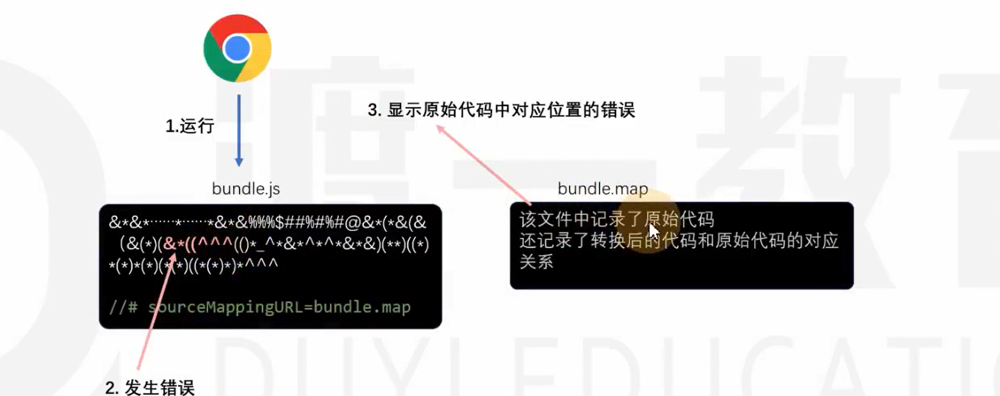
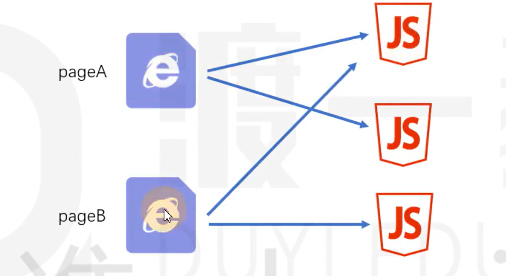
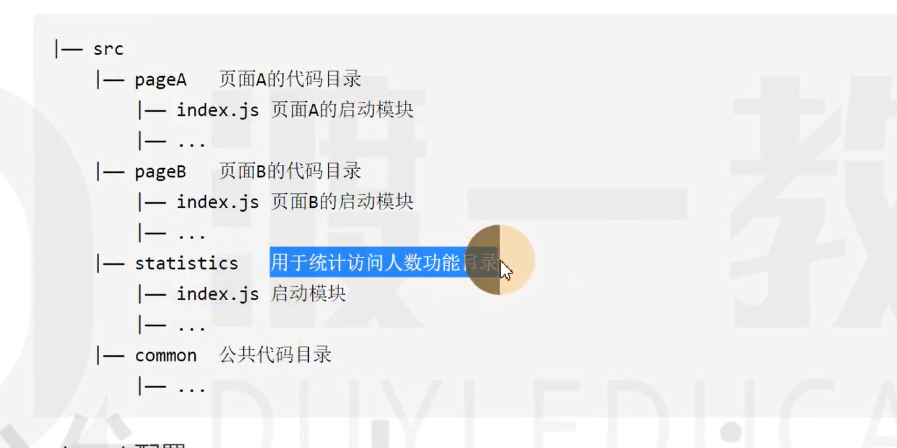
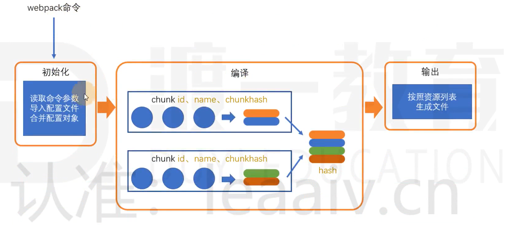
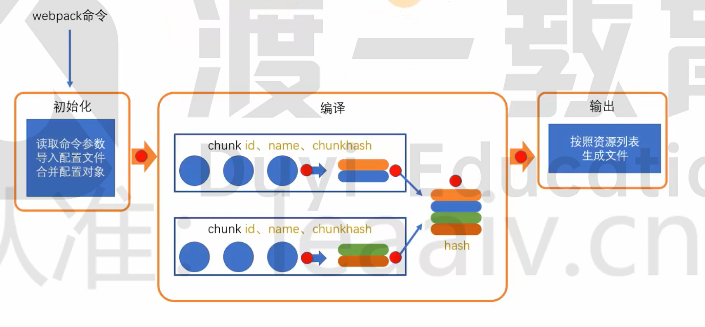
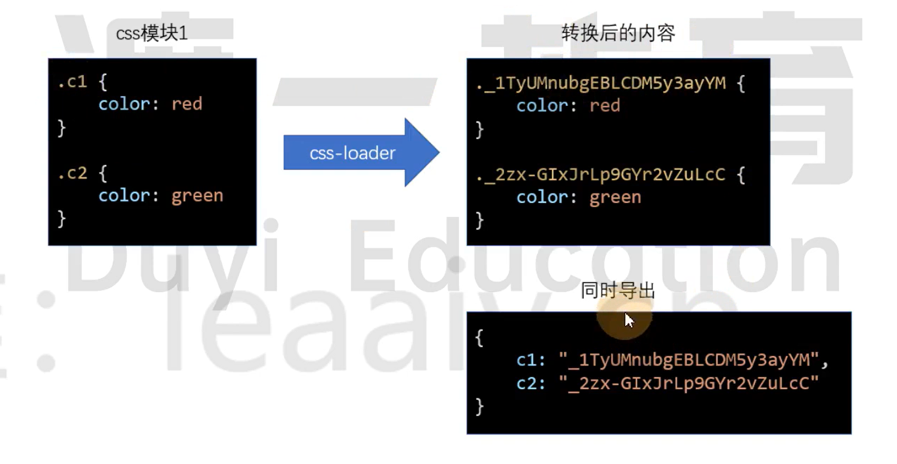
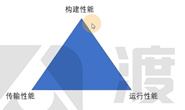
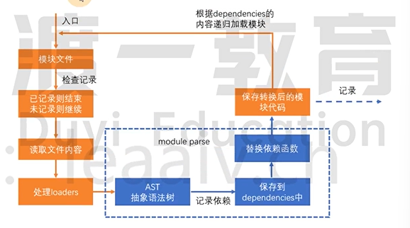
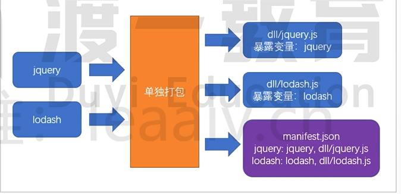
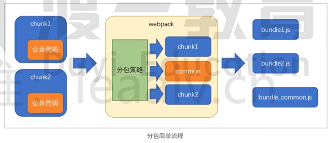

# 课程简介

本门课需要的前置知识: ES6, 模块化, 包管理器, git

本门课程的讲解特点:

1. 合适的深度: webpack 使用层面很简单,但原理层面非常复杂
2. 合适的广度: webpack 生态圈极其繁荣,有海量的第三方库可以融入到 webpack

## 浏览器端的模块化

问题:

- 效率问题: 精细的模块划分带来了更多的 JS 文件,更多的 JS 文件带来了更多的请求,降低了页面访问效率
- 兼容性问题: 浏览器目前仅支持 ES6 的模块化标准,并且还存在在兼容性问题
- 工具问题: 浏览器不支持 npm 下载的第三方包

这些仅仅是前端工程化的一个缩影

当开发一个就具有规模的程序，你将遇到非常多的非业务问题，这些问题包括：执行效率，兼容性，代码的可维护性和可扩展性，团队协作，测试等等。我们将这些问题称之为工程问题.工程问题于业务无关,但他深刻地影响到开发进度,如果没有一个好的工具解决这些问题,将使得开发进度变得极其缓慢,同时也让开发者陷入技术泥潭.

## 根本原因

思考:上面提到的问题,为什么在 node 端没有那么明显,反而到了浏览器端变得如此严重呢?

答:在 node 端,运行的 JS 文件在本地,因此可以本地读取文件,它的效率比浏览器远程传输文件高得多

**根本原因** : 在浏览器端, 开发时态(devtime)和运行时态(runtime)的侧重点不一样.

**开发时态, devtime**:

1. 模块划分越细越好
2. 支持多种模块化标准
3. 支持 npm 或其他包管理器下载的模块
4. 能够解决其他工程化问题

**运行时态, runtime**:

1. 文件越少越好
2. 文件体积越小越好
3. 代码内容越乱越好
4. 所有浏览器都要兼容
5. 能够解决其他运行时的问题,主要是执行效率问题

这种差异在小项目中表现的并不明显,可是一旦项目形成规模,就越来越明显,如果不解决这些问题,前端项目形成规模只能是空谈

## 解决办法

既然开发时态和运行时态面临的局面有巨大的差异,因此,我们需要有一个工具,这个工具能够让开发者专心的在开发时态写代码,然后利用这个工具将开发时态编写的代码转换为运行时态需要的东西

这样的工具,叫做**构建工具**


这样一来,开发者就可以专注于开发时态的代码结构,而不用担心运行时态遇到的问题了

## 常见的构建工具

- webpack
- grunt
- gulp
- browserify
- fis
- 其他

# webpack 的安装和使用

> webpack 官网: https://webpack.js.org/

## webpack 简介

webpack 是基于模块化的打包(构建)工具,它把一切视为模块
它通过一个开发时态的入口模块为起点,分析出所有的依赖关系,然后经过一系列的过程(压缩,合并),最终生成运行时态的文件.

webpack 的特点:

- **为前端工程化而生**: webpack 致力于解决前端工程化,特别是浏览器端工程化中遇到的问题,让开发者集中精力编写业务代码
- **简单易用**: 支持零配置
- **强大的生态**: webpack 是非常灵活,可扩展的,有许多第三方插件
- **基于 nodejs**: 由于 webapck 在构建过程中需要读取文件,因此它是运行在 node 环境中的
- **基于模块化**: webpack 在构建过程中要分析依赖关系,方式是通过模块化导入语句进行分析的,它支持各种模块化标准,包括但不限于 CommonJS, ES6 Module

## webpack 的安装

webapck 通过 npm 安装,它提供了两个包

- webpack: 核心包,包含了 webpack 构建过程中要用到的所有 api
- webpack-cli: 提供了命令行工具,它调用 webpack 核心包的 api 来完成构建过程

安装方式:

- 全局安装: 可以全局使用 webpack 命令, 但是无法为不同项目对应不同的 webpack 版本
- 本地安装: **推荐**, 每个项目都是用自己的 webpack 版本

## 使用

在本地全局或项目中安装 webpack 和 webpack-cli

```powershell
pnpm add webpack webpack-cli -D
```

使用 pnpm 运行 webapck 命令

```powershell
pnpm webpack
```

默认情况下,webpack 会以`./src/index.js`作为入口文件分析依赖关系,打包到`./dist/main.js`文件中

通过 `--mode`选项可以控制 webpack 的打包结果的运行环境

# 模块化兼容性

由于 webpack 同时支持 CommonJS 和 ES6 module, 因此需要理解他们互操作时,webpack 是如何处理的

## 同模块化标准

如果导出和导入使用的是同一种模块化标准,打包后的效果和之前学习的模块化没有任何差异

```js
// CommonJS export

module.exports = {
  a: 1,
  b: 2,
  C: 3,
};
// CommonJS import
require('./a');
```

```js
// ES6 export

export const a = 1;
export const b = 2;
export default 3;
// ES6 import

import * as obj from './a.js';
console.log(obj);
/**{
    a: 1, 
    b: 2,
        default: 3
}
*/
```

## 不同模块化标准

```js
// ES6 export

export const a = 1;
export const b = 2;
export default 3;

// CommonJS import
const obj = require('.a');
console.log(obj);
/**{
    a: 1, 
    b: 2,
        default: 3
}
*/
```

> 这里尤其要注意,使用`ES`导出,`CommonJS`导入时,导入的是把普通导出和默认导出整合在一起的一个对象,默认导出是其中的`defatult`属性

```js
// CommonJS export

module.exports = {
  a: 1,
  b: 2,
  C: 3,
};

// ES6 import

import * as obj from './a'; // 导入全部内容
import c from './a'; // 导入默认值

// 以上两种完全相同,得到的结果都是
console.log(ojb);
console.log(c);
/**{
    a: 1, 
    b: 2,
    c: 3
}
*/
```

## 最佳实践

代码编写最忌讳的是精神分类,选择一个合适的模块化标准,然后贯彻整个开发阶段.

# 练习:酷炫的数字查找特效

# 编译结果分析

**手写`my-main.js`**

```js
// 合并两个模块

// ./src/a.js
// ./src/index.js

(function (modules) {
  var moduleExports = {}; // 用于缓存模块的导出结果

  /**
   * 运行一个模块，得到模块的导出结果
   * @param {string} moduleId 模块路径
   */
  function __webpack_require(moduleId) {
    // 检查是否有缓存
    if (moduleExports[moduleId]) {
      return moduleExports[moduleId];
    }
    var func = modules[moduleId]; // 得到该模块对应的函数
    var module = {
      exports: {},
    };
    func(module, module.exports, __webpack_require); // 运行模块
    var result = module.exports; // 得到模块的导出结果
    moduleExports[moduleId] = result;
    return result;
  }
  // 执行入口模块
  __webpack_require('./src/index.js');
})(
  // 该对象保存了所有的模块，以及模块对应的代码
  {
    './src/a.js': function (module, exports) {
      console.log('module a');
      module.exports = 'a';
    },
    './src/index.js': function (module, exports, require) {
      console.log('index module');
      var a = require('./src/a.js');
      var newA = require('./src/a.js');
      console.log(a);
    },
  }
);
```

**真实的`main.js`**

```js
(() => {
  var __webpack_modules__ = {
    './src/a.js': (module) => {
      eval(
        "console.log('module a');\r\nmodule.exports = 'a';\r\n\n\n//# sourceURL=webpack://code/./src/a.js?"
      );
    },
    './src/index.js': (
      __unused_webpack_module,
      __unused_webpack_exports,
      __webpack_require__
    ) => {
      eval(
        'console.log(\'index module\');\r\nvar a = __webpack_require__(/*! ./a */ "./src/a.js");\r\nconsole.log(a);\n\n//# sourceURL=webpack://code/./src/index.js?'
      );
    },
  };
  var __webpack_module_cache__ = {};

  function __webpack_require__(moduleId) {
    var cachedModule = __webpack_module_cache__[moduleId];
    if (cachedModule !== undefined) {
      return cachedModule.exports;
    }
    var module = (__webpack_module_cache__[moduleId] = {
      exports: {},
    });
    __webpack_modules__[moduleId](module, module.exports, __webpack_require__);

    return module.exports;
  }
  var __webpack_exports__ = __webpack_require__('./src/index.js');
})();
```

**为什么要把代码放到`eval()`函数中，而不是直接写**

当代码报错时，如果在`eval()`中,可以单独显示

```html
<!DOCTYPE html>
<html lang="en">
  <head>
    <meta charset="UTF-8" />
    <meta name="viewport" content="width=device-width, initial-scale=1.0" />
    <title>Document</title>
  </head>
  <body>
    <script>
      var a = 1;
      var b = 2;
      var c = 3;

      eval('var d = null; \n d.abc();');
    </script>
  </body>
</html>
```


可以通过增加注释的方自定义打开空间

```html
<!DOCTYPE html>
<html lang="en">
  <head>
    <meta charset="UTF-8" />
    <meta name="viewport" content="width=device-width, initial-scale=1.0" />
    <title>Document</title>
  </head>
  <body>
    <script>
      var a = 1;
      var b = 2;
      var c = 3;

      eval('var d = null; \n d.abc();//# sourceURL=webpack:///./src/a.js');
    </script>
  </body>
</html>
```


# 学习可以很轻松

## 重过程, 轻目标: 心态

以轻松的心态去学习,享受学习的过程. 轻装上阵才能学习的更持久

## 重大局, 轻细节: 思维

不要一头扎进 API, 要从宏观上把握某一个技术到底是**为了解决什么问题**,而不是纠结于其解决问题的具体方法.

## 重基础, 轻上层: 路径

要先从基础开始,把基础学完,再学习上层的东西.

## 重实践, 轻理论: 方法

实践和自己写是两码事情

# 配置文件

webpack 提供的 cli 支持很多的参数,例如`--mode`,但更多的时候,我们会使用更加灵活的配置文件来控制 webpack 的行为

默认情况下,webpack 会读取`webpack.config.js`文件作为配置文件,但也可以通过 CLI 参数`--config`来指定某个配置文件

配置文件中通过`CommonJS`模块导出一个对象,对象中的各种属性对应不同的 webpack 配置

**注意: 配置文件中的代码,必须是有效的 node 代码**

当命令行参数与配置文件中的配置出现冲突时,**以命令行参数为准**

**基本配置**

1. `mode`: 编译模式,字符串,取值为`development`或`production`,指定编译结果代码运行的环境,会影响 webpack 对编译结果代码格式的处理.
2. `entry`: 入口,字符串(后续详细讲解), 指定入口文件
3. `output`: 出口, 字符串(后续详细讲解), 指定编译结果文件

> 注意: `webpack`支持我们`src`目录下的源代码使用`commonjs`或`ESmodule`,因为源代码在构建过程中根本不会运行,最后运行的是 webpack 打包后的文件.
>
> 但是`webpack.config.js`这个配置文件本身在构建过程中是要在 node 环境下运行的

# `devtool`配置

## `source map`源码地图

> 本小节的知识与 webpack 无关

前端发展到现阶段,很多时候都不会直接运行源代码,可能需要对源代码进行合并,压缩,转换等操作,真正运行的是转换后的代码.

这就给调试带来了困难,因为党运行发生错误的首,我们更加希望能看到源代码中的错误,而不是转换后代码的错误

> `jquery`压缩后的代码: https://code.jquery.com/jquery-3.4.1.min.js

为了解决这一问题,chrome 率先支持了`source map`,其他浏览器纷纷效仿,目前,几乎所有新版浏览器都支持了`source map`

`source map`实际上是一个配置,配置中不仅记录了所有源码内容,还记录了和转换后的代码的对应关系

下面是浏览器处理`source map`的原理




**最佳实践**

1. `source map`应该在开发环境中使用，作为一种调试手段
2. `source map`不应该在生产环境中使用，`source map`的文件一般比较大，不仅会导致额外的网络传输，还容易暴露原始代码。即便要在生产环境中使用`source map`，用于调试真实的代码运行问题，也要做出一些处理规避网络传输和代码暴露的问题。

## `webpack中的source map`

使用`webpack`编译后的代码难以调试，可以通过`devtool`配置来**优化调试体验**

具体的配置见文档

https://www.webpackjs.com/configuration/devtool

# 编译过程

webpack 的作用是将源代码编译(构建，打包)成最终代码


整体过程大致分为三个步骤

1. 初始化
2. 编译
3. 输出

## 初始化

此阶段，webpack 会将**CLI 参数，配置文件，默认配置**进行融合,形成一个最终的配置对象

对配置的处理过程是依托一个第三方库`yargs`完成的

此阶段相对比较简单,主要是为接下来的编译阶段做必要的准备.

目前,可以简单理解为,初始化阶段主要任务就是形成一个最终的配置

## 编译

### 创建 chunk

chunk 是 webpack 内部构建过程中的一个概念,译为`块`,它表示通过某个入口找到的所有依赖的统称.

根据入口模块(默认为`./src/index.js`)创建一个 chunk


每个 chunk 都至少有两个属性:

- name: 默认是 main
- id: 唯一编号, 开发环境和 name 相同,生产环境是一个数字,从 0 开始

### 构建所有依赖模块


> AST(Abstract Sytax Tree)在线测试工具: https://astexplorer.net/

### 产生 chunk assets

在第二步完成后, chunk 中会产生一个模块列表,列表中包含了**模块 id**和**模块转换后的代码**

接下来,webpack 会根据配置为 chunk 生成一个资源列表,即`chunk assets`,资源列表可以理解为是生成到最终文件的文件名和文件内容


> chunk hash 是根据所有 chunk assets 的内容生成的一个 hash 字符串
>
> hash: 一种算法,具体有很多分类,特点是将一个任意长度的字符串转换为一个固定长度的字符串,而且可以保证原始内容不变,产生的 hash 字符串就不变

简图


### 合并 chunk assets

将多个 chunk 的 assets 合并到一起,并产生一个总的 hash


## 输出

此步骤非常简单,webapck 利用 node 中的 fs 模块,根据编译产生的总的 assets,生成响应的文件.


## 总过程


**涉及术语**

- `module`:模块,代码分割的单元,webpack 中的模块可以是任何内容的文件,不仅限于 JS
- `chunk`:webpack 内部构建模块的块,一个 chunk 中包含多个模块,这些模块是从入口模块通过依赖分析得来的.
- `bundle`:chunk 构建好模块后会生成 chunk 的资源清单,清单中的每一项就是一个 bundle,可以认为 bundle 就是最终生成的文件
- `hash`:最终的资源清单所有内容联合生成的 hash 值
- `chunkhash`:chunk 生成的资源清单的内容联合生成的 hash 值
- `chunkname`:chunk 的名称,如果没有配置则使用 main
- `id`:通常指 chunk 的唯一编号,如果在开发环境下构建,和`chunkname`相同,如果在生产环境下构建,则使用一个从 0 开始的数字进行编号.

> 如果启用 `--watch`选项,每次改动文件后会从编译步骤开始

# 入口和出口

## 出口

这里的出口是针对资源列表的文件名或路径的配置

出口通过`output`进行配置

## 入口

**入口真正配置的是 chunk**

入口通过 entry 进行配置

规则:

- `name`: `chunkname`
- `hash`:总的资源哈希,防止内容更新,名称没变,导致浏览器使用缓存,无法获取最新文件
- `chunkhash`: 每一个 chunk 的哈希,只有对应的 chunk 变时,对应的 hash 才变
- `id`:chunkid, 不推荐使用,因为开发环境是 name,生产环境是数字

## 最佳实践

具体情况具体分析

下面是一些经典场景

### 一个页面一个 JS


目录结构


webpack 配置

```js
module.exports = {
  entry: {
    pageA: './src/pageA/index.js',
    pageB: './src/pageB/index.js',
    pageC: ['./src/pageC/main1.js', './src/pageC/main2.js'],
  },
  output: {
    filename: '[name]·[chunkhash:5].js',
  },
};
```

这种方式适用于页面之间功能差异巨大,公共代码较少的情况,这种情况下打包出来的最终代码不会有太多的重复.

### 一个页面多个 JS





webpack 配置

```js
module.exports = {
  entry: {
    pageA: './src/pageA/index.js',
    pageB: './src/pageB/index.js',
    statistics: './src/statistics/index.js',
  },
  output: {
    filename: '[name]·[chunkhash:5].js',
  },
};
```

这种方式适用于页面之间有一些**独立**,相同的功能,专门使用一个 chunk 抽离

这部分 JS 有利于浏览器更好地缓存这部分内容

> 思考: 为什么不使用多启动模块的方式

### 单页应用

所谓单页应用,是指整个网站(或网站的某一个功能块),只有一个页面,页面中的内容全部靠 JS 创建和控制. `Vue`和`React`都是实现单页应用的利器.


源码结构


webpack 配置

```js
module.exports = {
  entry: './src/index.js',
  output: {
    filename: 'index.[hash:5].js',
  },
};
```

# loader

> webpack 做的事情,仅仅是分析出各种模块的依赖关系,然后形成资源列表,最终打包到指定的文件中.
>
> 更多的功能需要借助`webpack loaders`和`webpack plugins`来完成的

`webpack loader`: loader 本质上是一个函数,它的作用是将某个源码字符转换成另一个源码字符串返回

## webpack 总流程



## chunk 中模块解析的流程


## chunk 中模块解析更详细的流程


## 处理 loaders 流程


## loader 配置

### 完成配置

```js
const path = require('path');

module.exports = {
  mode: 'development',
  devtool: 'source-map',
  entry: {
    main: './src/index.js', // 默认配置
  },
  output: {
    path: path.resolve(__dirname, 'target'), //必须配置一个绝对路径,表示资源放置的路径，默认是dist
    filename: '[name]-[chunkhash:5].js', // 配置的合并的js文件的规则
  },
  module: {
    rules: [
      {
        test: /index\.js$/, // 正则表达式，匹配模块的路径
        use: [
          {
            loader: './loaders/test.js', // 加载器的路径
            options: {
              oldWord: '未知数',
              newWord: 'const',
            },
          }, // 每个loader的使用
        ], // 匹配到了之后使用哪些loader
      }, // 规则1
    ], // 模块的匹配规则
  },
};
```

## [练习]处理样式

```js
// style-loader.js
module.exports = function (sourceCode) {
  return `const style = document.createElement('style');
  style.innerHTML = ${JSON.stringify(sourceCode)};
  document.head.appendChild(style);`;
};
```

## [练习]图片处理

```js
// img-loader.js
const loaderUtils = require('loader-utils');
function loader(source) {
  const { limit = 1000, fileName = '[contenthash:5].[ext]' } =
    this.getOptions();
  let content;
  if (source.byteLength >= limit) {
    content = getFilePath.call(this, source, fileName);
  } else {
    content = getBase64(source);
  }
  return `module.exports = ${JSON.stringify(content)}`;
}
loader.raw = true;

module.exports = loader;

function getBase64(buffer) {
  return 'data:image/png;base64,' + buffer.toString('base64');
}

function getFilePath(buffer) {
  const fileName = loaderUtils.interpolateName(this, '[contenthash:5].[ext]', {
    content: buffer,
  });
  this.emitFile(fileName, buffer);
  return fileName;
}
```

```js
// index.js
const src = require('./assets/image.png');

const img = document.createElement('img');
img.src = src;

document.body.appendChild(img);
```

```html
<!-- index.html -->
<!DOCTYPE html>
<html lang="en">
  <head>
    <meta charset="UTF-8" />
    <meta name="viewport" content="width=device-width, initial-scale=1.0" />
    <title>Document</title>
  </head>
  <body>
    <script src="./main.js"></script>
  </body>
</html>
```

```js
// webpack.config.js
const path = require('path');

module.exports = {
  mode: 'development',
  devtool: 'source-map',
  entry: {
    main: './src/index.js', // 默认配置
  },
  module: {
    rules: [
      // 规则1
      {
        test: /\.(png)|(jpg)|(gif)$/,
        use: [
          {
            loader: './loaders/img-loader.js',
            options: {
              limit: 10, // 3000字节以上使用图片路径，3000以内使用base64
              fileName: 'img-[contenthash:8].[ext]',
            },
          },
        ],
      },
    ], // 模块的匹配规则
  },
};
```

# plugin

loader 的功能定位是转换代码,而一些其他的操作难以使用 loader 完成,比如:

- 当 webpack 生成文件时,顺便多生成一个说明描述文件
- 当 webpack 编译启动时,控制台输出一句话表示 webapck 启动了
- 当 XXX 时,XXXX

这种类似的功能需要把功能嵌入到 webpack 的编译流程中,而这种事情的实现是依托于 plugin 的



plugin 的**本质**是一个带有`apply`方法的对象

```js
var plugin = {
  apply: function (compiler) {},
};
```

通常,习惯上,我们会将该对象写成构造函数的模式

```js
class MyPlugin {
  apply(compiler) {}
}
var plugin = new MyPlugin();
```

要将插件应用到 webpack,需要把插件对象配置到 webpack 的 plugins 数组中,如下:

```js
module.exports = {
  plugins: [new MyPlugin()],
};
```

compiler 对象是在初始化阶段构建的,整个 webpack 打包期间只有一个 compiler 对象,后续完成打包工作的是 compiler 对象内部创建的 compilation

apply 方法会在**创建好 compiler 对象后调用**,并向方法传入一个 compiler 对象

> 如果我们启用了 webpack 的 watch 配置,当文件变化时,webpack 会生成新的 Compilation,但是 Compiler 不变,所以 apply 方法也不会重新运行.


compiler 对象提供了大量的钩子函数(hooks,可以理解为事件),plugin 的开发者可以注册这些钩子函数,参与 webpack 编译和生成.

你可以在 apply 方法中使用下面的代码注册钩子函数

```js
class MyPlugin {
  apply(compiler) {
    compiler.hooks.事件名.事件类型(name, function (compilation) {
      // 事件处理函数
    });
  }
}
```

## 事件名称

即要监听的事件名,即钩子名,所有的钩子

https://www.webpackjs.com/api/compiler-hooks

## 事件类型

这一部分使用的是`Tapable API`,这个小型的库是一个专门用于钩子函数监听的库.

它提供了一些事件类型:

- `tap`:注册一个同步的钩子函数,函数运行完毕则表示事件处理结束
- `tapAsync`:注册一个基于回调的异步的钩子函数,函数通过调用一个回调表示事件处理结束
- `tapPromise`:注册一个基于 Promise 的异步的钩子函数,函数通过返回的 Promise 进入已决状态表示事件处理结束

## 处理函数

处理函数有一个事件参数`compilation`

## [练习] 添加文件列表

```js
module.exports = class FileListPlugin {
  apply(compiler) {
    compiler.hooks.emit.tap('FileListPlugin', (compilation) => {
      const fileList = [];
      for (const key in compilation.assets) {
        const content = `[${key}]\r\n大小: ${compilation.assets[key].size()}`;
        fileList.push(content);
      }
      compilation.assets['fileList.md'] = {
        source() {
          return fileList.join('\n');
        },
        size() {
          return fileList.join('\n').length;
        },
      };
    });
  }
};
```

# 区分环境

有些时候,我们需要针对生产环境和开发环境分别书写 webpack 配置

为了更好的适应这种要求,webpack 允许配置不仅可以是一个对象,还可以是一个**函数**

```js
module.exports = (env) => {
  return {
    // 配置内容
  };
};
```

在开始构建时,webpack 如果发现配置是一个函数,会调用该函数,将函数返回的对象作为配置内容,因此,开发者可以根据不同的环境返回不同的对象

在调用 webpack 函数时,webpack 会向函数传入一个参数`env`,该参数的值来自 webpack 命令中给 env 指定的值,例如

```powershell
pnpm webpack --env abc  # env: "abc"
pnpm webpack --env.abc	# env: {abc: true}
pnpm webpack --env.abc=1 # env: {abc: 1}
pnpm webpack --env.abc=1 --env.bcd=2  # env{abc: 1, bcd: 2}
```

这样一来,我们就可以在命令中指定环境,在代码中进行判断,根据环境返回不同的配置结果

# 其他配置细节

## context

```js
context: path.resolve(__dirname, 'app');
```

该配置会影响**入口**和**loaders**的解析,他们的相对路径会以`context`的配置作为基准路径,这样,你的配置会独立于 CWD(current working directory,当前执行路径)

## output

### libraray

```js
library: 'abc';
```

这样一来,打包后的结果中,会将自执行函数的结果暴露给 abc,可以给别人提供为第三方包

### libraryTarget

```js
libraryTarget: 'var';
```

该配置可以更加精细地控制如何暴露入口包的导出结果

其可用的值有:

- `var`:默认值,暴露给一个普通变量
- `window`:暴露给 window 对象的一个属性
- `this`: 暴露给 this 的一个属性
- `global`:暴露给 global 的一个属性
- `commonjs`:暴露给 exports 的一个属性
- 其他: https://www.webpackjs.com/configuration/output/#output-librarytarget

## target

```js
target: web; // 默认值
```

设置打包结果最终运行的环境,常用的值有

- web:
- node
- 其他: https://www.webpackjs.com/configuration/target/

## module.noParse

```js
noParse: /jquery/;
```

不解析正则表达式匹配的模块,通常用它来忽略那些大型的**单模块**库,以提高**构建性能**

## resolve

### modules

```js
modules: ['node_modules']; // 默认值
```

当解析模块时,如果遇到导入语句,`require("test")`,webpack 会从下面的位置寻找依赖的模块

1. 当前目录下的`node_modules`目录
2. 上级目录下的`node_modules`目录
3. ...

### extensions

```js
extensions: ['.js', '.json']; // 默认值
```

当解析模块时,遇到无具体后缀的导入语句,例如`require("test")`,会依次测试它的后缀名

- test.js
- test.json

### alias

设置别名

```js
alias: {
    '@': path.resolve(__dirname, 'src'),
    "_": __dirname
}
```

## externals

```js
externals: {
    jquery: "$",
    lodash: "_"
}
```

从最终的 bundle 总排除配置的配置项的源码,例如,入口模块是

```js
//index.js
require('jquery');
require('lodash');
```

生成的 bundle 是

```js
(function() {
...
})({
    "./src/index.js": function(module, exports, __webpack_require__) {
        __webpack_require__("jquery");
        __webpack_require__("lodash");
    },
    "jquery": function(module, exports) {
        // jquery的大量源码
    },
    "lodash": function(module, exports) {
        // lodash大量源码
    }
})
```

但是有了上面的配置后,则变成了

```js
(function() {
...
})({
    "./src/index.js": function(module, exports, __webpack_require__) {
        __webpack_require__("jquery");
        __webpack_require__("lodash");
    },
    "jquery": function(module, exports) {
        module.exports = $;
    },
    "lodash": function(module, exports) {
        // lodash大量源码
        module.exports = _;
    }
})
```

这比较适用于一些第三方库来自外部 CDN 的情况,这样一来,既可在页面中使用 CDN,又让 bundle 的体积变得更小,还不影响源码的编写

## stats

stats 控制的是构建过程中控制台的输出内容

# 常用扩展

`clean-webpack-plugin`:每次重新构建时清空目录

`html-webpack-plugin`: 自动生成页面,在 dist 目录中生成 index.html 文件并引用生成的 js 文件

`copy-webpack-plugin`: 复制静态资源

`file-loader`: 生成一来的文件到输出目录,然后将模块文件设置为:导出一个路径

`url-loader`: 将依赖的文件转换为: 导出一个 base64 格式的字符串

# 开发服务器

在**开发阶段**,目前遇到的问题是打包,运行,调试过程过于繁琐,回顾一下我们的操作流程:

1. 编写代码
2. 控制台运行命令完成打包
3. 打开页面查看结果
4. 继续编写代码,回到步骤 2

并且,我们往往希望把最终生成的代码和页面部署到服务器上,来模拟真实环境

为了解决这些问题,webpack 官网制作了一个单独的库: **webpack-dev-server**

它**既不是 plugin 也不是 loader**

先来看看它怎么用

1. 安装
2. 执行`webpack-dev-server`命令

`webpack-dev-server`几乎支持所有的 webpack 命令参数,如`--config -env`等,你可以把它当作 webpack 命令使用

这个命令是专门为开发阶段服务的,真正部署的时候还是得使用 webpack 命令

当我们执行`webpack-dev-server`命令后,它做了以下操作:

1. 内部执行 webpack 命令,传递命令参数
2. 开启 watch
3. 注册 hooks,类似于 plugin,webpack-dev-server 会向 webpack 中注册一些钩子函数,主要功能如下
   1. 将资源列表(assets)保存起来
   2. 禁止 webapck 输出文件
4. 用 express 开启一个服务器,监听某个端口,当请求到达后,根据请求的路径,给予相应的资源内容

## 配置

针对 webpack-dev-server 的配置,参考

https://www.webpackjs.com/configuration/dev-server/

常见的配置有

- port: 监听的端口号
- proxy: 配置代理,常用于跨域访问
- stats: 配置控制台的输出内容

# 解决路径问题

在使用 file-loader 或 url-loader 时,可能会遇到一个非常有趣的问题

比如,通过 webpack 打包的目录结构如下:

```powershell
dist
	|-- img
		|-- a.png			# file-loader生成的文件
	|-- scripts
		|-- main.js			# export default "img/a.png"
	|-- html
		|-- index.html		#<script src="../scripts/main.js"></script>
```

这种问题发生的根本原因:模块中的路径来自于某个 loader 或 plugin,当产生路径时,loader 或 plugin 只有相对于 dist 目录的路径,并不知道该路径将在哪个资源中使用,从而无法确定最终正确的路径

面对这种情况, 需要依靠 webpack 的配置 publicPath 解决

# webpack 内置插件

所有的 webapck 内置插件都作为 webpack 的静态属性存在的,使用下面的方式即可创建一个插件对象

```js
const webpack = require('webpack');
new webpack.插件名(options);
```

## DefinePlugin

全局常量定义插件,使用该插件通常定义一些常量值,例如:

```js
new webpack.DefinePlugin({
  PI: `Math.PI`, // PI = Math.PI
  VERSION: `"1.0.0"`, // VERSION = "1.0.0"
  DOMAIN: JSON.stringify('duyi.com'), // DOMAIN: "duyi.com"
});
```

这样一来,在源码中,我们可以直接使用插件中提供的常量,当 webpack 编译完成后,会自动题欢为常量的值

## BannerPlugin

它可以为每一个 chunk 生成的文件头部添加一行注释,一般用于添加作者,公司,版权等信息

```js
new webpack.BannerPlugin({
    banner:
    hash:[hash]
    chunkhash: [chunkhash]
	author:yuanjin
    corporation: duyi
})
```

## ProvidePlugin

自动加载模块,而不必到处`import`或`require`

```js
new webpack.ProvidePlugin({
  $: 'jquery',
  _: 'lodash',
});
```

然后我们在任意源码中

```js
$('#item'));		//起作用
_.drop([1,2,3],2);;	//起作用
```

# CSS 工程化概述

## CSS 问题

### 类名冲突的问题

当你写一个 CSS 类的时候,你是写全局的类呢, 还是写多个层级选择后的类呢?

你会发现,怎么都不好

- 过深的层级不利于编写,阅读,压缩,复用
- 过浅的层级容易导致类名冲突

### 重复样式

这种问题就更普遍了,一些重复的样式值总是不断的出现在 CSS 代码中,维护起来极其困难

比如,一个网站的颜色一般就那么几种:

- primary
- info
- warn
- error
- success

如果有更多的颜色,都是从这些色调中自然变化得来,可以想象,这些颜色会到处充斥到诸如背景,文字,边框中,一旦要做颜色调整,是一个非常大的工程.

### CSS 文件细分问题

在大型项目中,css 也需要更细的拆分,这样有利于 css 代码的维护.

比如,有一个做轮播图的模块,它不仅需要依赖 js 功能,还需要依赖 css 样式,既然依赖的 js 功能仅关心轮播图,那 css 样式也应该仅关心轮播图,由此类推,不同的功能依赖不同的 css 样式,公共样式可以单独抽离,这样就形成了不同于过去的 css 文件结构:文件更多,拆分的更细.

而同时,在真实的运行环境下,我们却希望文件越少越好,这种情况和 js 遇到的情况是一致的

## 如何解决

### 解决类名冲突

一些第三方机构提出了一些方案来解决该问题,常见的解决方案如下:

**命名约定**

即提供一种命名的标准,来解决冲突,常见的标准有:

- BEM

全称是**B**lock **E**lement **M**odifier

一个完整的 BEM 类名:block\_\_element\_\_modifier,例如`banner__dot__selected`,可以表示: 轮播图中,处于选中状态的小圆点

- OOCSS
- AMCSS
- SMACSS
- 其他

在某些大型工程中,还可能会加一个前缀,表示类名的用途

- l: layout,表示这个类是用于布局的
- c: component, 表示这个样式是一个组件,即一个功能区域
- u: util,表示工具性样式
- j: javascript,表示这个样式没有实际意义,是专门提供给 js 获取元素使用的

**css in js**

这种方案非常大胆,他觉得,css 语言本身几乎无可救药了,干脆直接用 js 对象来表示样式,然后把样式直接应用到元素的 style 中

这样一来,css 变成了一个一个的对象,就完全可以利用 js 语言的优势,你可以

- 通过一个函数返回一个样式对象
- 把公共的样式提取到公共模块内返回
- 应用 JS 的各种特性操作对象,比如:混合,提取,拆分
- 更多的花样

**css module**

非常有趣和好用的 css 模块化方案,编写简单,绝对不重名

css module 遵循以下思路解决类名冲突

1. css 的类名冲突往往发生在大型项目中
2. 大型项目往往会使用构建工具(wepack 等)搭建工程
3. 构建工具允许将 css 样式切分为更加精细的模块
4. 同 JS 变量一样,每个 css 模块文件中难以出现冲突的类名,冲突的类名往往发生在不同的 css 模块文件中
5. 只需要保证构建工具在合并样式代码后不会出现类名冲突即可.

**实现原理**

在 webpack 中,作为处理 css 的 css-loader,它实现了`css module`的思想,要启用`css module`,需要将 css-loader 的配置`modules`设置为`true`

开启后类名转换为唯一的 hash 值

**如何应用样式**

`css module`带来了一个新的问题,源代码的类名和最终生成的类名是不一样的,而开发者只知道自己写的源代码中的类名,并不知道最终的类名是什么,那如何应用类名到元素上呢?

为了解决这个问题,css-loader 会导出原类名和最终类名的对应关系,该关系是通过一个对象描述的



**其他操作**

**全局类名**

某些类名是全局的,静态的,不需要进行转换,仅需要再类名位置使用一个特殊的语法即可

```css
:global(.main) {
  ...;
}
```

使用了 global 的类名不会进行转换,相反的,没有使用 global 的类名,表示默认使用了 local

```css
:local(.main) {
  ...;
}
```

使用了 local 的类名表示局部类名,是可能会造成冲突的类名,会被`css module`进行转换

- 往往配合构建工具使用
- 仅处理顶级类名,不处理嵌套类名
- 仅处理类名,不处理其他选择器

### 解决重复样式问题

**css in js**

这种方案虽然可以利用 js 语言解决重复样式值的问题,但由于太过激进,很多习惯写 css 的开发者编写起来并不是很适应

**预编译器**

有些第三方搞出一套语言 CSS 语言进化版来解决这个问题，它支持变量，函数等高级语法，然后经过编译器将其编译为正常的 css

这种方案特别像构建工具，不过它仅针对 CSS

常见的 CSS 预编译器有

- less
- sass

### 解决 css 文件细分问题

这一部分，就要依靠构建工具,例如 webapck 来解决了

利用一些 loader 或 plugin 来打包,合并,压缩 css 文件

# 利用 webpack 拆分 css

要拆分 css, 就必须把 css 当成像 js 那样的模块;要把 css 当场模块,就必须有一个构建工具(webpack),它具备合并代码的能力

而 webpack 本身只能读取 css 文件的内容,将其当作 JS 代码进行分析,因此,会导致错误,于是,就必须有一个 loader,能够将 css 代码转换为 js 代码

## css-loader

css-loader 的作用,就是将 css 代码转换为 js 代码

它的处理原理极其简单,将 css 代码作为字符串导出

例如:

```css
.red {
  color: 'red';
}
```

经过 css-loader 转换后变成 js 代码

```javascript
module.exports = `.red {
	color: "red";
}`;
```

> 上面的 js 代码是经过简化后的,不代表真实的 css-loader 的转换后代码,css-loader 转换后的代码有些复杂,同时会导出更多的信息,但核心思想不变

再例如

```css
.red {
  color: 'red';
  background: url('./bg.png');
}
```

经过 css-loader 转换后的 js 代码如下:

```js
var import1 = require('./bg.png');
module.exports = `.red {
	color: "red",
	background: url("${import1}")
} `;
```

这样一来,经过 webpack 的后续处理,会把依赖`./bg.png`添加到模块列表,然后再将代码转化为

```js
var import1 = __webpack_require__('./src/bg.png');
module.exports = `.red {
	color: "red",
	background: url("${import1}")
} `;
```

再例如

```css
@import './reset.css';
.red {
  color: 'red';
  background: url('./bg.png');
}
```

会转换为

```javascript
var import1 = require("./reset.css");
var import2 = require("./bg.png");

.red {
    color: "red";
    background: url("${import2}")
}
```

## style-loader

由于 css-loader 仅提供了将 css 转换为字符串导出的能力,剩余的事情要交给其他 loader 或 plugin 来处理.

style-loader 可以将 css-loader 转换后的代码进一步处理,将 css-loader 导出的字符串加入到页面的 style 元素中

```css
.red {
  color: '#f40';
}
```

经过 css-loader 转换后成为 js 代码

```js
module.exports = `.red{
	color: "#f40";
} `;
```

经过 style-loader 转换后变成

```js
module.exports = `.red{
	color: "#f40";
} `;
var style = module.exports;
var styleElem = documents.createElement('style');
styleElem.innerHTML = style;
document.head.appendChild(styleElem);
module.exports = {};
```

> 以上均为简化后的代码,不代表真实的代码
>
> style-loader 可以避免元素重复导入

# css 预编译器

编写 css 时, 受限于 css 语言本身,尝尝难以处理一些问题

- 重复的样式值
- 重复的代码段
- 重复的嵌套书写

由于官方迟迟不对 css 语言本身做出改进,一些第三方的机构开始想办法来解决这些问题

其中一种方案,便是预编译器

预编译器的原理很简单,即使用一种更加优雅的方式来书写样式代码,通过一个编译器,将其转换为可被浏览器识别的传统 css 代码

目前,最流行的预编译器有`less`和`sass`,由于他们两者特别相似,因此仅学习一种即可.

```powershell
pnpm add less -D
```

```less
// less代码
@red: #f40 .redcolor{
  color: @red;
};
```

less 基本使用

- 变量
- 混合
- 嵌套
- 运算
- 函数
- 作用域
- 注释
- 导入

# PostCss

> 本节课内容与 webpack 无关

## 什么是 PostCss

如果把 css 单独拎出来看,光是样式本身,就有很多事情要处理.

既然有这么多的事情要处理,为什么不把这些事情集中到一起处理呢?

PostCss 就是基于这样的理念出现的.

PostCss 类似于一个编译器,可以把样式的源码,编译为最终的代码

但是 PostCss 和 less,Sass 的思路不同,它其实只是做一些代码分析之类的事情,将分析的结果交给插件,具体的代码转换是插件去完成的.


官方的一张图更能说明postcss的处理流程


>这一点有点像webapck

## 安装

PostCss是基于node开发的,使用npm安装

# 在webpack中使用PostCss

# 抽离CSS文件

# babel的安装和使用

babel主要是来做语法降级的.


# babel预设

babel有多种预设,最常见的预设是`@babel/preset-env`

```js
// 配置
{
    "preset": [
        "@babel/preset-env"
    ]
}
```

## 兼容的浏览器

`@babel/preset-env`需要根据兼容的浏览器范围来确定如何编译,和postcss一样,可以使用文件`.browserslistrc`来描述浏览器的兼容范围.

```
last 3 version
> 1%
not ie <= 8
```

# babel插件

# 在webpack中使用babel

# 对类的转换

# async和await的转换

# 性能优化概述



## 构建性能

这里所说的构建性能,是指在**开发阶段的构建性能**,而不是生产环境的构建性能.

优化的目标,是**降低从打包开始,到代码效果呈现所经过的时间**

构建性能会影响开发效率.构建性能越高,开发过程中浪费的时间越少.

## 传输性能

传输性能是指,打包后的JS代码传输到浏览器经过的时间

在优化传输性能时要考虑到

1. 总传输量: 所有需要传输的JS文件内容加起来,就是总传输量,重复代码越少,总传输量越少
2. 文件数量: 当访问页面时,需要传输的JS文件数量,文件数量越多,http请求越多,响应速度越慢
3. 浏览器缓存: JS文件会被浏览器缓存,被缓存的文件不会再进行传输

## 运行性能

运行性能是指,JS代码在浏览器端的运行速度.

它主要取决于我们如何书写高性能的代码

**永远不要过早地关注性能**,因为你在开发的时候,无法完全预知最终的运行性能,过早的关注性能会极大地降低开发效率

---

性能优化主要从上面三个维度入手.

**性能优化没有完美的解决方案,需要具体情况具体分析**

# 减少模块解析

## 什么叫模块解析



模块解析包括:抽象语法树分析,依赖分析,模块语法替换

## 不做模块解析会怎么样

如果某个模块不做解析,该模块经过loader处理后的代码就是最终代码.

如果没有loader对该模块进行处理,该模块的源码就是最终打包结果的代码

如果不对某个模块进行解析,可以缩短构建时间

## 哪些模块不需要解析

- 模块中无其他依赖: 通常是打包好的第三方包

## 如何让某个模块不解析

配置`module.noParse`,它是一个正则,被正则匹配到的模块不会被解析

# 优化loader性能

## 进一步限制loader的应用范围

思路是: 对于某些库,不适用loader

例如: `babel-loader`可以语法降级,如果本来就是兼容语法,就不用处理

通过`module.rule.exclude`或`module.rule.include`,排除或仅包含需要应用loader的场景.

```js
module.exports = {
    module: {
        rules: [
            {
                test: /\.js$/,
                exclude: /lodash/,
                use: "babel-loader"
            }
        ]
    }
}
```

如果暴力一点,甚至可以排除掉`node_modules`目录中的模块,或仅转换`src`目录的模块

```js
module.exports = {
    module: {
        rules: [
            {
                test:/\.js$/,
                exclude: /node_modules/,
                // 或
                // include: /src/
                use: "babel-loader"
            }
        ]
    }
}
```

>这种做法是对loader的范围进行进一步的限制,和`noParse`不冲突,想想看,为什么不冲突?

## 缓存loader的结果

我们可以基于一种假设: 如果某个文件内容不变,经过相同的loader解析后,解析后的结果也不变.

于是,可以将loader的解析结果保存下来,让后续的解析直接使用保存的结果

`cache-loader`可以实现这样的功能

```js
module.exports = {
    module: {
        rules: [
            {
                test: /\.js$/,
                use: ['cache-loader', ...loader]
            }
        ]
    }
}
```

有趣的是,`cache-loader`放到最前面,却能决定后继的loader是否运行.

实际上,loader的运行过程中,还包含一个过程,就是`pitch`


`cache-loader`还可以实现各种自定义的配置,具体方式见文档.

## 为loader的运行开启多线程

`thread-loader`会开启一个线程池,线程池中包含适量的线程.

它会把后续的loader放到线程池的线程中运行,以提高构建效率

由于后续的loader会放到新的线程中,所以,**后续**的loader不能:

- 使用`webpack api`生成文件
- 无法使用自定义的`plugin api`
- 无法访问`webpack options`

> 在实际开发中,可以进行测试,来决定`thread-loader`放到什么位置

**特别注意**,开启胡管理线程需要**消耗时间**,在小型项目中使用`thread-loader`反而会增加构建时间.

# 热模块替换(HMR)

>热替换并不能降低构建时间(可能还会稍微增加),但可以降低代码改动到效果呈现的时间

当使用`webpack-dev-server`时,考虑代码改动到效果呈现的过程


而使用了热替换后,流程发生了变化


## 使用和原理

1. 更改配置

```js
module.exports = {
    devServer: {
        hot:true,		// 开启热更新
    },
    plugins:[
        // 可选
        new webpack.HotModuleReplacementPlugin()
    ]
}
```

2. 更改代码

```js
// index.js
if(module.hot) {
    // 是否开启了热更新
    module.hot.accept(); // 接受热更新
}
```

首先,这段代码会参与最终的运行!

当开启了热更新后,`webpack-dev-server`会向打包结果中注入`module.hot`属性

默认情况下, `webpack-dev-server`不管是否开启了热更新,当重新打包后,都会调用`location.reload`刷新页面,但如果运行了`module.hot.accept()`,将改变这一行为

`module.hot.accept()`的作用是让`webpack-dev-server`通过`socket`管道,把服务器更新的内容发送到浏览器.


然后,将结果交给插件`HotModuleReplacementPlugin`注入的代码执行

插件`HotModuleReplacementPlugin`会根据结果覆盖原始代码,然后让代码重新执行.

所以,**热替换发生在代码运行时期**

## 样式热替换

对于样式也是可以使用热替换的,但需要使用的是`style-loader`

因为热替换发生时,`HotModuleReplacementPlugin`只会简单地重新运行模块代码

因此`style-loader`的代码一运行就会重新设置`style`元素中的样式

而`mini-css-extract-plugin`,由于它生成的文件是在构建期间,运行期间并不会也无法改动文件,因此它对于热替换是无效的.

# 手动分包

## 基本原理

手动分包的总体思路是

1. 先单独地打包公共模块



公共模块会被打包成为动态链接库(DLL, Dynamic Link Library),并生成资源清单

2. 根据入口模块进行正常打包

打包时,如果发现模块中使用了资源清单中描述的模块,则不会形成下面的代码结构

```js
// 源码,入口文件index.js
import $ from "jquery"
import _ from "lodash"
_.isArray($(".red"));
```

由于资源清单中包含`jquery`和`lodash`两个模块,因此打包结果的大致格式是:

```js
(function(modules){
    // ...
})({
    // index.js文件的打包结果并没有变化
    "./src/index.js":
    function(module,exports, __webpack_require__) {
        var $ = __webpack_require__("./node_modules/jquery/index.js");
        var _ = __webpack_require__("./node_modules/lodash.js");
         _.isArray($(".red"));
    },
    // 由于资源清单中存在,jquery的代码并不会出现在这里
"./node_modules/jquery/index.js":
function(module, exports, __webpack_require__){
    module.exports = jquery;
},
    // 由于资源清单的存在,lodash的代码并不会出现在这里
  "./node_modules/lodash/index.js": 
    function(module, exports, __webpack_require__){
        module.exports = lodash;
    }
   
})
```

## 打包公共模块

打包公共模块是一个**独立**的打包过程

1. 单独打包公共模块,暴露变量名

```js
// webpack.dll.config.js
module.exports = {
    mode: "production",
    entry: {
        jquery: ["jquery"],
        lodash: ["lodash"]
    },
    output: {
        filename: "dll/[name].js",
        library: "[name]"
    }
}
```

2. 利用`DllPlugin`生成资源清单

```js
// webpack.dll.config.js
module.exports = {
    plugins: [
        new webpack.DllPlugin({
            path: path.resolve(__dirname, "dll", "[name].manifest.json"),// 资源清单的保存位置
            name: "[name]"
        })
    ]
}
```

运行后,即可完成公共模块打包

## 使用公共模块

1. 在页面中手动引入公共模块

```html
<script src="./dll/jquery.js"></script>
<script src="./dll/lodash.js"></script>
```

2. 重新设置`clean-webpack-plugin`

如果使用了插件`clean-webpack-plugin`,为了避免它把公共模块清除,需要作出以下配置

```js
new CleanWebpackPlugin({
    // 要清除的文件或目录
    // 排除掉dll目录本身和它里面的文件
    cleanOnceBeforeBuildPatterns: ["**/*","!dll","!dll/*"]
})
```

> 目录和文件的匹配规则使用的是`globbing patterns`

3. 使用`DllReferencePlugin`控制打包结果

```js
module.exports = {
    plugins:[
        new webpack.DllReferencePlugin({
            manifest: require("./dll/jquery.manifest.json")
        }),
        new webpack.DllReferencePlugin({
            manifest: require("./dll/lodash.manifest.json")
        })
    ]
}
```

## 总结

**手动打包过程**

1. 开启`output.library`暴露公共模块
2. 用`DllPlugin`创建资源清单
3. 用`DllReferencePlugin`使用资源清单

**手动打包的注意事项**

1. 资源清单不参与运行,可以不放到打包目录中
2. 记得手动引入公共库JS,以及避免被删除
3. 不要对小型的公共JS库使用

**优点**

1. 极大提升自身模块的打包速度
2. 极大地缩小了自身文件体积
3. 有利于浏览器缓存第三方库的公共代码

**缺点**:

1. 使用非常繁琐
2. 如果第三方库中包含重复代码,则效果不理想

# 自动分包

## 基本原理

不同于手动分包,自动分包是从实际的角度出发,从一个**更加宏观的角度**来控制分包,而一般不对具体哪个包要分出去进行控制.

因此使用自动分包,不仅非常方便,而且更加贴合实际的开发需要.

要控制自动分包,关键是要配置一个合理的**分包策略**

有了分包策略之后,不需要额外安装任何插件,webpack会自动地按照策略进行分包

>实际上,webpack内部使用`SplitChunksPlugin`进行分包的.
>
>过去有一个库`CommonsChunkPlugin`也可以实现分包,不过由于该库某些地方不完善, 到`webpack4`之后,已经被`SplitChunksPlugin`取代



从分包流程可以看出以下几点

- 分包策略至关重要,它决定了如何分包
- 分包时, webpack开启了一个**新的chunk**,对分离的模块进行打包
- 打包结果中,公共的部分被提取出来形成了一个单独的文件,它是新chunck的产物.

## 分包策略的基本配置

webpack提供了`optimization`配置项,用于配置一些优化信息

其中`splitChunks`时分包策略的配置

```js
module.exports = {
    optimization: {
        splitChunks: {
            // 分包策略
        }
    }
}
```

事实上, 分包策略有其默认的配置,我们只需要轻微的改动,即可应对大部分分包场景

1. chunks

该配置项用于配置需要应用分包策略的chunk

我们知道,分包是从已有的chunk中分离出来新的chunk,那么哪些chunk需要分离呢

chunks有三个取值,分别是:

- all: 对于所有的chunk都要应用分包策略
- async: [默认]仅针对异步chunk应用分包策略
- initial:进针对普通chunk应用分包策略

所以,你只需要配置`chunks`为`all`即可

2. maxSize

该配置可以控制包的最大字节数

如果某个包(包括分出来的包)超过了该值,则webpack会**尽可能**地将其分离成多个包.

但是不要忽略的是,分包的基础单位是**模块**,如果一个完整的模块超过了该体积,它是无法做到再切割的,因此,尽管使用了这个配置,完全有可能某个包还是会超过这个体积.

另外,该配置看上去很美妙,实际意义其实不大.

因为分包的目的是**提取大量公共代码**,从而减少总体积和充分利用浏览器缓存

虽然该配置可以把一些包进行再切分,但是实际的总体积和传输量并没有发生变化

> 如果进一步减少公共模块的体积,只能是压缩和`tree shaking`

## 分包策略的其他配置

如果不想使用其他配置的默认值,可以手动进行配置

- automaticNameDelimiter: 新chunk名称的分隔符,默认值~
- minChunks: 一个模块被多少个chunk使用时,才会进行分包,默认值1
- minSize: 当分包达到多少字节后才允许被真正的拆分,默认值30000

## 缓存组

之前配置的分包策略是全局的

而实际上,分包策略是基于缓存组的

每个缓存组提供一套独有的策略,webpack按照缓存组的优先级依次处理每个缓存组,被缓存组处理过的分包不需要再次分包

默认情况下,webpack提供了两个缓存组

```js
module.exports = {
    optimization: {
        splitChunks: {
            // 全局配置
            cacheGroups:{
                // 属性名是缓存组名称,会影响到分包的chunk名
                // 属性值是缓存组的配置,缓存组继承所有的全局配置,也有自己的特殊配置
                vendors: {
                    test: /[\\/]node_modules[\\/]/,	// 当匹配到相应模块是,将这些模块进行单独打包
                }
            }
        }
    }
}
```


# 代码压缩

# tree-shaking

# lazy-loading

# ESLint

# bundle-analyzer

# gzip

# 不确定的动态依赖 

# 搭建多页应用

# 搭建Vue单页应用

# 搭建React单页应用

# 搭建Node应用

# 搭建全栈应用

