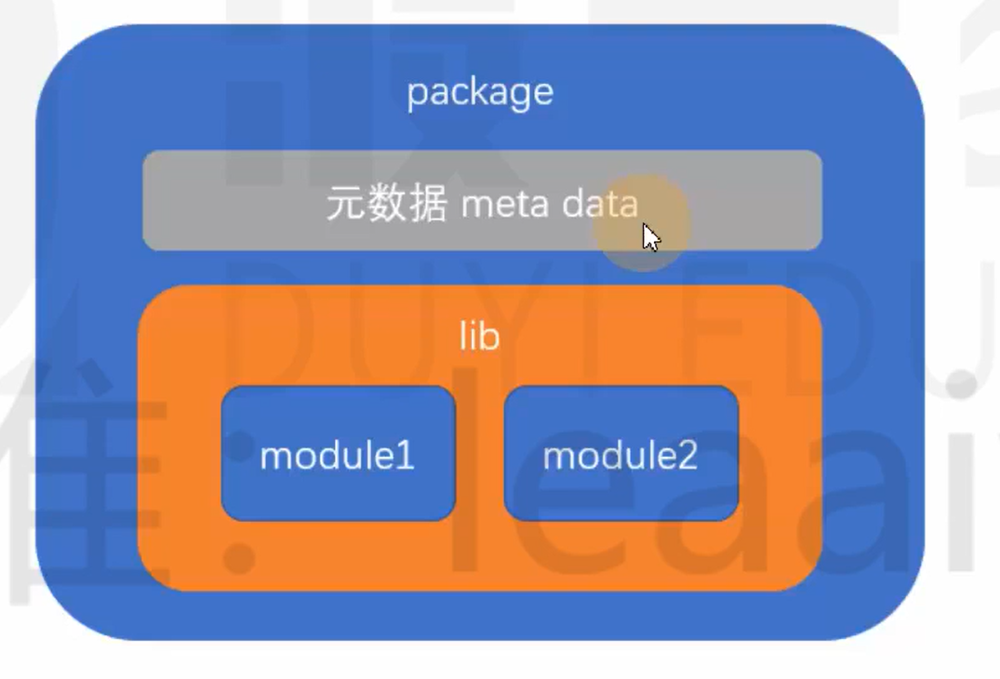
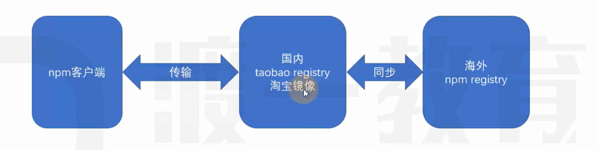
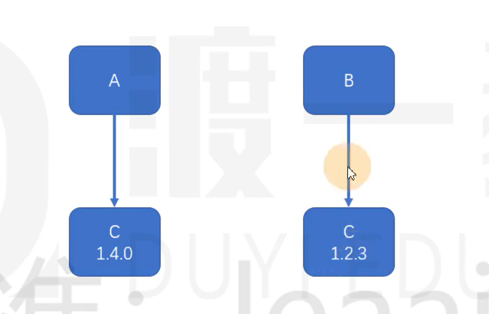
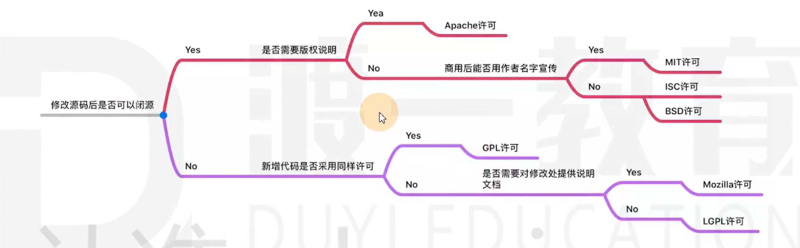
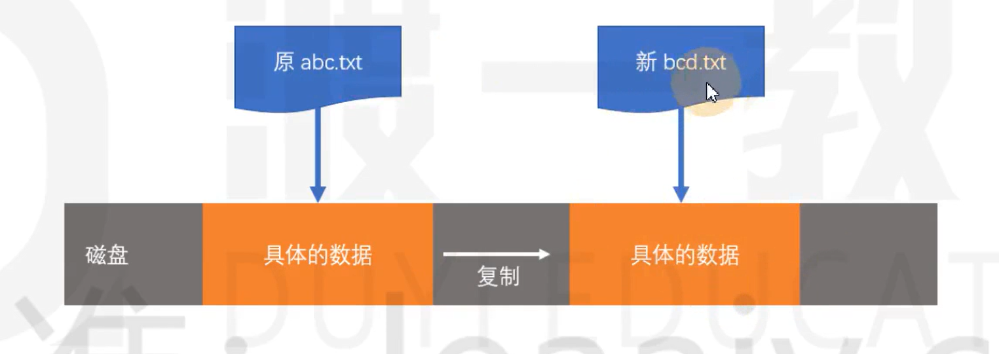
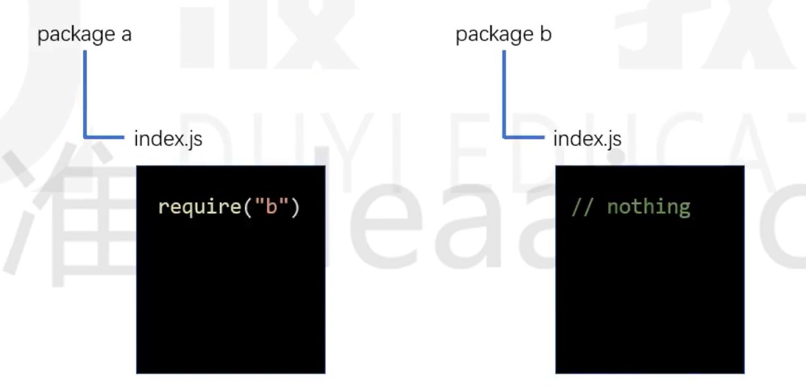
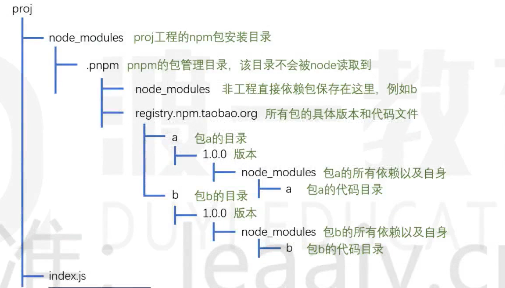

> 本门课程前置知识: JavaScript, ES6, 模块化, git
> 本门课程的所有代码均书写在 `node` 环境中,不涉及浏览器环境.

# 概述 

## 概念

### 模块(module)

通常以单个文件形式存在的功能片段,入口文件通常称为**入口模块**或**主模块**

### 库(library, 简称 lib)

以一个或多个模块组成的完整个功能块, 为开发中某一方面的问题提供完整的解决方案

### 包(package)

包含元数据的库,这些元数据包括: 名称, 描述, git主页, 许可证协议, 作者, 依赖等



## 背景 

CommonJS的出现,使node环境下的JS代码可以用模块更加细粒度的划分.一个类,一个函数,一个对象,一个配置等等,均可以作为模块,这种细粒度的划分,使开发大型应用的基石.

为了解决在开发过程中遇到的常见的问题,比如加密,提供常见的工具方法,模拟数据等,一时间,在前端社区涌现了大量的第三方库.这些库使用CommonJS标准书写而成,非常容易使用.

然而,在下载使用这些第三方库的时候,遇到难以处理的问题.

- 下载过程繁琐
  - 进入官网或github主页
  - 找到并下载相应的版本
  - 拷贝到工程目录中
  - 如果遇到同名的库,需要更改名称
- 如果该库需要依赖其他的库,还要按照要求先下载其他的库
- 开发环境中安装的大量的库如何在生产环境中还原,又如何区分
- 更新一个库极度麻烦
- 自己开发的库,如何在下一次开发使用

## 前端包管理器

>npm: 重点
>
>yarn: 了解
>
>其他: 了解

`npm`全称为`node package manager`,即node包管理器.它运行在node环境中,让开发者可以用简单的方式完成包的查找,安装,更新,卸载,上传等操作

>npm之所以要运行在node环境,而不是浏览器环境,根本原因是浏览器环境无法提供下载,删除,读取本地文件的功能.而node属于服务器环境没有浏览器的种种限制,理论上可以完全掌控运行node的计算机

npm的出现,弥补了node没有包管理器的缺陷,于是很快,node在安装文件中内置了npm,当开发者安装好node后,就自动安装了npm, 不仅如此,node环境还专门为npm提供了良好的支持,使用npm下载包更加方便了

npm由三部分组成

- registry: 入口
  - 可以把它想象成一个庞大的数据库
  - 第三方库的开发者,将自己的库按照npm的规范,打包上传到数据库中.
  - 使用者通过统一的地址下载第三方包
- 官网: https://www.npmjs.com/
  - 查询包
  - 注册,登录,管理个人信息
- CLI: `command-line-iterface` 命令行接口
  - 这一部分是本门课程讲解的重点
  - 安装好npm后,通过CLI来使用npm的各种功能

# 包的安装



随着开发的进展,`node_modules`目录会变得异常庞大,目录下的内容不适合直接传输到生产环境,因此通常使用`.gitignore`文件来忽略该目录中的内容

本地安装使用于绝大部分的包,它会在当前目录及其子目录中发挥作用,通常在项目的根目录中使用本地安装.

安装一个包的时候,npm会自动管理依赖,它会下载该包的依赖包到`node_modules`目录中

如果本地安装的包带有CLI ,npm会将它的CLI脚本文件放置到`node_modules/.bin`下,使用命令`npx 命令名`即可调用

## 全局安装

全局安装的包放置在一个特定的全局目录,该目录可以通过`npm config get prefix`查看

>全局安装的包并非所有工程可用,它仅提供**全局的CLI工具**

大部分情况下,都不需要全局安装包,除非

- 包的版本非常稳定,很少有大的更新
- 提供的CLI工具在各个工程中使用的非常频繁
- CLI工具仅为开发环境提供支持,而非部署环境

# 包配置

目前遇到的问题

1. 拷贝工程后如何还原
2. 如何区分开发依赖和生产依赖
3. 如果自身的项目也是一个包,如何描述包的信息

## 配置文件

npm将每个使用npm的工程都看作一个包,包的信息需要通过一个名称固定的配置文件来描述

**配置文件的固定名称为`package.json`**

可要手动创建或使用`npm init`命令创建

配置文件中可以描述大量的信息,包括

- name: 包的名称, 该名称必须是**英文单词字符**,并且命名规范为**连字符**
- version: 版本
  - 版本规范: 主版本号.次版本号.补丁版本号
  - 主版本号: 当程序发生了重大变化时才会增长,如新增了重要功能,新增了大量的API,技术架构发生了重大变化
  - 次版本号: 仅当程序发生了一些小变化时才会增长,如新增了一些小功能,新增了一些辅助API
  - 补丁版本号: 仅当解决了一些bug或进行了一些局部优化时更新, 如修复了某个函数的bug,提升了某个函数的运行效率
- description: 包的描述
- homepage: 官网地址
- author: 包的作者, 必须是有效的npm账户名,书写规范是`account<mail>`,例如:`zhangsan <zhangsan@gmail.com>`,不正确的账号和邮箱可能导致发布包时失败.
- repository: 包的仓储地址,通常指git或svn的地址,它是一个对象
  - type: 仓储类型, git或svn
  - url: 地址
- main: 包的入口文件,使用包的人默认从该入口文件导入包的内容
- keywords: 搜索关键字,发布包以后,可以通过该数组中的关键字搜索到包

使用`npm init --yes`或`npm init -y`可以在生成配置文件时自动填充默认配置.

## 保存依赖关系

大部分的时候,我们仅仅是开发项目,并不会把它打包发布出去,尽管如此,我们仍然需要`package.json`文件

**package.json文件最重要的作用,是记录当前工程的依赖**

- dependencies: 生产环境的依赖包
- devDependencies: 仅开发环境的依赖包

配置好依赖后,使用下面的命令即可安装依赖

```powershell
## 本地安装所有依赖 dependencies + devDependencies
npm install
npm i

## 仅安装生产环境的依赖 dependencies
npm install --production
```

这样一来,代码移植就不是问题了,只需要移植源代码和`package.json`文件,不用移植`node_modules`目录,然后在移植之后,通过命令即可重新恢复安装

```powershell
npm i package # 安装生产依赖
npm i package -D # 安装开发依赖
```

> 自动保存的依赖版本,例如`^15.1.3`,这种书写方式叫做语义版本号,(semver version),具体规则后续讲解

# 包的使用

nodejs对包的支持非常良好

当使用nodejs导入模块时, 如果模块路径不是以`./`或`../`开头,则node会认为导入的模块来自`node_modules`目录,例如:

```
var _ = require("lodash");
```

它首先会从当前目录的以下位置寻找文件

```
node_modules/lodash.js
node_modules/lodash/入口文件
```

若当前目录没有这样的文件,则会回溯到上级目录按照同样的方式查找

如果到顶级目录都无法找到文件,则抛出错误

上面提到的入口文件按照以下规则确定

1. 查看导入包的package.json文件,读取main字段作为入口文件
2. 若不包含main字段,则使用index.js作为入口文件

> 入口文件的规则同样适用于自己工程中的模块
>
> 在node中,还可以手动指定路径来导入相应的文件,这种情况比较少见

# 简易数据爬虫

将豆瓣电影的电影数据抓取下来,保存到本地文件`movie.json`中

需要用到的包

- axios
- cheerio

# 语义版本

思考: 如果你编写了一个包a, 依赖另外一个版本包b, 你在编写代码时,包b的版本是2.4.1,你是希望使用你包的人一定要安装包b,并且是2.4.1版本,还是希望他可以安装更高的版本,如果你希望他安装更高的版本,高到什么程度呢?

回顾:版本号规则

版本规范: 主版本号.次版本号.补丁版本号

- 主版本号: 仅当程序发生了重大变化时才会增长,如新增了重要功能,新增了大量的API,技术架构发生了重大变化
- 次版本号: 仅当程序发生了一些小变化时才会增长,如新增了一些小功能,新增了一些辅助性API
- 补丁版本号: 仅解决了一些bug或进行了一些局部优化时更新,如修复了某个函数的bug, 提升了某个函数的运行效率

有的时候,我们希望,安装我的依赖包的时候,次版本号和布丁版本号是可以有提升的,但是主版本号不能变化

有的时候,我们又希望:安装我的依赖包的时候,只有补丁版本号可以提升,其他都不能提升

甚至我们希望依赖包保持固定的版本,尽管这比较少见

这样一来,就需要在配置文件中描述清楚具体的依赖规则,而不是直接写上版本号那么简单.

这种规则的描述,即**语义版本**

语义版本的书写规则非常丰富,下面列出了一些常见的书写方式

| 符号 | 描述                 | 示例        | 示例描述                                              |
| ---- | -------------------- | ----------- | ----------------------------------------------------- |
| >    | 大于某个版本         | >1.2.1      | 大于1.2.1版本                                         |
| >=   | 大于等于某个版本     | >=1.2.1     | 大于等于1.2.1版本                                     |
| <    | 小于某个版本         | <1.2.1      | 小于1.2.1版本                                         |
| <=   | 小于等于某个版本     | <=1.2.1     | 小于等于1.2.1版本                                     |
| -    | 介于两个版本之间     | 1.2.1-1.4.5 | 介于1.2.1和1.4.5之间                                  |
| x    | 不固定的版本号       | 1.3.x       | 只要保证主版本号是1,次版本号是3即可                   |
| ~    | 补丁版本号可增       | ~1.3.4      | 保证主版本号是1,次版本号是3,补丁版本号大于等于4       |
| ^    | 次版本和补丁版本可增 | ^1.3.4      | 保证主版本号是1,次版本号大于等于3,补丁版本号大于等于4 |
| *    | 最新版本             | *           | 始终安装最新版本                                      |

## 避免还原的差异

版本依赖控制始终是一个两难的问题

如果允许版本增加,可以让依赖包的bug得以修复(补丁版本号),可以带来一些意外的惊喜(次版本号),但同样可能带来不确定的风险(新的bug)

如果不允许版本增加,可以获得最好的稳定性,但失去了依赖包自我优化的能力

而有的时候情况更为复杂,如果依赖包升级后,依赖也发生了变化,会有更多的不确定的情况出现

基于此, npm在安装包的时候,会自动生成一个`package-lock.json`文件,该文件记录了安装包时的确切依赖关系

当移植工程时,如果移植了`package-lock.json`文件,恢复安装时,会按照`package-lock.json`文件中的确切依赖进行安装,最大限度的避免了差异

## 扩展:npm的差异版本处理

如果两个包依赖同一个包的不同版本,如下图



面对这种情况,在`node_modules`目录中,不会使用扁平的目录结构,而是使用嵌套的.


# npm脚本

在开发的过程中,我们可能会反复使用某些命令

可以在`package.json`文件中使用`scripts`字段进行配置,使用`npm run`命令来运行脚本.

不仅如此,npm还对某些常用的脚本名称进行了简化,下面的脚本名称是不需要使用`run`的

- stop
- start
- test

一些细节

- 脚本中可以省略npx
- start脚本有默认值 `node server.js`

# 运行环境配置

我们书写代码一般有三种运行环境:

1. 开发环境
2. 生产环境
3. 测试环境

有的时候,我们可能需要在node代码中根据不同的环境做出不同的处理

如何优雅地让node知道处于什么环境,是极其重要的

通常我们使用如下的处理方式:

node中有一个全局变量`global`(可以类比为浏览器环境的window),该变量是一个对象,对象中的所有属性均可以直接使用

`global`有一个属性是`process`该属性是一个对象,包含了当前运行node程序的计算机的很多信息,其中有一个信息是`env`,是一个对象,包含了计算机中所有的系统变量

通常,我们通过系统变量`NODE_ENV`的值,来判定node程序处于何种环境

由两种方式设置`NODE_ENV`的值

1. 永久设置
2. 临时设置

一般使用临时设置

因此,我们可以配置`scripts`脚本,在设置好了`NODE_ENV`后启动程序

> 为了避免不同系统的设置方式的差异,可以使用第三方库`cross-env`对环境变量进行设置

## 在node中读取`package.json `

在node中,可以直接导入一个json格式的文件,它会自动将其转换为js对象

# 其他npm命令

## 安装

1. 精确安装最新版本

```powershll
npm install --save-exact 包名
npm i -E 包名 
```

2. 安装指定版本

```powershell
npm i 包名@版本号
```

## 查询

1. 查询包的安装路径

```
npm root [-g]
```

2. 查看包的信息

```
npm view 包名 [子信息]
## view aliases: v info show
```

3. 查询安装包

```powershell
npm list [-g] [--depth=深度依赖]
## list aliases: ls la ll
```

## 更新

1. 检查有哪些包需要更新

```
npm outdated
```

2. 更新包

```
npm update [-g] [包名]
## update 别名(aliases): up upgrade
```

## 卸载

```
npm uninstall [-g] 包名
## uninstall aliases: remove, rm, r, un, unlink
```

## npm配置

一个用户配置,一个系统配置,前者优先

```
npm config ls [-l] [--json]
```

# 发布包

## 准备工作

1. 使用官方镜像源
2. 进入npm官网认证并邮箱注册
3. 本地使用`npm cli`进行登录
   1. 使用`npm login`进行登录
   2. 使用命令`npm whoami`查看当前登录账号
   3. 使用命令`npm logout`退出登录
4. 创建工程根目录
5. 使用npm init进行初始化



可以通过网站https://choosealicense.com/选择协议,并复制协议内容

## 发布

1. 开发
2. 确定版本
3. 使用命令`npm publish`完成发布

# yarn简介

> yarn官网: https://www.yarnpkg.com/

yarn是由Facebook, Google, Exponent和Tilde联合退出了一个新的JS包管理器,它仍然使用npm的registry,不过提供了全新的CLI来对包进行管理

过去,yarn的出现极大的抢夺了npm的市场,甚至有人戏言,npm只剩下一个registry了

之所以会出现这种情况,是因为在过去,npm存在以下问题

- 依赖目录嵌套层次深: 过去,由于npm的依赖是嵌套的,这在windows系统上是一个极大的问题, 由于众所周知的原因,windows无法支持太深的目录
- 下载速度慢
  - 由于嵌套层次的问题,所以npm对包的下载只能是串行下载,即一个包下载完成后才能下载下一个包,导致带宽资源没有完全利用
  - 多个相同版本的包被重复下载
- 控制台输出繁杂: 过去npm安装包的时候,每安装一个依赖,就会输出依赖的详细信息,导致一次安装有大量的信息输出到控制台,遇到错误极难查看
- 工程移植问题: 由于npm的版本依赖可以是模糊的,可能会导致工程移植后,依赖的确切版本不一致

针对上述问题,yarn从诞生那天就已经解决,它用到了以下的手段

- 使用扁平的目录结构
- 并行下载
- 使用本地缓存
- 控制台仅输出关键信息
- 使用`yarn-lock`文件记录确切的依赖

不仅如此,yarn还优化了以下内容

- 增加了某些功能强大的命令
- 让既有的命令更加语义化
- 本地安装的CLI工具可以使用yarn直接启动
- 将全局安装的目录当做一个普通的工程,生成`package.json`文件,便于全局安装移植

yarn的出现给npm带来了巨大的压力,很快,npm学习了yarn的先进的理念,不断地对自身进行优化,几乎解决了所有问题

- 目录扁平化
- 并行下载
- 本地缓存
- 使用`package-lock`记录确切依赖
- 增加了大量的命令别名
- 内置了npx,可以启动本地的CLI工具
- 极大地简化了控制条的输出

## 总结

两者相似了

# yarn的核心命令

## 初始化

```
yarn init [--yes/-y]
```

## 安装

添加指定包: `yarn [global] add package-name [--dev/-D] [--exact/-E]`

安装package.json中的所有依赖: `yarn install [--production/--prod]`

## 脚本和本地CLI

运行脚本: `yarn run 脚本名`

> start, stop, test 可以省略run

运行本地安装的CLI: `yarn run CLI名`

## 查询

查看bin目录: `yarn [global] bin`

查询包信息: `yarn info 包名 [子字段]`

列举已经安装的依赖: `yarn [global] list [--depth=依赖深度]`

> yarn的list命令和npm的list不同,yarn的输出的信息更加丰富,包括顶级目录结构,每个包的依赖版本号

## 更新

列举需要更新的包: `yarn outdated`

更新包: `yarn [global] upgrade [包名]`

## 卸载

`yarn remove 包名`

# yarn的特别礼物

在终端命令上,yarn还增加了一些命令

1. yarn check: 验证package.json文件的依赖记录和lock文件是否一致,这对于防止篡改非常有用
2. yarn audit: 检查本地安装的包有哪些已知的漏洞,以表格的形式列出,漏洞分为以下几种
   - INFO: 信息级别
   - LOW: 低级别
   - MODERATE: 中级别
   - HIGH: 高级别
   - CRITICAL: 关键级别
3. yarn why: 使用`yarn why 包名`可以在控制台打印出为什么安装了这个包,哪些包会用到它
4. yarn create:

今后,我们会学习一些脚手架,用命令来搭建一个工程结构

过去,我们通常都是使用如下做法

- 全局安装脚手架工具
- 使用全局命令搭建脚手架

由于大部分脚手架工具都是以`create-xxx`的方式命名的,比如`react`的官方脚手架名称为`create-react-app`

因此,可以使用`yarn create`命令来一步完成安装和搭建

例如

```powershell
yarn create react-app my-app
# 等同于下面的两条命令
yarn global add create-react-app
create-react-app my-app
```

# cnpm

> 官网地址: https://npmmirror.com

# nvm

管理node版本

# pnpm

具有以下优势

1. 目前,安装效率高于npm和yarn的最新版
2. 极其简洁的`node_modules`目录
3. 避免了开发时使用间接依赖的问题
4. 能极大地降低磁盘的空间的占用

## 安装和使用

全局安装pnpm

```powershell
npm i -g pnpm
```

## 原理

1. 同yarn和npm一样,pnpm仍然使用缓存来保存已经安装过的包,以及使用`pnpm-lock.yaml`来详细记录依赖版本
2. 不同于yarn和npm, pnpm使用**符号连接和硬链接**(可以将他们想象成快捷方式)的做法来放置依赖,从而规避了从缓存中拷贝文件的时间,是得安装和卸载的速度更快
3. 由于使用了**符号连接和硬链接**,pnpm可以规避windows系统路径过长的问题,因此,他选择使用树形的依赖结构,有着几乎完美的依赖管理也是因为如此,项目中只能使用直接依赖,而不能使用间接依赖

## 注意事项

由于pnpm会改动node_modules的目录结构,使得每个包只能使用直接依赖,而不能使用间接依赖,因此,如果使用pnpm安装的包中包含间接依赖,则会出现问题

由于pnpm超高的安装和卸载效率,越来越多的包开始修正之前的间接依赖代码

# pnpm原理

## 概念

> 要彻底理解pnpm是怎么做的,需要有一些操作系统的知识

### 文件的本质

在操作系统中, 文件实际上是一个指针,只不过它指向的不是内存地址,而是一个外部存储地址(这里的外部存储可以是硬盘,U盘,甚至是网络);

当我们删除文件时,删除的实际上是指针,因此,无论删除多么大的文件,速度都非常快

### 文件的拷贝

如果你复制一个文件,是将该文件指针指向的内容进行复制,然后产生一个新的文件指向新的内容



### 硬链接 hard link

硬链接的概念来自于Unix操作系统,它是指将一个文件A指针复制到另一个文件B指针中,文件B就是文件A的硬链接


通过硬链接,不会产生额外的磁盘占用,并且,两个文件都能找到相同的磁盘

windows Vista操作系统开始,支持了创建硬链接的操作,在cmd中使用如下命令可以创建硬链接

```cmd
mklink /h 链接名称 目标文件
```

由于文件夹(目录)不存在文件内容,所以文件夹(目录)不能创建硬链接

> 由于种种原因,在windows操作系统中,通常不跨越盘符创建硬链接

### 符号链接 symbol link

符号链接又称为软连接,如果为某个文件或文件夹A创建符号链接B,则B指向A


windos Vista操作系统开始,支持创建符号链接的操作,在cmd使用下面的命令可以创建符号链接

```cmd
mklink /d 链接名称 目标文件
# /d 表示穿件的是目录的符号链接,不写/d则代表创建的是文件的符号链接
```

### 符号链接和硬链接的区别

1. 硬链接只能链接文件,而符号链接可以链接文件夹
2. 硬链接在连接完成后仅和文件内容相关联,和之前链接的文件没有任何关系.而符号链接始终和之前链接的文件相关联,和文件的内容不直接相关

### 快捷方式

快捷方式类似于符号链接,是windows系统早期就支持的链接方式

它不仅仅是一个指向其他文件或目录的指针,其中还包含了各种信息: 如权限,兼容性启动方式等等各种属性

由于快捷方式是windows系统独有的,在跨平台的应用中不会使用

### node 环境对硬链接和符号链接的处理

**硬链接**: 硬链接是一个实实在在的文件,node不对其做任何特殊处理,也无法区别对待,实际上,node根本无从知晓该文件到底是不是一个硬链接

**符号链接**: 由于符号链接指向的是另一个文件或目录,当node执行符号链接下的JS文件时,会使用**原始路径.**

## pnpm原理

pnpm使用符号链接和硬链接来构建`node_modules`目录

下面用一个例子来说明它的构建方式

假设两个包a和b, a依赖b 



假设我们的工程为proj,直接依赖a,则安装时,pnpm会做以下处理

1. 查询依赖关系,得到最终要安装的包: a和b
2. 查看a和b是否已经有缓存,如果没有,下载到缓存中,如果有,则进入下一步
3. 创建`node_modules`目录,并对目录进行结构初始化



4. 从缓存中

