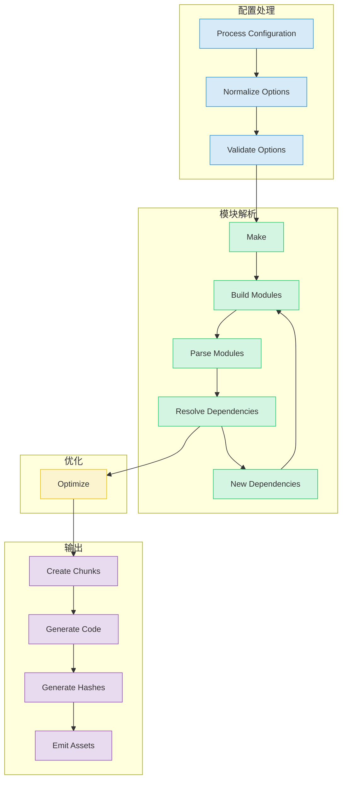
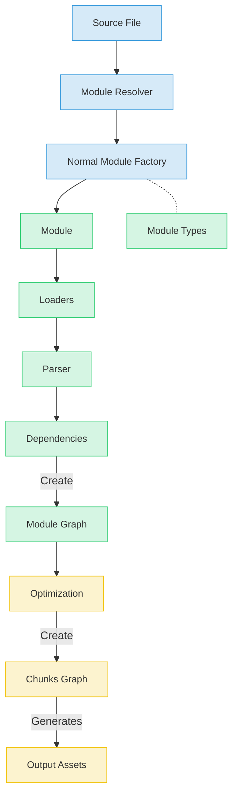

# 概述

Webpack是一个用于JavaScript应用程序的模块打包工具。它转换，打包并组合代码和其他资源，以便在浏览器或其他平台上使用。本节内容提供了Webpack仓库架构的高层次概述，以及其核心系统及其交互方式。

## 什么是Webpack

Webpack是一个**静态**模块打包工具，它通过分析应用程序的模块依赖关系图生成**一个或多个**打包文件。虽然主要是专注于JavaScript，但是Webpack可以通过其**加载器(loader)**系统转换几乎所有类型的文件。本质上，Webpack分析具有依赖关系的模块，生成打包文件，作为浏览器或其他环境的静态资源。

## 核心系统架构

Webpack由几个关键系统组成，这些系统协同工作以处理模块并生成输出。其架构高度模块化并且可扩展，围绕着插件系统构建。

## 编译流程

Webpack的编译过程包括：配置处理，模块解析，转换，优化和代码生成。

## 入口和API使用

Webpack可以通过其Node.js 或命令行界面(webpack-cli)以编程的方式使用。

### 命令行界面

`bin/webpack.js`脚本作为CLI使用的入口。它会检查webpack-cli是否存在，如果存在，就将任务委托给webpack-cli。

### Node.js API

`lib/webpack.js`导出webpack函数，它是用编程的方式使用的主要入口。

## 模块处理系统

Webpack的核心功能是处理模块。它处理各种模块类型并管理他们的依赖关系。

## 扩展点

Webpac通过其插件(Plugin)架构和加载器(Loader)系统实现高度的扩展性。

### 插件(Plugin)系统

插件通过webpack的事件钩子来修改和扩展编译过程。

### 加载器(Loader)系统

加载器在文件被包含到依赖图之前对其进行预处理，使webpack能够处理非JavaScript文件类型。

## 输出生成与优化

Webpack 提供了多种优化功能和输出选项，用于生成优化的代码包。

## 实例用法和集成

Webpack包含大量示例，展示了其功能，从基本的打包到高级特性如代码分割，懒加载和多种输出格式。

## 生态系统

Webpack在一个广泛的工具和插件生态系统中运行。这些工具和插件增强了其功能。

## Webpack中的数据流

## 结论

Webpack的架构基于一个灵活的，插件化的系统，允许进行广泛的定制和扩展。核心的Compiler和Compilation类负责协调构建的过程，而Module Graph和Chunk Graph则表示依赖关系和输出包的内部状态。

