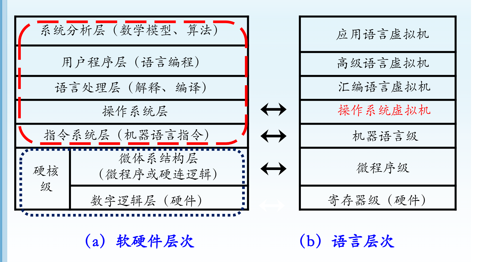
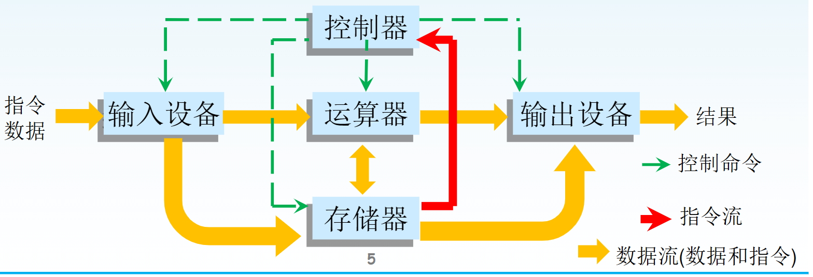
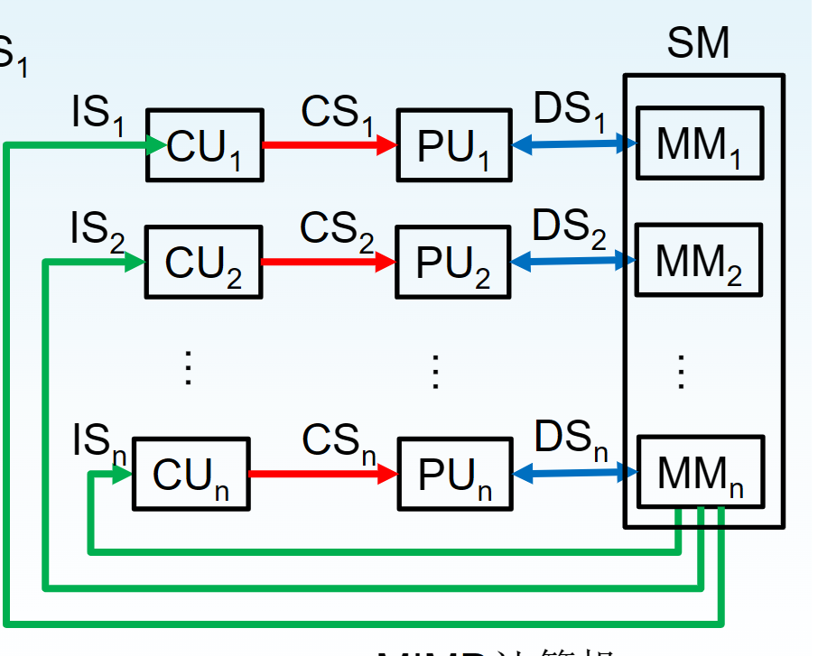
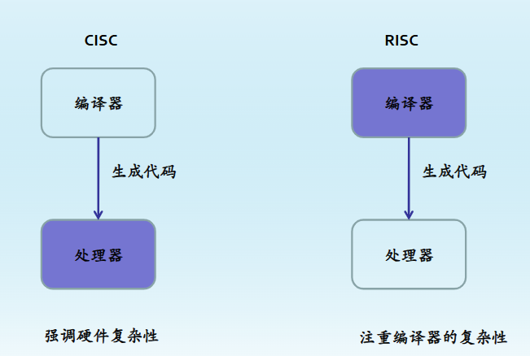
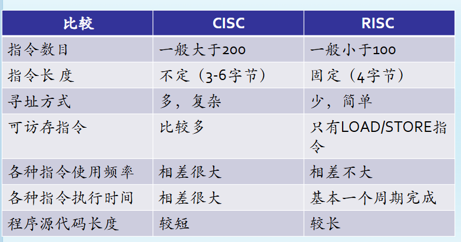
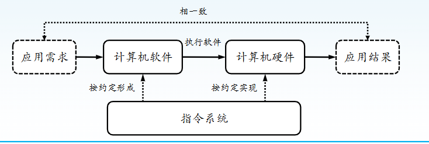
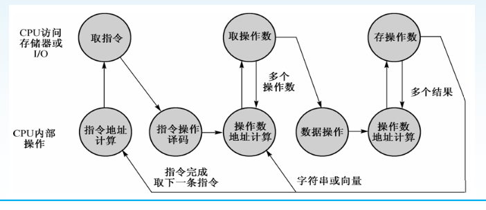

# 计算机系统的结构组成与工作原理

## 计算机系统的基本结构与组成

### 层次模型`Hiberarchy`

图(a)自下而上反映了逐级**开发**计算机系统的过程，自上而下反映了计算机系统**求解**问题的过程。

图(b)的语言层次越往上抽象程度越高

简单地分为三个层次

- 针对解决具体问题的应用软件
- 包括操作系统在内的软件
- 计算机系统硬件

### 结构`Architecture`,组成`Organization`与实现`Realization`

- 计算机系统的体系结构

程序员关心的计算机概念结构和功能特性(**系列机**)

如：确定指令集中是否有乘法指令；

- 计算机系统的组成

从硬件角度关注物理机器的组织

如：乘法指令由专用乘法器还是用加法器实现

- 计算机系统的实现方式

底层的器件技术，微组装技术，冷却技术等

如：加法器底层的物理器件类型及微组装技术

## 计算机系统的工作原理

### 冯·诺伊曼计算机架构

- 程序和数据存放在存储器中
- 控制器实现指令的执行操作
- 运算器完成各种算数逻辑运算
- 输入设备和输出设备分别完成指令和原市数据的输入，运算结果的输出

### 模型机：系统结构，指令集，工作流程

**处理器**：计算机系统的计算，控制中心，用来实现算术逻辑运算及其他各种操作，并实现对计算机系统所有部件的控制。

- CPU 主要由**控制器，运算器和寄存器组**组成，并通过**内部总线**连接
- 控制器根据**指令进行译码**，产生控制 CPU 内部**各模块间信息传输**的控制信号，并产生**控制外设**的控制信号
- 运算器完成各种算术逻辑等运算操作

**程序的执行**

- 程序由完成一定功能的**多条指令**组成
- 指令执行的过程分为三个阶段
  - 从存储器**读取指令(fetch)**
  - CPU 的控制器解析指令(decode),即**指令译码**
  - **执行指令(execute)**,各个控制信号控制 CPU 内部和外部电路完成对应的操作功能。

**存储器**：存放处理器可以直接运行的程序，数据和结果

- **RAM(Random Access Memory)**随机存取存储器，是半导体类型的存储器，可随时将程序和数据写入或读出。一旦断电后，存放在其中的程序和数据即消失
- **ROM(Read Only Memory)**只读存储器，是半导体存储器，一般情况下只能读出存放在其中的程序和数据，在特殊条件下才能将程序和数据写入。断电后，存放在其中的内容不会消失。

存储器是**存放机器指令和数据**等信息的载体，由 3 部分组成

- 存储体：存放**机器指令和数据(均为 0,1 序列)**的电路实体，划分为多个单元，每个单元有多个二进制位
- 地址：指示指令和数据的**具体存放位置**，由地址寄存和译码器组成
- 控制电路：控制存储体中信息的**输入或输出**

**存储器访问原理**

- 写操作： 提供给的地址信号经地址译码选中存储位置，控制操作为输入，数据输入到存储器并存放
- 读操作：控制为输出，地址信号经地址译码选中存储位置，该位置的数据由数据线输出

**存储子系统**：存放当前的运行程序和数据

**外设**：输入设备与输出设备的统称
**I/O 接口**：处理器与计算机系统各种输入/输出设备之间的电路

**输入输出子系统**：完成计算机与外部的信息交换

**总线**：根据传输信息的不同

- 数据总线 DB：用于数据交换，传送机器指令，原始数据和计算结果信息，通常是**分时双向的**
- 地址总线 AB：通常是**单向**的，由**主设备**(如 CPU)发出，用于选择读写对象(如某个特定的存储单元或外部设备端口)
- 控制总线 CB：用于传输方向，传送时间，异常处理等各种控制的信号。包括真正的**控制**信号线(如读/写信号)和一些**状态**信号线(如是否已将数据送上总线)，用于实现对设备的监视和控制。

**总线子系统**：作为公共通道连接各子部件，用于实现各部分之间的数据，信息等的传输和交换

**指令**是发送到 CPU 的命令，指示 CPU 执行一个特定的处理，如数据搬移，对数据进行算术运算

指令通常包含**操作码**和**操作数**两部分

- 操作码指明要完成的操作功能，如加，减，数据传送，移位等
- 操作数指明上述规定操作的数据或获取该数据所存放地址的方法

指令通常有两种形式

- 机器指令：包含操作码和操作数，由 0 和 1 组成，CPU 能直接解析，执行并完成一定功能，如 1011 0000 0101 1100
- 汇编指令：与机器指令功能一一对应，由具有一定含义的字符串，寄存器名和立即数组成，如`MOV R1,#5CH`

**模型机的执行过程**

计算机的运行本质上就是**执行程序**的过程

程序执行的两种类型

- 顺序执行
- 非顺序执行
  - 转移(jump)：执行条件/无条件转移指令，**不返回**
  - 过程(procedure)调用：子程序执行完后，**返回原处**
  - 异常(exception)：将正常程序(包括顺序，转移，过程调用等)的执行过程暂时中止，转而执行其他级别更高的程序，如数据出错
  - 中断(interrupt)：异常之一，用于优先级更高的处理

## 微处理器体系结构的演进

冯·诺伊曼机器的数据传输时瓶颈，解决途径

- 程序和数据分开存储，即**哈弗结构**
- 采用并行结构，包括**流水线结构**

### 指令集结构的演进

**CISC(Complex Instruction Set Computer)**，复杂指令集：为软件编程方便和提高程序的运行速度，不断增加可**实现复杂功能的指令和多种灵活的寻址方式**。为实现程序兼容,同一系列的新机器的指令系统只能扩充而不能减少,也使指令系统愈加复杂

- 优点:有较强的**处理高级语言**的能力
- 缺点:**硬件越来越复杂**,反而影响了执行速度和性能.典型程序的 80%使用 20%的指令实现的
- 演进:指令系统应当**只包含哪些使用频率很高的少量指令**.适当保留支持高级语言和操作系统的必要指令,即精简指令集

**RISC(Reduced Instruction Set Computer)**, 精简指令集.

- RISC 把较长的指令分拆成若干条**长度相同的单一操作**指令,可使 CPU 的工作变得单纯,速度更快,设计和开发也更简单.
- 缺点: 软件支持较少
- 演进:CISC 吸纳 RISC 技术优点,RISC 保持部分 CISC 先进思想.**架构不同,技术融合**

### 体系结构的演进

**冯·诺伊曼**体系结构也称为**普林斯顿结构**,它把**程序指令看作为特殊的数据**,可以像数据一样被处理,将**程序和数据存放在相同的存储器中**,

采用**统一编制**,但程序存储地址和数据存储地址指向不同的物理位置.

- 在通用计算机系统中由于灵活方便**重分代码与数据空间**,更新内容而占有优势.统一编址可以最大限度地利用资源.
- 如程序执行过程所述,处理器首先到程序指令存储器中**读取程序指令内容,解码后得到数据地址**,再到相应的数据存储器中读取数据,并进行下一步的操作(如运算处理).显然**读取指令和读取数据是串行的**,速度慢.
- 演进为哈弗结构

**哈弗结构**,是一种将**程序指令存储和数据存储完全分开**的存储器结构,采用分离编址.

- 哈弗与两个存储器相对应的是系统的 4 套总线.

  - 程序的数据总线
  - 程序的地址总线
  - 数据的数据总线
  - 数据的地址总线

  可以在一个机器周期内同时获得**指令码**(来自程序存储器)和**操作数**(来自数据存储器),从而提高了执行速度

- 由于程序和数据存储器在两个分开的物理空间中,因此**取指**和**执行**能**完全重叠**

- 哈弗结构的缺点: 数据存储器和程序代码存储器各自需要数据与地址总线,**引脚信号线多**

- 再次演进: 对于 CPU 内部,通过不同的**数据和指令 cache**,采用哈弗结构以有效的提高指令的执行效率.而处理器外部采用冯·诺伊曼结构

### 总线结构

**总线**:用于连接计算机系统各部件的导线集合,即部件间传输信息的**共用通道**,可以是线缆,也可以是 PCB 板上的金属线

计算机系统的部件之间通信为何采用总线结构

- 存储器由多种类型,多种功能,**多组芯片**组成
- 计算机外部设备因**功能,性能和应用等不同**而具有各自的接口电路
- 多电路部件,多芯片间的**点对点互联复杂,连线多,扩展性差**

**按照总线在计算机系统中所处位置不同划分**

- CPU 片内总线: 连接 CPU 内部控制器,运算器和寄存器组的总线
- 片总线: 通常指处理器芯片引脚的总线,用于连接处理器片外的存储器,接口芯片等
- 系统总线: 用于连接计算机系统外的其他电路模块的总线,如 PCI 总线

### 存储器结构

如何以**合理的价格搭建出容量和速度都满足要求**的存储器系统,始终是计算机体系结构设计中的关键问题之一.

现代计算机系统通常把不同的存储设备按一定的体系结构组织起来,以解决**存储容量,存取速度和价格之间的矛盾**

采用**分级结构**,以均衡速度,容量,成本,长期存储等问题.

在存储器分层结构中,上面一层的存储器作为下一层存储器的高速缓存

- CPU 中的寄存器就是 cache 的高速缓存,寄存器保存来自 cache 的字
- cache 又是内存层的高速缓存,从内存中提取数据送给 CPU 进行处理,并将 CPU 的处理结果返回到内存中
- 内存又是主存储器的高速缓存,它将经常用到的数据从 Flash 等主存储器中提取出来,放到内存中,从而加快了 CPU 的运行效率
- 嵌入式系统的主存储器容量是有限的,磁盘,光盘或 CF,SD 卡等外部存储器用来保存大信息量的数据
- 在某些带有**分布式文件系统的嵌入式网络系统**中,外部存储器就作为其他系统中被存储数据的高速缓存

### 微处理器机构的改变

**通过"并行"提高处理速度**

- 多层次的并行处理技术
- 流水线结构
- 超标量结构
- 超长指令字
- 多核结构
- 并行机

**并行处理技术**实现多个处理器或处理模块的并行性,其基本思想包括**时间重叠(time interleaving)**,**资源重复(resource replication)**,和**资源共享(resource sharing)**

- 电路级并行技术 CLP

  - 组相联 cache, 先行进位加法器

- 指令级并行技术 ISP

  - 流水线，超标量

  不同的处理器的流水线级数不同

  
  超标量技术：通过重复设置多套指令执行部件，同时处理并完成多条指令，实现并行操作来达到提高处理速度的目的。

  

  可在一个时钟周期内对多条指令进行并行处理，**使 CPI 小于 1**

  有 5 个执行单元的超标量流水线，指令的执行比取指，译码的时间更长，通过超标量均衡各级流水的执行时间。

  **VLIW(Very Long Instruction Word)**超长指令字，**依靠编译器**编译时找出指令之间潜在的并行性，把能并行执行的多条指令组装成一条很长的指令

  处理机中多个**相互独立的执行部件**分别执行长指令中的一个操作，即相当于同时执行多条指令。

  WLIW 处理机很大程度上取决于代码压缩的效率，其编译程序和体系机构的关系非常密切。

- 线程级并行技术

  - 同时多线程

- 系统级并行技术

  - 多处理器

**大规模并行处理机(MPP)**是一种价格昂贵的超级计算机，它由许多 CPU 通过高速专用互联网络连接。

**机群(cluster)**由多台同构或异构的独立计算机通过高性能网络或局域网连在一起协同完成特定的并行计算任务。

**刀片(blade)**通常指包含一个或多个 CPU, 内存以及网络接口的服务器主板。通常一个刀片柜共享其他外部 I/O 和电源，而辅助存储器则由距离刀片柜较近的存储服务器提供。

**网络计算(Network)**是一组由高速网络连接的不同的计算机系统，可以相互合作也可以独立工作。网络计算机将接受中央服务器分配的任务，然后在不忙的时候执行这些任务。

## 计算机体系结构的分类与性能评测

**Flynn 分类**:根据**指令流和数据流**的多少进行分类

CU: 控制部件

PU: 处理部件

MM: 存储单元

CS: 控制流

DS: 数据流

IS: 指令流

- 单指令单数据**SISD**
  - 传统的顺序处理机
  - 标量流水线处理机
  - 超标量流水线处理机

- 单指令多数据**SIMD**
  - 阵列处理机
  - 向量处理机

- 多指令单数据**MISD**,无实际机型对应

- 多指令多数据**MIMD**：多处理机系统

计算机系统的性能由**硬件性能和程序特性**决定，通常使用**标准测试程序**来测定性能

- 用**MIPS**(Million Instructions Per Second,每秒百万条指令)或**MFLOPS**(每秒百万次浮点操作)的数值来衡量计算机系统的硬件速度
- 用**CPU 执行时间 t**来量化硬软件结合系统的有效速度。
  - MIPS=f(MHz)/CPI
  - t(s) = IC\*CPI\*T

T:CPU 主时钟周期(s), 对应的主时钟频率 f=1/T(Hz)

IC(指令数目): 运行的程序指令总数

CPI(Cycles Per Instruction): 平均单条指令执行所需的时钟周期数，可以从运行大量测试程序或实际程序的统计数据中计算出来。

# 微处理器设计技术

## CISC 与 RISC 体系结构

**CISS**的特点及设计思想

- 许多复杂指令很少被使用，“2-8”原则
- 控制器硬件复杂(指令多，且具有不定长格式和复杂的数据类型),占用了大量的芯片面积，且容易出错。
- 指令操作繁杂，速度慢
- 指令规整性不好，不利用采用流水线技术提高性能

**RISC**机的设计应当遵循以下五个原则

- 指令条数少，格式简单，易于译码
- 提供足够的寄存器，只允许`load`和`store`指令访问内存
- 指令由硬件直接执行，在单个周期内完成
- 充分利用流水线
- 依赖优化编译器的作用

**区别**

## 指令系统设计

**指令结构**

> 指令系统是软硬件之间的一个约定,是计算机软硬件接口之一

**指令集结构(ISA)**

指令集结构(Instruction Set Architecture)

处理器的接口，包含了与该处理器交互所需要的信息，但并不设计处理器自身如何设计和实现的细节

ISA包括

- 指令集
- 程序员可以直接访问的寄存器细节
- 访问内存所需要的信息
- 中断(异常)处理

**指令的组成**

- 操作码(operation code, opcode): 需要完成的操作
- 源操作数(source operand reference): 操作所需的输入
- 结果操作数(result operand reference): 操作产生的结果
- 下一条指令(next instruction reference): 告诉CPU到哪里取下一条指令

**指令格式**

在计算机内部，指令由一个位串来表示。相应于指令的各要素，这些位串划分成几个字段

- 操作码字段
  - 说明CPU应进行的操作
  - 按操作类型分组：同类操作要求同样或类似的控制信号，因此编码也类似(有尽可能多的公共位)
- 操作数/地址字段
  - 说明源操作数和目的操作数存放的位置信息(R,M或I/O)
  - 说明源操作数和目的操作数的数据类型
- 下一条指令地址字段
  - 如紧跟当前指令，在主存或虚存中，则不需要显示引用
  - 如可能产生跳转，则需要显示给出存储地址

**操作码设计(指令类型)**

指令操作码**按操作分组**即是指令类型，按功能可分成三种基本类型：

1. 数据传输：将数据从一个地方(源地址)复制到另一个地方(目的地址),传输结束后源地址中的内容不变.
2. 数据运算:算术运算和逻辑运算
3. 控制类:用于改变正常的程序执行流程,完成程序的跳转,主要包括转移指令和过程指令

**操作数字段**

- 立即数寻址:在指令码中指定操作数
- 寄存器直接寻址:指令的地址字段给出寄存器名,而被指定的寄存器的内容就是操作数
- 寄存器简介寻址:指令的地址字段给出寄存器名,而被指定的寄存器的内容是操作数的地址
- 存储器直接寻址:指令的地址字段给定存储单元的地址,存储单元中是操作数
- 存储器间接寻址:指令的地址字段给定存储单元的地址,存储单元中是操作数的地址
- 位移量寻址方式:通常用于数据,矩阵,类向量数据的存取,立即数指定数组首址,寄存器指定组内偏移.
- 变址寻址方式:寄存器1指定数组首地址,寄存器2指定组内偏移
- 比例尺寻址方式:指定**两个寄存器**中的存储器地址加上`imm`字段的位移量
- PC相对寻址方式:主要用在转移和跳转指令,指定汇编语言程序码的内部位置作为**目的地址偏移量**操作数
- 独立编址系统的I/O寻址方式: 系统视端口和存储单元位不同的对象
- 统一编制系统的I/O寻址方式: 将端口看作存储单元,仅以**地址范围的不同**来区分两者.

## 指令流水线设计

**流水线冲突**

理想流水线性能:每个时钟周期完成一条指令

实际流水机器中可能存在**冒险*8导致停顿

- 数据冲突
- 结构冲突
- 控制冲突

