# 计算机系统的结构组成与工作原理

## 计算机系统的基本结构与组成

### 层次模型`Hiberarchy`

图(a)自下而上反映了逐级**开发**计算机系统的过程，自上而下反映了计算机系统**求解**问题的过程。

图(b)的语言层次越往上抽象程度越高

简单地分为三个层次

- 针对解决具体问题的应用软件
- 包括操作系统在内的软件
- 计算机系统硬件

### 结构`Architecture`,组成`Organization`与实现`Realization`

- 计算机系统的体系结构

程序员关心的计算机概念结构和功能特性(**系列机**)

如：确定指令集中是否有乘法指令；

- 计算机系统的组成

从硬件角度关注物理机器的组织

如：乘法指令由专用乘法器还是用加法器实现

- 计算机系统的实现方式

底层的器件技术，微组装技术，冷却技术等

如：加法器底层的物理器件类型及微组装技术

## 计算机系统的工作原理

### 冯·诺伊曼计算机架构

- 程序和数据存放在存储器中
- 控制器实现指令的执行操作
- 运算器完成各种算数逻辑运算
- 输入设备和输出设备分别完成指令和原市数据的输入，运算结果的输出

### 模型机：系统结构，指令集，工作流程

**处理器**：计算机系统的计算，控制中心，用来实现算术逻辑运算及其他各种操作，并实现对计算机系统所有部件的控制。

- CPU 主要由**控制器，运算器和寄存器组**组成，并通过**内部总线**连接
- 控制器根据**指令进行译码**，产生控制 CPU 内部**各模块间信息传输**的控制信号，并产生**控制外设**的控制信号
- 运算器完成各种算术逻辑等运算操作

**程序的执行**

- 程序由完成一定功能的**多条指令**组成
- 指令执行的过程分为三个阶段
  - 从存储器**读取指令(fetch)**
  - CPU 的控制器解析指令(decode),即**指令译码**
  - **执行指令(execute)**,各个控制信号控制 CPU 内部和外部电路完成对应的操作功能。

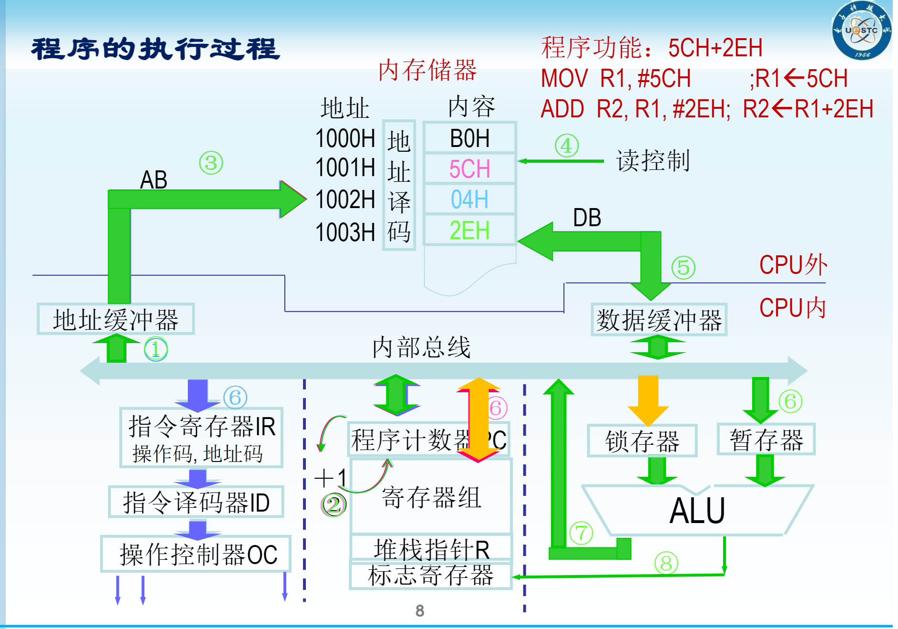

**存储器**：存放处理器可以直接运行的程序，数据和结果

- **RAM(Random Access Memory)**随机存取存储器，是半导体类型的存储器，可随时将程序和数据写入或读出。一旦断电后，存放在其中的程序和数据即消失
- **ROM(Read Only Memory)**只读存储器，是半导体存储器，一般情况下只能读出存放在其中的程序和数据，在特殊条件下才能将程序和数据写入。断电后，存放在其中的内容不会消失。

存储器是**存放机器指令和数据**等信息的载体，由 3 部分组成

- 存储体：存放**机器指令和数据(均为 0,1 序列)**的电路实体，划分为多个单元，每个单元有多个二进制位
- 地址：指示指令和数据的**具体存放位置**，由地址寄存和译码器组成
- 控制电路：控制存储体中信息的**输入或输出**

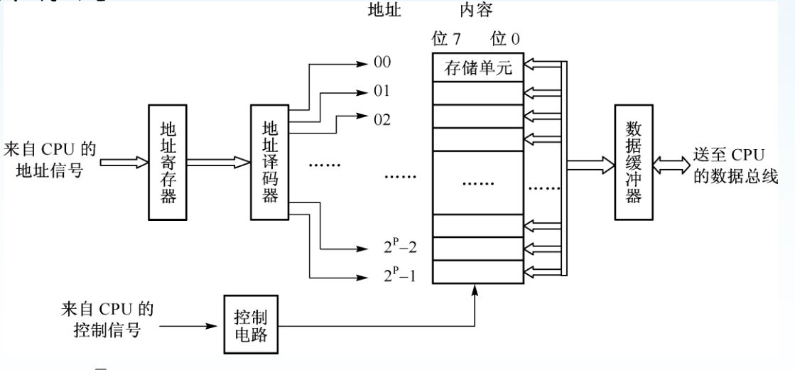

**存储器访问原理**

- 写操作： 提供给的地址信号经地址译码选中存储位置，控制操作为输入，数据输入到存储器并存放
- 读操作：控制为输出，地址信号经地址译码选中存储位置，该位置的数据由数据线输出

**存储子系统**：存放当前的运行程序和数据

**外设**：输入设备与输出设备的统称
**I/O 接口**：处理器与计算机系统各种输入/输出设备之间的电路

**输入输出子系统**：完成计算机与外部的信息交换

**总线**：根据传输信息的不同

- 数据总线 DB：用于数据交换，传送机器指令，原始数据和计算结果信息，通常是**分时双向的**
- 地址总线 AB：通常是**单向**的，由**主设备**(如 CPU)发出，用于选择读写对象(如某个特定的存储单元或外部设备端口)
- 控制总线 CB：用于传输方向，传送时间，异常处理等各种控制的信号。包括真正的**控制**信号线(如读/写信号)和一些**状态**信号线(如是否已将数据送上总线)，用于实现对设备的监视和控制。

**总线子系统**：作为公共通道连接各子部件，用于实现各部分之间的数据，信息等的传输和交换

**指令**是发送到 CPU 的命令，指示 CPU 执行一个特定的处理，如数据搬移，对数据进行算术运算

指令通常包含**操作码**和**操作数**两部分

- 操作码指明要完成的操作功能，如加，减，数据传送，移位等
- 操作数指明上述规定操作的数据或获取该数据所存放地址的方法

指令通常有两种形式

- 机器指令：包含操作码和操作数，由 0 和 1 组成，CPU 能直接解析，执行并完成一定功能，如 1011 0000 0101 1100
- 汇编指令：与机器指令功能一一对应，由具有一定含义的字符串，寄存器名和立即数组成，如`MOV R1,#5CH`

**模型机的执行过程**

计算机的运行本质上就是**执行程序**的过程

程序执行的两种类型

- 顺序执行
- 非顺序执行
  - 转移(jump)：执行条件/无条件转移指令，**不返回**
  - 过程(procedure)调用：子程序执行完后，**返回原处**
  - 异常(exception)：将正常程序(包括顺序，转移，过程调用等)的执行过程暂时中止，转而执行其他级别更高的程序，如数据出错
  - 中断(interrupt)：异常之一，用于优先级更高的处理

## 微处理器体系结构的演进

冯·诺伊曼机器的数据传输时瓶颈，解决途径

- 程序和数据分开存储，即**哈弗结构**
- 采用并行结构，包括**流水线结构**

### 指令集结构的演进

**CISC(Complex Instruction Set Computer)**，复杂指令集：为软件编程方便和提高程序的运行速度，不断增加可**实现复杂功能的指令和多种灵活的寻址方式**。为实现程序兼容,同一系列的新机器的指令系统只能扩充而不能减少,也使指令系统愈加复杂

- 优点:有较强的**处理高级语言**的能力
- 缺点:**硬件越来越复杂**,反而影响了执行速度和性能.典型程序的 80%使用 20%的指令实现的
- 演进:指令系统应当**只包含哪些使用频率很高的少量指令**.适当保留支持高级语言和操作系统的必要指令,即精简指令集

**RISC(Reduced Instruction Set Computer)**, 精简指令集.

- RISC 把较长的指令分拆成若干条**长度相同的单一操作**指令,可使 CPU 的工作变得单纯,速度更快,设计和开发也更简单.
- 缺点: 软件支持较少
- 演进:CISC 吸纳 RISC 技术优点,RISC 保持部分 CISC 先进思想.**架构不同,技术融合**

### 体系结构的演进

**冯·诺伊曼**体系结构也称为**普林斯顿结构**,它把**程序指令看作为特殊的数据**,可以像数据一样被处理,将**程序和数据存放在相同的存储器中**,

采用**统一编制**,但程序存储地址和数据存储地址指向不同的物理位置.

- 在通用计算机系统中由于灵活方便**重分代码与数据空间**,更新内容而占有优势.统一编址可以最大限度地利用资源.
- 如程序执行过程所述,处理器首先到程序指令存储器中**读取程序指令内容,解码后得到数据地址**,再到相应的数据存储器中读取数据,并进行下一步的操作(如运算处理).显然**读取指令和读取数据是串行的**,速度慢.
- 演进为哈弗结构

**哈弗结构**,是一种将**程序指令存储和数据存储完全分开**的存储器结构,采用分离编址.

- 哈弗与两个存储器相对应的是系统的 4 套总线.

  - 程序的数据总线
  - 程序的地址总线
  - 数据的数据总线
  - 数据的地址总线

  可以在一个机器周期内同时获得**指令码**(来自程序存储器)和**操作数**(来自数据存储器),从而提高了执行速度

- 由于程序和数据存储器在两个分开的物理空间中,因此**取指**和**执行**能**完全重叠**

- 哈弗结构的缺点: 数据存储器和程序代码存储器各自需要数据与地址总线,**引脚信号线多**

- 再次演进: 对于 CPU 内部,通过不同的**数据和指令 cache**,采用哈弗结构以有效的提高指令的执行效率.而处理器外部采用冯·诺伊曼结构

### 总线结构

**总线**:用于连接计算机系统各部件的导线集合,即部件间传输信息的**共用通道**,可以是线缆,也可以是 PCB 板上的金属线

计算机系统的部件之间通信为何采用总线结构

- 存储器由多种类型,多种功能,**多组芯片**组成
- 计算机外部设备因**功能,性能和应用等不同**而具有各自的接口电路
- 多电路部件,多芯片间的**点对点互联复杂,连线多,扩展性差**

**按照总线在计算机系统中所处位置不同划分**

- CPU 片内总线: 连接 CPU 内部控制器,运算器和寄存器组的总线
- 片总线: 通常指处理器芯片引脚的总线,用于连接处理器片外的存储器,接口芯片等
- 系统总线: 用于连接计算机系统外的其他电路模块的总线,如 PCI 总线

### 存储器结构

如何以**合理的价格搭建出容量和速度都满足要求**的存储器系统,始终是计算机体系结构设计中的关键问题之一.

现代计算机系统通常把不同的存储设备按一定的体系结构组织起来,以解决**存储容量,存取速度和价格之间的矛盾**

采用**分级结构**,以均衡速度,容量,成本,长期存储等问题.

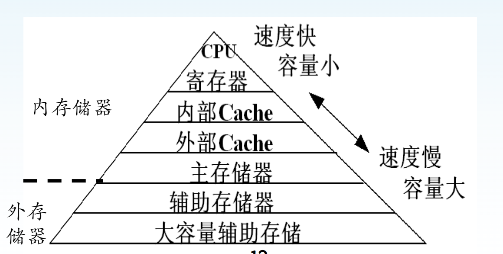

在存储器分层结构中,上面一层的存储器作为下一层存储器的高速缓存

- CPU 中的寄存器就是 cache 的高速缓存,寄存器保存来自 cache 的字
- cache 又是内存层的高速缓存,从内存中提取数据送给 CPU 进行处理,并将 CPU 的处理结果返回到内存中
- 内存又是主存储器的高速缓存,它将经常用到的数据从 Flash 等主存储器中提取出来,放到内存中,从而加快了 CPU 的运行效率
- 嵌入式系统的主存储器容量是有限的,磁盘,光盘或 CF,SD 卡等外部存储器用来保存大信息量的数据
- 在某些带有**分布式文件系统的嵌入式网络系统**中,外部存储器就作为其他系统中被存储数据的高速缓存

### 微处理器机构的改变

**通过"并行"提高处理速度**

- 多层次的并行处理技术
- 流水线结构
- 超标量结构
- 超长指令字
- 多核结构
- 并行机

**并行处理技术**实现多个处理器或处理模块的并行性,其基本思想包括**时间重叠(time interleaving)**,**资源重复(resource replication)**,和**资源共享(resource sharing)**

- 电路级并行技术 CLP

  - 组相联 cache, 先行进位加法器

- 指令级并行技术 ISP

  - 流水线，超标量

  不同的处理器的流水线级数不同

  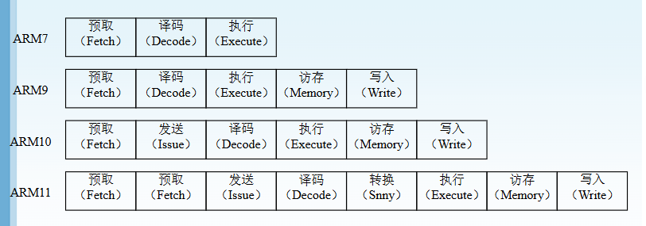
  超标量技术：通过重复设置多套指令执行部件，同时处理并完成多条指令，实现并行操作来达到提高处理速度的目的。

  

  可在一个时钟周期内对多条指令进行并行处理，**使 CPI 小于 1**

  有 5 个执行单元的超标量流水线，指令的执行比取指，译码的时间更长，通过超标量均衡各级流水的执行时间。

  **VLIW(Very Long Instruction Word)**超长指令字，**依靠编译器**编译时找出指令之间潜在的并行性，把能并行执行的多条指令组装成一条很长的指令

  处理机中多个**相互独立的执行部件**分别执行长指令中的一个操作，即相当于同时执行多条指令。

  WLIW 处理机很大程度上取决于代码压缩的效率，其编译程序和体系机构的关系非常密切。

- 线程级并行技术

  - 同时多线程

- 系统级并行技术

  - 多处理器

**大规模并行处理机(MPP)**是一种价格昂贵的超级计算机，它由许多 CPU 通过高速专用互联网络连接。

**机群(cluster)**由多台同构或异构的独立计算机通过高性能网络或局域网连在一起协同完成特定的并行计算任务。

**刀片(blade)**通常指包含一个或多个 CPU, 内存以及网络接口的服务器主板。通常一个刀片柜共享其他外部 I/O 和电源，而辅助存储器则由距离刀片柜较近的存储服务器提供。

**网络计算(Network)**是一组由高速网络连接的不同的计算机系统，可以相互合作也可以独立工作。网络计算机将接受中央服务器分配的任务，然后在不忙的时候执行这些任务。

## 计算机体系结构的分类与性能评测

**Flynn 分类**:根据**指令流和数据流**的多少进行分类

CU: 控制部件

PU: 处理部件

MM: 存储单元

CS: 控制流

DS: 数据流

IS: 指令流

- 单指令单数据**SISD**
  - 传统的顺序处理机
  - 标量流水线处理机
  - 超标量流水线处理机

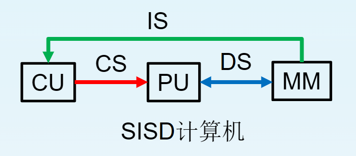

- 单指令多数据**SIMD**
  - 阵列处理机
  - 向量处理机

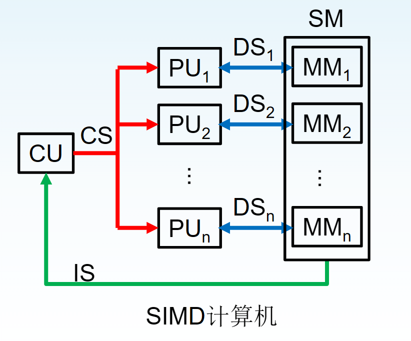

- 多指令单数据**MISD**,无实际机型对应

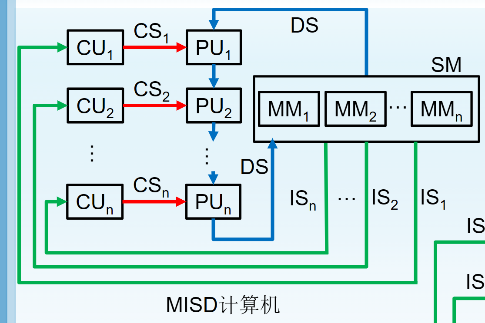

- 多指令多数据**MIMD**：多处理机系统

计算机系统的性能由**硬件性能和程序特性**决定，通常使用**标准测试程序**来测定性能

- 用**MIPS**(Million Instructions Per Second,每秒百万条指令)或**MFLOPS**(每秒百万次浮点操作)的数值来衡量计算机系统的硬件速度
- 用**CPU 执行时间 t**来量化硬软件结合系统的有效速度。
  - MIPS=f(MHz)/CPI
  - t(s) = IC\*CPI\*T

T:CPU 主时钟周期(s), 对应的主时钟频率 f=1/T(Hz)

IC(指令数目): 运行的程序指令总数

CPI(Cycles Per Instruction): 平均单条指令执行所需的时钟周期数，可以从运行大量测试程序或实际程序的统计数据中计算出来。

## 作业

1. 某测试程序在一个 40 MHz 处理器上运行，其目标代码有 100 000 条指令，由如下各类指令及其时钟周期计数混合组成，试确定这个程序的有效 CPI、MIPS 的值和执行时间。

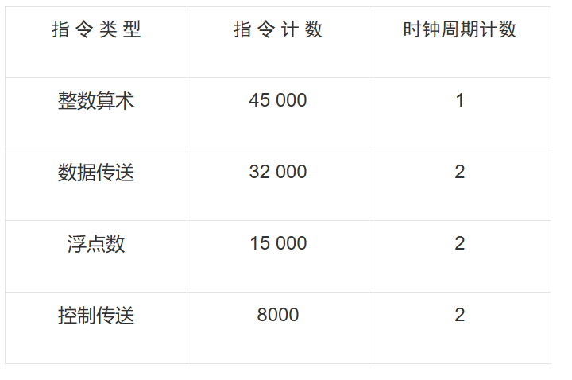

$有效CPI = 0.45*1 + 0.32*2 + 0.15*2 + 0.08*2=1.55$

$MIPS=\frac{4*10^7}{1.55*10^6}  \approx 25.81$

$执行时间=\frac{1.55*10^6}{4*10^7} = 0.003875s$

2. 假设一条指令的执行过程分为“取指令”、“分析”和“执行”三段，每一段的时间分别为 ∆t,2∆t 和 3∆t。在下列各种情况下，分别写出连续执行 n 条指令所需要的时间表达式。
   （1） 顺序执行方式
   （2） 仅“取指令”和“执行”重叠
   （3） “取指令”、“分析”和“执行”重叠

(1): $n(1+2+3)\Delta t = 6n\Delta t$

(2):$6 \Delta t + (n-1)*3\Delta t$

(3):$6 \Delta t + (n-1)*3\Delta t$

3. 请简述高速缓冲存储器技术和虚拟存储器技术。计算机系统中采用这两种技术的根本目的是什么？这两种技术有什么相同点？

**高速缓冲存储器**（Cache Memory）是计算机系统中用于提高存取速度的存储器。它是位于主存（RAM）与 CPU 之间的小容量、高速度的存储设备。由于 CPU 的处理速度远快于主存的读写速度，因此，当 CPU 需要访问数据时，通过缓存存储器来加速数据的读取，减少访问主存的时间。

**根本目的**：提高数据访问速度，减少 CPU 访问主存的延迟，使得计算机系统能更高效地执行任务。

**虚拟存储器**是一种存储管理技术，它允许程序拥有比物理内存更大的虚拟内存空间，通过将数据分块存储在磁盘上，当程序需要时再将这些数据从磁盘加载到物理内存中。虚拟存储器的出现使得程序可以假装它拥有连续且充足的内存空间，而实际的物理内存可能远远不足以支持这么大的空间。

**根本目的**：提供大于物理内存的地址空间，允许程序使用更多的内存，并有效管理内存，使得多任务可以共享内存资源，而不受物理内存限制。

**这两种技术的相同点**

- **缓存与虚拟存储器都依赖于存储管理技术**：缓存是为了优化数据访问速度，而虚拟存储器则是为了扩展可用的内存空间，二者都通过管理数据的存储位置来提高系统性能。

- **都实现了存储器的透明性**：对于程序员而言，无论是访问缓存中的数据还是虚拟内存中的数据，系统都将这些操作隐藏，程序可以认为它直接访问整个内存空间，且访问速度较快。
- **都通过硬件和软件协作来实现**：高速缓存技术依赖 CPU 的硬件支持，而虚拟存储器需要操作系统的管理与硬件的支持（如 MMU）来实现地址转换和内存调度。

4. 简述冯诺依曼计算机“存储程序和自动执行程序”的过程。导致冯诺依曼计算机性能瓶颈的主要原因是什么？

**存储程序**:

在冯诺依曼架构中，程序和数据被存储在同一存储器（通常是内存）中。这意味着程序指令和数据都可以被存储和读取，并且程序指令和数据并没有明确区分，它们共享相同的内存空间。程序员编写的指令会被存储到计算机的内存中，CPU 从内存中读取这些指令并逐一执行。

**自动执行程序**:

一旦程序被加载到内存，**控制单元（CU）开始自动执行这些指令。CPU 按照\*\*指令周期**（取指、译码、执行）的过程执行程序：

- **取指（Fetch）**：CPU 通过程序计数器（PC）指示内存中的位置，按顺序从内存中取出指令。
- **译码（Decode）**：CPU 解码指令，理解其含义。
- **执行（Execute）**：执行指令，可能涉及算术运算、数据存储、输入输出操作等。

每完成一条指令的执行，程序计数器（PC）递增，指向下一条指令的地址，CPU 继续执行程序，直到遇到终止指令或程序结束。

**性能瓶颈**

**冯诺依曼瓶颈（Von Neumann Bottleneck）**：

- 由于冯诺依曼架构的程序和数据存储在同一个内存中，CPU 在执行程序时需要频繁地从内存中读取指令和数据。内存访问速度远低于 CPU 的处理速度，因此 CPU 和内存之间的数据传输成为性能的主要瓶颈。
- 具体来说，**内存带宽**和**CPU 计算速度**之间的不匹配导致了冯诺依曼瓶颈。CPU 的处理速度通常要比内存的读写速度快得多，每当 CPU 需要访问内存时，会导致处理器的等待时间，影响整体性能。

**数据传输延迟**：

- 程序指令和数据共享同一个内存通道，CPU 在每个时钟周期内只能执行一次内存操作（取指或读写数据），这使得指令取用和数据存取在时间上产生冲突，导致处理器空闲等待，降低了整体效率。

**指令和数据的分离问题**：

- 冯诺依曼架构中，指令和数据是通过同一通道进行访问的，这种设计限制了数据和指令的并行处理。虽然现代计算机采用了缓存（如 L1/L2 缓存）等技术来缓解这一问题，但仍然无法完全消除瓶颈。

**内存访问的串行性**：

- 传统的冯诺依曼架构在执行过程中通常是**串行的**，即每次只能执行一条指令，这使得它不能充分发挥出多核处理器和并行计算的优势。尽管现代处理器引入了多级缓存和并行处理机制，但基础架构的串行特性依然影响性能。

# 微处理器设计技术

## CISC 与 RISC 体系结构

**CISS**的特点及设计思想

- 许多复杂指令很少被使用，“2-8”原则
- 控制器硬件复杂(指令多，且具有不定长格式和复杂的数据类型),占用了大量的芯片面积，且容易出错。
- 指令操作繁杂，速度慢
- 指令规整性不好，不利用采用流水线技术提高性能

**RISC**机的设计应当遵循以下五个原则

- 指令条数少，格式简单，易于译码
- 提供足够的寄存器，只允许`load`和`store`指令访问内存
- 指令由硬件直接执行，在单个周期内完成
- 充分利用流水线
- 依赖优化编译器的作用

**区别**

## 指令系统设计

**指令结构**

> 指令系统是软硬件之间的一个约定,是计算机软硬件接口之一

**指令集结构(ISA)**

指令集结构(Instruction Set Architecture)

处理器的接口，包含了与该处理器交互所需要的信息，但并不设计处理器自身如何设计和实现的细节

ISA 包括

- 指令集
- 程序员可以直接访问的寄存器细节
- 访问内存所需要的信息
- 中断(异常)处理

**指令的组成**

- 操作码(operation code, opcode): 需要完成的操作
- 源操作数(source operand reference): 操作所需的输入
- 结果操作数(result operand reference): 操作产生的结果
- 下一条指令(next instruction reference): 告诉 CPU 到哪里取下一条指令

**指令格式**

在计算机内部，指令由一个位串来表示。相应于指令的各要素，这些位串划分成几个字段

- 操作码字段
  - 说明 CPU 应进行的操作
  - 按操作类型分组：同类操作要求同样或类似的控制信号，因此编码也类似(有尽可能多的公共位)
- 操作数/地址字段
  - 说明源操作数和目的操作数存放的位置信息(R,M 或 I/O)
  - 说明源操作数和目的操作数的数据类型
- 下一条指令地址字段
  - 如紧跟当前指令，在主存或虚存中，则不需要显示引用
  - 如可能产生跳转，则需要显示给出存储地址

**操作码设计(指令类型)**

指令操作码**按操作分组**即是指令类型，按功能可分成三种基本类型：

1. 数据传输：将数据从一个地方(源地址)复制到另一个地方(目的地址),传输结束后源地址中的内容不变.
2. 数据运算:算术运算和逻辑运算
3. 控制类:用于改变正常的程序执行流程,完成程序的跳转,主要包括转移指令和过程指令

**操作数字段**

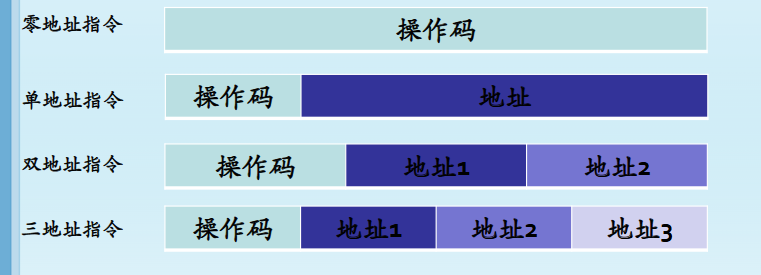

- 立即数寻址:在指令码中指定操作数
- 寄存器直接寻址:指令的地址字段给出寄存器名,而被指定的寄存器的内容就是操作数
- 寄存器简介寻址:指令的地址字段给出寄存器名,而被指定的寄存器的内容是操作数的地址
- 存储器直接寻址:指令的地址字段给定存储单元的地址,存储单元中是操作数
- 存储器间接寻址:指令的地址字段给定存储单元的地址,存储单元中是操作数的地址
- 位移量寻址方式:通常用于数据,矩阵,类向量数据的存取,立即数指定数组首址,寄存器指定组内偏移.
- 变址寻址方式:寄存器 1 指定数组首地址,寄存器 2 指定组内偏移
- 比例尺寻址方式:指定**两个寄存器**中的存储器地址加上`imm`字段的位移量
- PC 相对寻址方式:主要用在转移和跳转指令,指定汇编语言程序码的内部位置作为**目的地址偏移量**操作数
- 独立编址系统的 I/O 寻址方式: 系统视端口和存储单元位不同的对象
- 统一编制系统的 I/O 寻址方式: 将端口看作存储单元,仅以**地址范围的不同**来区分两者.

## 指令流水线设计

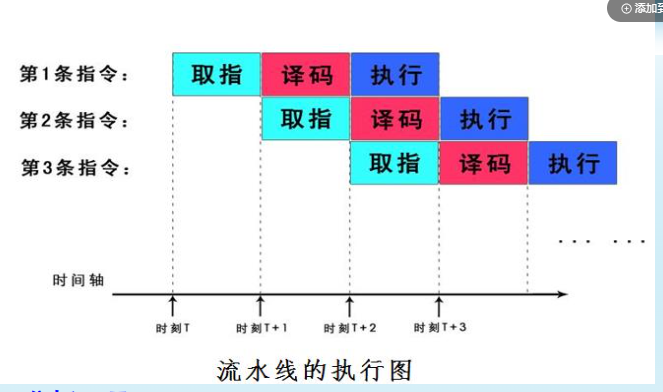

**流水线冲突**

理想流水线性能:每个时钟周期完成一条指令

实际流水机器中可能存在**冒险**导致停顿

- 数据冲突:当前指令之间存在依赖关系时发生的冲突,例如一条指令的结果是另一条指令的输入

  - 前递(数据旁路): 将执行阶段产生的结果直接传递给后续需要这个结果的指令,而不是等待结果被写回到寄存器文件中.这可以减少由于读-后写(RAW)依赖导致的停顿
  - 延迟分支: 在某些架构中,在分支指令之后插入一个或多个空操作(NOP),以确保所有依赖的数据都已经准备好.
  - 编译器优化: 通过重新排序代码中的指令来避免或最小化数据依赖性,如调度指令以增加并行度

- 结构冲突:因为硬件资源不足以同时支持多条指令的并发而引起的

  - 资源复制(超标量):增加功能单元的数量,使得同一周期内可以处理更多的指令.例如,增加 ALU 的数量或者拥有多个内存访问端口
  - 互斥访问: 设计流水线使得不同阶段的指令不会同时争夺相同的硬件资源

- 控制冲突: 通常发生在分支条件或跳转指令处,因为这些指令改变了程序的正常顺序执行流程
  - 分支预测: 使用静态或动态分支预测算法来猜测分支的方向,并提前加载可能执行的指令路径.现代处理器还采用了复杂的分支目标缓冲区(BTB)等机制
  - 投机执行:基于预测的结果继续执行指令,如果预测正确则提高效率,如果错误,则回滚到正确的状态并清除错误预测后的指令
  - 延迟分支: 类似于解决数据相关的延迟分支方法,可以在分支指令前安排一下不影响分支决策的指令.

**流水线性能分析**

**基本要求**

- 流水线各个段的操作相互独立
- 流水线各个段的操作同步

**性能指标**

- 吞吐率：单位时间内能完成的作业量
- 最大吞吐量：流水线达到稳定状态后的吞吐量

用于描述流水线执行各种运算的速率，通常表示为每秒执行的运算数或每周期执行的运算数

若一个**m 级**线性流水线各级时长(即拍长)均为$\Delta t$,则连续处理 n 条指令时的实际吞吐率$T_p$为

$T_p=\frac{n}{m\Delta t + (n-1)\Delta t} = \frac{1}{[1+\frac{m-1}{n}]\Delta t}$

可以看出,当$n \rightarrow \infin$时,最大吞吐量$T_pmaz = 1/( \Delta t)$

- 加速比: 非流水线执行时间相对流水线执行时间之比

$S_p=\frac{T_{串行}}{T_{流水}} = \frac{n·m \Delta t}{m \Delta t + (n-1) \Delta t} = \frac{nm}{m+n-1} = \frac{m}{1+(m-1)/n}$

可以看出,当$n \rightarrow \infin$时,$S_p \rightarrow m$,即最大加速比等于流水线的段数**m**

- 效率: 一定时间段内,流水线所有段处于工作状态的比率

若一个**m 级**线性流水线各级时长(即拍长)均为$\Delta t$,求取连续处理 n 条指令时的效率 E

利用指令时空图进行分析

$E = \frac{指令完成时间内占用的时空区}{指令总时空区}=\frac{nm \Delta t}{[n+(m-1)]m \Delta t}=\frac{1}{1+\frac{m-1}{n}}$

可以看出,当$n \rightarrow \infin $时,$E \rightarrow 1$,即流过流水线的指令越多,流水线效率越高

- 深度或并行度：流水级数 m
- 延迟时间：每一作业从开始到结束所需时钟周期数

**计算机性能测评**

1. 字长
2. 存储容量
3. 运算速度

## 作业

1. 一个时钟频率为 2.5 GHz 的非流水式处理器，其平均 CPI 是 4。此处理器的升级版本引入了 5 级流水。然而，由于如锁存延迟这样的流水线内部延迟，使新版处理器的时钟频率必须降低到 2 GHz。

   ‎

   ‎(1) 对一典型程序，新版所实现的加速比是多少？

   ‎

   ‎(2) 新、旧两版处理器的 MIPS 各是多少？

(1) 假设有 n 条指令

$T_{串行} = \frac{4n}{2.5*10^9}s$

引入流水线后,理想情况下

$T_{流水线} = \frac{n}{2*10^9}$

$加速比S_p = \frac{T_{串行}}{T_{流水}}=3.2$

(2)

旧版: $MIPS_{old} = \frac{2.5*10^9}{4*10*6} = 625$

新版: $MIPS_{new} = \frac{2*10^9}{1*10^6} = 2000$

2. 微码体系结构与随机逻辑体系结构有什么区别？

3. **实现方式**
   **微码体系结构**：使用一种低级的、类似于软件的微程序来实现机器指令。每条机器指令被分解为一系列微指令，这些微指令存储在一个特殊的只读存储器（ROM）或可编程逻辑阵列（PLA）中。控制单元通过执行这些微指令序列来生成所需的控制信号。
   **随机逻辑体系结构**：采用硬连线逻辑电路直接实现机器指令。指令的解码和控制信号的生成是由固定的硬件逻辑电路完成的，通常由组合逻辑和时序逻辑构成。

4. **灵活性与可维护性**
   **微码体系结构**：具有更高的灵活性，因为可以通过修改微程序来改变或扩展指令集，甚至可以在不改动硬件的情况下修复某些类型的错误。这使得微码体系结构更容易进行更新和维护。
   **随机逻辑体系结构**：一旦设计完成，其指令集就很难更改，因为这需要对硬件逻辑进行物理上的改动。因此，它的灵活性较低，但这也意味着更稳定和确定的行为。
5. **复杂性与设计难度**
   **微码体系结构**：可以更容易地处理复杂的指令集架构（CISC），因为它允许以相对简单的方式实现复杂的操作。然而，设计一个高效的微程序控制器可能需要更多的工程努力，并且优化微代码以达到最佳性能也是一项挑战。
   **随机逻辑体系结构**：对于简单的指令集架构（RISC），硬连线逻辑可以提供更加紧凑和快速的设计。但是，随着指令集变得越来越复杂，设计和验证这样的控制单元也会变得更加困难。
6. **性能**
   **微码体系结构**：由于涉及额外的微指令解释层，理论上可能会比等效的随机逻辑实现稍慢。不过，现代微码实现技术已经大大减少了这种差距，并且在某些情况下，微码实现可以更有效地利用资源。
   **随机逻辑体系结构**：通常能够提供更快的响应时间和更低的延迟，因为它没有中间的微指令层，所有操作都是直接由硬件逻辑完成的。
7. **成本与功耗**
   **微码体系结构**：由于需要额外的存储空间来保存微程序，可能会增加芯片面积和成本。此外，微程序的执行也可能导致稍微更高的功耗。
   **随机逻辑体系结构**：一般而言，硬连线逻辑会占用较少的硅片面积，从而降低成本并减少功耗。

# 总线技术与总线标准

## 总线技术

### 总线要素

**线路介质**

1. 种类： 有线(电缆，光缆), 无线(电磁波)
2. 特性：
   1. 原始数据传输率， 带宽
   2. 对噪声，失真，衰减的敏感性等

**总线协议**

电气性能

- 总线信号:有效电平,传输方向/速率/格式等
- 总线时序:规定通信双方的联络方式
- 总线仲裁:规定解决总线冲突的方式
- 其他: 如差错控制

机械性能

- 接口尺寸
- 形状

$$
总线协议 \begin{cases} 消息的内容 \begin{cases} 数据内容 \\ 命令内容 \end{cases} \\ 消息传输\begin{cases} 介质 \begin{cases} 位编码 \\ 位传输 \end{cases} \\ 通道组织 \begin{cases} 单工/双工 \\ 通道共享 \\ 并行/串行 \end{cases} \\ 协调 \begin{cases} 时钟同步 \\ 检错和纠错 \end{cases} \end{cases} \end{cases}
$$

### 总线的分类

按**所处位置**(数据传送范围)

- 片上总线
- 芯片总线(片间总线, 元件级总线)
- 系统内总线(插板级总线)
- 系统外总线(通信总线)

按**总线功能**

- 地址总线
- 数据总线
- 控制总线

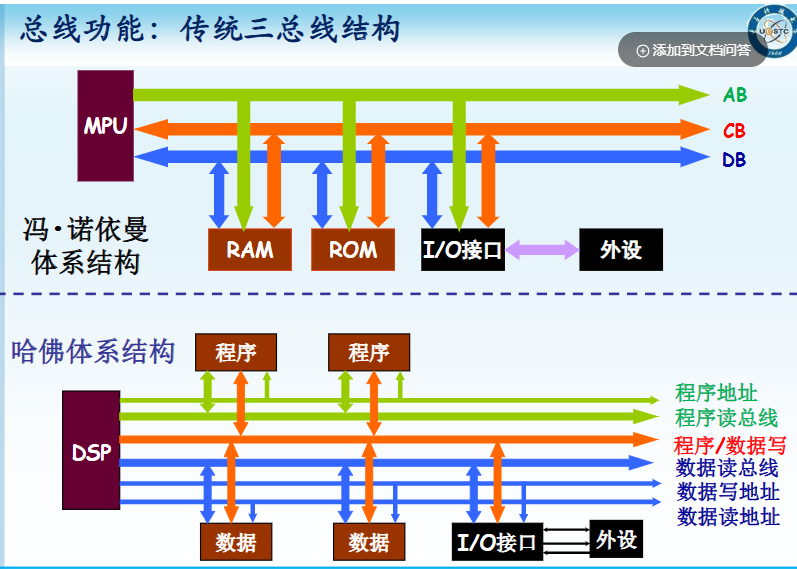

按**数据格式**

- 并行总线
  - 同步
  - 半同步
  - 异步
- 串行总线
  - 同步
  - 异步

按**总线组织**

- 单总线
  - 特点: 存储器和 I/O**分时**使用同一总线
  - 优点: 结构简单,成本低廉,易于扩充
  - 缺点: 带宽有限,传输率不高(可能造成物理长度过长)
- 双总线
  - 特点: 存储总线 + I/O 总线
  - 优点: 提高了总线带宽和数据传输速率
  - 缺点: CPU 繁忙
- 多级总线
  - 特点: 高速外设和低速外设分开使用不同的总线
  - 优点: 高效,进一步提高系统的传输带宽和传输速率
  - 缺点: 复杂

### 总线的性能指标

**总线时钟频率(Hz)**

**总线宽度(bits)**

- 数据线: 数据通路宽度
- 地址线: 寻址空间

**总线速率(次/s)**
$$
总线速率 = \frac{总线时钟频率}{总线周期数}
$$

**总线周期数**(次/周期)：传送一次数据所需的时钟周期数

**总线带宽(Bytes/s)**:表示单位时间内总线能传送的最大数据量
$$
总线带宽 = 总线速率 * 总线宽度
$$

**总线负载能力**

**总线带宽的计算**

1. CPU 的前端总线(FSB, Front Side Bus) 频率为**800MHz**,总线周期数为**1/4**(即一个时钟周期传送 4 次数据),位宽为**64bit**,则 FSB 带宽为多少?

$$
总线速率 = \frac{总线时钟频率}{总线周期数} = \frac{800*10^6}{\frac{1}{4}}=3200*10^6 次/s
$$

$$
带宽 = 总线速率 * 位宽 = 3200*10^6*(64/8) = 25.6GB/s
$$

2. PCI总线的频率为**33.3MHz**,位宽为**64bit**,总线周期数为**1**,则PCI总线的带宽是多少

$$
带宽 = \frac{33.3*10^6}{1}*\frac{64}{8} = 266.4MB/s
$$

**总线共享技术**

TDM,FDM,CDM,SDM,WDM

信源编码(数据压缩),信道编码(调制解调)

### 总线操作与总线仲裁

**总线操作**

通过总线进行信息交换的过程

**总线周期**

总线设备完成一次信息交换的时间,如存储器读/写周期,I/O读/写周期,DMA周期,中断周期

- **多主控制器**系统的总线操作周期一般分为四个阶段
  - 总线请求及仲裁
  - 寻址
  - 传数
  - 结束
- **单主控制器**系统的总线操作周期一般只需要两个阶段
  - 寻址
  - 传数

**总线主控制器的作用**

- 总线系统的**资源分配与管理**
- 提供总线**定时信号脉冲**
- 负责总线使用权的**仲裁**
- 不同总线**协议**的转换
- 不同总线间数据传输的**缓冲**

**总线仲裁**(arbitration)

也称为总线判决,其目的是合理地控制和管理系统中**多个主设备**的总线请求,以**避免总线冲突**

**分布式(对等式)仲裁**

- 控制逻辑分散在连接于总线上的各个部件或设备中
- 协议复杂且昂贵,效率高

**集中式(主从式)仲裁**

- 采用专门的控制器或仲裁器
- 总线控制器或仲裁器可以是独立的模块或集成在CPU中
- 协议简单而有效,但总体系统性能较低

**菊花链(串行)总线仲裁**

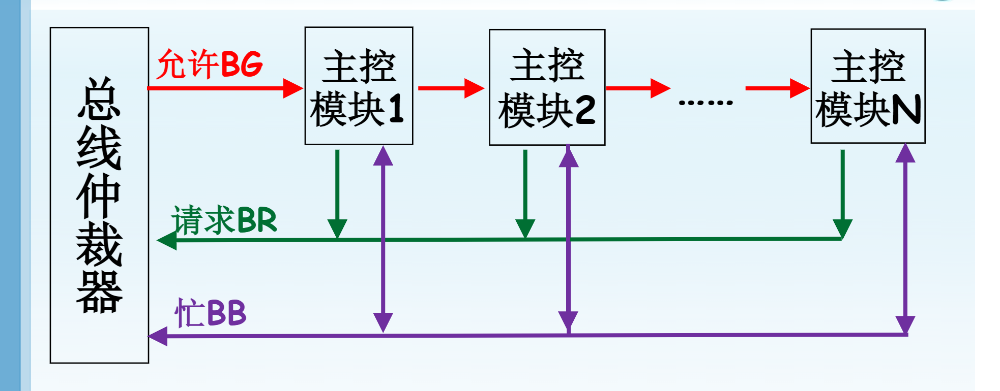

特点: 各主控模块**共用请求信号线BR和忙信号线BB**,其优先级别由其在**链式允许信号线**上的**位置决定

优点: 具有较好的灵活性和可扩充性

缺点: 主控模块数目较多时,总线请求响应速度较慢

**并行仲裁**

**集中式(主从式)**

特点: 各主控模块有**独立的请求信号线BR和允许信号线BG**,其优先级由总线仲裁器内部模块判定

优点: 总线请求响应**速度快**

缺点: **扩充性差**

**串并行二维仲裁**

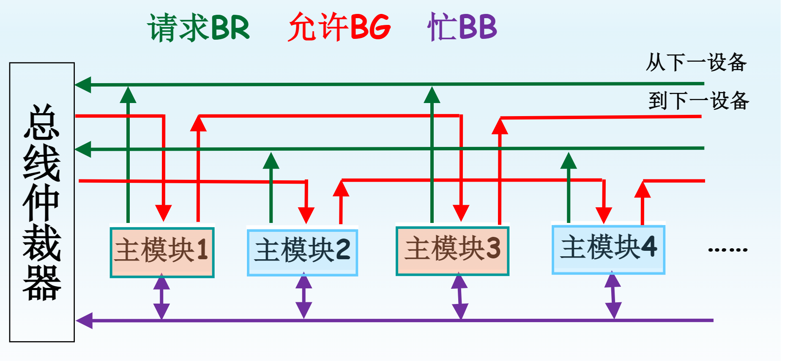

综合了前两种仲裁方式的优点和缺点

### 总线时序

**总线时序**:总线事件的协调方式,目的是实现可靠的寻址和数据传送

- 同步: 所有设备采用统一时钟信号进行收发定时
- 异步: 依靠握手(handshake)信号实现收发控制
- 半同步:具有同步总线的高速和异步总线的适应性

**同步并行总线时序**

特点:

- 系统使用**同一时钟信号**控制各模块完成数据传输
- 一般一次读写操作可在一个时钟周期内完成,时钟前后沿分别指明总线操作周期的开始和结束
- 地址,数据及读/写等控制信号可在时钟沿处改变

优点: 电路设计简单,总线带宽大,数据**传输速率快**

缺点: 时钟以最慢速设备为准,高速设备性能将受到影响

**异步并行总线时序**

特点: 系统中可以没有统一的时钟源,模块之间依靠各种联络(握手)信号进行通信,以确定下一步的动作.

优点: 全互锁方式**可靠性高,适应性强**

缺点:控制复杂,交互的联络过程会影响系统工作速度

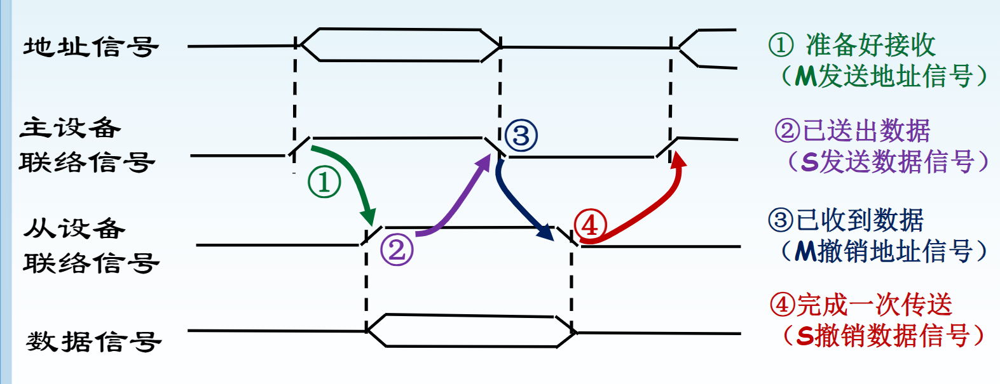

**半同步并行总线时序**

特点: 同时使用主模块的**时钟信号**和从模块的**联络信号**

优点: 兼有同步总线的速度和异步总线的可靠性与适应性

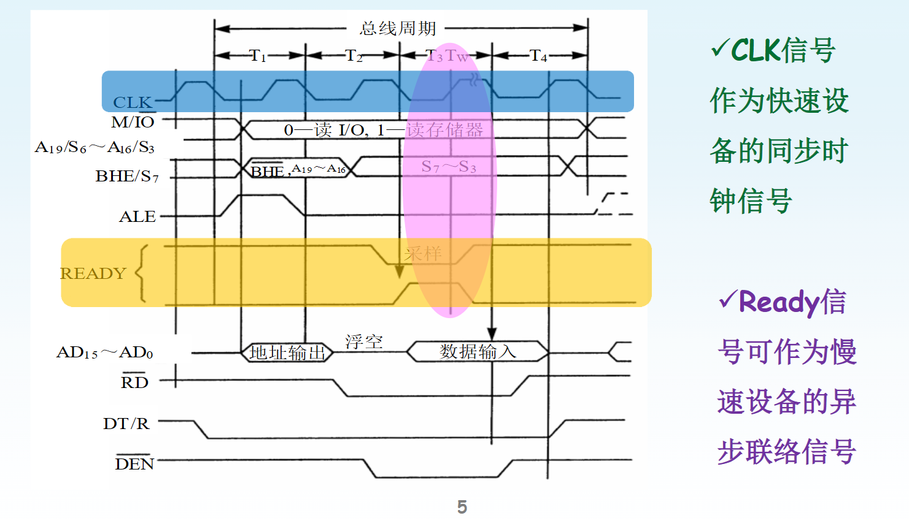

## 常见总线标准

### AMBA总线特性

**`Advanced Microcontroller Bus Architecture`**

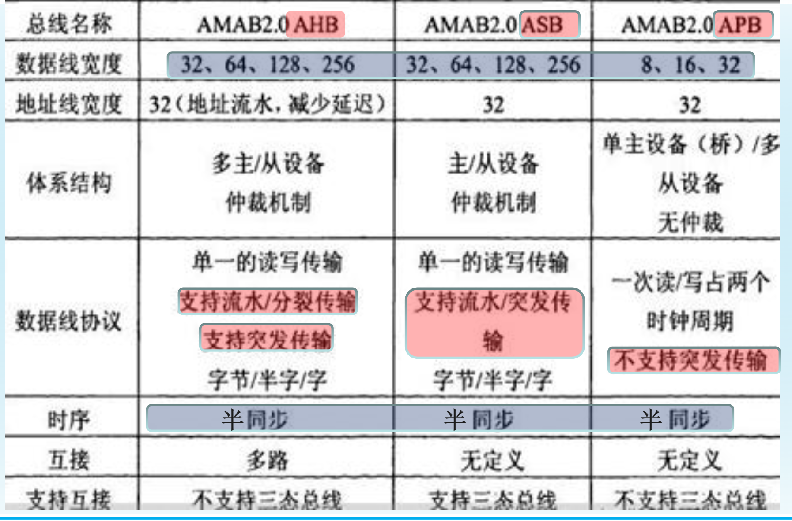

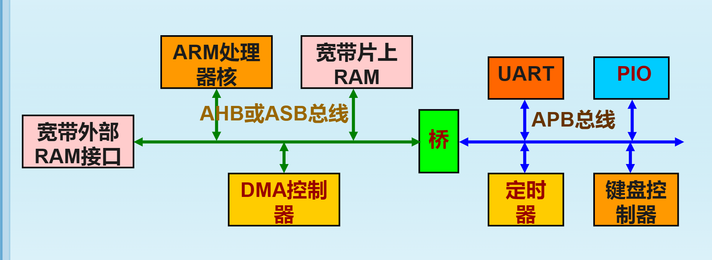

**AHB总线的基本传输周期**

**地址传送阶段：传送地址与控制信号**

只持续一个时钟周期，在HCLK的上升沿数据有效，所有的模块都在这个上升沿采样地址信息

**数据传送阶段：传送数据和响应信号**

可以持续一个或几个时钟周期(HREADY)信号为低电平时加入等待周期

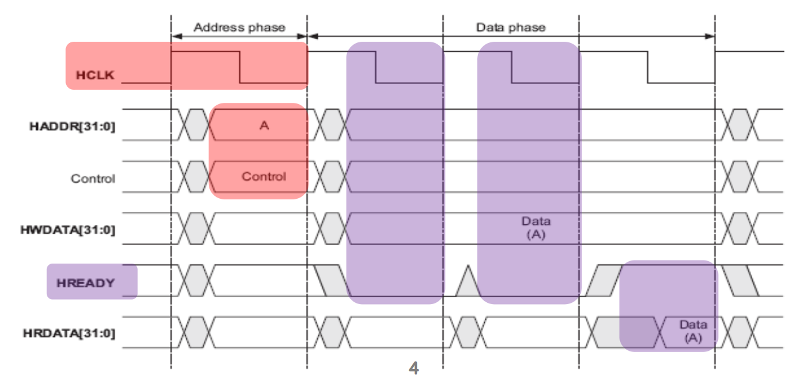

**APB总线**

主/从信号接口

- 主要用于低宽带外设的连接
- APB桥是唯一的主模块(系统总线上的从模块)

### PCI总线

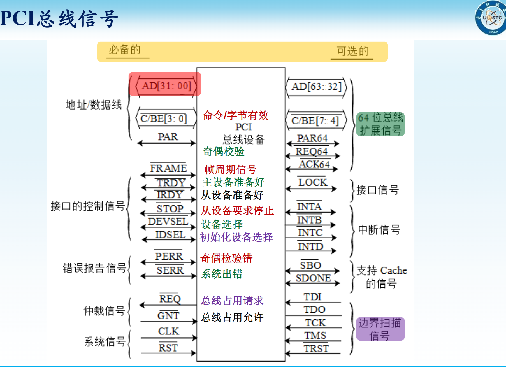

### 串行数据传输

**高速串行总线**体现了成功的网络通信技术向计算机体系结构的渗入：**差分信号控制**，**数据包**，**点对点**

- 传输方向

  - 单工
  - 半双工
  - 双工
  - 多工

- 传输距离

  - 基波

  串行数据在**基波传送**方式下(指信号按原样传输)，通常只能传输几十米至几百米，并且传输速率越大，传输距离越短

  为提高串行数据的传输速率和传输距离，我们通常采用**载波传送**(利用调制解调技术将信号加在高频载波上再进行传输)

  如：可将数字信号利用MODEM调制到300-3300Hz的频段以利用公用电话线进行传输

  

  常用的调制解调方法包括频移键控FSK,幅移键控ASK,相移键控PSK等方式

  - 载波

- 差错控制

  - 检错重发ARQ  奇偶校验
  - 前向纠错FEC  CRC校验
  - 混合纠错HEC 

- 数据格式及含义

  一些串行总线(接口)标准只约定实现信息传输的基本方法，而对**被传输信息的格式及含义**不作规定，这些内容应由通信双方遵循的**通信协议**确定

  - 控制信息
  - 数据信息

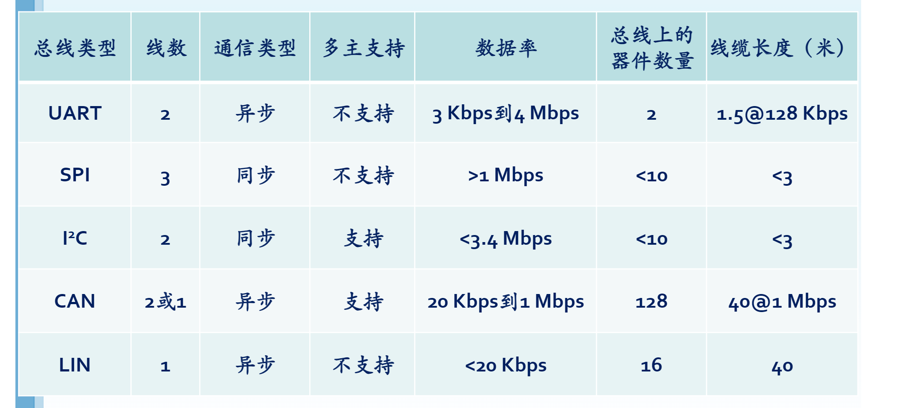

- 传输速率
  - 比特率
  - 波特率
- 传输时序
  - 同步
  - 异步

### 串行数据的性能

**比特率**(bit/s):系统单位时间内传送有效二进制数据的位数

**波特率**(baud): 通信线路上基本电信号状态的变化频率

波特率描述的是硬件性能，它与比特率的关系是

- 基波传送方式下：通信线路状态改变一次即送出一位数据，这时候比特率=波特率
- 载波传送方式下：通信线路状态改变一次可能送出n位数据，这时候比特率=n*波特率

### 串行总线的时序

**同步串行通信**

同步串行通信以**数据块**为基本单位，传输时字节与字节之间，位与位之间都需要严格同步，因此收发双方需要使用(传送)**同一时钟信号**

同步串行通信通常采用CRC校验方法进行数据的检错和纠错

同步串行通信的数据格式可能有以下几种。但都必须首先确定**传送的起始位置**(用同步字符或同步标志或采用硬件同步信号)，然后传送准备好的信息数据，最后发送校验字符

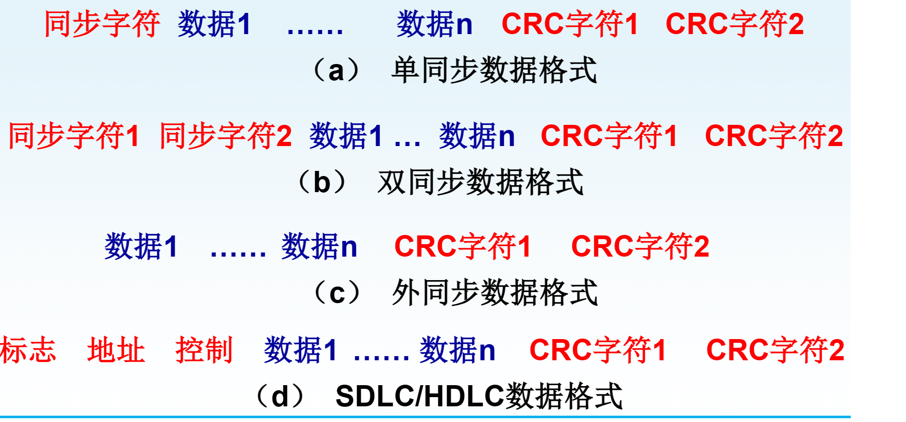

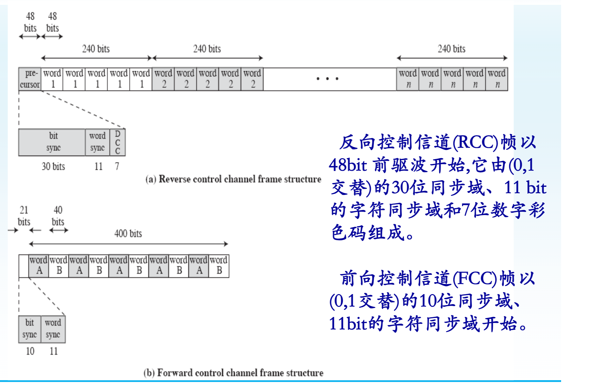

**异步串行通信**

异步串行通信以**字符**为基本单位，传输时字节与字节之间无时序关系，但字节内各位按固定时序和顺序传送。收发双方只需保证接收时钟和发送时钟再误差范围内同频率，而无需使用同一时钟源。

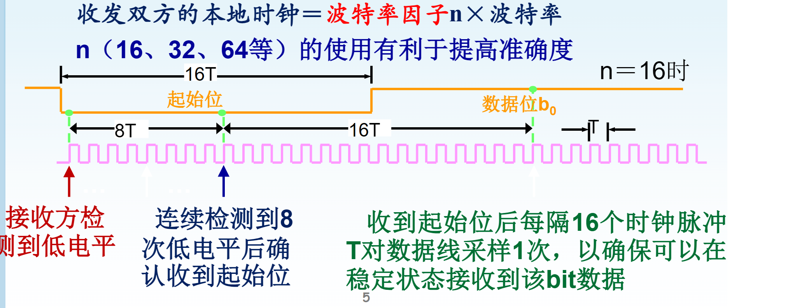

### RS232类总线

这类标准最初为远程通信连接数据终端设备DTE(如计算机)与数据通信设备DCE(如MODEM)而制定,一般用于**异步串行**通信

- 机械特性: 连接器, 传输电缆
- 电气特性: 信号电平,信号名称

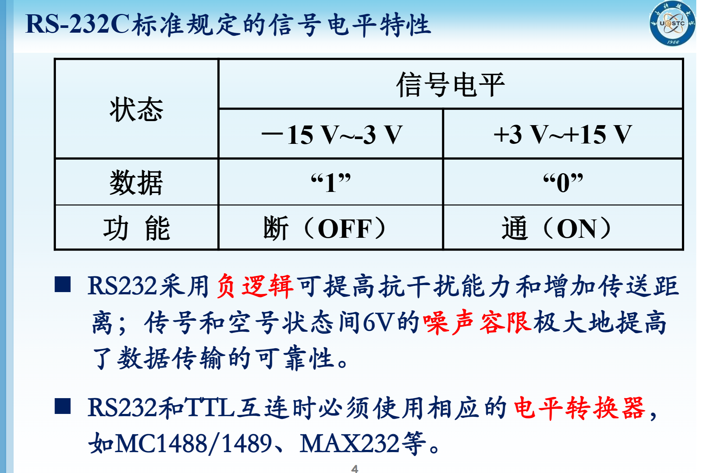

RS422/423 485标准

- 与RS-232兼容
- 支持更高的传输速率
- 支持更远的传输距离
- 增加信号数量
- 改善接口的电气特性

### USB 总线

**USB总线特点:**

- 连接简单,支持P&P及热插拔,无需电源
- 接口体积小,兼容性好,支持多连接
- 3种传送速度,4种传送模式适用于各种外设
- 半双工异步串行总线,具有主从结构

**USB系统的硬件构成**

**USB系统的软件构成**

**主控制器驱动程序(Host Controller Driver)**

安装在主机(计算机中),通过HUB完成初始化,在主控制器与USB设备之间简历通信信道,并完成对USB交换的调度

**设备驱动程序(USB Device Driver)**

安装在主机(计算机中),通常由操作系统或USB设备制造商提供

**USB芯片驱动程序(USB Driver)**

固化在USB设备内部,在设备上电时进行初始化,并根据设备特征在请求发生时组织数据传输.

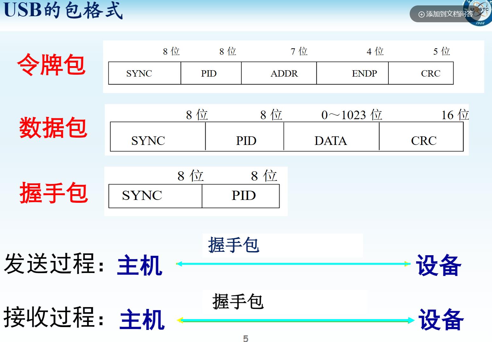

### SPI总线

SPI(Serial Peripherals Interface)是Motorala公司推出的一种**同步串行**接口,可用于单主控器同标准外设芯片的通信,也可用于组建*多主**同步网络

特点:

- 有主从模式
- 全双工通信
- 主机位移频率可调
- 丰富的中断源
- 多种错误检测机制

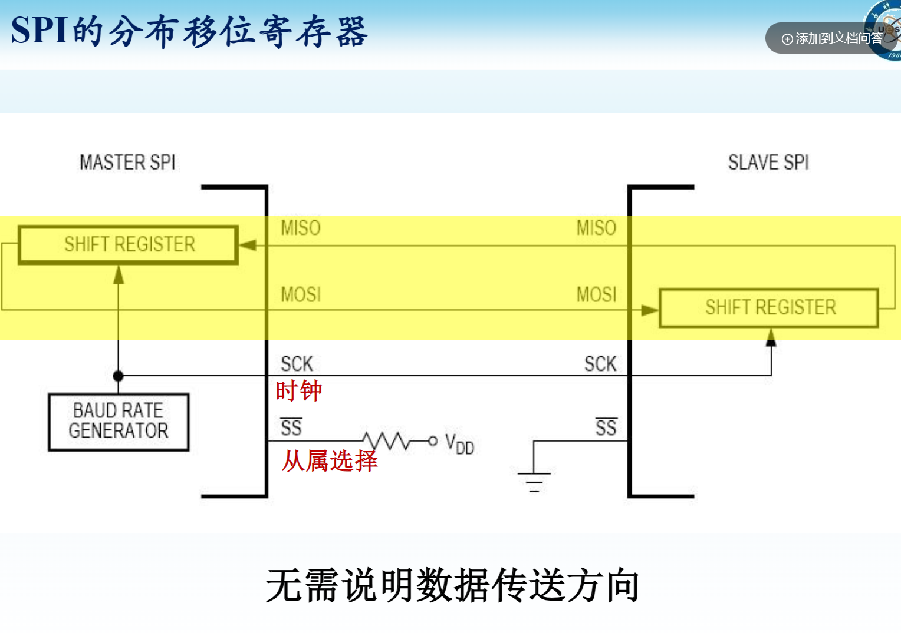

### 现场总线

现场总线也称为现场网络,是一种**工业数据总线**,指安装在制造或过程区域的现场装置与控制室内的自动装置之间的**数字式,串行,多点通信**的数据总线

现场总线技术将专用微处理器置入传统的测量控制仪表,采用可进行的简单连接的双绞线等作为总线,并按公开,规范的通信协议,形成各种**自动控制系统**

CAN(Controller Area Network)总线是由德国BOSCH公司推出的一种现场总线,它广泛用于离散控制领域,现在已经是**欧洲汽车电子网络**的标准协议

- 异步串行通信
- 支持多主方式
- 高抗电磁干扰性
- 能检测出产生的任何错误
- 具有自动关闭功能

