# 操作系统的概念,功能

## 操作系统的概念(定义)

操作系统(Operating System, OS)是指控制和**管理**整个计算机系统的**硬件和软件**资源,并合理地组织调度计算机的工作和资源的分配;以**提供给用户和其他软件方便的接口环境**;它是计算机中最基本的**系统软件**

## 提供的功能

- 处理机(CPU)管理
- 存储器(内存)管理
- 文件管理
- 设备管理

## 目标

向上层提供方便易用的方式

- GUI

- 联机命令接口(交互式命令接口)
- 脱机命令接口(批处理命令接口),文件后缀为`.bat`
- 程序接口: 可以在程序中进行**系统调用**来使用程序接口.普通用户不能直接使用程序接口,只能通过程序代码**间接调用**

> 系统调用=广义指令

# 操作系统的特征

## 并发

**并发**: 指两个或多个事件在同一时间间隔内发生.这些事件在**宏观上是同时发生的**,但**微观上是交替发生的**

**操作系统的并发性**:指计算机系统中"同时"运行着多个程序,这些程序宏观上看是同时运行着的,而微观上是交替运行的.

操作系统就是伴随着"多道程序技术"而出现的.因此,**操作系统和程序并发是一起诞生的**

> **单核CPU**同一时刻只能执行**一个程序**,各个程序只能**并发**执行
>
> **多核CPU**同一时刻可以同时执行**多个程序**,多个程序可以**并行**的执行

## 共享

**共享**:即资源共享,是指系统中的资源可供内存中多个并发执行的进程共同使用.

两种共享方式:

- 互斥共享: 一个时间段内只允许一个进程访问该资源
- 允许一个时间段内由多个进程"同时"对他们进行访问

> 并发和共享的关系
>
> **并发性**指计算机系统中同时存在着多个运行着的程序.
>
> **共享性**指系统中的资源可供内存中多个并发执行的进程共同使用
>
> 如果失去并发性,共享性就没有存在的意义
>
> 如果失去共享性,并发性就不可能实现

## 虚拟

**虚拟**是指把一个物理上的实体变为若干个逻辑上的对应物.物理实体(前者)是实际存在的,而逻辑上对应物(后者)是用户感受到的.

虚拟技术

- 空分复用技术(如虚拟存储器技术)
- 时分复用技术(如虚拟处理器)

## 异步

**异步**是指,在多道程序环境下,允许多个程序并发执行,但由于资源有限,进程的执行不是一贯到底的,而是走走停停,以**不可预知**的速度向前推进,这就是进程的异步性.

# 操作系统的发展与分类

## 手工操作阶段

用户独占全机,人机交互效率低.

## 批处理阶段

引入**脱机输入/输出技术**,并由**监督程序**负责控制作业的输入,输出

优点: 缓解了一定程度人机速度不同

缺点: 效率还是很低,没有人机交互功能

## 分时操作系统

以**时间片**为单位,**轮流为各个用户/作业服务**,各个用户可通过终端与计算机进行交互.

## 实时操作系统

优点: 能够优先响应一些紧急任务,某些紧急任务不需要时间片排队.

## 网络操作系统

## 分布式操作系统

## 个人计算机操作系统

# 操作系统的运行机制

## 两种指令

- 特权指令

- 非特权指令

## 两种状态

- 内核态(管态)
- 用户态(目态)

内核态->用户态: 执行一条**特权指令**,修改PSW状态为为用户态

用户态->内核台: 由中断引起,硬件自动完成.

**程序状态寄存器(PSW)**

# 中断和异常

## 中断的作用

CPU上会运行两种程序,一种是**操作系统的内核程序**,一种是**应用程序**

在合适的情况下,操作系统内核会把CPU的使用权主动让给应用程序

中断是让**操作系统夺回CPU使用权**的唯一途径

> 如果没有中断机制,那么一旦应用上CPU运行,CPU就会一直运行这个应用程序.
>
> 就失去了"并发性"

## 中断的类型

### 内中断(也成为异常)

与当前执行的指令**有关**,中断信号来源于CPU的**内部**

- 陷阱,陷入(tarp): 由**陷入指令**引发,是应用程序故意引发的.
- 故障(fault): 由错误条件引起的,可能被内核程序修复.内核程序修复故障后会把CPU的使用权还给应用程序.让它继续执行下去,如:缺页故障
- 终止(abort): 由致命错误引起的,内核程序无法修复该错误,因此一般不再将CPU使用权还给引发终止的应用程序,而是直接终止该应用程序.如:整数除以0,非法使用特权指令.

## 外中断

与当前执行的指令**无关**,中断信号来源于CPU的**外部**

例如时钟中断和IO中断

## 中断机制的基本原理

**不同的中断信号,需要用不同的中断处理程序来处理**.当CPU检测到中断信号后,会根据中断信号的类型去查询**中断向量表**,以此来找到响应的中断处理程序在内存中存放的位置.

> 中断处理程序是**内核程序**

# 系统调用

## 什么是系统调用

操作系统作为用户和计算机硬件之间的接口,需要向上提供一些简单易用的服务.主要包括**命令接口**和**程序接口**.其中程序接口由一组**系统调用**组成.

**系统调用**是操作系统提供给应用程序(程序员/编程人员)使用的接口,可以理解为一种可供应用程序调用的特殊函数,**应用程序可以通过系统调用来请求获得操作系统内核的服务**

## 系统调用和库函数的区别

## 什么功能要用到系统调用

- 设备管理: 完成设备的请求/释放/启动等功能
- 文件管理: 完成文件的读/写/创建/删除等功能
- 进程控制: 完成进程的 创建/撤销/阻塞/唤醒 等功能
- 进程通信: 完成进程之间的 消息传递/信号传递 等功能
- 内存管理: 完成内存的 分配/回收 等功能

应用程序通过**系统调用**请求操作系统的服务.而系统重的各种共享资源都由操作系统的内核统一掌管,因此**凡是与共享资源有关的操作(如存储分配,I/O操作,文件管理等),都必须通过系统调用的方式想操作系统内核提出服务请求**,由操作系统代为完成.这样**可以保证系统的稳定性和安全性**,防止用户进行非法操作.

## 系统调用的过程

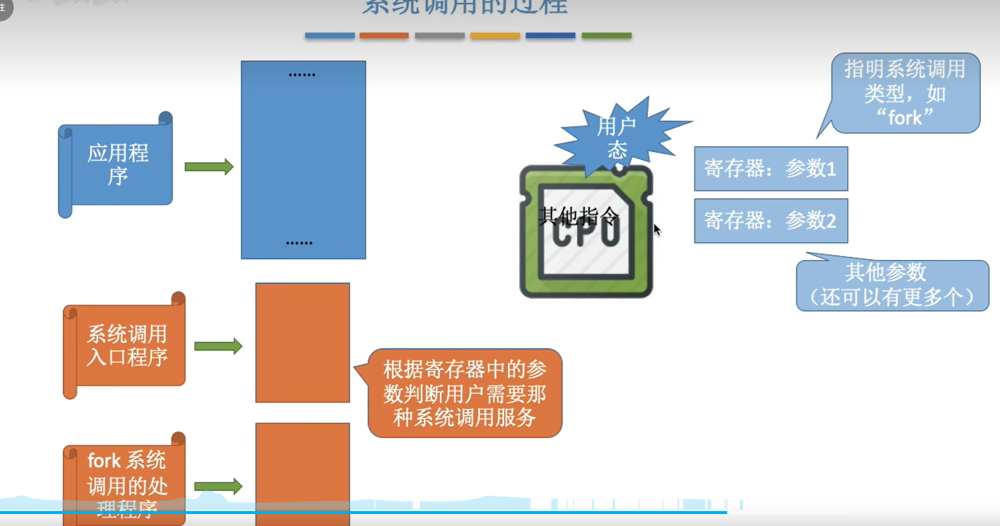

传递系统调用参数->执行陷入指令(用户态)->执行相应的请求内核程序处理系统调用(核心态)->返回应用程序

> 注意:
>
> 1. **陷入指令**是在**用户态**执行的,执行陷入指令之后立即引发一个**内中断**,使CPU进入**内核态**
> 2. 发出系统调用请求是在**用户态**,而**对系统调用的相应处理**在**核心态**下进行

# 操作系统的体系结构

## 大内核和微内核 

**内核**是操作系统最基本,最核心的部分.

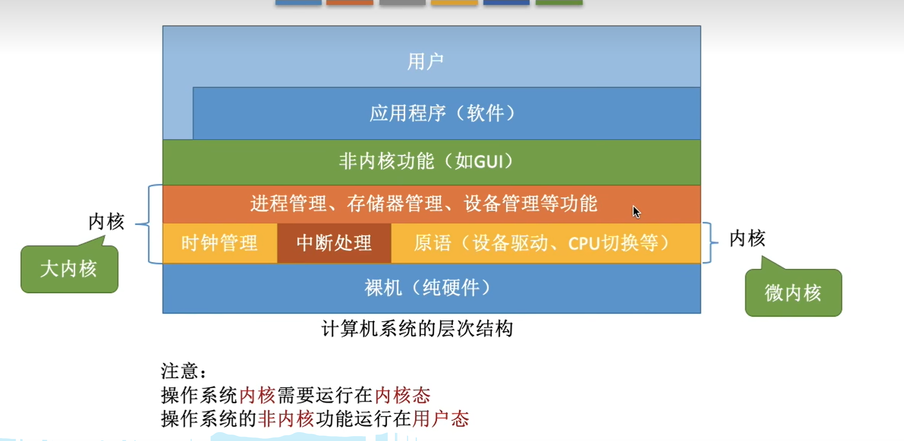

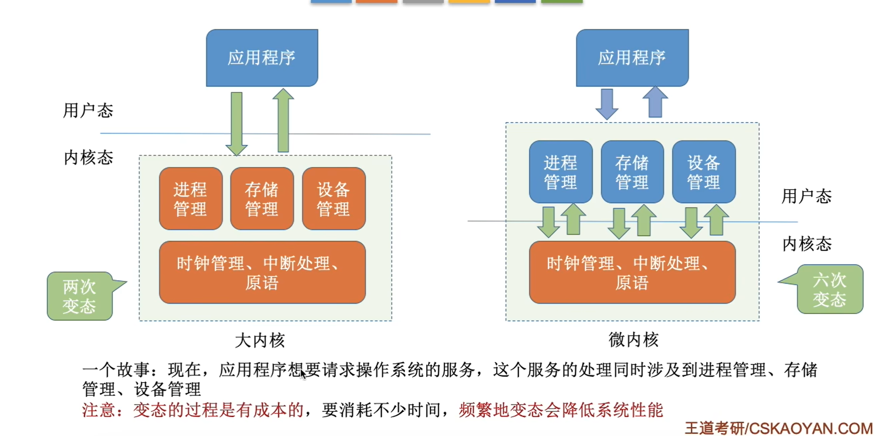

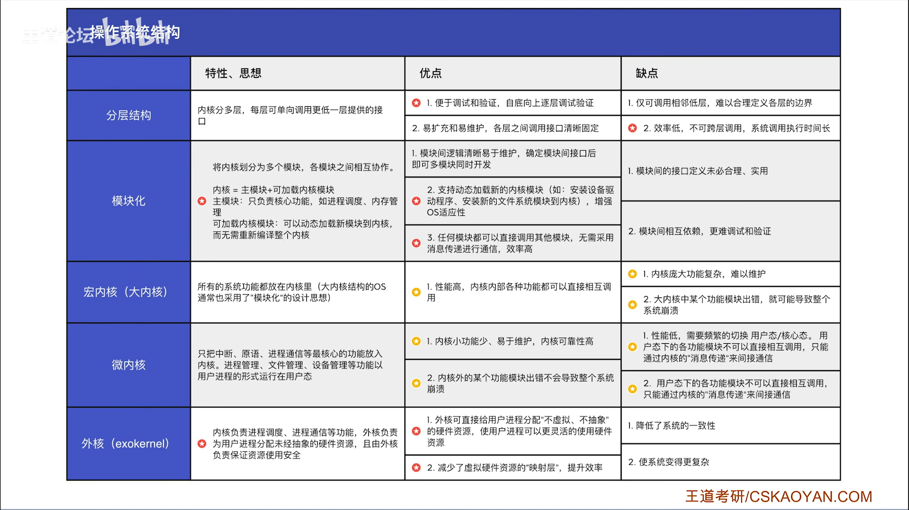

# 操作系统引导

## 什么是操作系统引导

操作系统引导(boot)

1. CPU从一个特定主存地址开始,取指令,执行ROM中的引导程序(先进行硬件自检,再开机)
2. 将磁盘的第一块--主引导记录(MBR)读入内存,执行磁盘引导程序,扫描分区表
3. 从活动分区(又称为主分区, 即安装了操作系统的分区)读入分区引导记录,执行其中的程序.
4. 从根目录下找到完整的操作系统初始化程序(即**启动管理器**)并执行,完成开机的一系列动作.

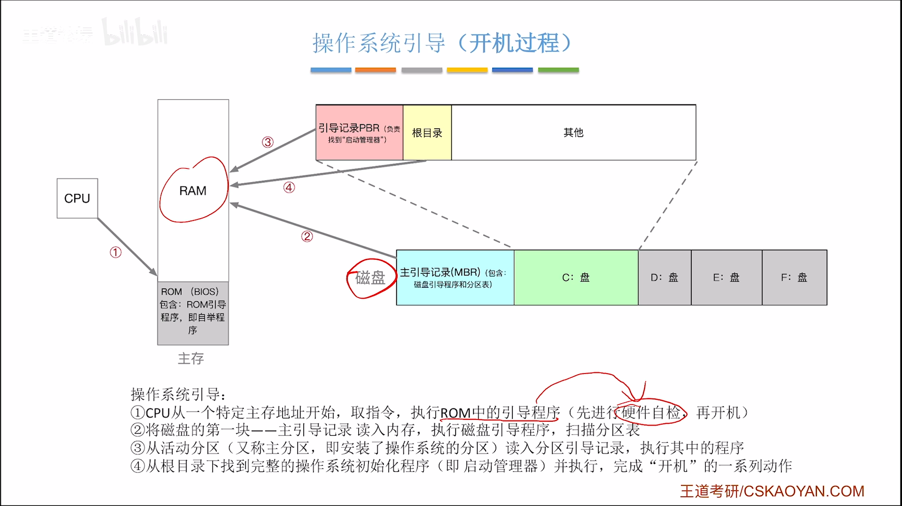

# 虚拟机

虚拟机: 使用虚拟机技术,将一台物理机器虚拟化为多台虚拟机器(Virtual Machine, VM),每个虚拟机器都可以独立运行一个操作系统.

同义术语: 虚拟机管理程序/虚拟机监控程序(Virtual Machine Monitor/Hypervisor)

# 进程的概念,组成,特征

## 概念

程序: 是**静态的**,就是个存放在磁盘里的可执行文件,就是一系列的指令集合.

进程(Process): 是**动态的**,是程序的一次执行过程.

> 同一个程序多次执行会对应多个进程.

当进程被创建时,操作系统会为该进程分配一个**唯一的,不重复**的"身份证号", --**PID**(Process ID, 进程ID)

## PCB:给操作系统用

进程控制块(Process Control Block),是进程存在的唯一标志,当进程被创建时,操作系统为其创建PCB,当进程结束时,会回收其PCB.

- 进程描述信息
  - 进程标识符PID
  - 用户标识符UID
- 进程控制和管理信息
  - CPU,磁盘,网络流量使用情况统计
  - 进程当前状态: 就绪态/阻塞态/运行态
- 资源分配清单
  - 正在使用哪些文件
  - 正在使用哪些内存区域
  - 正在使用哪些I/O设备
- 处理相关信息
  - PSW,PC等等各种寄存器的值(用于实现进程切换)

## 程序段:给进程自己用

程序的代码(指令序列)

## 数据段: 给进程自己用

运行过程中产生的各种数据(如:程序中定义的变量)

## 进程的组成

一个进程实体(进程映像)由**PCB,程序段,数据段**组成.

进程是动态的,进程实体(进程映像)是**静态**的

进程实体反映了进程在**某一时刻的状态**

**进程**是进程实体的**运行过程**,是系统进行**资源分配**和**调度**的一个独立单位.

> 注意: PCB是进程存在的唯一标志.

## 进程的特征

程序是静态的,进程是动态的,相比于程序,进程拥有以下特征

- 动态性: 进程是程序的一次执行过程,是动态地产生,变化和消亡的
- 并发性: 内存中有多个进程实体,各进程可并发执行
- 独立性: 进程是能独立运行,独立获得资源,独立接受调度的基本单位
- 异步性: 各进程按各自独立的,不可预知的速度向前推进,操作系统要提供**进程同步机制**来解决异步问题
- 结构性: 每个进程都会配置一个PCB.结构上看,进程由程序段,数据段,PCB组成.

# 进程的状态与转换

## 状态

三种基本状态

- 运行状态:该进程正在CPU上运行
- 就绪状态:当进程创建完成后,进入就绪态,此时进程已经具备运行条件,但是由于没有空闲的CPU,就暂时不能运行.
- 阻塞状态:在进程运行的过程中,可能会**请求等待某个事件的发生**,在这个事件发生之前,进程无法继续往下执行,此时操作系统会让这个进程下CPU,并让它进入**阻塞态**,当CPU空闲时,又会选择另一个就绪态的进程在CPU上运行

其他状态:

- 创建状态:进程正在被创建时的状态,在这个阶段操作系统会为进程分配资源,初始化PCB.
- 终止状态:一个进程可以执行`exit`系统调用,请求操作系统终止该进程.操作系统会让该进程下CPU,并回收内存空间等资源,最后还要回收该进程的PCB.当终止进程的工作完成之后,该进程就彻底消失了.

## 状态间的转换

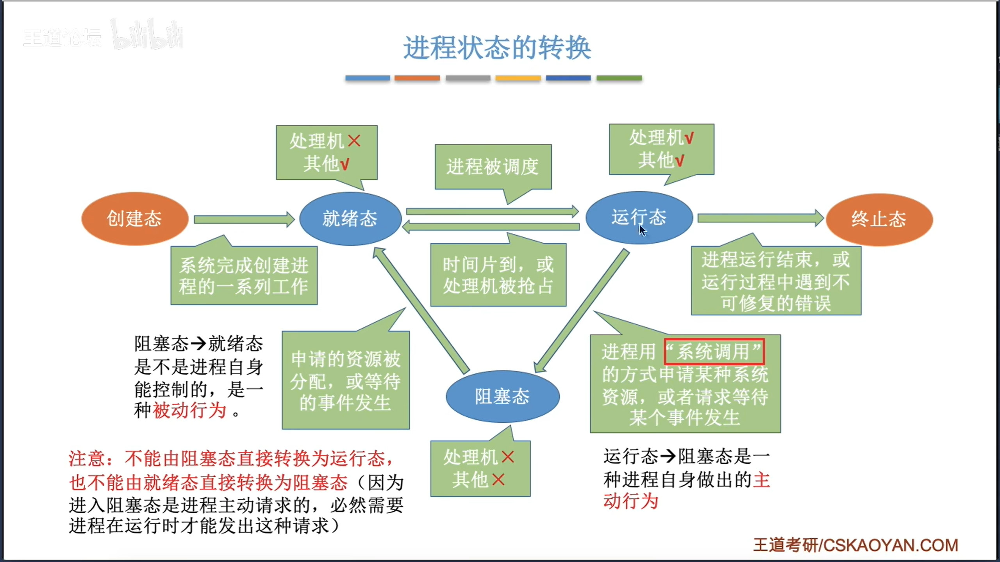

进程PCB中,会有一个变量`state`来表示进程的当前状态.如:1表示创建态,2表示就绪态,3表示运行态等.

为了对同一个状态下的各个进程进行统一的管理,操作系统会将各个进程的PCB组织起来

## 进程的组织方式(各个进程PCB的组织方式)

### 链接方式

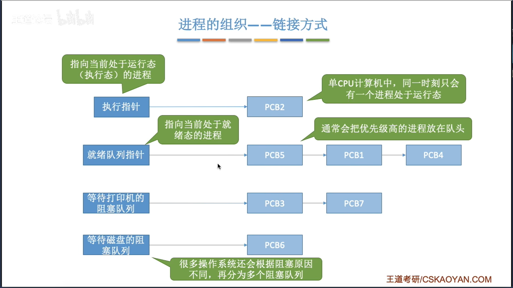

### 索引方式

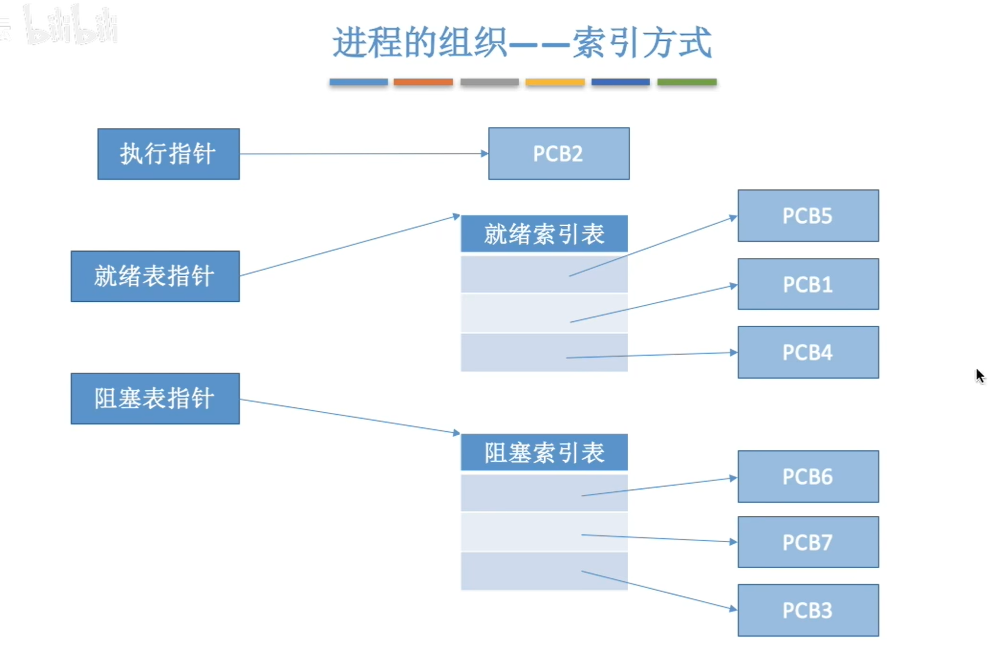

# 进程控制

进程控制主要功能是对系统中的所有进程实施有效的管理,它具有创建新进程,撤销已有进程,实现进程状态转换等功能.

简化理解: 反正进程控制就是要实现**进程状态的转换**

## 基本概念

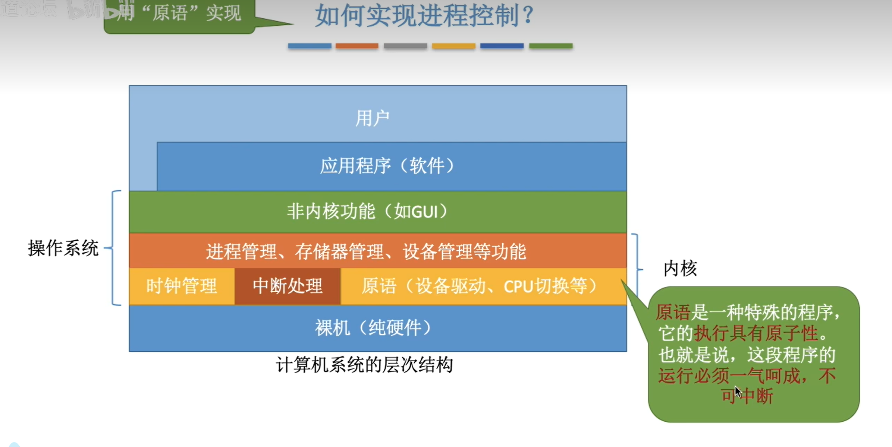

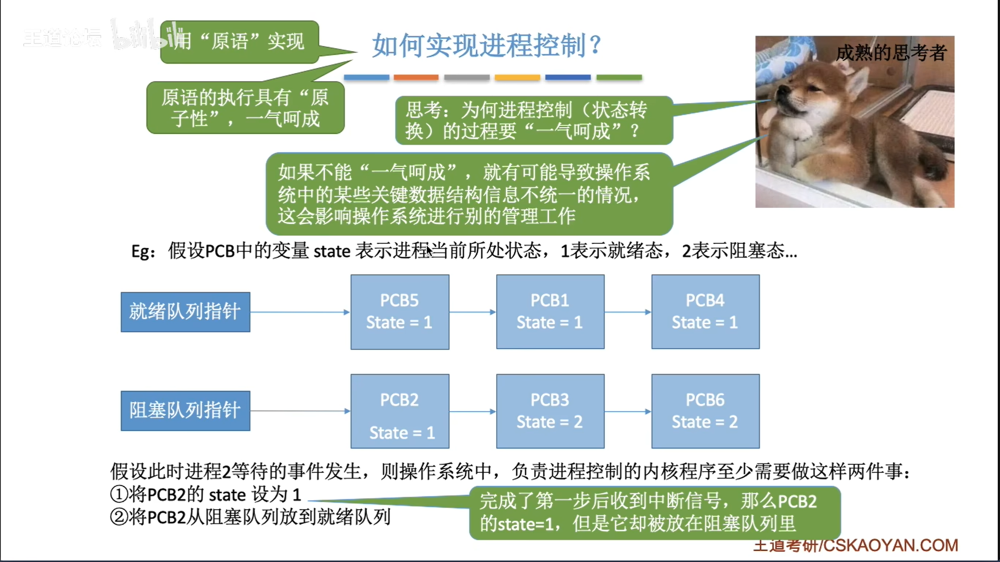

## 进程控制相关的原语

**原语**的执行具有**原子性**,即执行过程只能一气呵成,期间**不允许被中断**

可以用**关中断**指令和**开中断**指令这两个**特权指令**实现原子性.

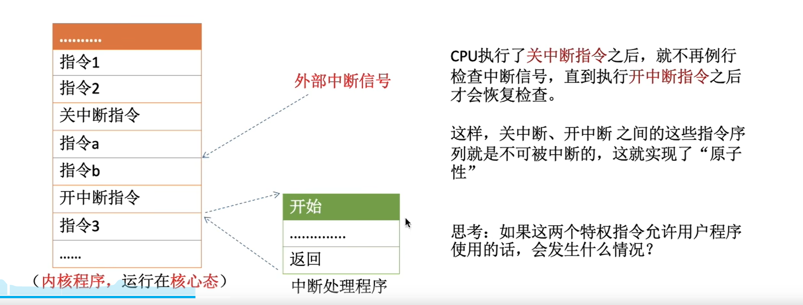

- 进程的创建
  - 创建原语
    - 申请空白PCB
    - 为新进程分配所需资源
    - 初始化PCB
    - 将PCB插入就绪队列
  - 引起进程创建的事件
    - 用户登录: 分时系统中,用户登录成功,系统会为其建立一个新的进程
    - 作业调度: 多道批处理系统中,有新的作业放入内存,会为其建立一个新的进程
    - 提供服务: 用户向操作系统提出某些请求时,会新建一个进程处理该请求
    - 应用请求: 由用户进程主动请求创建一个子进程
- 进程的终止
  - 撤销原语
    - 从PCB集合中找到终止的PCB
    - 若进程正在运行,立即剥夺CPU,将CPU分配给其他进程
    - 终止其所有子进程
    - 将该进程拥有的所有资源归还给父进程或操作系统
    - 删除PCB
  - 引发进程终止的事件
    - 正常结束
    - 异常结束
    - 外界干预
- 进程的阻塞
  - 阻塞原语
    - 找到要阻塞的进程对应的PCB
    - 保护进程运行现场,将PCB状态信息设置为阻塞态,暂时停止进程运行
    - 将PCB插入相应事件的等待队列
  - 引起进程阻塞的事件
    - 需要等待系统分配某种资源
    - 需要等待相互合作的其他进程完成工作
- 进程的唤醒
  - 唤醒原语
    - 在事件阻塞队列中找到PCB
    - 将PCB从阻塞队列移除,设置进程为就绪态
    - 将PCB插入就绪队列,等待被调度
  - 引起进程唤醒的事件: 等待的事件完成
- 进程的切换
  - 切换原语
    - 将运行环境信息存入PCB(保存必要的寄存器信息)
    - PCB移入相应队列
    - 选择另一个进程执行,并更新其PCB
    - 根据PCB恢复新进程所需的运行环境
  - 引起进程切换的事件
    - 当前进程时间片到
    - 有更优先级的进程到达
    - 当前进程主动阻塞
    - 当前进程终止

# 进程通信

进程间的通信(Inter-Process Communication, IPC)是指两个进程之间产生数据交互.

进程是分配系统资源的单位(包括内存地址空间),因此**各进程**拥有的**内存地址空间相互独立**

为了保证安全,一个进程不能直接访问另一个进程的地址空间

## 共享存储

### 基于数据结构的共享

基于数据结构的共享: 比如共享空间里只能放一个长度为10的数组.这种共享方式速度慢,限制多,是一种**低级通信**方式.

### 基于存储区的共享

基于存储区的共享:操作系统在内存中划出一块共享存储区,数据的形式,存放位置都由通信进程控制,而不是操作系统.这种共享方式速度很快,是一种**高级通信**方式.

## 消息传递

进程间的数据交换以**格式化的消息(Message)**为单位.进程通过操作系统提供的"发送消息/接收消息"两个**原语**进行数据交换.

消息头包括:发送进程ID,接收进程ID,消息长度等格式化信息.

### 直接通信方式

消息发送进程要指明接收进程的ID

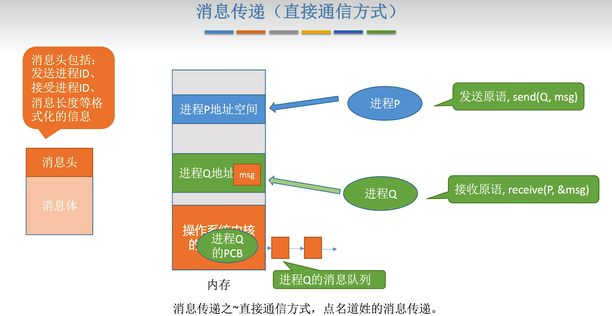

### 间接通信方式

通过"信箱"间接地通信.因此又称为"信箱通信方式"

## 管道通信

"管道"是一个特殊的共享文件,又名`pipe`文件.其实就是在内存中开辟一个大小固定的内存缓冲区.

1. 管道只能支持**半双工**通信,某个时间段内只能实现单向的传输.如果要实现**双向同时通信**,则**需要设置两个管道**.
2. 各进程要**互斥**地访问管道(由操作系统实现)
3. 当管道写满时,写进程将阻塞,直到读进程将管道中的数据取走,即可唤醒写进程
4. 当管道读空时,读进程将阻塞,直到写进程往管道中写入数据,即可唤醒读进程
5. 管道中的数据一旦被读出,就彻底消失.因此,当多个进程读同一个管道时,可能会错乱.对此,通常有两种解决方案
   - 一个管道允许多个写进程,一个读进程(2014年408真题高教社官方答案)
   - 允许有多个写进程,多个读进程,但系统会让各个读进程轮流从管道中读数据(Linux方案)

# 线程的概念与特点

传统的进程是程序执行流的最小单位.

有的进程可以需要"同时"做很多事情,而传统的进程只能串行地执行一系列程序.为此,引入了"线程",来增加并发度.

在引入线程后,线程成了程序执行流的最小单位.

> 可以把线程理解为**轻量级进程**

**线程**是一个**基本的CPU执行单元**,也就是**程序执行流的最小单位**.

引入线程之后,不仅是进程之间可以并发,进程内的**各线程之间**也可以**并发**,从而进一步**提升了系统的并发度**,使得每一个进程内也可以并发处理各种任务(如QQ视频,文字聊天,传文件);

引入线程之后,进程只作为**除CPU之外的系统资源的分配单元**(如打印机,内存地址空间等都是分配给进程的)

## 带来的变化

### 资源分配,调度

- 传统进程机制中,进程是资源分配,调度的基本单位.
- 引入线程之后,进程是自愿分配的基本单位,线程是调度的基本单位.

### 并发性

- 传统进程机制中,只能进程之间并发
- 引入线程后,各线程间也能并发,提升了并发度

### 系统开销

- 传统的进程间并发,需要切换进程的运行环境,系统的开销很大
- 线程间的并发,如果是同一进程内的线程切换,则不需要切换进程环境,系统开销小.
- 引入线程后,并发所带来的系统开销减小

## 线程的属性

- 线程是处理机调度的单位
- 多CPU计算机中,各个线程可占用不同的CPU
- 每个线程都有一个线程ID,线程控制块(TCB)
- 线程也有就绪,阻塞,运行三种基本状态
- 线程几乎不拥有系统资源
- 同一进程的不同线程间共享进程的资源
- 由于共享内存地址空间,同一进程中的线程间通信甚至无需系统干预
- 同一进程中的线程切换,不会引起进程切换
- 不同进程中的线程切换,会引起进程切换
- 切换同进程内的线程,系统开销很小.
- 切换进程,系统开销较大

# 线程的实现方式和多线程模型

## 线程的实现方式

### 用户级线程(User-Level Thread, ULT)

早期的操作系统(如:早期Unix)只支持进程,不支持线程.当时的"线程"是由线程库实现的.

很多编程语言提供了强大的线程库,可以实现线程的创建,销毁,调度等功能.

- 线程的管理工作由应用程序通过线程库实现,所有的**线程管理工作**都由**应用程序负责**(包括线程切换)
- 线程切换在**用户态下**即可完成,无需操作系统的干预.
- 在用户看来,是有多个线程,但是在操作系统内核看来,并意识不到线程的存在.
- 优缺点:
  - 优点: 线程切换在用户空间即可完成,不需要切换到核心态,线程管理的**系统开销小,效率高**
  - 缺点: 如果其中一个线程被阻塞,整个进程都会被阻塞,并发度不高.而且多个线程**不可在多核处理机上并行运行**.

### 内核级线程(Kernel-Level Thread, KLT)

- 线程管理工作由**操作系统内核**完成
- 线程调度,切换等工作都由内核负责,因此**内核级线程的切换**必须要在**核心态**下才能完成.
- 操作系统会为每个内核级线程建立相应的TCB(Thread Control Block, 线程控制块),通过TCB对线程进行管理.
- 优缺点:
  - 优点: 当一个线程被阻塞后,别的线程还可以继续执行,并发能力强.多线程可在多核处理机上并行执行.
  - 缺点: 一个用户进程会占用多个内核级线程,线程切换由操作系统内核完成,需要切换到核心态,因此线程管理成本高,开销大

### 多线程模型

- 一对一模型: 一个用户级线程映射到一个内核级线程.每个用户进程有与用户级线程同数量的内核级线程.
  - 优点: 当一个线程被阻塞后,别的线程还可以继续执行,并发能力强.多线程可在多核处理机上并行执行.
  - 缺点: 一个用户进程会占用多个内核级线程,线程切换由操作系统完成,需要切换到核心态,线程管理成本高,开销大.
- 多对一模型: 多个用户线程映射到一个内核级线程.且一个进程只被分配一个内核级线程.
  - 优点: 用户级线程切换在用户空间即可完成,不需要切换到核心态,线程管理的系统开销小,效率高.
  - 缺点: 当一个用户线程别阻塞后,整个进程都会被阻塞,并发度不高.多个线程不可在多核处理机上并行运行.
- 多对多模型: n用户级线程映射到m个内核级线程(n>=m).
  - 克服了多对一模型并发度不高的缺点(一个阻塞全体阻塞),又克服了一对一模型中一个用户进程占用太多内核级线程,开销太大的缺点.

> 用户级线程是"代码逻辑"的载体
>
> 内核级线程是"运行机会"的载体
>
> **内核级线程才是处理机分配的单位**.例如:多核CPU环境下,两个内核级线程最多被分配两个核.

一段"代码逻辑"只有获得了"运行机会"才能被CPU执行.

内核级线程中可以运行任意一个有映射关系的用户级线程代码,只有两个内核级线程中正在运行的代码逻辑都阻塞时,整个进程才会阻塞.

# 线程的状态与转换

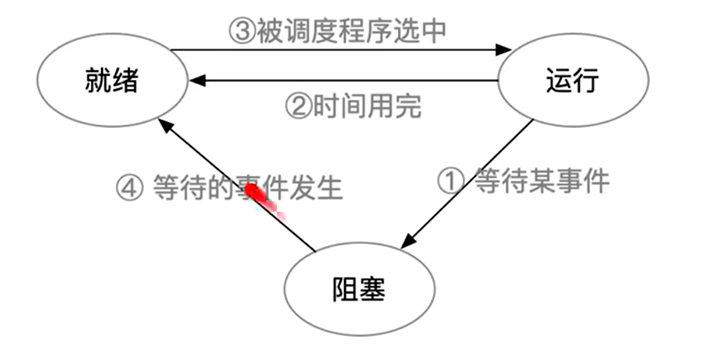

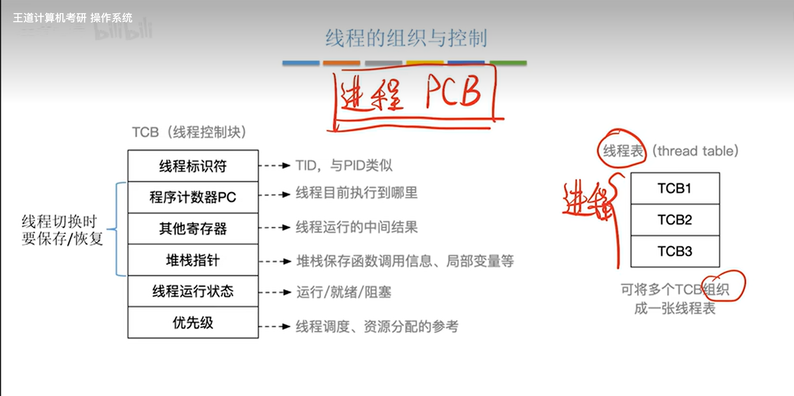

# 处理机调度的概念,层次

## 调度的基本概念

当有一堆任务要处理,但由于资源有限,所以事情没法同时处理.这就需要确定**某种规则**来**决定**处理这些任务的顺序,这就是"调度"研究的问题.

## 调度的三个层次

### 高级调度

**高级调度(作业调度)**.按一定的原则,从外存的作业后备队列中挑选一个作业调入内存,并创建进程.**每个作业只调入一次,调出一次**.作业调入时会建立PCB,调出时才撤销PCB.

### 低级调度

**低级调度(进程调度/处理机调度)**:按照某种策略从就绪队列中选取一个进程,将处理机分配给它.

进程调度是操作系统中**最基本的一种调度**,在一般的操作系统中都必须配置进程调度.

进程调度的**频率很高**,一般几十毫秒一次.

### 中级调度

内存不够时,可将某些进程的数据调出外存.等内存空闲或者进程需要运行时再重新调入内存.

暂时调到外存等待的进程状态为**挂起状态**.被挂起的进程PCB会被组织成**挂起队列**.

**中级调度(内存调度)**:按照某种策略决定将哪个处于挂起状态的进程重新调入内存.

一个进程可能会被多次调出,调入内存,因此**中级调度**发生的**频率**要比高级调度**更高**

|                    | 要做什么                                                     | 调度发生在               | 发生频率 | 对进程状态的影响                       |
| ------------------ | ------------------------------------------------------------ | ------------------------ | -------- | -------------------------------------- |
| 高级调度(作业调度) | 按照某种规则,从后备队列中选择合适的作业将其调入内存,并为其创建进程 | 外存->内存 面向作业 | 最低     | 无->创建态->就绪态                     |
| 中级调度(内存调度) | 按照某种规则,从挂起队列中选择合适的进程将其数据调回内存.     | 外存->内存 面向进程 | 中等     | 挂起态->就绪态 (阻塞挂起->阻塞态) |
| 低级调度(进程调度) | 按照某种规则,从就绪队列中选择一个进程为其分配处理机          | 内存->CPU                | 最高     | 就绪态->运行态                         |

## 进程的挂起态与七状态模型

暂时调到外存等待的进程状态为**挂起状态(挂起态, suspend)**

挂起态又可以进一步细分为**就绪挂起,阻塞挂起**两种状态.

五状态模型->七状态模型

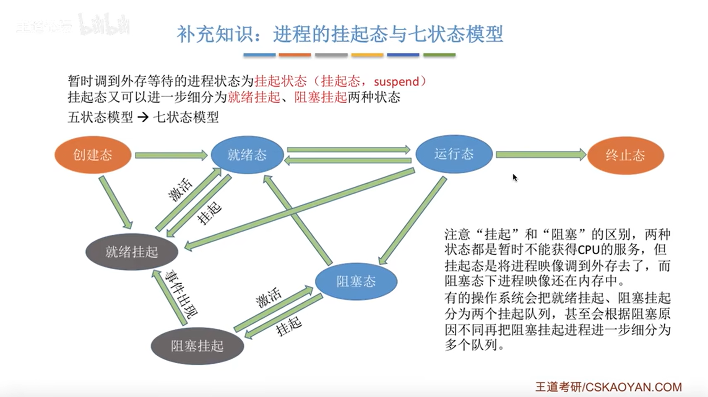

# 进程调度的时机,切换与过程,方式

## 进程调度的时机

**进程调度(低级调度)**,就是按照某种算法从就绪队列中选择一个进程为其分配处理机.

- 当前运行的进程**主动放弃**处理机
  - 进程正常终止
  - 运行过程中发生异常而终止
  - 进程主动请求阻塞(如:等待IO)
- 当前运行的进程被动放弃处理机
  - 分给进程的时间片用完
  - 有更紧急的事要处理(如I/O中断)
  - 有更高优先级的进程要进入就绪队列

不能进行进程调度与切换的情况

- 在**处理中断的过程中**.中断的处理过程复杂,与硬件密切相关,很难做到在中断处理过程中进行进程切换.
- 进程在**操作系统内核程序临界区**中
- 在**原子操作过程中(原语)**.原子操作不可中断,要一气呵成.

> 临界资源: 一个时间段内只允许一个进程使用的资源.各进程需要**互斥地**访问临界资源.
>
> 临界区: 访问临界资源的那段代码

**内核程序临界区**一般是用来访问**某种内核数据结构**的,比如进程的就绪队列(由各就绪进程的PCB组成)

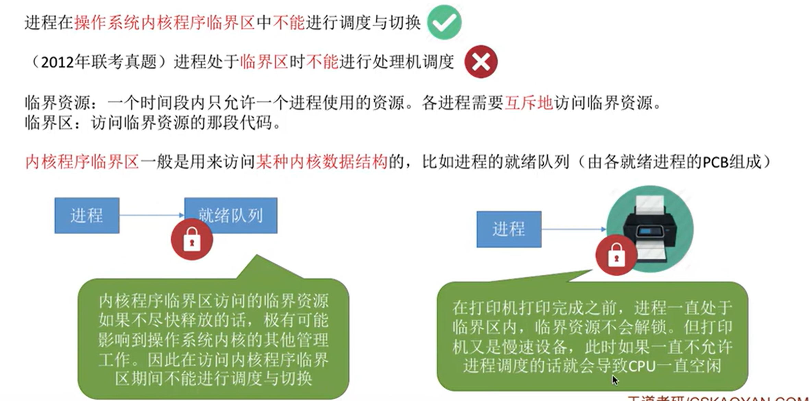

## 进程调度方式

### 非剥夺调度方式
又称为**非抢占式**.即,只允许进程主动放弃处理机.在运行过程中即便有更紧迫的任务到达,当前进程仍然会继续使用处理机,直到该进程终止或主动要求进入阻塞态.

> 实现简单,系统开销小,但是无法及时处理紧急任务,适合早期的批处理系统

### 剥夺调度方式

又称为**抢占方式**.当一个进程正在处理机上执行时,如果有一个更重要或更紧迫的进程需要使用处理机,则立即暂停正在执行的进程,将处理机分配给更重要紧迫的那个进程.

> 可以优先处理更紧急的进程,也可以让各进程按时间片轮流执行的功能(通过时钟中断).适合于分时操作系统,实时操作系统

# 调度器和闲逛进程

## 调度器/调度程序(scheduler)

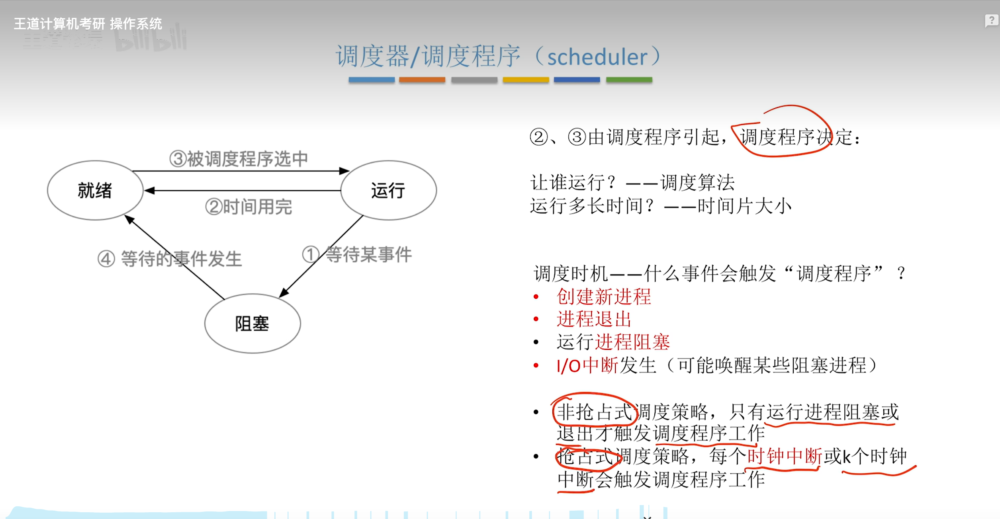

## 闲逛进程

调度程序永远的备胎,当没有其他就绪进程时,运行闲逛进程(idle)

闲逛进程的特性:

- 优先级最低
- 可以是0地址指令,占一个完整的指令周期(指令周期末尾例行检查中断)
- 能耗低

# 调度的目标(调度算法的评价指标)

## CPU利用率

$$
利用率 = \frac{忙碌的时间}{总时间}
$$

## 系统吞吐量

$$
系统吞吐量 = \frac{总共完成了多少道作业}{总共花了多少时间}
$$

## 周转时间

作业被**提交给系统**到**作业完成为止**的这段时间的时间间隔.

包括四个部分

- 作业在外存后备队列上等待作业调度(高级调度)的时间
- 进程在就绪队列上等待进程调度(低级调度)的时间
- 进程在CPU上的执行时间
- 进程等待I/O操作完成的时间

后三项在整个作业的处理过程中,可能发生多次.
$$
作业周转时间 = 作业完成时间 - 作业提交时间
$$

$$
平均周转时间 = \frac{各作业周转时间之和}{作业数}
$$

$$
带权周转时间 = \frac{作业周转时间}{作业实际运行的时间} = \frac{作业完成时间-作业提交时间}{作业的实际运行时间}
$$

## 等待时间

等待时间,指进程/作业**处于等待处理机状态时间之和**.

对于**进程**来说,等待时间是指进程建立后**等待被服务的时间之和**,在等待I/O完成期间其实进程也是被服务的,所以不计入等待时间之和.

对于**作业**来说,不仅需要考虑**建立进程后的等待时间**,还要加上**作业在外存后备队列中的等待时间**

## 响应时间

用户**提交请求**到**首次产生响应**所用的时间.

# 调度算法

> 1. 算法思想
> 2. 算法规则
> 3. 这种调度算法是用于作业调度还是进程调度
> 4. 抢占式还是非抢占式
> 5. 优点和缺点
> 6. 是否会导致**饥饿**(某进程/作业长期得不到服务)

## 先来先服务(FCFS)

### 算法思想

主要从"公平"的角度

## 短作业优先(SJF)

## 高响应比优先(HRRN)

# 同步与互斥的基本概念

# 进程互斥的软件实现方法

# 进程互斥的硬件实现方法

# 互斥锁

# 信号量机制

# 用信号量实现进程互斥,同步,前驱关系

# 生产者-消费者问题

# 多生产者-多消费者问题

# 吸烟者问题

# 读者-写者问题

# 哲学家进餐问题

# 管程

# 死锁的概念

# 死锁的处理策略

# 内存的基础知识

# 内存管理的概念

# 覆盖与交换

# 连续分配管理方式

# 动态分区分配算法

# 基本分页存储管理的概念

# 基本地址变换机构

# 具有快表的地址变换机构

# 两级页表

# 基本分段式存储管理方式

# 段页式管理方式

# 虚拟内存的基本概念

# 请求分页管理方式

