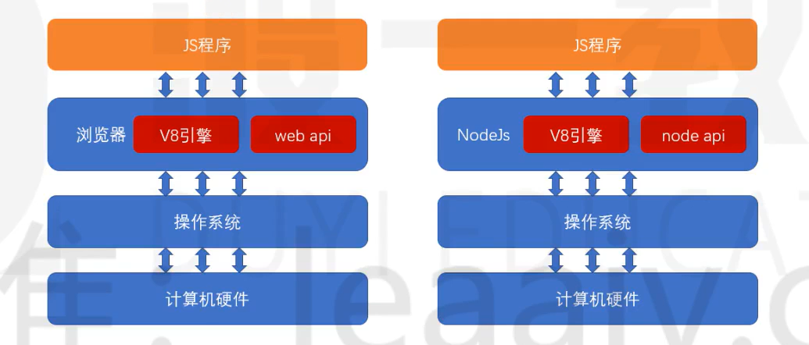

# JavaScript 模块化发展史

## 第一阶段

在`JavaScript`语言刚刚诞生的时候，它仅仅用于实现页面中一些小效果，那个时候，一个页面所用到的 JS 可能只有区区几百行的代码
在这种情况下，语言本身所存在的一些缺陷往往被大家有意地忽略，因为程序的规模实在太小，只要开发人员小心谨慎，往往不会造成什么问题
在这个阶段，也不存在专业的前端工程师，由于前端要做的事情实在太少，因此这一部分工作往往由后端工程师顺带完成
第一阶段发生的大事

- 1996 年，`NetScape`将`JavaScript`语言提交给欧洲的一个标准指定组织 ECMA(欧洲计算机制造商协会)
- 1998 年,`NetScape`在与微软浏览器 IE 的竞争中失利,宣布破产

## 第二阶段

`ajax`的出现,逐渐改变了`JavaScript`在浏览器中扮演的角色.现在,它不仅可以实现小的效果,还可以和服务器之间进行交互,以更好的体验来改变数据.
JS 代码的数量开始逐渐增长,从最初的几百行,到后来的几万行,前端程序逐渐变得复杂.
后端开发者压力逐渐增加,致使一些公司开始招募专业的前端开发者
但此时,前端开发者的待遇远不及后端开发者,因为前端开发者承担的开发任务相对于后端来说,还是比较简单的,通过短短一个月的时间集训,就可以成为满足前端开发的需要
究其根本原因,是因为前端开发还有几个大的问题没有解决,这些问题严重地制约了前端程序的规模进一步扩大

1. 浏览器解释执行 JS 的速度太慢
2. 用户端的电脑配置不足
3. 更多的代码带来了全局变量污染,依赖关系混乱等问题
   上面三个问题,就像是阿克琉斯之踵,成为前端开发挥之不去的阴影和原罪
   在这个阶段,前端开服处在一个非常尴尬的境地,它在传统的开发模式和前后端分离之间无助地徘徊
   第二阶段的大事件
4. IE 浏览器制霸市场后,几乎不再更新
5. ES4.0 流产,导致 JS 语言 10 年间几乎毫无变化
6. 2008 年 ES5 发布,仅解决了一些 JS API 不足的糟糕局面

## 第三阶段

时间继续向前推进,到了 2008 年,谷歌的 V8 引擎发布,将 JS 的执行速度推上了一个新的台阶,甚至可以和后端语言媲美.
摩尔定律持续发酵,个人电脑的配置开始飞跃
突然间,制约前端发展的两大问题得以解决,此时,只剩下最后一个问题还在负隅顽抗,即**全局变量污染和依赖混乱**的问题,解决了它,前端便可以突破一切障碍,未来无可限量.
于是,全世界的前端开发者在社区中激烈的讨论,想要为这个问题寻求解决之道
2008 年,有一个名叫 Ryan Dahl 的小伙子正在为一件事焦头烂额,他需要在服务端手写一个高性能的 web 服务,该服务对性能要求之高,以至于目前市面上已有的 web 服务产品都满足不了需求.
经过分析,他确定,如果要实现高性能,那么必须要尽可能地减少线程,而要减少线程,避免不了使用异步的处理方案
一开始,他打算自己使用 C/C++语言来编写,可是这一过程实在太痛苦.
就在他一筹莫展之际,谷歌的 v8 引擎引起了他的注意,他突然发现,JS 不就是最好的实现 web 服务的语言吗?它天生就是单线程,并且是基于异步的!有了 v8 引擎的支撑,它的执行速度完全可以撑起一个服务器.而且 V8 是大名鼎鼎的谷歌公司发布的,谷歌一定会不断地优化 V8,有这种省钱又省力的好事,我干嘛还要自己去写呢?
于是,它基于开源的 V8 引擎,对源代码作了一些修改,便快速的完成了该项目.
2009 年,Ryan 推出了该 web 服务项目,命名为 nodejs
从此,JS 第一次堂堂正正地入主后端,不再是必须附属于浏览器的"玩具"语言了.
也是从此刻开始,人们认识到,JS(ES)是一门真正的语言,它依附于运行环境(运行时)(宿主程序)而执行



nodejs 的诞生,便把 JS 中的最后一个问题放到了台前,即**全局变量污染和依赖混乱**问题.

要知道,nodejs 是服务器端,如果不解决这个问题,分模块开发就无从实现,而模块化开发是所有后端程序必不可少的内容
经过社区的激烈讨论,最终,形成了一个模块化的方案,即鼎鼎大名的`CommonJS`,该方案,彻底解决了全局变量污染和依赖混乱的问题
该方案一出,立即被 nodejs 支持,于是,nodejs 成为了第一个为 JS 语言实现模块化的平台,为前端接下来的迅猛发展奠定了实践基础
该阶段发生的大事件

- 2008 年,v8 发布
- IE 的市场逐步被 firfox 和 chrome 蚕食,现已无力回天
- 2009 年, nodejs 发布,并附带 commonjs 模块化标准

## 第四阶段

`CommonJS`的出现打开了前端开发者的思路
既然后端可以使用模块化的 JS,作为 JS 语言的老东家浏览器为什么不行呢?
于是,开始有人想办法把`CommonJS`运用到浏览器中
可是这里面存在诸多的困难
办法总比困难多,有些开发者就想,既然 CommonJS 运用到浏览器困难,我们干嘛不自己重新定一个模块化的标准出来,难道就一定要有 CommonJS 标准吗?
于是很快,`AMD`规范出炉,它解决的问题和 CommonJS 一样,但是可以更好地适应浏览器环境.
相继地,`CMD`规范出炉,它对`AMD`规范进行了改进.
这些行为,都受到了 ECMA 官方的密切关注
2015 年,ES6 发布,它提出了官方的模块化解决方案 `ES Module`
从此以后,模块化成为了 JS 本身特有的性质,这门语言终于有了和其他语言较量的资本,成为了可以编写大型应用的正式语言
与此同时,很多开发者,技术厂商早已预见到 JS 的无穷潜力,于是有了下面的故事

- 既然 JS 也能编写大型应用,那么自然也需要像其他语言那样具有解决复杂问题的开发框架
  - `Angular`,`React`,`Vue`等前端开发框架出现
  - `Express`,`Koa`等后端开发框架出现
  - 各种后端数据库驱动出现
- 要开发大型应用，自然少不了各种实用的第三方库的支持
  - npm 包管理器的出现，使用第三方变得极其方便
  - webpack 等构建工具出现，专门用于打包和部署
- 既然 JS 可以放到服务器环境，为什么不能放到其他终端环境呢？
  - `Electron`的发布，可以使用 JS 语言开发桌面应用程序
  - `RN`和`Weex`的发布，可以使用 JS 语言开发移动应用程序
  - 各种小程序出现，可以使用 JS 编写依附于其他应用的小程序
  - 目前还有很多厂商致力于将 JS 应用到各种其他的终端设备，最终形成大前端生态

> 可以看到，模块化的出现，是 JS 通向大型应用的最后一堵墙，学习好模块化，便具备了编写大型应用的基本功.

# CommonJS

在 nodejs 中,由于有且仅有一个入口文件(启动文件),而开发一个应用肯定会涉及到多个文件的配合,因此,nodejs 对模块化的需求比浏览器端要大的多

由于 nodejs 刚刚发布的时候,前端没有统一的,官方的模块化规范,因此,它选择使用社区提供的 CommonJS 规范

在学习 CommonJS 之前,首先认识两个重要概念: **模块的导出和模块的导入**

## 模块的导出

要理解模块的导出,首先要理解模块的含义

什么是模块?

模块就是一个 JS 文件, 它实现了一部分功能,并隐藏自己的内部实现,同时提供了一些接口供其他模块使用

模块有两个核心要素: **隐藏**和**暴露**

隐藏的是自己的内部实现

暴露的是希望外部使用的接口

任何一个正常的模块化标准,都应该默认隐藏模块中的所有实现,而是通过一些语法或 api 调用来暴露接口

**暴露接口的过程即模块的导出**

## 模块的导入

当需要使用一个模块时,使用的是该模块暴露的部分(导出的部分), 隐藏的部分是永远无法使用的

**当通过某种语法或 api 去使用一个模块时,这个过程就叫做模块的导入**

## CommonJS 规范

CommonJS 使用`exports`导出模块,使用`require`导入模块

具体规范如下:

1. 如果一个 JS 文件中存在`exports`或`require`,该文件是一个模块
2. 模块内的所有代码均为隐藏代码,包括全局变量,全局函数,这些全局的内容均不应该对全局变量造成任何污染.
3. 如果一个模块需要暴露一些 API 提供给外部使用,需要通过`exports`导出, `exports`是一个空的对象,你可以为该对象添加任何需要导出的内容
4. 如果一个模块需要导入其他模块,通过`require`实现,`require`是一个函数,其返回值是模块的导出内容,`require`的参数是模块的路径

## nodejs 对 CommonJS 的实现

为了实现 CommonJS 规范, nodejs 对模块做出了以下处理

1. 为了保证高效地执行, 仅加载必要的模块. nodejs 只有执行到`require`函数时才会加载**并执行模块** (模块中的代码会被执行一遍)

2. 为了隐藏模块中的代码, nodejs 执行模块时, 会将模块中的所有代码放置到一个函数中执行,以保证不污染全局变量.

```js
(function () {
  // 模块中的代码
})();
```

3. 为了保证顺利地导出模块内容,nodejs 做了以下处理

- 在模块开始执行前,初始化一个值`module.exports={}`
- `module.exports`就是模块的导出值
- 为了方便开发者便捷的导出, nodejs 在初始化完`module.exports`之后,又声明了一个变量`exports = module.exports`

```js
(function (module) {
  module.exports = {};
  var exports = module.exports;
  // 模块中的代码
  return module.exports;
})();
```

4. 为了避免反复加载同一个模块, nodejs 默认开启了模块缓存, 如果加载的模块已经被加载过了,则会自动使用之前的导出结果(不会再次执行模块代码)

# 浏览器端模块化的难题

## CommonJS 的工作原理

当使用`require(模块路径)`导入一个模块时,node 会做以下两件事情(不考虑模块缓存):

1. 通过模块路径找到本机文件,并读取文件内容
2. 将文件中的代码放入到一个函数环境中执行,并将执行后`module.exports`的值作为`require`函数的返回结果

正是这两个步骤,使得 CommonJS 在 node 端可以良好地被支持

可以认为, **CommonJS 是同步的**, 必须要等到加载完文件并执行完代码后才能继续向后执行

## 当浏览器遇到 CommonJS

当想要把 CommonJS 放到浏览器端时,就遇到了一些挑战

1. 浏览器要加载 JS 文件,需要远程从服务器读取,而网络传输的效率远远低于 node 环境中读取本地文件的效率.由于 CommonJS 是同步的,这会极大地降低运行性能

2. 如果需要读取 JS 文件内容并把它放入到一个环境中执行,需要浏览器厂商的支持,可是浏览器厂商不愿意提供支持,最大啊的原因是 CommonJS 属于社区规范,而不是官方标准

## 新的规范

基于以上两点原因,浏览器无法支持模块化
可这并不代表模块化不能在浏览器中实现
要在浏览器中实现模块化,只要能解决上面的两个问题就行了
解决办法其实很简单:

1. 远程加载 JS 浪费了时间? 做成异步即可,加载完成后调用一个回调就行了
2. 模块中的代码需要放置到函数中执行? 编写模块时,直接放函数中就行了

基于这种简单有效的思路,出现了`AMD`和`CMD`规范,有效地解决了浏览器的模块化问题.

# ES6 模块化简介

ECMA 组织参考了众多社区模块化标准,终于在 2015 年,随着 ES6 发布了官方的模块化标准,后成为 ES6 模块化标准

ES6 模块化具有以下的特点

1. 使用依赖**预声明**的方式导入模块

   1. 依赖延迟声明
      1. 优点: 某些时候可以提高效率
      2. 缺点: 无法在一开始确定模块依赖关系
   2. 依赖预声明
      1. 优点: 可以在编译时确定模块依赖关系
      2. 缺点: 某些时候效率较低

2. 灵活的多种导入导出方式

3. 规范的路径表示法: 所有路径必须以./或../开头

## 基本的导入导出

### 模块的引入

**注意: 这一部分非模块化标准**

目前,浏览器使用以下方式引入一个 ES6 模块文件

```html
<script type="module" src="入口文件"></script>
```

### 模块的基本导入导出

ES6 中模块的导入导出分为两种

1. 基本导入导出

2. 默认导入导出


### 基本导出

类似于`exports.xxx = xxxxx`

基本导出可以有多个, 每个必须有名称

基本导出的语法如下:

```js
export 声明表达式

export const a = 1;

const b = 1;

export b;     // 错误,export后面必须是声明语句或具名符号
export c = 3; // 错误,export后面必须是声明语句或具名符号

const d = 4;

export {b} // 将b变量的名称作为导出名称,将b变量的值作为导出的值

```

或

```js
export { 具名符号 };
```

由于基本导出必须具有名称,所以要求导出的内容必须跟上**声明表达式**或**具名符号**

### 基本导入

由于使用的是**依赖预加载**,因此,导入任何模块,导入代码必须放置到所有代码之前

对于基本导出, 如果要进行导入,使用下面的代码

```js
import { 导入的符号列表 } from '模块路径';
```

注意以下细节

- 导入和导出时,可以通过关键字`as`对导入的符号进行重命名

```js
export { c as a };
import { a as a2 } from './a.js';
```

- 导入时使用的符号是常量,不可修改

```js
import { name, age } from './a.js';

name = 234324;
// Uncaught TypeError: Assignment to constant variable.
```

- 可以使用`*`号导入所有的基本导出,形成一个对象(必须使用`as`重命名)

```js
import * as obj from './a.js';
console.log(obj.a);
```

> ESModule 同样具有导入缓存
> 如果只想执行模块中代码,不想导入,可以直接使用`import './a.js'`

## 默认导入导出

### 默认导出

每个模块,除了允许有多个基本导出之外,还允许有**一个**默认导出
默认导出类似于 CommonJS 中的`module.exports`,由于只有一个,因此无需具名
具体的语法是

```js
export default 默认导出的数据;
```

或

```js
export { 默认导出的数据 as default };
```

```js
export const a = 1; // 基本导出a = 1
export default a; // 默认导出a的值(即默认导出1)
```

由于每个模块仅允许有一个默认导出,因此,每个模块不能出现多个默认导出语句

### 默认导入

想要导入一个模块的默认导出,需要使用下面的语法

```js
import 接受变量名 from '模块路径';
import data from './a.js'; // 将模块默认导出的值赋给data
```

类似于 CommonJS 中的

```js
var 接受变量名 = require('模块路径');
```

由于默认导入时变量名是自行定义的,因此没有别名一说
如果希望同时导入某个模块的默认导出和基本导出,可以使用下面的语法

```js
import 接收默认导出的变量, { 接收基本导出的符号列表 } from '模块路径';
```

> 如果使用\*号,会将所有基本导出和默认导出聚合到一个**对象**中,默认导出会作为属性`default`存在

## ES6 模块化细节

1. 尽量导出不可变的值

```js
// index.js
import method, { name } from './a.js';

name = 123; // Uncaught TypeError: Assignment to constant variable.

console.log(name); // 模块a

method();

console.log(name); // module a
```

```js
// a.js
export var name = '模块a';

export default function () {
  name = 'module a';
}
```

可能导致混乱,所以在导出时尽量使用`const`声明语句

```js
export const name = '模块a';
```

2. 可以使用无绑定的导入用于执行一些初始化代码
   如果我们只是想执行模块中的一些代码,而不需要导入它的任何内容,可以使用无绑定导入

```js
import './a.js';
```

3. 可以使用绑定再导出来重新导出来自另一个模块的内容

有的时候,我们可能需要用一个模块封装多个模块,然后有选择地将多个模块的内容分别导出,可以使用下面的语法轻松完成

```js
export { 绑定的表示符 } from '模块路径';
```
