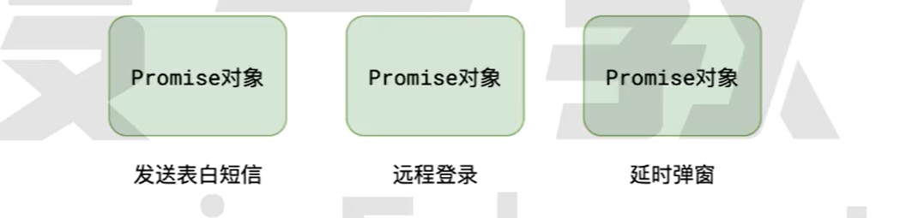
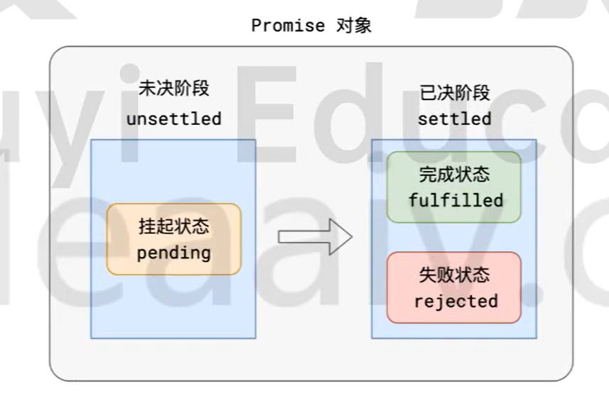
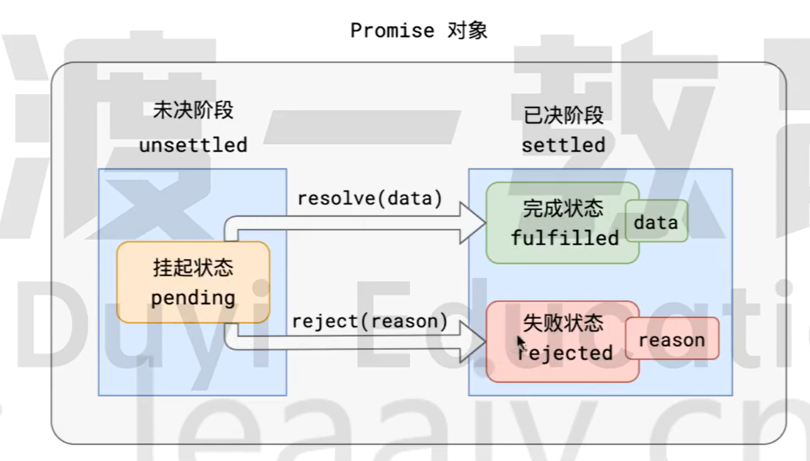
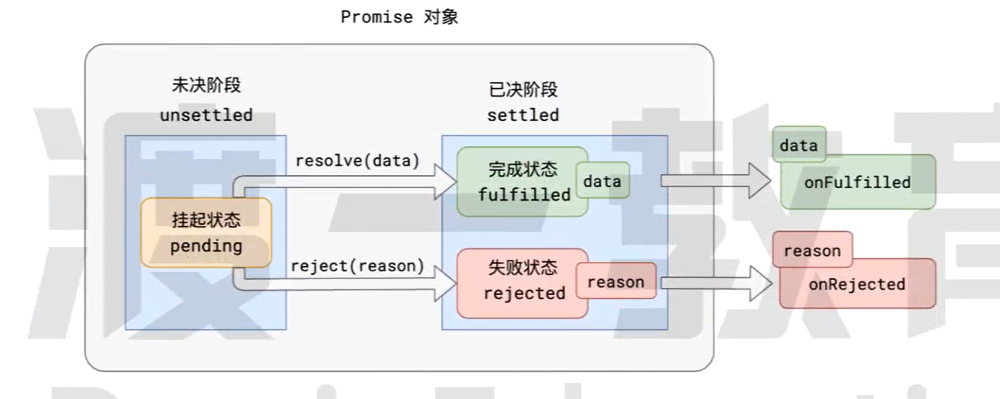
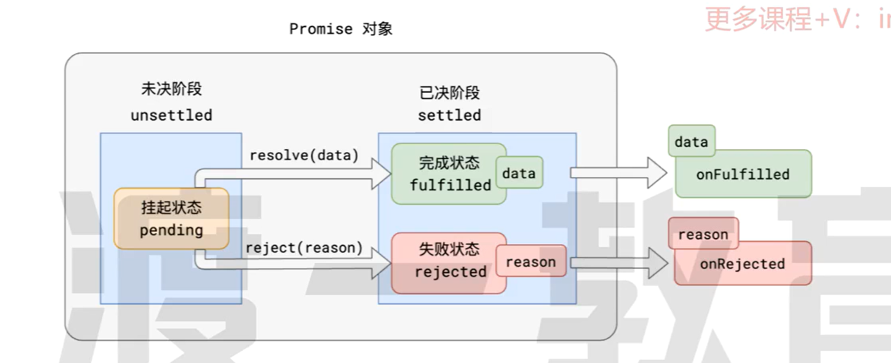
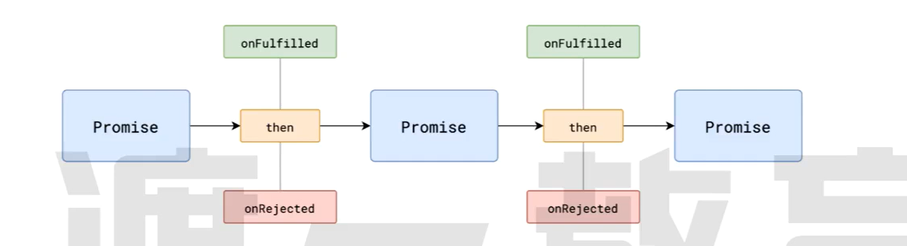
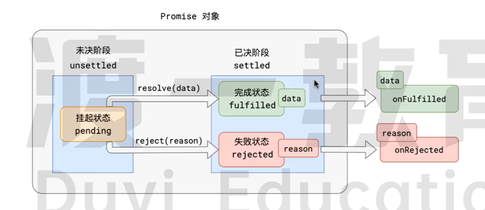
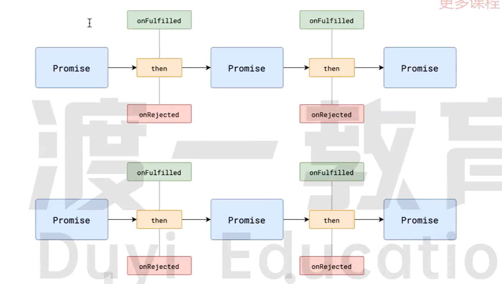

# Promise 概述

## Promise规范

Promise是一套专门处理异步场景的规范,它能够有效的避免回调地狱的产生,使异步代码更加清晰,简洁,统一

这套规范最早诞生于前端社区,规范名称为`Promise A+`

该规范出现后,立即得到很多开发者的响应.

Promise A+规定

1. 所有的异步场景,都可以看作是一个任务,每个异步任务,在JS中应该表现为一个对象,该对象称之为**Promise**对象,也叫做任务对象



2. 每个任务对象,都应该有两个阶段,三个状态



根据常理,他们之间存在以下逻辑:

- 任务总是从未决阶段变到已决阶段,==无法逆行==
- 任务总是从挂起状态变到完成或失败状态,==无法逆行==
- 时间不能倒流,历史不可改写,任务一旦完成或失败,状态就固定下来,永远无法改变.

3. `挂起->完成`称之为`resolve`;`挂起->失败`称之为`reject`.任务完成时,可能有一个相关数据;任务失败时,可能有一个失败原因.



4. 可以针对任务进行后续处理,针对完成状态的后续处理称之为`onFulfilled`,针对失败的后续处理称之为`onRejected`



## Promise API

ES6提供了一套API,实现了Promise A+规范

基本使用如下:

```js
// 创建一个任务对象,该任务立即进入pending状态
const pro = new Promise((resolve, reject)=> {
    // 任务的具体执行流程,该函数会立即被执行
    // 调用 resolve(data), 可将任务变为 fulfilled 状态, data为需要传递的相关数据.
    // 调用 reject(reason), 可将任务变为 rejected 状态, reason为序言传递的失败原因
})

pro.then((data)=>{
    // onFulfilled函数,当任务完成后,会自动运行该函数,data为任务完成的相关数据
},
        (reason)=>{
    // onRejected函数,当任务失败后,会自动运行该函数, reason为任务失败的相关原因
})
```

## 练习题

1. 完成下面的函数

```js
/**
* 延迟一段指定的时间
* @param {Number} duration 等待的时间
* @returns {Promise} 返回一个任务,该任务在指定的时间后完成
*/
function delay(duration) {
    return new Promise((resolve,reject) =>{
        setTimeout(()=>{
            resolve();
        },duration);
    });
}
```

2. 按照要求,调用`delay`函数,完成程序:利用`delay`函数,等待1s钟,输出:`finish`

```js
delay(1000).then(()=>{
    console.log('finish');
})
```

3. 如下

```js
<!DOCTYPE html>
<html lang="en">
<head>
  <meta charset="UTF-8">
  <meta name="viewport" content="width=device-width, initial-scale=1.0">
  <title>Document</title>
</head>
<body>
  <script>
    // 根据指定的图片路径,创建一个img元素
    // 该函数需要返回一个Promise, 当图片加载完成后,任务完成,如图片加载失败,任务失败
    // 任务完成后,需要提供的数据是图片的DOM元素;任务失败时,需要提供失败的原因
    // 提示: img元素有两个事件,load事件会在图像加载完成时触发,error事件会在图像加载失败时触发
    function createImage(src) {
      return new Promise((resolve, reject) => {
        const img = new Image();
        img.src = src;
        img.onload = () => {
          resolve(img);
        };
        img.onerror = () => {
          reject(new Error('图片加载失败'));
        };
      });
    }
    // 使用createImage函数,创建一个图片元素,并添加到页面中
    createImage('https://www.baidu.com/img/bd_logo1.png').then(img => {
      document.body.appendChild(img);
      const p = document.createElement('p');
      // p元素中显示img的宽高
      p.innerHTML = `图片的宽高为: ${img.width} x ${img.height}`;
      document.body.appendChild(p);
    }).catch(err => {
      console.log(err);
    });
  </script>
</body>
</html>
```

4. 下面的任务最终状态是什么,相关的数据或失败的原因是什么,最终输出什么

```js
new Promise((resolve,reject) =>{
  console.log('任务开始');
  resolve(1);
  reject(2);      // 无效
  resolve(3);     // 无效
  console.log('任务结束');
})

// 任务开始
// 任务结束
// Promise fulfilled 1

new Promise((resolve,reject) => {
  console.log('任务开始');
  resolve(1);     
  resolve(2);       // 无效
  console.log('任务结束');
})

// 任务开始
// 任务结束
// Promise fulfilled 1
```

# Promise的链式调用



## catch方法

`.catch(onRejected)` = `.then(null, onRejcted)`

## 链式调用



1. `then`方法必定会返回一个新的`Promise`,可以理解为==后续处理也是一个任务==
2. 新任务的状态取决于后续处理:
   - 若没有相关的后续处理,新任务的状态和前任务一致,数据为前任务的数据.==注意: 目前新版node如果整个链式调用都不对错误进行相关处理,程序会直接报错==
   - 若有后续处理但还未执行,新任务挂起
   - 若后续处理执行了,则根据后续处理的情况确定新任务的状态
     - 后续处理执行==无错==,新任务的状态为==完成==,数据为后续处理的返回值
     - 后续处理执行==有错==,新任务的状态为==失败==,数据未异常对象
     - 后续执行后返回的是一个任务对象,新任务的状态和数据与该任务对象一致.

由于链式任务的存在,异步代码有了更强的表达力

```js
// 常见的任务处理代码

/*
* 任务成功后,执行处理1,失败后则执行处理2
*/

pro.then(处理1).catch(处理2);

/* 
* 任务完成后,依次处理1, 处理2
*/

pro.then(处理1).then(处理2)


```

## 面试题

```js
// 下面代码的输出是什么
const pro1 = new Promise((resolve, reject)=>{
    setTimeout(()=>{
        resolve(1);
    },1000);
})

const pro2 = pro1.then((data)=>{
    console.log(data);
    return data+1;
})

const pro3 = pro2.then((data)=>{
    console.log(data);
});

setTimeout(()=>{
    console.log(pro1, pro2, pro3);
},2000)

// pro1 fulfilled 1
// pro2 fulfilled 2
// pro3 fulfilled undefined
```

2. 下面的代码的输出结果是什么

```js
const pro1 = new Promise((resolve, reject) => {
  resolve(1);
})
const pro2 =  pro1.then((res) => {
  console.log(res);
  return 2;
})
const pro3 = pro2.catch((err) => {
  return 3;
})
const pro4 = pro3.then((res) => {
  console.log(res);
});

// fulfilled 1 
// fulfilled 2
// fulfilled 2
// fulfilled undefined


// 输出 1 2

setTimeout(() => {
  console.log(pro1);
  console.log(pro2);
  console.log(pro3);
  console.log(pro4);
}, 0);

```

3. 下面代码的输出是什么

```js
const pro1 = new Promise((resolve, reject) => {
  resolve();
});
const pro2 = pro1.then((res) => {
  console.log(res.toString()); // 抛出错误,因为undefined没有toString方法
  return 2;
});
const pro3 = pro2.catch((err) => {
  return 3;
});
const pro4 = pro3.then((res) => {
  console.log(res);
});

setTimeout(() => {
  console.log(pro1, pro2, pro3, pro4);
}, 1000);

// fulfilled undefined
// rejected  Type
// fulfilled 3
// fulfilled undefined

// 输出3

```

4. 下面的代码的输出是什么?

```js
const pro1 = new Promise((resolve, reject) => {
  throw new Error(1);
});
const pro2 = pro1.then((res) => {
  console.log(res);
  return new Error(2);
});
const pro3 = pro2.catch((err) => {
  throw err;
  return 3;
});
const pro4 = pro3.then((res) => {
  console.log(res);
});
setTimeout(() => {
  console.log(pro1, pro2, pro3, pro4);
}, 1000);


// rejected Error 1
// rejected Error 1
// rejected Error 1
// rejected Error 1


// Error 1

```

> 注意在新版node中,由于该代码中的错误最后并没有被捕获,所以运行代码会直接报错,不会输出.报错位置是最开始第二行的Error(1);

5. 下面的代码输出什么?

```js
const pro1 = new Promise((resolve, reject) => {
  setTimeout(() => resolve(), 1000);
});

const pro2 = pro1.catch(() => {
  return 2;
})

console.log('pro1', pro1);
console.log('pro2', pro2);

setTimeout(() => {
  console.log('pro1', pro1);
  console.log('pro2', pro2);
}, 2000);


// pending 
// pending

// fulfilled undefined
// fulfilled undefined
```

# Promise的静态方法

| 方法名                         | 含义                                                         |
| ------------------------------ | ------------------------------------------------------------ |
| `Promise.resolve(data)`        | 直接返回一个完成状态的任务                                   |
| `Promise.reject(reason)`       | 直接返回一个拒绝状态的任务                                   |
| `Promise.all(任务数组)`        | 返回一个任务<br />任务数组全部成功则成功<br />任何一个失败则失败 |
| `Promise.any(任务数组)`        | 返回一个任务<br />任务数组任一成功则成功<br />任务全部失败则失败 |
| `Promise.allSettled(任务数组)` | 返回一个任务<br />任务数组全部已决则成功<br />该任务不会失败 |
| `Promise.race(任务数组)`       | 返回一个任务<br />任务数组任一已决则已决,状态和其一致        |

# `async`和`await`

## 消除回调

有了`Promise`,异步任务就有了一种统一的处理方式.

有了统一的处理方式,ES官方就可以对其进行进一步优化

ES7推出了两个关键字`async`和`await`,用于更加优雅的表达Promise

## async

`async`关键字用于修饰函数,被它修饰的函数,一定返回`Promise`

```js
async function method1() {
  return 1; // 该函数的返回值是Promise完成后的数据
}

console.log(method1()); // Promise {1}

async function method2() {
  return Promise.resolve(1); // 若返回的是Promise,则method得到的Promise状态和其一致
}
const m2 = method2();
console.log(m2); // Promise {<pending>}
setTimeout(() => {
  console.log(m2);
}, 0); // Promise {1}

async function method3() {
  return new Error(1); // 若执行过程报错,则任务是rejected
}

console.log(method3()); // Promise { <rejected> Error(1)}
```

## await

`await`关键字用于等待某个`Promise`完成,它必须用于`async`函数中.

```js
async function method() {
    const n = await Promise.resolve(1);
    console.log(n);	// 1
}

// 上面的函数等同于
function method() {
    return new Promise((resolve, reject) => {
        Promise.resolve(1).then(n => {
            console.log(n);
            resolve(1);
        })
    })
}
```

`await`也可以等待其他数据

```js
async function method() {
    const n = await 1;		// 等同于 await Promise.resolve(1);
}
```

如果要针对失败的任务进行处理,可以使用`try-catch`语法

```js
async function method() {
    try {
        const n = await Promise.rejected(123);		// 这句代码将抛出异常
        console.log('成功', n);
    }
    catch(err) {
        console.log('失败', err);
    }
}

method(); 		// 输出: 失败 123
```

# Promise相关面试题

## 面试题考点

### Promise的基本概念



### 链式调用规则



1. `then`方法必定会返回一个新的`Promise`,可以理解为==后续处理也是一个任务==
2. 新任务的状态取决于后续处理:
   - 若没有相关的后续处理,新任务的状态和前任务一致,数据为前任务的数据.==注意: 目前新版node如果整个链式调用都不对错误进行相关处理,程序会直接报错==
   - 若有后续处理但还未执行,新任务挂起
   - 若后续处理执行了,则根据后续处理的情况确定新任务的状态
     - 后续处理执行==无错==,新任务的状态为==完成==,数据为后续处理的返回值
     - 后续处理执行==有错==,新任务的状态为==失败==,数据未异常对象
     - 后续执行后返回的是一个任务对象,新任务的状态和数据与该任务对象一致.

### Promise的静态方法

| 方法名                         | 含义                                                         |
| ------------------------------ | ------------------------------------------------------------ |
| `Promise.resolve(data)`        | 直接返回一个完成状态的任务                                   |
| `Promise.rejected(reason)`     | 直接返回一个拒绝状态的任务                                   |
| `Promise.all(任务数组)`        | 返回一个任务<br />任务数组全部成功则成功<br />任何一个失败则失败 |
| `Promise.any(任务数组)`        | 返回一个任务<br />任务数组任一成功则成功<br />任务全部失败则失败 |
| `Promise.allSettled(任务数组)` | 返回一个任务<br />任务数组全部已决则成功<br />该任务不会失败 |
| `Promise.race(任务数组)`       | 返回一个任务<br />任务数组任一已决则已决,状态和其一致        |

### `async`和`await`

### 事件循环

根据目前所学,进入事件队列的函数有以下几种:

- `setTimeout`的回调,宏任务(macro task)
- `setInterval`的回调,宏任务(macro task)
- Promise的`then`函数回调,**微任务**(micro task)
- `requestAnimationFrame`的回调,宏任务(macro task)
- 事件处理函数,宏任务(macro task)

## 面试题

1. 下面代码的输出是什么

```js
const promise = new Promise((resolve, reject) => {
  console.log(1);
  resolve();
  console.log(2);
});

promise.then(() => {
  console.log(3);
});


console.log(4);


// 1
// 2
// 4
// 3
```

2. 下面的代码的输出结果是什么

```js
const promise = new Promise((resolve, reject) => {
  console.log(1);
  setTimeout(() => {
    console.log(2);
    resolve();
    console.log(3);
  });
});

promise.then(() => {
  console.log(4);
});

console.log(5);


// 1
// 5
// 2
// 3
// 4
```

3. 下面代码的输出是什么?

```js
const promise1 = new Promise((resolve, reject) => {
  setTimeout(() => resolve(), 1000);
})

const pormise2 = promise1.catch(() => {
  return 2;
})

console.log('promise1', promise1);
console.log('pormise2', pormise2);

setTimeout(() => {
  console.log('promise1', promise1);
  console.log('pormise2', pormise2);
}, 2000);

// pending 
// pending
// fulfilled undefined
// fulfilled undefined
```

4. 下面代码的输出是什么?

```js
async function m() {
  const n = await 1;
  console.log(n);
}

m();

console.log(2);


// 相当于

// function m() {
//   return new Promise((resolve, reject) => {
//     resolve(1);
//   }).then((n) => {
//     console.log(n);
//   });
// }

// m();

// console.log(2);

// 2
// 1
```

5. 下面的代码输出什么

```js
async function m() {
  const n = await 1;
  console.log(n);
}

(async () => {
  await m();
  console.log(2);
})();

console.log(3);


// 3
// 1
// 2
```

6. 下面的代码输出什么?

```js
async function m1() {
  return 1;
}

async function m2() {
  const n = await m1();
  console.log(n);
  return 2;
}

async function m3() {
  const n = m2();
  console.log(n);
  return 3;
}

m3().then((n) => {
  console.log(n);
});

m3();

console.log(4);

// Promise pending
// Promise pending
// 4
// 1
// 3
// 1
```

7. 下面的代码输出是什么?

```js
async function m1() {
  return 1;
}

async function m2() {
  const n = await m1();
  console.log(n);
  return 2;
}

async function m3() {
  const n = await m2();
  console.log(n);
  return 3;
}

m3().then((n) => {
  console.log(n);
});

m3();

console.log(4);


// 4
// 1
// 1
// 2
// 2
// 3
```

8. 下面的代码输出是什么?

```js
Promise.resolve(1).then(2).then(Promise.resolve(3)).then(console.log);

// 1
```

> 如果`then`方法传递的不是一个函数,则相当于无效

9. 下面的代码输出是什么?

```js
var a;
var b = new Promise((resolve, reject) => {
  console.log('promise1');
  setTimeout(() => {
    resolve();
  }, 1000);
})
  .then(() => {
    console.log('promise2');
  })
  .then(() => {
    console.log('promise3');
  })
  .then(() => {
    console.log('promise4');
  });

a = new Promise(async (resolve, reject) => {
  console.log(a);
  await b;
  console.log(a);
  console.log('after1');
  await a;
  resolve(true);
  console.log('after2');
});

console.log('end');


// promise1
// undefined
// end
// promise2
// promise3
// promise4
// Promise<pending>
// after1
```

10. 下面代码的输出是什么?

```js
async function async1() {
  console.log('async1 start');
  await async2();
  console.log('async1 end');
}

async function async2() {
  console.log('async2');
}

console.log('script start');

setTimeout(function () {
  console.log('setTimeout');
}, 0);

async1();

new Promise(function (resolve) {
  console.log('promise1');
  resolve();
}).then(function () {
  console.log('promise2');
});

console.log('script end');

// script start
// async1 start
// async2
// promise1
// script end
// async1 end
// promise2
// setTimeout
```

