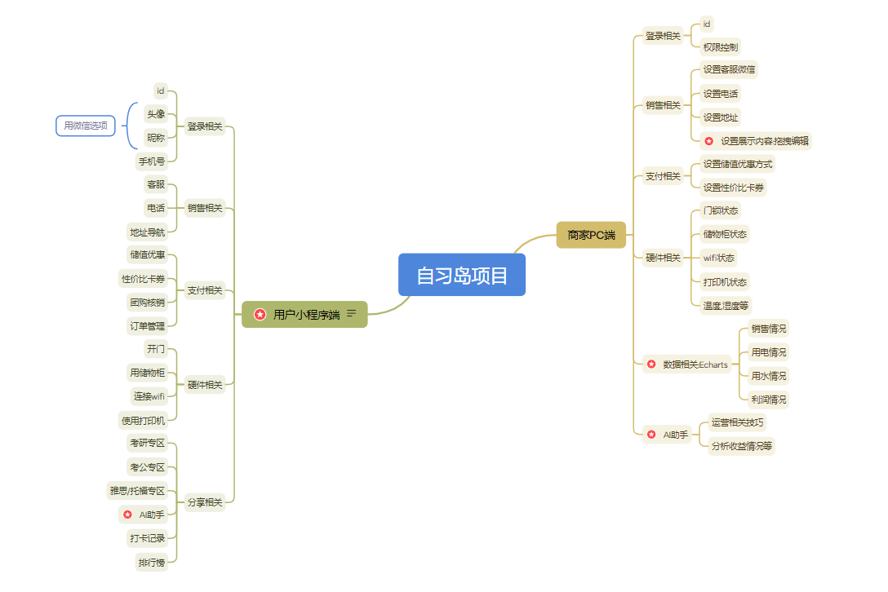

# 项目准备

最近准备做一个无人自习室的项目,先简单写一些想法,以后再慢慢完善.

总体上分为软硬件两大部分

## 软件

- 用户端小程序
- 商家端小程序
- 商家端PC管理后台

对于小程序端,采用技术栈:

- UI设计: MasterGo
- 框架: Uniapp支持平台微信小程序,支付宝小程序,抖音小程序
- UI组件库: uview-plus
- 语言: typescript + scss

对于PC管理后台,采用技术栈

- 框架: vue3

- UI组件库: ElementPlus+ Echarts
- 语言: typescript + scss

后端统一采用

- mysql + nodejs + koa

调试工具

- apifox

## 硬件

# 初步功能点

