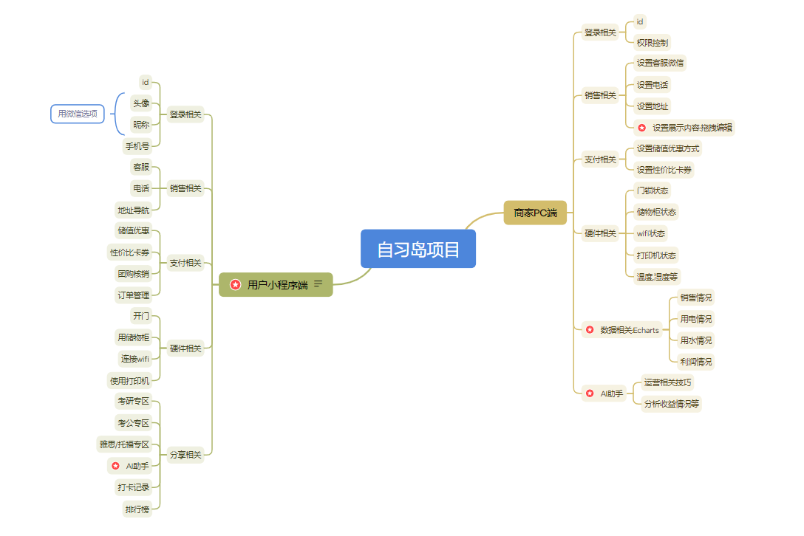

# 项目准备

最近准备做一个无人自习室的项目,先简单写一些想法,以后再慢慢完善.

总体上分为软硬件两大部分

## 软件

- 用户端小程序
- 商家端小程序
- 商家端PC管理后台

对于小程序端,采用技术栈:

- UI设计: MasterGo
- 框架: Uniapp支持平台微信小程序,支付宝小程序,抖音小程序
- UI组件库: uview-plus
- 语言: typescript + scss

对于PC管理后台,采用技术栈

- 框架: vue3

- UI组件库: ElementPlus+ Echarts
- 语言: typescript + scss

后端统一采用

- mysql + nodejs + koa

调试工具

- apifox

## 硬件

# 初步功能点

我想做一个无人自习室软件,包括uniapp用户端和Vue3管理后台,后端用express,请问这个项目可以寻找哪些点作为前端技术的难点和亮点为简历添彩

这是一个很有潜力的项目！以下是前端部分可以设计为**技术难点**和**亮点**的点，以提升简历的吸引力：

------

## **技术难点与亮点**

### **1. 实时座位状态显示**

**难点：**

- 实现座位实时更新需要前后端协作。
- 使用 WebSocket 或其他实时通信技术（如 Server-Sent Events）。
- 高效地管理状态更新，避免因频繁刷新导致性能问题。

**亮点：**

- 采用 WebSocket 实现实时座位状态的更新显示，提供流畅的用户体验。
- 使用 Vue3 的组合式 API（Composition API）来优化状态管理。

------

### **2. 动态表单和灵活的座位布局**

**难点：**

- 后台管理系统允许动态设置自习室座位布局。
- 实现座位布局的可视化编辑，支持拖拽功能。
- 数据格式需要灵活且兼容前后端传输。

**亮点：**

- 在管理后台使用 Vue3 + TypeScript + Element Plus，构建一个支持拖拽布局的座位编辑器。
- 使用 `d3.js` 或 `Konva.js` 实现座位布局的可视化。

------

### **3. 智能排座和预约系统**

**难点：**

- 根据用户需求（比如安静区域、靠窗位置）智能推荐座位。
- 实现冲突检测和排座逻辑优化。
- 需要处理预约时间的跨日和冲突问题。

**亮点：**

- 使用算法优化排座体验，比如基于优先级的排队系统。
- 在 UI 上提供直观的预约状态和推荐理由。

------

### **4. 高性能日历组件**

**难点：**

- 用户端需要支持按天、周、月展示自习室的预约情况。
- 数据量大时，日历组件的性能优化是一个挑战。

**亮点：**

- 使用自定义的高性能日历组件，基于虚拟滚动实现。
- 结合 Vue3 的响应式系统，确保流畅的交互体验。

------

### **5. 数据可视化**

**难点：**

- 后台需要展示自习室使用情况（如座位利用率、预约热度时段等）。
- 数据展示需要兼顾美观和实用性。

**亮点：**

- 使用 `ECharts` 或 `Chart.js` 实现多维度的统计图表。
- 提供交互式的数据筛选和动态展示功能。

------

### **6. 多端统一的主题和样式**

**难点：**

- 确保管理端和用户端在不同平台上的 UI 体验一致。
- 实现主题切换功能（如白天/夜间模式）。

**亮点：**

- 使用 `Tailwind CSS` 或 `Sass` 实现高扩展性的设计系统。
- 提供深色模式切换，增强用户体验。

------

### **7. 权限管理**

**难点：**

- 区分用户和管理员的权限，并限制访问特定页面或功能。
- 提供灵活的角色权限分配系统。

**亮点：**

- 在管理后台实现基于 JWT 的前端权限控制，结合路由守卫动态加载菜单。
- 利用 Vue Router 的动态路由功能，提升权限管理的灵活性。

------

### **8. 离线模式与渐进式增强**

**难点：**

- 用户在网络不稳定时仍然可以浏览已加载的座位状态。
- 实现数据的离线缓存和同步。

**亮点：**

- 集成 PWA（Progressive Web App）特性，支持离线访问。
- 利用 `IndexedDB` 或 `localForage` 存储用户预约数据。

------

### **9. 性能优化**

**难点：**

- 用户端和管理端都可能有大量表单和列表，容易引起性能瓶颈。
- 实现快速的页面加载和交互响应。

**亮点：**

- 使用 Vue3 的动态组件和懒加载功能优化前端性能。
- 结合 `vite` 进行打包优化，实现更快的构建和更小的包体积。

------

### **10. 统一的组件库**

**难点：**

- 用户端和管理后台需要统一的交互和样式组件。
- 确保组件的高复用性和灵活性。

**亮点：**

- 自行开发一个基于 Vue3 的组件库，支持按需加载。
- 使用 Storybook 展示组件库的使用方式和效果。

------

通过在简历中突出这些难点和亮点，并展示具体的技术解决方案（如代码片段、性能数据或用户反馈），会让你的项目更加引人注目，也更能展示你的技术能力和思维深度！

## 后台管理系统

后台管理系统是整个无人自习室软件的重要组成部分，负责管理座位、用户、预约、权限等方面的操作。根据你的需求和项目的特点，以下是一个详细的后台管理系统功能模块设计：

### 1. **用户管理**

- 用户列表：
  - 查看所有注册用户的基本信息（如用户名、手机号、注册时间、预约历史等）。
  - 支持用户筛选、搜索、排序等功能。
- 用户详情：
  - 查看和编辑单个用户的信息。
  - 查看用户的预约记录、历史操作等。
- 用户权限管理：
  - 设置用户权限（如普通用户、管理员等角色）。
  - 支持对用户的权限进行增删改查（如禁用用户、限制预约等）。
- 批量操作：
  - 支持批量删除、批量禁用等操作。

------

### 2. **自习室管理**

- 座位管理：
  - 查看所有自习室座位的布局与状态（如空闲、已预约、占用等）。
  - 动态调整座位布局（如添加、删除、修改座位、区域划分等）。
  - 可视化编辑座位，支持拖拽等交互功能（使用 `d3.js` 或 `Konva.js`）。
- 座位区域划分：
  - 将自习室划分为多个区域，如安静区、普通区、靠窗区等。
  - 设置区域规则，比如某些区域仅限特定用户预约。

------

### 3. **预约管理**

- 预约列表：
  - 查看所有用户的预约信息（预约时间、座位、状态等）。
  - 支持筛选、搜索、排序预约记录。
  - 提供详细的预约状态（如已确认、已完成、已取消等）。
- 预约规则配置：
  - 设置每个座位的最大预约时长（如每次预约最多3小时等）。
  - 设置预约的最短提前时间和最长提前时间。
  - 配置每个自习室的预约开放时间（如每天9:00-18:00可预约）。
- 预约审核：
  - 支持管理员对特定预约进行审核和审批。
  - 可手动调整预约状态（如取消预约、强制结束等）。

------

### 4. **财务管理（如果涉及收费功能）**

- 订单管理：
  - 查看所有订单的详细信息（订单号、支付状态、支付金额等）。
  - 支持按用户、时间、订单状态进行筛选和搜索。
- 支付记录：
  - 查看用户支付记录，支持查看支付详情（如支付时间、金额、支付方式等）。
  - 支持退款、结算操作。
- 收入统计：
  - 提供详细的财务报表，包括每日、每月、每年的收入、退款等数据统计。

------

### 5. **数据分析与报表**

- 座位利用率分析：
  - 分析不同时间段、不同区域座位的使用情况。
  - 提供图表展示，如座位空闲率、预约率等。
- 预约热度分析：
  - 统计哪些时间段、哪些座位最受欢迎，帮助优化座位分配。
- 用户行为分析：
  - 分析用户的预约习惯，找出常用的座位区域、预约时间等。
- 历史数据导出：
  - 支持导出报表，如 Excel、CSV 等格式，方便进一步分析。

------

### 6. **通知与消息管理**

- 站内消息：
  - 向用户推送系统通知、预约提醒、系统更新等信息。
  - 提供消息的发送记录、阅读状态等。
- 短信/邮件通知：
  - 配置短信/邮件通知模板，提醒用户预约成功、预约即将开始、预约结束等。
  - 支持自定义消息内容和发送时间。
- 推送管理：
  - 提供推送通知管理，支持推送系统公告、优惠活动等信息。

------

### 7. **权限管理**

- 角色与权限配置：
  - 配置不同角色（如管理员、普通用户、超级管理员）的访问权限。
  - 管理员可以配置哪些操作对不同角色开放（如添加/删除用户、修改预约规则等）。
- 日志管理：
  - 记录管理员的操作日志（如修改设置、删除用户等）以便追踪和审计。
  - 提供日志查询和导出功能。

------

### 8. **系统设置**

- 基本设置：
  - 设置平台的一些基本信息（如自习室名称、联系方式、营业时间等）。
  - 配置网站的基本配置信息，如 SEO 设置、网站链接等。
- 预约规则配置：
  - 设置用户预约的基本规则，如最短预约时间、最大预约时长、预约间隔等。
  - 配置座位区域的规则，如禁止预约特定区域等。
- 系统日志：
  - 查看系统运行状态、错误日志、性能监控等，确保系统的稳定运行。
- 安全设置：
  - 配置二次验证、密码强度要求等，提升系统的安全性。

------

### 9. **系统运营与营销功能**

- 优惠券管理：
  - 创建和管理优惠券（如打折券、满减券等），并提供生成优惠码的功能。
  - 设置优惠券的有效期、使用条件等。
- 活动管理：
  - 配置限时活动或促销活动（如新用户优惠、节假日活动等）。
  - 支持活动的开启、暂停、结束以及活动数据的统计分析。

------

### 10. **系统健康与监控**

- 实时监控：
  - 提供系统运行状态的实时监控面板，包括服务器负载、数据库连接数、接口响应时间等。
- 性能优化：
  - 对系统进行性能分析，找出瓶颈并提供优化建议。
  - 支持定期检查系统的安全性，检测潜在的风险。

------

### 11. **API接口管理（如果有）**

- API文档：
  - 提供后台管理系统的API接口文档，便于前端和其他第三方系统接入。
- 接口访问管理：
  - 配置API的访问权限，如设置权限令牌（Token）、限制接口调用频率等。

------

### 总结：

后台管理系统的功能设计应全面覆盖自习室的日常运营、用户管理、数据统计与分析等核心功能，同时要具备灵活的权限管理和高效的运营支持。通过清晰的功能模块划分、友好的界面设计和高效的数据管理，可以极大提升自习室运营效率，确保用户体验流畅、系统稳定运行。
