# JS

## 关于矩阵的创建

今天做了一个 leetcode 的 59 螺旋矩阵题目，该题在最开始需要创建一个矩阵。GPT 给的方式如下

```js
const matrix = Array.from({ length: n }, () => Array(n).fill(0));
```

这个代码片段使用了 ES6 的 Array.from()方法，该方法接受一个可迭代对象（通常是一个类数组对象）作为参数，并返回一个新数组。其中第二个参数是一个映射函数，用于将每个元素映射到新数组中的元素。

这个代码片段中，{ length: n }是一个对象，它表示创建一个长度为 n 的数组。然后，Array(n)是一个数组，它表示创建一个包含 n 个 0 的数组。最后，fill(0)是一个数组方法，它将数组中的每个元素设置为 0。

我过去创建矩阵通常使用如下方法

```js
const matrix = new Array(n).fill(0).map(() => new Array(n).fill(0));
```

这个代码片段首先创建了一个长度为 n 的数组，每个元素都被设置为 0。然后，它使用 map()方法将每个元素转换为一个新的数组，并使用 fill(0)方法将每个数组中的元素设置为 0。

这里在使用第二种方法时,很容易出现**共享引用**的错误.

错误示例：

```javascript
const result = new Array(n).fill(new Array(n).fill(0));
```

这里 fill 用的是同一个子数组引用，导致所有行指向同一个数组。
修改其中一个子数组会影响其他行：

```javascript
result[0][0] = 1;
console.log(result);
// 输出:
// [
// [1, 0, 0],
// [1, 0, 0],
// [1, 0, 0]
// ]
```

> 总结
> Array.from 推荐: 更安全且代码简洁，避免引用共享问题。
> fill + map: 同样有效，适合对 map 方法较为熟悉的开发者。
> 切记，**不能用 fill 填充同一个子数组引用**，否则会产生意外的共享引用问题。

## map 和 parseInt 函数的使用

```js
const arr = ['1', '2', '3'].map(parseInt);
console.log(arr);
```

今天在地铁上刷视频看到一个很有意思的题目，随笔记录一下，和大家分享。
乍一看这个题目，感觉非常简单，对一个字符串数组进行`map`处理,处理函数是`parseInt`,输出结果应该就是`[1, 2, 3]`.
然而当我们尝试运行这段代码会发现,真实的输出结果是`[1, NaN, NaN]`.

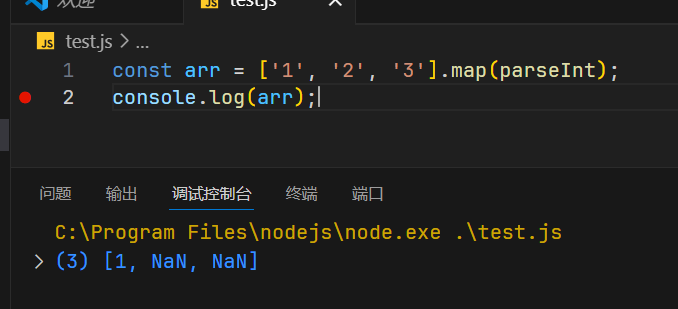

那为什么会出现这么奇怪的现象呢?
这里有两个关键点,`map`和`parseInt`,我们需要深入且准确地弄清楚这两个函数的工作原理。才能解决这个问题。

### map

Array 实例的 `map()` 方法创建一个**新数组**，其中填充了对调用数组中的每个元素调用提供的函数的结果。

使用语法如下

```js
map(callbackFn[, thisArg])
```

- `callbackFn`: 要为数组中的每个元素执行的函数。其**返回值**将作为单个元素添加到新数组中。使用以下参数调用该函数：
  - `element`: 数组中正在处理的当前元素
  - `index`: 数组中正在处理的当前元素的索引
  - `array`: 调用`map()`的数组
- `thisArg`: 可选。执行回调时使用的 this 值。(指定`callbackFn`函数内使用 this)

### parseInt

`parseInt()`函数解析字符串参数并返回指定**基数**(数学数字系统中的基数)的整数.]
其实就是返回指定进制的整数

```js
console.log(parseInt('123'));
// 123 (default base-10)
console.log(parseInt('123', 10));
// 123 (explicitly specify base-10)
console.log(parseInt('   123 '));
// 123 (whitespace is ignored)
console.log(parseInt('077'));
// 77 (leading zeros are ignored)
console.log(parseInt('1.9'));
// 1 (decimal part is truncated)
console.log(parseInt('ff', 16));
// 255 (lower-case hexadecimal)
console.log(parseInt('0xFF', 16));
// 255 (upper-case hexadecimal with "0x" prefix)
console.log(parseInt('xyz'));
// NaN (input can't be converted to an integer)
```

使用语法如下:

```js
parseInt(string[, radix])
```

- `string`: 以整数开头的字符串.此参数的**前导空格**将被忽略

  - 如果第一个非空白字符不能转换为基数范围内的数字,直接返回`NaN`
  - 对于字符串的符号(`+/-`),`parseInt`可以理解,正常输出,不作处理.原来是正数就是正数,原来是负数就是负数.
  - 如果`parseInt`遇到不是指定基数中的数字字符,它将**忽略该字符和所有后续字符**,并返回到该点为止解析的整数值.例如,尽管`1e3`在技术上对整数进行编码(并且将被`parseFloat()`正确解析为整数`1000`),但`parseInt("1e3",10)`返回`1`,因为`e`不是以10为基数的有效数字.由于`.`也不是数字,因此返回值将始终为整数(也就是说,如果来解析小数,遇到小数点就会自动停止并返回,所以如果可以成功返回,返回值一定是整数)

- `radix`: 可选。一个介于`2`和`36`之间的整数，表示`字符串`的**基数(进制)**.

  - 如果**非零且超出[2,36]**的范围,则函数将始终返回`NaN`

    ```js
    console.log(parseInt('213',1));
    console.log(parseInt('213',-1));
    console.log(parseInt('213',37));
    
    /**
     * NaN
     * NaN
     * NaN
     */
    ```

  - 如果**未提供,或者值变为`0`,`NaN`,或`Infinity`(`undefined`被强制转换为`NaN`)**,则将根据`字符串`的值推断基数.注意,并**不是默认为10**

    - 如果输入的`字符串`(删除了前导空格和可能的`+/-`符号)以`0x`或`0X`(0,后面跟小写或大写的`x`)开头,则基数假定为**16**,字符串的其余部分将被解析为16进制数.

    - 如果输入`字符串`以任何其他值开头,则基数为`10`(十进制)

      >**注意:**其他前缀(如`0b`)在数字字面量中有效,但是在`parseInt()`中视为普通数字.`parseInt()`也**不会**将以`0`字符开头的字符串视为八进制.`parseInt()`识别的**唯一前缀**是十六进制值的`0x`或`0X`.如果缺少`radix`,其他所有内容都被解析为十进制值.可以使用`Number()`或`BigInt()`来解析这些前缀.

  - 如果为16,则可以在可选符号字符(`+/-`)后选择性地为字符串添加`0x`或`0X`前缀.

  - 对于大于`10`的基数,英文字母表的字母表示大于`9`的数字.例如,对于十六进制数,使用`A`到`F`.这些字母**不区分大小写**


在非字符串上使用`parseInt()`

`parseInt()`在处理非字符串和高基数时可以产生有趣的结果;例如,`36`(使所有字母数字字符都是有效的数字进制,即0-9,和26个字母,总共36个)

```js
console.log(parseInt(null,36));
console.log(parseInt(undefined,36));

// 1112745
// 86464843759093
```

我们应尽可能避免用`parseInt`处理非整数的字符串

所以回到我们的题目,为什么会有下面的输出呢?

```js
const arr = ['1', '2', '3'].map(parseInt);
console.log(arr);
// [1, NaN, NaN]
```

这是因为我们把`parseInt`作为了`map`的回调函数.那么传递给`parseInt`的两个参数就是`item`和`index`

所以实际的处理相当于如下所示

```js
arr = [parseInt('1', 0),parseInt('2',1), parseInt('3',2)];
```

对于第一个元素,传递的`radix`为0,字符串`'1'`也不是以`0x`或`0X`开头,所以这里采用十进制转换.结果为数字`1`

对于第二个元素,传递的`radix`为1,这是一个非法的进制,(因为合法的进制是2-36的一个整数),所以直接返回`NaN`

对于第三个元素,传递的`radix`是2,表示解析为二进制.当开始解析后,遇到第一个字符`'3'`就不是二进制中的一个合法字符(二进制只有`0`和`1`),所以直接停止,返回`NaN`.

# hexo 个人博客

## 关于图片引用问题

### 文章图片本地和远程不能同时显示问题

在本地 typora 中使用绝对路径插入的图片部署到网站中会无法正常显示，解决方式如下

1. 在 Typora 的偏好设置中的图片设置中，设置如下图

   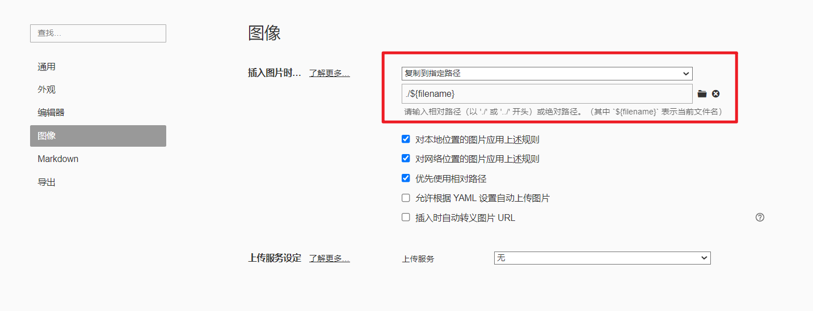

   这样我们在本地只需要直接在 Typora 中粘贴图片，就会将图片复制到当前 markdown 文件同级的同名目录下。

2. 在 hexo 项目的根目录的配置文件`_config.yml`中，把`post_asset_folder`属性设置为`ture`.

   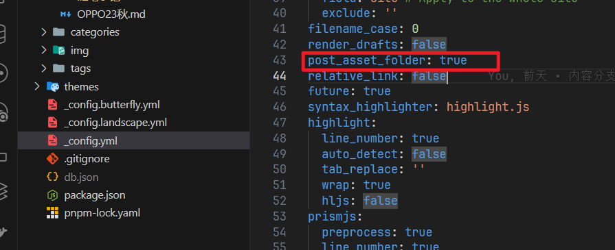

   这样当我们在 hexo 中使用命令`hexo new xxxx`的时候,就会同时创建一个同名目录,用来存放静态资源

3. 安装`hexo-asset-img`插件

   ```powe
   pnpm add hexo-asset-img
   ```

   安装完这个插件后,使用相对路径引入的图片在部署到站点后也可以显示.

### 文章的 top_img 和 cover 路径问题

文章中图片的问题解决了以后，在文章页面中 top_img 和 cover 图片路径的问题就出现了。

我们看下面这个例子,在经过上一步的设置后,已经在同级目录下有一个同名文件夹用来存放静态资源.这里我们在 OPPO23 秋文件夹中保存了一张`top.png`图片

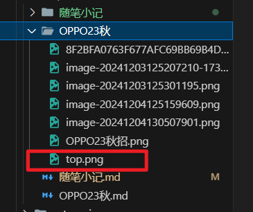

然后在文章页的`Front-Formatter`中将封面图`cover`和顶部图`top_img`均设置为此图.

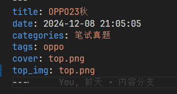

然后我们在本地使用`hexo clean && hexo generate && hexo server`命令运行博客

我们可以看到封面图`cover`可以成功显示,没有问题.


但是当我们点到文章页时,会发现`top_img`并没有成功显示


明明是一样的路径配置,但是一个正常,另一个不正常.很有可能是 hexo 以及我们安装的插件综合作用下,**对`cover`和`top_img`的路径处理方式不同**.

为了验证我们的猜想,我们使用浏览器开发者工具分别查看两图片对应的元素,并对获取图片请求进行抓包分析.

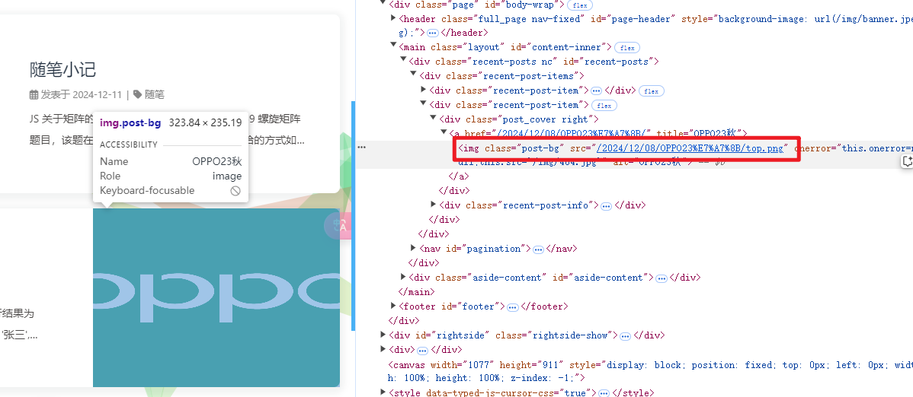

对于`cover`我们可以看到,它是一个嵌套在`<a>`标签里的一个``标签.

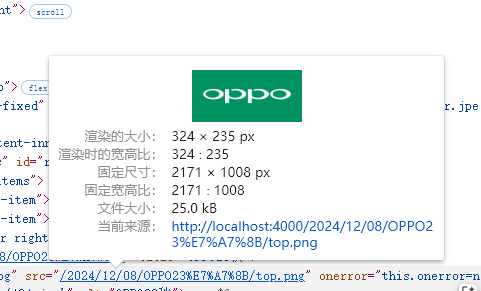

我们点击当前来源，跳转到图片资源位置，没有问题。


我们再来看一下`top_img`图片。

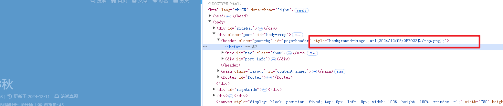

我们可以看到它并不是``，而是用 CSS 的`background-image`属性来设置的。这里难以看出问题，我们对网络请求进行抓包。

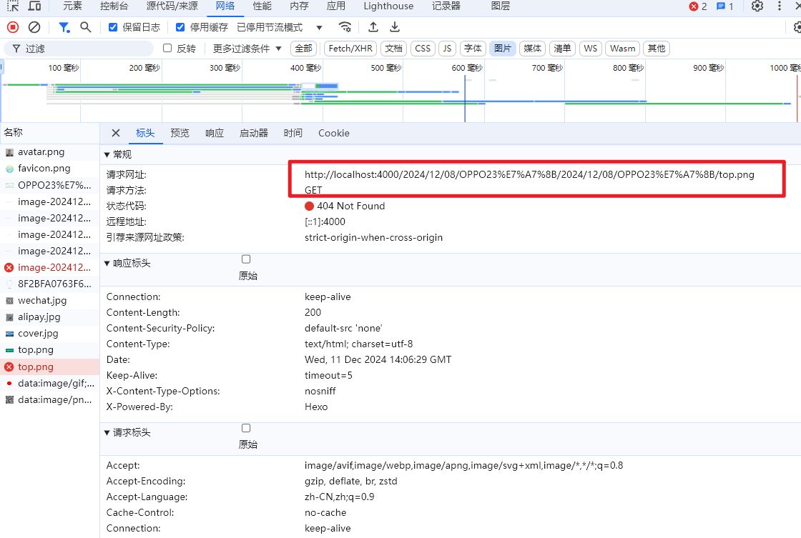

我们可以看到是一个 404 错误，说明找不到资源，就是路径出错了。观察请求头地址，我们不难发现，`2024/12/08/OPPO23秋`这一部分内容写了两次.说明 hexo 在处理文章的`top_img`时,很有可能本来就会加上前面的内容,我们的插件之类的又产生了干扰.具体原因还不得而知,不过问题已经可以解决了.

通过上述分析,我们可以推测,`top_img`不显示,很可能是因为我们使用了**相对路径**,框架在此处的路径处理出了一些问题,所以我们尝试改用绝对路径来引入.

在项目的`source`文件夹下新建一个`img`目录,里面复制我们的`top.png`

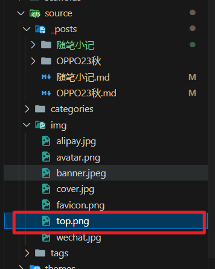

将文章中`tom_img`路径改为绝对路径`/img/top.png`(因为 hexo 会把 source 文件当作根目录来建站,所以建站后`img`文件夹相当于在根目录下,使用`/img`即可访问)

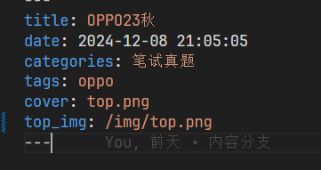

清理 hexo,重新生成,发现顶部图成功显示!


