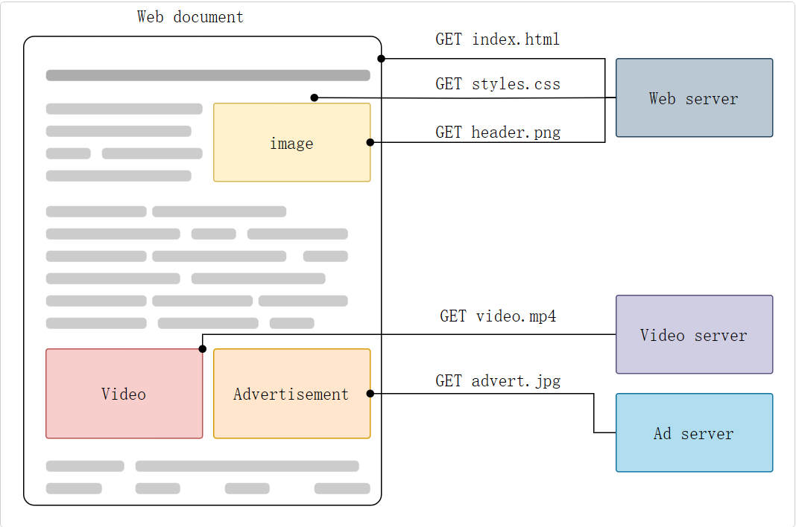
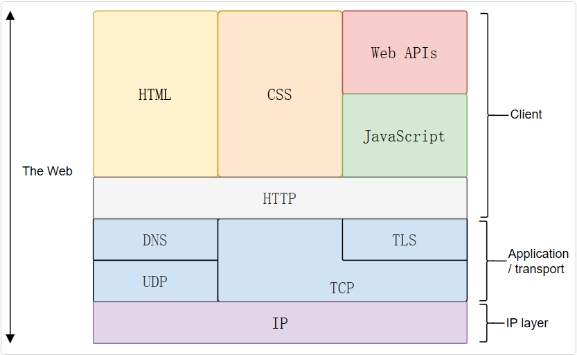
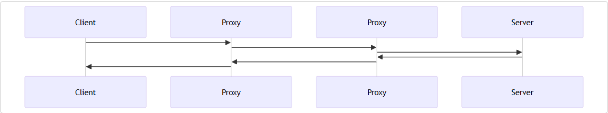
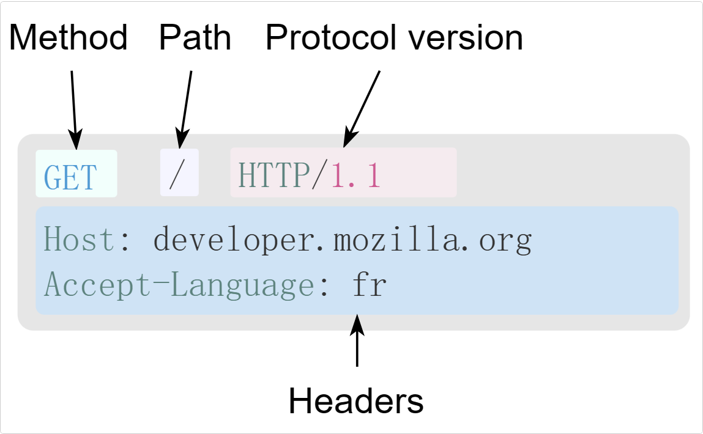
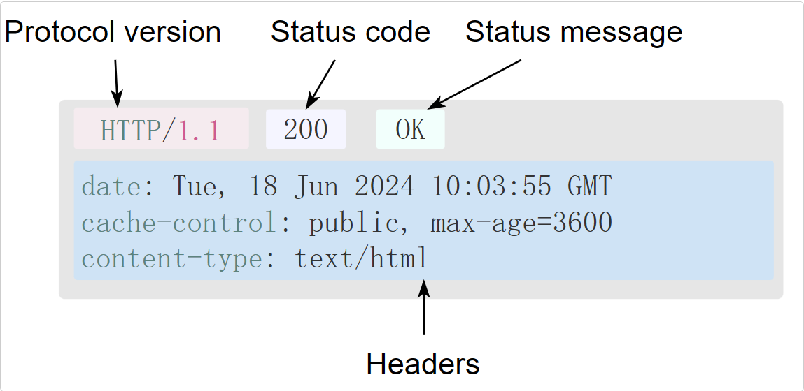
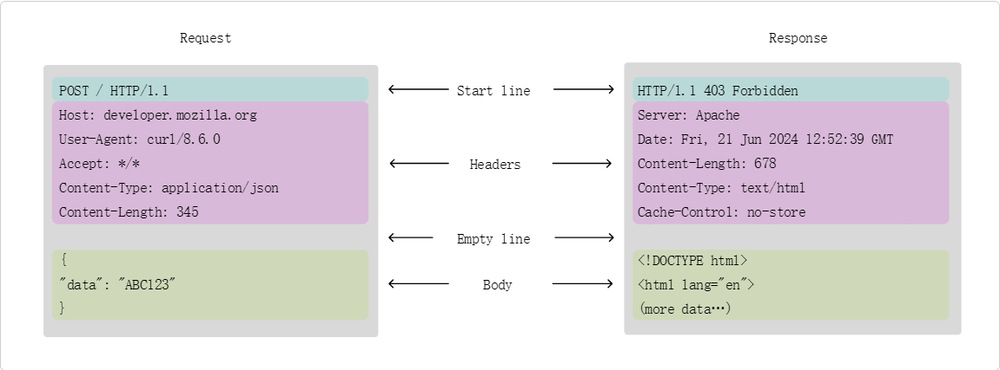
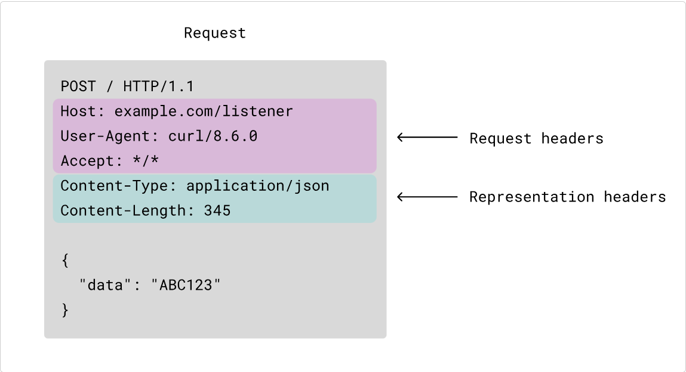
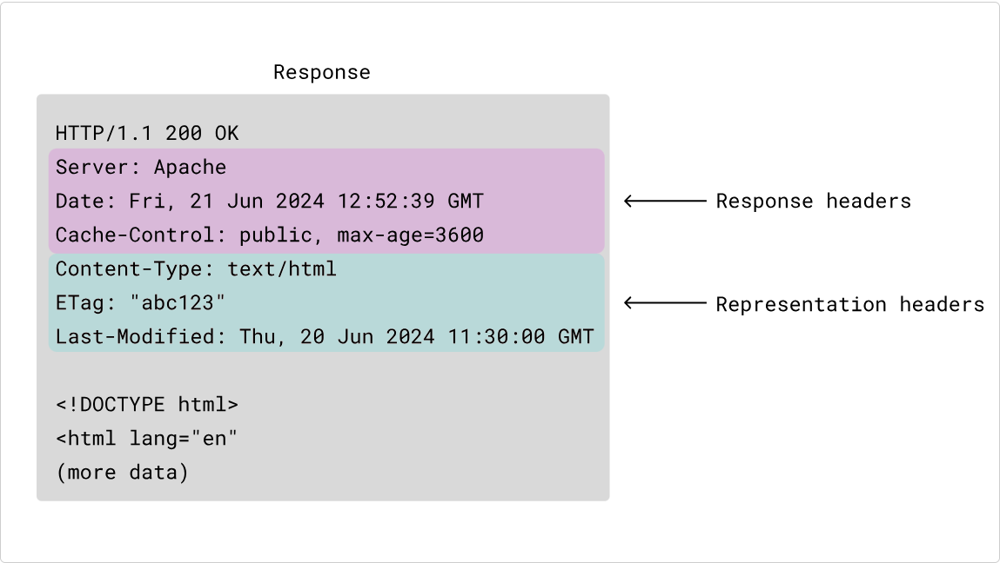
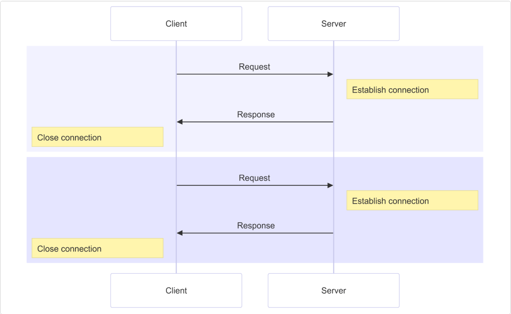
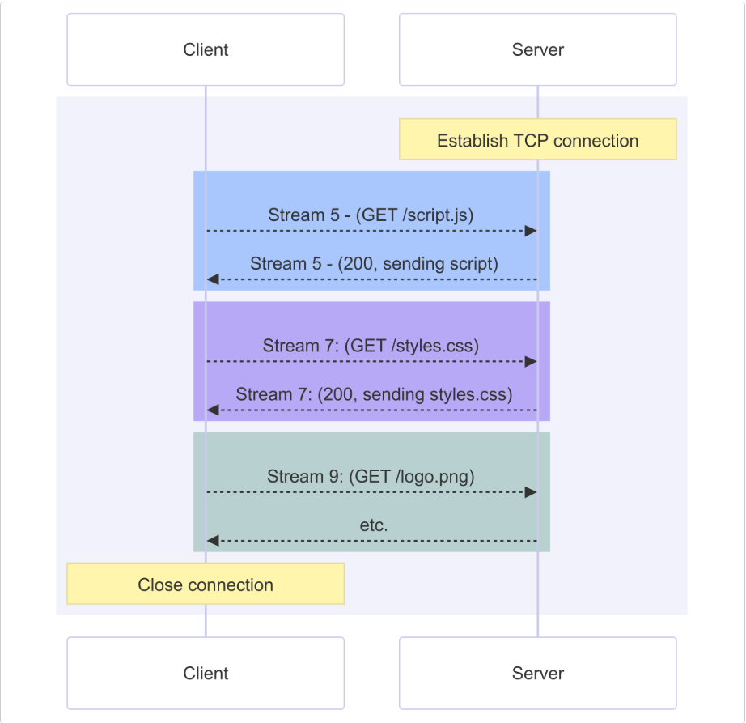

# 自我介绍

面试官你好，我叫马嘉路，目前电子科技大学大三在读，学习物联网工程和金融学双学位。此前在四川品忆科技有限公司有过一段为期两个月的实习，参与了基于Flutter的“力喵软件”项目。目前，我正在独立开发“学习岛”项目，负责前端后端和数据库全栈开发，涵盖了小程序，商家管理后台和Node服务器等部分。我的主要技术栈是Vue3，对项目部署有一定的了解。

# 前端开发技术

> 你提到你熟练掌握Vue3全家桶，能否详细讲一下你在Vue3项目中使用的技术和设计模式？

- Vue3: 核心框架，负责构建用户界面（UI)和管理应用状态
- Vue Router: 路由管理工具，用于处理不同页面之间导航
- `Pinia`: 状态管理库
- `Vite`: 项目构建工具
- `Vue Test Utils`: 测试工具

# Flutter和跨平台开发

> 你在实习中使用了Flutter进行开发,能否分享一下Flutter的优势和你遇到的挑战?

优势主要有以下两点:

- 一次开发,多端运行.Flutter开发的应用能够运行在Android,IOS,Web甚至桌面应用,极大地提高了开发效率,降低开发成本.
- 性能相对较高.相比于基于`WebView`和小程序的渲染引擎的`Uniapp`和通过桥接机制调用原生控件的`React Native`等框架,Flutter的UI组件都由自己实现,性能更好.

挑战主要就是

- Dart语言开发体验差. 一方面是社区支持相对于`JavaScript`没有那么活跃,另一方面是因为Flutter的嵌套结构导致代码很容易满屏都是括号,难以阅读维护.

> 追问: 你提到使用了SSE技术来接收流式数据,能详细说明一下为什么选择SSE,而不是选择WebSocket或其他方案?

选择SSE(Server-Sent-Events)主要基于性能与成本的考虑.SSE能够实现单工通信,从服务器推送数据到客户端,相对于WebSocket的双工通信,SSE的实现更加简单,资源消耗较小,并且能够支持自动重连机制,适合于数据流实时更新的需求.对于大多数情况,SSE的性能和实现都能够满足要求,同时也比WebSocket更省服务器的资源.

# 全栈开发学习

> 你在"学习岛"项目中担任了前后端开发,你能详细介绍一下你如何设计实现服务器端架构吗?

在"学习岛"项目中,我使用了`Node.js`和`Express`进行性后端开发,结合`Sequelize`进行MySQL数据库的`ORM`映射.服务器主要提供`RESTful API`,用于前端与数据库的交互.为保证系统的高效性和可扩展性,我使用了`JWT`进行用户认证,并将接口进行了分层设计,确保了代码的可维护性和可扩展性.在数据库设计上,我进行了表的规范化,确保数据结构的合理性,避免冗余数据.通过使用`TypeScript`,我增加了代码的可读性和类型安全,避免了类型错误.

> 追问: 你是如何处理项目中的跨域问题的?特别是在前后端分离的情况下.

我使用的是在后端`Express`框架中使用`CORS`中间件来解决的跨域问题.

`CORS`是基于`http1.1`的一种跨域解决方案,它的全称是`Cross-Origin Resource Sharing`,即跨域资源共享.

它的总体思路是: **如果浏览器要跨域访问服务器的资源,需要获得服务器的允许**

> 追问: 除了CORS,还有哪些那些解决跨域的方案?

跨域的解决方案主要有

- 使用代理: **生产环境不发生跨域,但开发环境发生跨域.**

- 使用`CORS`
- 使用`JSONP`

JSONP做法是:**当需要跨域请求时,不使用AJAX,转而生成一个`script`元素去请求服务器,由于浏览器并不阻止`script`元素的请求,这样请求可以到达服务器.服务器拿到请求后,响应一段JS代码,这段代码实际上是一个函数调用,调用的是客户端预先生成好的函数,并把浏览器需要的数据作为参数传递到函数中,从而间接的把数据传递给客户端.

1. 准备好一个函数,相当于是`ajax`的回调函数

```js
function callback(users) {
  // users是服务器传递过来的数据
}
```

2. 生成一个`script`元素跨域访问服务器地址

```html
<script src="http://corsdomain.com/api/user" ></script>
```

3. 服务器响应一段JS函数调用,把数据作为参数传递

```js
callback({
  {name: 'monica', age: 17, sex: 'female'},
})
```

> JSONP有着明显的缺点,就是只能支持GET请求.

# 网络通信

> 你提到了HTTP和HTTPS协议,详细介绍一下,并说明他们有什么区别?

## HTTP

超文本传输协议(`Hyper Text Transfer Protocol`)是一种用于传输超媒体文档(例如`HTML`)的应用层协议.它是为Web浏览器于Web服务器之间的通信而设计的,但也可以用于其他目的.`HTTP`遵循经典的`客户端-服务端模型`.客户端打开一个连接以发出请求,然后等待知道收到服务器端响应.`HTTP`是无状态协议,这意味着服务器不会在两个请求之间保留任何数据(状态).

### HTTP概述

HTTP是一种用于获取诸如HTML文档这类资源的协议.它是Web上进行任何数据交换的基础,同时,也是一种客户端-服务器(client-server)协议,也就是说,请求是由接收方--通常是Web浏览器--发起的.完整网页文档通常由文本,布局描述,图片,视频,脚本等资源构成.



客户端和服务器端之间通过交换一个个独立的消息(而非数据流)进行通信.由客户端发出的消息被称作**请求(request)**,由服务器发出的应答消息被称作**响应(response)**



20世纪90年代,HTTP作为一套可扩展的协议被设计出来,并随着时间不断演进.HTTP是一种应用层协议,通过**TCP**或**TLS**(一种加密过的TCP连接)来发送,当然,理论上来说可以借助任何可靠的传输协议.收益于HTTP的可扩展性,时至今日,它不仅可以用来获取超文本文档,还可以用来获取图片,视频或者向服务端发送信息,比如填写好的HTML表单.HTTP还可以用来获取文档的部分内容,以便按需更新Web页面.

#### 基于HTTP的系统的组成

HTTP是一个客户端-服务器协议:请求由一个实体,即用户代理(user agent),或是一个可以表达它的代理方(proxy)发出.大多数情况下,这个用户代理都是一个Web浏览器,不过它可能是任何东西,比如一个爬取网页来充实,维护搜索引擎索引的机器爬虫.

每个请求都会被发送到一个服务器,它会处理这个请求并提供一个称作**响应**的回复.在客户端与服务器之间,还有许许多多的被称为**代理**的实体,履行不同的作用,例如充当网关或**缓存**.



实际上,在浏览器和处理其请求的服务器之间,还有路由器,调制解调器等等许多计算机.归功于Web的分层设计,这些机器都隐藏在网络层和传输层内.而HTTP位于这些机器之上的应用层.虽然下面的层级在诊断网络问题时很重要,但在描述HTTP的设计时,他们大多是不相干的.

##### 客户端: 用户代理

用户代理是任何能够代表用户行为的工具.这类工具以浏览器为主,不过,他也可能是工程师和Web开发人员调试应用时所使用的那些程序.

浏览器**总是**首先发起请求的那个实体,永远不会是服务端(不过,后来已经加入了一些机制,能够模拟出由服务端发起的消息).

为了展现一个网页,浏览器需要发送最初的请求来获取描述这个页面的HTML文档.接着,解析文档,并发送数个请求,相应地获取可执行脚本,展示用的布局信息(CSS)以及其他页面内的子资源(一般是图片和视频等).然后,Web浏览器会将这些资源整合到一起,展现出一个完整的文档,即网页.在之后的阶段,浏览器中可执行的脚本可以获取更多资源,并且浏览器会相应的更新网页.

网页是超文本文档.这意味着有一部分真实的内容会是链接--可以通过激活(通常是点击鼠标)来获取一个新的网页--用户可以通过这些链接只是用户代理进行Web浏览.浏览器会将受到的指示转换成HTTP请求,并进一步解析HTTP响应,向用户提供清晰的响应.

##### Web服务器

在上述通信过程的另一侧是服务器,它负责提供客户端所请求的文档.服务器可以表现为仅有的一台机器,但实际上,它可以是共享负载的一组服务器集群(负载均衡)或是其他类型的软件(如缓存,数据库服务,电商服务等),按需完整或部分地生成文档.

服务器不一定只有一台机器,也可以在同一台机器上托管多个服务器软件实例.利用HTTP/1.1和`Host`标头,他们甚至可以共用一个IP地址.

##### 代理

在Web浏览器和服务器之间,有许多计算机和设备参与传递了HTTP消息.依靠Web技术栈的层次化结构,传递过程中的多数操作都位于传输层,网络层或物理层,他们对于HTTP应用层而言就是透明的,并默认地对网络性能产生着重要影响.还有一部分实体在应用层传递消息,一般称之为**代理**(Proxy).代理可以是透明的,即转发它们收到的请求并不做任何修改,也可以表现得不透明,将它传递给服务器端之间使用一些手段修改这个请求.代理可以发挥很多种作用: 

- 缓存(可以是公开的也可以是私有的,如浏览器的缓存)
- 过滤(如反病毒扫描,家长控制)
- 负载均衡(让多个服务器服务不同的请求)
- 认证(控制对不同资源的访问)
- 日志(使得代理可以存储历史信息)

#### HTTP的基本性质

##### HTTP是简约的

大体上看,HTTP被设计的简单且易读,尽管HTTP/2中,HTTP消息被封装进帧(frame)这点引入了额外的复杂度.HTTP报文能够被人读懂并理解,想开发者提供了更简单的测试方式,也对初学者降低了门槛.

##### HTTP是可扩展的

在HTTP/1.0中引入的`HTTP标头`让该协议易于扩展和实验.只要服务器客户端之间对新标头的语义经过简单协商,新功能就可以被加入进来.

##### HTTP无状态但并非无会话

HTTP是无状态的:在同一个连接中,两个执行成功的请求之间是没有关系的.这就带来了一个问题,用户没有办法在同一个网站中进行连贯的交互,比如在电商网站中使用购物车功能.尽管HTTP根本上来说是无状态的,但借助HTTP Cookie就可使用有状态的会话.利用标头的扩展性,HTTP Cookie被加进了协议工作流程,每个请求之间就能够被创建会话,让每个请求都能共享相同的上下文信息或相同的状态.

##### HTTP和连接

连接是由传输层来控制的,因此从根本上说不属于HTTP的范畴.HTTP并不需要底层的传输协议是面向连接的,仅仅需要它是可靠的,或不会丢失消息(至少,某个情况下告知错误).在互联网两个最常用的传输协议中,TCP是可靠的,而UDP不是.HTTP因此而依靠于TCP的标准,即面向连接的.

在客户端与服务器能够传递请求,响应之前,这两者间必须建立TCP连接,这个过程需要多次往返交互.HTTP/1.0默认为每一对HTTP请求/响应都打开一个单独的TCP连接.当需要连接发起多个请求时,工作效率相比于它们之间共享同一个TCP连接要低.

为了减轻这个缺陷,HTTP/1.1引入了流水线(已被证明难以实现)和持久化连接:可以通过`Connection`标头来部分控制底层的TCP连接.HTTP/2则更进一步,通过在一个连接中复合多个消息,让这个连接时钟活跃并更加高效.

为了设计一种更匹配HTTP的传输协议,各种实验正在进行中.例如Google正在测试一种基于UDP构建,更可靠,高效的传输协议--`QUIC`

#### HTTP能控制什么

多年以来,良好的扩展性使得HTTP涉及到更多的Web功能与控制权.在HTTP诞生早期,缓存和认证就可以由这个协议来处理了.而直到2010年,放行**同源限制**的能力才加入到协议中.

以下是可以被HTTP控制的常见特性

- 缓存:文档如何被缓存可以铜鼓HTTP来控制.服务端能只是代理和客户端缓存哪些内容以及缓存多长时间,客户端能够指示中间的缓存代理来忽略已存储的文档.
- 开放同源限制:为了阻止网络窥听和其他侵犯隐私的问题,Web浏览器强制在不同网站之间做了严格分割.只有来自于**相同来源**(same origin)的网页才能够获取到一个网页的全部信息.这种限制有时对服务器是一种负担,服务器的HTTP标头可以减弱此类严格分离,使得一个网页可以是由源自不同地址的信息拼接而成.某些情况下,放开这些限制还有安全相关的考虑.
- 认证: 一些页面可能会被保护起来,仅让特定的用户进行访问.基本的认证功能也可以直接由HTTP提供,既可以使用`WWW-Authenticate`或其他类似的标头,也可以用`HTTP cookie`来设置一个特定的会话.
- 代理服务器和隧道: 服务器或客户端常常是处于内网的,对其他计算机隐藏真实的IP地址.因此HTTP请求就要通过代理服务器越过这个网络屏障.并非所有的代理都是HTTP代理,例如`SOCKS`协议就运作在更底层.其他的协议,比如ftp,也能够被这些代理处理.
- 会话: 使用`HTTP Cookie`可以利用服务端的状态将不同的请求联系在一起.这就创建了会话,尽管HTTP本身是无状态协议.这不仅仅对电商平台购物车很有用,也让任何网站都能够允许用户自由定制内容了.

#### HTTP流

当客户端想要和服务器--不管是最终的服务器还是中间的代理--进行信息交互时,过程表现为下面几步

1. 打开一个TCP连接: TCP连接用来发送一条或多条请求,以及接受响应消息.客户端可能打开一条新的连接,或重用一个已经存在的连接,或者也可能开几个新的与服务器的TCP连接.
2. 发送一个HTTP报文: HTTP报文(在HTTP/2之间)是人类可读的.在HTTP/2中,这些简单的消息被封装在了帧中,这使得报文不能被直接读取,但是原理仍是相同的.例如:

```HTTP
GET / HTTP/1.1
Host: developer.mozilla.org
Accept-Language: zh
```

3. 读取服务端返回的报文信息

```HTTP
HTTP/1.1 200 OK
Date: Sat, 09 Oct 2010 14:28:02 GMT
Server: Apache
Last-Modified: Tue, 01 Dec 2009 20:18:22 GMT
ETag: "51442bc1-7449-479b075b2891b"
Accept-Ranges: bytes
Content-Length: 29769
Content-Type: text/html

<!DOCTYPE html> ... (此处是所请求网页的 29769字节)
```

4. 关闭连接或者为后续请求重用连接
5. 当启用HTTP流水线时,后续的请求都可以直接发送,而不用等待第一个响应被全部接受.然而HTTP流水线已被证明很难在现有的网络中实现,因为现有网络中有老旧的软件与现代版本的软件同时存在.因此,HTTP流水已在HTTP/2中被更健壮、使用帧的多路复用请求所取代.

#### HTTP报文

HTTP/1.1以及更早的HTTP协议报文都是语义可读的.在HTTP/2中,这些报文被嵌入到了一个新的二进制结构,帧.帧允许实现很多优化,比如报文标头的压缩以及多路复用.及时只有原始HTTP报文的一部分以HTTP/2发送出来,每条报文的语义依旧不变,客户端会重组原始HTTP/1.1请求.因此用HTTP/1.1格式来理解HTTP/2报文仍旧有效.

有两种HTTP报文类型,请求与响应,每种都有其特定的格式.

##### 请求

HTTP请求的一个例子



请求由以下元素组成:

- HTTP方法,通常是由一个动词,像`GET`,`POST`等,或者一个名词,想`OPTIONS`,`HEAD`等,来定义客户端执行的动作.典型场景有:客户端意图获取某个资源(使用`GET`);发送HTML表达的参数值(使用`POST`);以及其他情况下需要的那些其他操作.
- 要获取的那个资源的路径--去除了当前上下文中显而易见的信息之后的URL,比如说,他不包括协议(`http://`),域名(这里是`developer.mozilla.org`),或是TCP的端口(这里是`80`)
- HTTP协议版本号
- 为服务端表达其他信息的**可选标头**
- 请求体(body): 类似于响应中的响应体,一些像`POST`这样的方法,请求体内包含了需要发送的资源.

##### 响应

HTTP响应的一个例子



响应报文包含了下面的元素:

- HTTP协议版本号
- 状态码,来指明对应请求成功执行与否,以及不成功时相应的原因
- 状态信息,这个信息是一个不权威,简短的状态码描述
- HTTP**标头**,与请求标头类似.
- 可选项,一个包含了被获取资源的主体.

#### 基于HTTP的API

`Fetch API`是基于HTTP的最常用的API,其可用于在JavaScript中发起HTTP请求.`Fetch APi`取代了`XMLHttpRequest`API

另一种API,`server-sent`事件,是一种单向服务,允许服务端借助作为HTTP传输机制向客户端发送事件.使用`EventSource`接口,客户端可以打开连接并创建事件处理器.客户端浏览器自动将HTTP流里到达的消息转换为适当的`Event`对象.继而将已知**类型**的事件,传递给先前注册过的事件处理器,其他未指明类型的事件则传递给`onmessage`事件处理器.

#### 总结

HTTP是一种简单,易用,具有可扩展性的协议,其客户端--服务器模式的结构,加上能够增加标头的能力,使得HTTP随Web中不断扩展的能力一起发展.

虽然HTTP/2为了提高性能,增加了一些复杂度,将HTTP报文嵌入到帧中--但是报文的基本结构自HTTP/1.0起仍保持不变.会话流依旧基础,通过HTTP网络监视器就可以产看和调试.

### 典型的HTTP会话

在像HTTP这样的客户端--服务器(Client-Server)协议中,会话分为三个阶段:

1. 客户端建立起一条TCP连接(如果传输层不是TCP,也可以是其他适合的连接)
2. 客户端发送请求并等待应答
3. 服务器处理请求并送回应答,回应包括一个状态码和对应的数据.

从HTTP/1.1开始,连接在完成第三阶段后不再关闭,客户端可以再次发起新的请求.这意味着第二步和第三步可以连续进行数次.

#### 建立连接

在客户端--服务器协议中,连接是由客户端发起建立的.在HTTP中打开连接意味着在底层传输层启动连接,通常是TCP.

使用TCP时,HTTP协议默认的端口号是80,另外还有8000和8080也很常用.页面的URL会包含域名和端口号,但当端口号是80时,可以省略.

> 客户端--服务器模型不允许服务器在没有显式请求时发送数据给客户端.为了解决这个问题,Web开发者们使用了许多技术:例如:使用`XMLHTTPRequest`或`Fetch`API周期性地请求服务器,使用HTML`WebSocket API`,或其他类似的协议.

#### 发送客户端请求

一旦连接建立,用户代理就可以发送请求(用户代理通常是Web浏览器,但也可以是其他的,例如爬虫).

客户端请求由一系列文本指令组成,并使用`CRLF`分隔(回车,然后是换行),他们被划分为三个块:

1. 第一行包括请求方法及请求参数
   - 文档路径,不包括协议和域名的绝对路径URL
   - 使用的HTTP协议版本
2. 接下来的每一行都表示一个HTTP标头,为服务器提供关于所需数据的信息(例如语言,或MIME类型),或是一些改变请求行为的数据(例如当前数据已经被缓存,就不再应答).这些HTTP标头形成一个以空行结尾的块
3. 最后一块是可选数据块,包含更多数据,主要被POST方法所使用.

##### 请求实例

访问`developer.mozilla.org`(https://developer.mozilla.org)的根页面,并告诉服务器用户代理倾向于该页面使用法语展示

```HTTP
GET / HTTP/1.1
Host: developer.mozilla.org
Accept-Language: fr

```

注意最后的空行,它把标头与数据块分隔开.由于在HTTP标头中没有`Content-Length`,所以数据块是空的,所以服务器可以在收到代表标头结束的空行后就开始处理请求.

再例如,发送这样的表单结果:

```HTTP
POST /contact-from.php HTTP/1.1
Host: developer.mozilla.org
Content-Length: 64
Content-Type: application/x-www-form-urlencoded

name=Joe%20User&request=Send%20me%20one%20of%20your%20catalogue
```

##### 请求方法

HTTP定义了一组请求方法用来指定对目标资源的行为.他们一般是名词,但这些请求方法有时会被叫做HTTP动词.最常用的请求方法就是`GET`和`POST`

- `GET`方法请求指定的资源.`GET`请求应该只被用于获取数据.
- `POST`方法向服务器发送数据,因此会改变服务器状态.这个方法常在HTML表单中使用.

#### 服务器响应结构

当收到用户代理发送的请求后,Web服务器就会处理它,并最终送回一个响应.与客户端请求很类似,服务器响应是由一些列文本指令组成的,并使用`CRLF`分隔.

他们被划分为三个不同的块.:

1. 第一行是状态行,包括使用的HTTP协议版本,然后是一个状态码(及人类可读的描述文本)
2. 接下来每一行都表示一个HTTP标头,为客户端提供关于所发送数据的一些信息(如类型,数据大小,使用的压缩算法,缓存指示).与客户端请求的头部块类似,这些HTTP标头组成一个块,并以一个空行结束
3. 最后一行是数据块,包含了响应的数据(如果有的话)

##### 响应示例

成功的网页响应

```HTTP
HTTP/1.1 200 OK
Content-Type: text/html; charset=utf-8
Content-Length: 55743
Connection: keep-alive
Cache-Control: s-maxage=300, public, max-age=0
Content-Language: en-US
Date: Thu, 06 Dec 2018 17:37:18 GMT
ETag: "2e77ad1dc6ab0b53a2996dfd4653c1c3"
Server: meinheld/0.6.1
Strict-Transport-Security: max-age=63072000
X-Content-Type-Options: nosniff
X-Frame-Options: DENY
X-XSS-Protection: 1; mode=block
Vary: Accept-Encoding,Cookie
Age: 7

<!DOCTYPE html>
<html lang="en">
<head>
  <meta charset="utf-8">
  <title>A simple webpage</title>
</head>
<body>
  <h1>Simple HTML webpage</h1>
  <p>Hello, world!</p>
</body>
</html>
```

请求资源已被永久移动的网页响应

```HTTP
HTTP/1.1 301 Moved Permanently
Server: Apache/2.4.37 (Red Hat)
Content-Type: text/html; charset=utf-8
Date: Thu, 06 Dec 2018 17:33:08 GMT
Location: https://developer.mozilla.org/ (目标资源的新地址,服务器期望用户代理去访问它)
keep-Alive: timeout=15, max=98
Accept-Ranges: bytes
Via: Moz-Cache-zlb05
Connection: Keep-Alive
Content-Length: 325 (如果用户代理无法转到新地址,就显示一个默认的页面)

<!DOCTYPE html>... (包含一个网站自定义页面,帮助用户找到丢失的资源)

```

请求资源不存在的网页响应

```HTTP
HTTP/1.1 404 Not Found
Content-Type: text/html; charset=utf-8
Content-Length: 3217
Connetction: keep-alive
Cache-Control: no-cache, no-store, must-revalidata, max-age=0
Content-Language: en-US
Date: Thu, 06 Dec 2018 17:35:13 GMT
Expires: Thu, 06 Dec 2018 17:35:13 GMT
Server: meinheld/0.6.1
Strict-Transport-Security: max-age=63072000
X-Content-Type-Options: nosniff
X-Frame-Options: DENY
X-XSS-Protection: 1; mode=block
Vary: Accept-Encoding,Cookie
X-Cache: Error from cloudfront

<!DOCTYPE html>… (包含一个站点自定义 404 页面，帮助用户找到丢失的资源)
```

##### 响应状态码

HTTP响应状态码用来表示一个HTTP请求是否成功完成.响应被分为5中类型: 信息型响应,成功响应,重定向,客户端错误和服务端错误.

### HTTP消息

HTTP 消息是用于在 HTTP 协议中在服务器和客户端之间交换数据的机制。有两种类型的消息：客户端发送以在服务器上触发操作的请求，以及响应，即服务器对请求发送的回答.

开发者很少从头开始构建 HTTP 消息。例如浏览器、代理或 Web 服务器等应用程序使用旨在以可靠和高效的方式创建 HTTP 消息的软件。消息的创建或转换是通过浏览器中的 API、代理或服务器的配置文件或其他接口来控制的。

在 HTTP 协议版本 HTTP/2 之前，消息是基于文本的，熟悉格式后相对容易阅读和理解。在 HTTP/2 中，消息被二进制帧包装，这使得没有特定工具的情况下阅读稍微困难一些。然而，协议的底层语义是相同的，因此您可以根据 HTTP/1.x 消息的基于文本的格式学习 HTTP 消息的结构和含义，并将这种理解应用于 HTTP/2 及其之后。

本指南使用 HTTP/1.1 消息以提高可读性，并使用 HTTP/1.1 格式解释 HTTP 消息的结构。在最后一节中，我们突出了一些可能需要描述 HTTP/2 的差异。

#### HTTP消息的结构

了解 HTTP 消息的工作原理，我们将查看 HTTP/1.1 消息并检查其结构。以下插图显示了 HTTP/1.1 中的消息看起来像什么：



请求和响应具有相似的结构：

1. 起始行是描述 HTTP 版本以及请求方法或请求结果的单独一行。
2. 一个包含描述消息的元数据的可选 HTTP 头集合。例如，对资源的请求可能包括该资源的允许格式，而响应可能包括指示实际返回格式的头。
3. 表示消息元数据完整的空行。
4. 一个可选的正文，包含与消息关联的数据。这可能是在请求中发送到服务器的 POST 数据，或者是在响应中返回给客户端的资源。消息是否包含正文由起始行和 HTTP 头决定。

> HTTP 消息的起始行和头部统称为请求头，之后包含其内容的部分称为主体。

#### HTTP请求

让我们看看用户在网页上提交表单后发送的以下示例 HTTP 请求：

```HTTP
POST /users HTTP/1.1
Host: example.com
Content-Type: application/x-www-form-urlencoded
Content-Length: 50

name=FirstName%20LastName&email=bsmth%40example.com
```

HTTP/1.x 请求的起始行（如上例中的 `POST /users HTTP/1.1` ）被称为“请求行”，它由三部分组成：

```HTTP
<method> <request-target> <protocol>
```

1. `<method>`:HTTP 方法（也称为 HTTP 动词）是一组定义的词汇之一，用于描述请求的含义和期望的结果。例如， `GET` 表示客户端希望接收一个资源作为回报，而 `POST` 则表示客户端正在向服务器发送数据。
2. `<request-target>`:请求目标是通常是一个绝对或相对 URL，其特征在于请求的上下文。请求目标的格式取决于所使用的 HTTP 方法和请求上下文。在下面的“请求目标”部分有更详细的描述。
3. `<protocol>`: HTTP 版本，它定义了剩余消息的结构，作为预期用于响应的版本的指示器。这几乎总是 `HTTP/1.1` ，因为 `HTTP/0.9` 和 `HTTP/1.0` 已经过时。在 HTTP/2 及以上版本中，由于从连接设置中可以理解，因此消息中不包含协议版本。

##### 请求目标

描述请求目标的方法有很多，但最常见的是“原始形式”。以下是目标类型及其使用情况的列表：

1. 在原始形式中，接收者将绝对路径与 `Host` 头部的信息结合。可以在路径后附加查询字符串以提供更多信息（通常为 `key=value` 格式）。这用于 `GET` 、 `POST` 、 `HEAD` 和 `OPTIONS` 方法：

```HTTP
GET /en-US/docs/Web/HTTP/Messagaes HTTP/1.1
```

2. 绝对形式是一个完整的 URL，包括授权，在连接到代理时与 `GET` 一起使用：

```HTTP
GET https://developer.mozilla.org/en-US/docs/Web/HTTP/Messages HTTP/1.1
```

3. 权限形式是权限和端口由冒号（ `:` ）分隔。它仅在设置 HTTP 隧道时与 `CONNECT` 方法一起使用：

```HTTP
CONNECT developer.mozilla.org:443 HTTP/1.1
```

4. 星号形式仅在您想表示整个服务器（ `*` ）而不是命名资源时与 `OPTIONS` 一起使用：

```HTTP
OPTIONS * HTTP/1.1
```

##### 请求头

请求头是在起始行之后和主体之前发送的元数据。在上面的表单提交示例中，它们是消息的以下几行：

```HTTP

Host: example.com
Content-Type: application/x-www-form-urlencoded
Content-Length: 50

```

在 HTTP/1.x 中，每个报头都是一个不区分大小写的字符串，后跟一个冒号（ `:` ）和一个值，其格式取决于报头。整个报头，包括值，由一行组成。在某些情况下，此行可能相当长，例如 `Cookie` 报头。



一些头信息仅用于请求，而另一些可以同时用于请求和响应，或者可能有更具体的分类：

- 请求头为请求提供额外的上下文，或为服务器如何处理它添加额外的逻辑（例如，条件请求）。
- 请求中如果消息有正文，则会发送表示头，它们描述了消息数据的原始形式以及应用的任何编码。这允许接收者理解如何将资源重建为它在通过网络传输之前的原始状态。

##### 请求体

请求体是请求中携带信息到服务器的部分。只有 `PATCH` 、 `POST` 和 `PUT` 请求有请求体。在表单提交示例中，这部分是请求体：

```HTTP

name=FirstName%20LastName&email=bsmth%40example.com

```

表单提交请求中的主体包含相对较少的信息，以 `key=value` 对的形式，但请求主体可能包含服务器期望的其他类型的数据：

```json
{
  "firstName": "Brian",
  "lastName": "Smith",
  "email": "bsmth@example.com",
  "more": "data"
}
```

或数据分为多个部分：

```HTTP

--delimiter123
Content-Disposition: form-data; name="field1"

value1
--delimiter123
Content-Disposition: form-data; name="field2"; filename="example.txt"

Text file contents
--delimiter123--

```

#### HTTP响应

响应是服务器在回复请求时发送的 HTTP 消息。响应让客户端知道请求的结果。以下是一个创建新用户的 `POST` 请求的 HTTP/1.1 响应示例：

```HTTP
HTTP/1.1 201 Created
Content-Type: application/json
Location: http://example.com/users/123

{
  "message": "New user created",
  "user": {
    "id": 123,
    "firstName": "Example",
    "lastName": "Person",
    "email": "bsmth@example.com"
  }
}

```

起始行（ `HTTP/1.1 201 Created` ）在响应中被称为“状态行”，包含三个部分：

```HTTP

<protocol> <status-code> <status-text>

```

- `<protocol>`: 剩余消息的 HTTP 版本。
- `<status-code>`: 数字状态码，表示请求是否成功或失败。常见状态码为 `200` 、 `404` 或 `302` 。
- `<status-text>`: 状态文本是对状态码的简要、纯信息性文本描述，以帮助人类理解 HTTP 消息。

##### 响应头

响应头是与响应一起发送的元数据。在 HTTP/1.x 中，每个头都是不区分大小写的字符串，后跟一个冒号（ `:` ）和一个值，其格式取决于使用的头。



像请求头一样，响应中可以出现许多不同的头信息，它们被归类为：

- `响应头`: 提供了关于消息的额外上下文或向客户端添加额外的后续请求逻辑。例如，像 `Server` 这样的头包含有关服务器软件的信息，而 `Date` 包含响应生成的时间。还有关于返回资源的其他信息，例如其内容类型（ `Content-Type` ），或它应该如何缓存（ `Cache-Control` ）。
- `表示头`: 如果消息有正文，它们描述了消息数据的格式以及任何应用的编码。例如，同一资源可能以特定的媒体类型（如 XML 或 JSON）格式化，本地化为特定的书面语言或地理区域，以及/或压缩或其他编码以进行传输。这允许接收者了解如何在网络传输之前重建资源。

##### 响应体

响应体通常包含在向客户端响应的大多数消息中。在成功的请求中，响应体包含客户端在 `GET` 请求中请求的数据。如果客户端请求存在问题，响应体通常会描述请求失败的原因，并暗示这是永久性还是暂时性的。

响应体可以是：

- 单资源实体由两个标题定义： `Content-Type` 和 `Content-Length` ，或者长度未知，以 `Transfer-Encoding` 设置为 `chunked` 的块进行编码。
- 多资源主体，由包含多个部分的身体组成，每个部分包含不同信息。多部分主体通常与 HTML 表单相关联，但也可能作为对范围请求的响应发送。

响应状态码无需包含消息内容即可回答请求的，如 `201 Created` 或 `204 No Content` ，不包含正文。

#### HTTP/2 消息

HTTP/1.x 使用基于文本的消息，易于阅读和构建，但因此也有一些缺点。您可以使用 `gzip` 或其他压缩算法压缩消息体，但不能压缩头部。头部在客户端-服务器交互中通常相似或相同，但在连接上的连续消息中会重复。有许多已知的方法可以压缩重复文本，这些方法非常高效，但仍有大量带宽节省未被利用。

HTTP/1.x 也存在一个称为行首阻塞（HOL）的问题，**即客户端在发送下一个请求之前必须等待服务器的响应**。HTTP 管道尝试解决这个问题，但由于支持不足和复杂性，它很少被使用且难以正确实现。需要打开多个连接以并发发送请求；由于 TCP 慢启动，热连接（已建立且繁忙的连接）比冷连接更有效。

在 HTTP/1.1 中，如果您想并行发送两个请求，您必须打开两个连接：



这意味着浏览器在同时下载和渲染的资源数量上有限制，通常限制为 6 个并行连接。

HTTP/2 允许您同时使用单个 TCP 连接进行多个请求和响应。这是通过将消息封装成二进制帧，并在连接上按编号流发送请求和响应来实现的。数据和头部帧分别处理，这使得可以通过名为 HPACK 的算法压缩头部。使用相同的 TCP 连接同时处理多个请求称为多路复用。



请求不一定是顺序的：例如，流 9 不必等待流 7 完成。多个流的数据通常在连接上交错，因此流 9 和 7 可以同时被客户端接收。协议有一个机制为每个流或资源设置优先级。低优先级资源在通过不同流发送时占用的带宽比高优先级资源少，或者如果有应该优先处理的临界资源，它们可以有效地在同一个连接上按顺序发送。

总体而言，尽管在 HTTP/1.x 上添加了所有这些改进和抽象，但开发者使用的 API 在利用 HTTP/2 时几乎无需更改。当浏览器和服务器都提供 HTTP/2 时，它会自动开启并使用。

##### 伪头部

HTTP/2 中对消息的一个显著变化是使用了伪头部。在 HTTP/1.x 中使用了消息起始行，而 HTTP/2 使用以 `:` 开头的特殊伪头部字段。在请求中，有以下伪头部：

- `:method`: HTTP方法
- `:scheme`: 目标URI的方案部分,通常是HTTP(S)
- `:authority`: 目标URI的权限部分
- `:path`: 目标URI的路径和查询部分

响应中只有一个伪头,那就是`:status`,它提供了响应的代码.

我们可以使用 nghttp 发送 HTTP/2 请求以获取 `example.com` ，这将以更易读的格式打印出请求。您可以使用此命令发送请求，其中 `-n` 选项丢弃下载的数据， `-v` 用于'详细'输出，显示帧的接收和传输：

```bash
nghttp -nv https://www.example.com
```

如果您向下查看输出，您将看到每个传输和接收帧的计时信息：

```bash
[  0.123] <send|recv> <frame-type> <frame-details>
```

我们不必对这个输出细节过多，但要注意格式中的 `HEADERS` 帧。在标题传输之后的行中，您将看到以下行：

```HTTP

[  0.447] send HEADERS frame ...
          ...
          :method: GET
          :path: /
          :scheme: https
          :authority: www.example.com
          accept: */*
          accept-encoding: gzip, deflate
          user-agent: nghttp2/1.61.0

```

如果已经熟悉使用 HTTP/1.x 以及本指南早期部分介绍的概念，那么这应该看起来很熟悉。这是将 `GET` 请求 `example.com` 转换为可读形式的二进制帧 `nghttp` 。如果您进一步查看命令输出，将看到从服务器接收到的流中的一个 `:status` 伪头部。

```HTTP

[  0.433] recv (stream_id=13) :status: 200
[  0.433] recv (stream_id=13) content-encoding: gzip
[  0.433] recv (stream_id=13) age: 112721
[  0.433] recv (stream_id=13) cache-control: max-age=604800
[  0.433] recv (stream_id=13) content-type: text/html; charset=UTF-8
[  0.433] recv (stream_id=13) date: Fri, 13 Sep 2024 12:56:07 GMT
[  0.433] recv (stream_id=13) etag: "3147526947+gzip"
...

```

如果从这条消息中移除时间戳和流 ID，它应该会更加熟悉：

```HTTP

:status: 200
content-encoding: gzip
age: 112721

```

深入挖掘消息帧、流 ID 以及连接管理等内容超出了本指南的范围，但为了理解和调试 HTTP/2 消息，您应该使用本文中的知识和工具做好充分准备。

#### 结论

本指南概述了 HTTP 消息的解剖结构，使用 HTTP/1.1 格式进行说明。我们还探讨了 HTTP/2 消息帧，它在不改变 HTTP 语义的基础上，在 HTTP/1.x 语法和底层传输协议之间引入了一层。HTTP/2 的引入是为了通过启用请求的多路复用来解决 HTTP/1.x 中存在的首部阻塞问题。

HTTP/2 中存在的问题是，尽管在协议层面解决了首部阻塞问题，但由于 TCP（传输层）内部的首部阻塞，仍然存在性能瓶颈。HTTP/3 通过使用基于 UDP 的 QUIC 协议，而不是 TCP，来解决这个问题。这种改变提高了性能，减少了连接建立时间，并在网络质量下降或不稳定的情况下增强了稳定性。HTTP/3 保留了相同的 HTTP 核心语义，因此请求方法、状态码和头部等特性在所有三个主要的 HTTP 版本中保持一致。

## MIME类型(IANA媒体类型)

媒体类型(也通常称为**多用途互联网邮件扩展**或**MIME**类型)是一种标准,用来表示文档,文件或一组数据的性质和格式.他在IETF的RFC6838中进行了定义和标准化.

互联网号码分配局(IANA)负责跟踪所有官方的MIME类型,你可以在媒体类型页面中找到最新的完整列表.

> 警告: 浏览器通常使用MIME类型而不是文件扩展名来决定如何处理URL, 因此Web服务器在`Content-Type`响应标头中添加正确的MIME类型非常重要.如果配置的不正确,浏览器可能会曲解文件内容,网站将无法正常工作,并且下载的文件也可能被错误处理.

### MIME类型的结构

MIME类型通常仅包含两个部分: 类型(`type`)和子类型(`subtype`),中间由斜杆`/`分割,中间没有空白字符

```
type/subtype
```

**类型**代表数据类型所属的大致分类,例如`video`或`text`

**子类型**标识了MIME类型所代表的指定类型的确切数据类型.以`text`类型为例,它的子类型包括:

- `plain`:纯文本
- `html`: HTML源代码
- `calender`: iCalendar/`.ics`文件

每种类型都有自己的一组可能得子类型.一个MIME类型总是包含类型和子类型这两部分,且两者必须成对出现.

有一个可选的**参数**,能够提供额外信息.

```
type/subtype;parameter=value
```

例如，对于主类型为 `text` 的任何 MIME 类型，可以添加可选的 `charset` 参数，以指定数据中的字符所使用的字符集。如果没有指定 `charset`，默认值为 [ASCII](https://developer.mozilla.org/zh-CN/docs/Glossary/ASCII)（`US-ASCII`），除非被[用户代理的](https://developer.mozilla.org/zh-CN/docs/Glossary/User_agent)设置覆盖。要指定 UTF-8 文本文件，则使用 MIME 类型 `text/plain;charset=UTF-8`。

MIME 类型对大小写不敏感，但是传统写法都是小写。参数值可以是大小写敏感的。

### 类型

类型可分为两类：**独立的**（discrete）和**多部分的**（multipart）。独立类型代表单一文件或媒介，比如一段文字、一个音乐文件、一个视频文件等。而多部份类型，可以代表由多个部件组合成的文档，其中每个部分都可能有各自的 MIME 类型；此外，也可以代表多个文件被封装在单次事务中一同发送。多部分 MIME 类型的一个例子是，在电子邮件中附加多个文件。

#### 独立类型

IANA目前注册的独立类型如下:

- `application`: 不明确属于其他类型之一的任何二进制数据；要么是将以某种方式执行或解释的数据，要么是需要借助某个或某类特定应用程序来使用的二进制数据。通用二进制数据（或真实类型未知的二进制数据）是 `application/octet-stream`。其他常用的示例包含 `application/pdf`、`application/pkcs8` 和 `application/zip`。（[查看 IANA 上 application 类型的注册表](https://www.iana.org/assignments/media-types/media-types.xhtml#application)）
- `audio`:音频或音乐数据。常见的示例如 `audio/mpeg`、`audio/vorbis`。（[查看 IANA 上 audio 类型的注册表](https://www.iana.org/assignments/media-types/media-types.xhtml#audio)）
- `example`: 在演示如何使用 MIME 类型的示例中用作占位符的保留类型。这一类型永远不应在示例代码或文档外使用。`example` 也可以作为子类型。例如，在一个处理音频有关的示例中，MIME 类型 `audio/example` 表示该类型是一个占位符，且在实际使用这段代码时，此处应当被替换成适当的类型。
- `font`: 字体/字型数据。常见的示例如 `font/woff`、`font/ttf` 和 `font/otf`。（[查看 IANA 上 font 类型的注册表](https://www.iana.org/assignments/media-types/media-types.xhtml#font)）
- `image`: 图像或图形数据，包括位图和矢量静态图像，以及静态图像格式的动画版本，如 [GIF](https://developer.mozilla.org/zh-CN/docs/Glossary/GIF) 动画或 APNG。常见的例子有 `image/jpeg`、`image/png` 和 `image/svg+xml`。（[查看 IANA 上 image 类型的注册表](https://www.iana.org/assignments/media-types/media-types.xhtml#image)）
- `model`: 三维物体或场景的模型数据。示例包含 `model/3mf` 和 `model/vrml`。（[查看 IANA 上 model 类型的注册表](https://www.iana.org/assignments/media-types/media-types.xhtml#model)）
- `text`: 纯文本数据，包括任何人类可读内容、源代码或文本数据——如逗号分隔值（comma-separated value，即 CSV）格式的数据。示例包含：`text/plain`、`text/csv` 和 `text/html`。（[查看 IANA 上 text 类型的注册表](https://www.iana.org/assignments/media-types/media-types.xhtml#text)）
- `video`: 视频数据或文件，例如 MP4 电影（`video/mp4`）。（[查看 IANA 上 video 类型的注册表](https://www.iana.org/assignments/media-types/media-types.xhtml#video)）

对于那些没有明确子类型的文本文档，应使用 `text/plain`。类似的，没有明确子类型或子类型未知的二进制文件，应使用 `application/octet-stream`。

#### 多部分类型

**多部分**类型指的是一类可分成不同部分的文件，其各部分通常是不同的 MIME 类型；也可用于——尤其在电子邮件中——表示属于同一事务的多个独立文件。它们代表一个**复合文档**。

HTTP 不会特殊处理多部分文档：信息会被传输到浏览器（如果浏览器不知道如何显示文档，很可能会显示一个“另存为”窗口）。除了几个例外，在 [HTML 表单](https://developer.mozilla.org/zh-CN/docs/Learn_web_development/Extensions/Forms)的 [`POST`](https://developer.mozilla.org/zh-CN/docs/Web/HTTP/Methods/POST) 方法中使用的 `multipart/form-data`，以及用来发送部分文档，与 [`206`](https://developer.mozilla.org/zh-CN/docs/Web/HTTP/Status/206) `Partial Content` 一同使用的 `multipart/byteranges`。

由两种多部分类型

- `message`: 封装其他信息的信息。例如，这可以用来表示将转发信息作为其数据一部分的电子邮件，或将超大信息分块发送，就像发送多条信息一样。例如，`message/rfc822`（用于转发或回复信息的引用）和 `message/partial`（允许将大段信息自动拆分成小段，由收件人重新组装）是两个常见的例子。（[查看 IANA 上 message 类型的注册表](https://www.iana.org/assignments/media-types/media-types.xhtml#message)）
- `multipart`: 由多个组件组成的数据，这些组件可能各自具有不同的 MIME 类型。例如，`multipart/form-data`（用于使用 [`FormData`](https://developer.mozilla.org/zh-CN/docs/Web/API/FormData) API 生成的数据）和 `multipart/byteranges`（定义于 [RFC 7233, section 5.4.1](https://datatracker.ietf.org/doc/html/rfc7233#section-5.4.1)，当获取到的数据仅为部分内容时——如使用 [`Range`](https://developer.mozilla.org/zh-CN/docs/Web/HTTP/Headers/Range) 标头传输的内容——与返回的 [HTTP](https://developer.mozilla.org/zh-CN/docs/Glossary/HTTP) 响应 [`206`](https://developer.mozilla.org/zh-CN/docs/Web/HTTP/Status/206) “Partial Content”组合使用）。（[查看 IANA 上 multipart 类型的注册表](https://www.iana.org/assignments/media-types/media-types.xhtml#multipart)）

## HTTPS

HTTPS(**超文本传输安全协议**)是HTTP协议的加密版本.它使用`SSL`或`TLS`协议来加密客户端和服务器之间所有的通信.安全连接允许客户端与服务器安全地交换敏感数据,例如网上银行或者在线商城等设计金钱的操作.

### SSL

SSL(`Secure Sockets Layer`, 安全套接层)是旧的标准安全技术,用于在服务器和客户端之间创建加密的网络链路,确保传递的所有数据都是私密并且安全的.SSL的当前版本是`Netscape`于1996年发布的3.0版本,已被`TLS`协议取代.

### TLS

**传输层安全协议**(Transport Layer Security, TLS),前身为安全套阶层(Secure Sockets Layer, SSL),是一个被应用程序用来在网络中安全通信的协议,防止电子邮件,网页,消息以及其他协议被篡改或是窃听.TLS和SSL都是客户端/服务器协议,通过使用加密协议来提供网络安全.当服务器和客户端使用TLS通信时,它确保没有第三方可以窃听或篡改任何消息.

所有现代浏览器都支持TLS协议,他们都要求服务器提供一个有效的**数字证书**来确认身份以建立安全连接.如果客户端和服务器都能提供自己的数字证书,则他们可以相互认证.

# pnpm原理

pnpm是一种高效,节省磁盘空间的`JavaScript`包管理工具,其核心原理基于**硬链接(Hard Link)**和**符号链接(Symbolic Link)**的巧妙结合,解决了传统包管理工具的依赖冗余和性能问题.以下是pnpm的核心原理和设计思想的详细解析.

## 核心设计目标

1. 节省磁盘空间:避免重复安装相同的依赖包
2. 提升安装速度:通过复用已经下载的包减少网络和磁盘I/O
3. 保持依赖树严格性:传统工具因扁平化依赖导致的幽灵依赖问题.
4. 兼容性: 兼容Nodejs模块解析逻辑,确保包的正确加载.

## 核心原理:硬链接与符号链接

pnpm的核心创新在于利用操作系统的文件系统特性来优化依赖管理:

1. 全局存储(Content-Addressavle Store)

- 存储位置:所有依赖包的实际文件存储在全局目录中(默认路径为`~/.pnpm-store`)
- 唯一标识:每个包根据其内容生成唯一的哈希值,作为存储路径的一部分.如果同一个版本的包已经被下载过,则直接复用全局存储中的文件.
- 跨项目共享:多个项目通过硬链接共享全局存储中的包文集那,避免重复下载和存储.

2. 硬链接(Hard Link)

- 原理: 硬链接是文件系统中指向同一个物理数据的多个入口.所有硬链接指向相同的磁盘块,修改任一硬链接会影响所有链接,但删除文件时,只有所有硬链接都被删除后,数据才会真正释放.
- pnpm的应用:
  - 项目中的`node_modules/.pnpm`目录下的依赖包,通过硬链接指向全局存储中的文件.
  - 同一版本的包在不同的项目中仅占用一次磁盘空间,极大节省存储.

3. 符号连接(Symbolic Link)

- 原理:符号链接是快捷方式,指向另一个文件或目录的路径.
- pnpm的应用
  - 项目的`node_modules`目录中,直接声明的依赖(`package.json`中的依赖)通过符号链接指向`.pnpm`目录中的对应包.
  - 一来的依赖(子依赖)通过嵌套的符号链接组织,形成严格的依赖树结构.

## node_modules目录结构

pnpm的`node_modules`结构与`npm/Yarn`的扁平化结构不同,采用嵌套的符号链接来保持依赖树的严格性,避免依赖提升带来的问题.

**关键特点**

1. 直接依赖平铺:`package.json`中声明的依赖平铺在`node_modules`根目录,通过符号链接指向`.pnpm`目录.
2. 嵌套依赖隔离: 子依赖被严格限制在其父依赖的`node_modules`中,避免版本冲突和幽灵依赖.
3. 无依赖提升:依赖树的层级关系清晰,没有传统工具因扁平化导致的隐式依赖问题.

## 解决幽灵依赖问题

- 幽灵依赖:在npm/Yarn的扁平化结构中,子依赖可能被提升到根目录的`node_modules`,导致未在`package.json`中声明的包被直接引用(如`require('bar')`)
- pnpm的解决方案: 通过符号链接的嵌套结构,只有显式声明的依赖才会出现在项目的根目录的`node_modules`中,子依赖会被隔离在各自的命名空间下,无法直接被访问.

# webpack原理

webpack是当前流行的前端资源模块化打包工具,其核心原理是通过构建依赖关系图,将各种静态资源(如JS,CSS,图片等)转换为可部署的静态文件.

## 核心设计思想

1. 一切皆模块:将JS,CSS,图片等资源视为模块,支持通过`import/require`声明依赖关系
2. 依赖图: 从入口文件出发,递归分析依赖关系,形成完整的依赖图,
3. 可扩展性:通过`loader`处理非js的文件,通过`plugin`干预打包生命周期
4. 按需加载: 支持代码分割(Code Spliting)和动态导入(Dynamic Import)

## 核心概念

1. 入口(Entry)

- 定义: 指定打包文件的起点文件(如`src/index.js`)
- 作用:webpack从入口开始递归构建依赖图


## 工作流程

1. 初始化
2. 构建依赖图
3. 生成chunk
4. 优化
5. 输出

